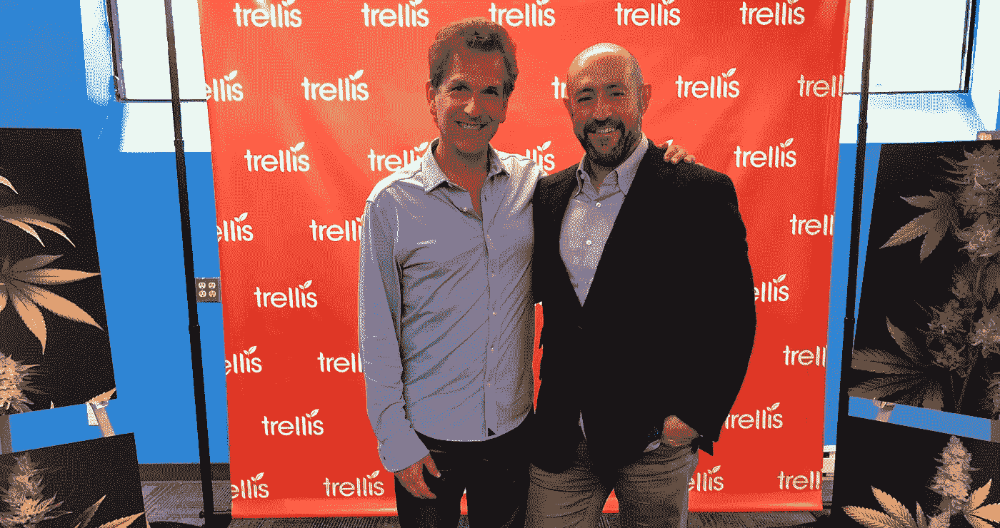

# 成长行业的创新、创意和技术——grow up 首次大麻黑客马拉松

> 原文：<https://medium.com/hackernoon/innovation-ideation-and-technology-for-the-growing-industry-growups-very-first-cannabis-341688c167af>

Congratulations to all participants of GrowUp’s very first Cannabis Hackathon!

大麻和技术的交集怎么强调都不为过。从供应链跟踪和品系识别到药效测试和分销管理，先进技术在大麻行业的应用令人震惊。这就是为什么 GrowUp 的首届大麻黑客马拉松于上周在 Brainsights 位于加拿大多伦多的总部举行！

黑客马拉松的特色是许多团队致力于花 24 小时制作创新作品，集思广益，辩论，以及其间的一切。该竞赛吸引了来自不同领域的参与者，如编码人员、开发人员、设计人员、工程师等，以探索跟踪、采购、报告、菌株识别、验证、与娱乐行业整合等方面的想法。以下是你错过的一切:

# 竞争

> “黑客马拉松是利用开发人员和编码人员的知识、灵感和能量的一种很好的方式，他们将塑造行业的未来”——grow up 大麻和加拿大音乐周黑客马拉松的制作人 David Hazan

Left to right: David Hazan and Jay Rosenzweig

数据可视化技术揭示了原始数据的价值，引领了新意义的发现。在 [Trellis](https://www.trellisgrows.com/) 的赞助下，参赛者被鼓励利用任何可用的技术来创造有趣和创造性的方法，以理解存储在他们平台上的数据。利用该公司的 API 来获取数据，有无限的可能性可以探索。

**grow up 大麻和加拿大音乐周黑客马拉松的制作人大卫·哈赞**表示，“黑客马拉松是一种很好的方式，可以利用开发人员和编码人员的知识、灵感和能量，他们将塑造行业的未来。”Hazan 没有错，因为参与的团队和个人与众不同。他们进入的不仅仅是一场竞争，而是一个每天都在寻找顶尖人才的行业。

不同的团队有他们自己的想法。团队 Smart Trellis 有一个有趣的想法，他们将在对话界面中实现某个数据库(即使用 Alexa 或 Google Home)来对所有大麻进行预测分析。队友 Arzen Edillo、Guy Pavlov、Daniel 和 Emelin Flores 希望通过使用语音识别使公司更容易了解自己的运营情况。这是一个不可思议的想法，但不仅仅是这个团队。

Left to right: Pranav Sood, Shiv Gupta, Judy Duong, Devon Day and Travis Laurendine

Weed 'em & Reap 团队的独特之处在于他们想预测未来。简单。队友 Devon Day、Judy Duong 和 Shiv Gupta 通过获取 Trellis 的数据来跟踪大麻，从而获得了成功。他们所能做的是为经营这类农场的某些公司分批预测植物的平均产量，使他们成为黑客马拉松的获胜者！但这场竞争远未结束。

# 赞助商

"*大麻产业庞大而复杂，迫切需要顶尖人才来构建解决方案，让该产业充分发挥潜力。黑客马拉松是让开发人员接触行业并让他们对挑战感到兴奋的一个很好的方式"*是 Trellis 创始人 Pranav Sood 对上周的黑客马拉松的解释。

普拉纳夫负责赞助今年的比赛，他经营着为数不多的从种子到销售的软件公司，这些公司在业内获得了巨大的成功。它们目前在加拿大、加利福尼亚、内华达、亚利桑那、澳大利亚和牙买加都有售，而且它们不会很快停止在世界其他地方的创新。

Trellis 为今年黑客马拉松的获胜者提供了难以置信的奖品，包括由 California Brothers 设计的高质量金属照片艺术，新的 PAX 3 蒸发器，以及每个接受单独面试的队友为 Trellis 工作——他们正在招聘！

[Leaf Forward](https://leafforward.org/) 为获胜团队提供一年的免费 Leaf Club 会员资格，并与 Leaf Forward 团队进行五次一小时的办公会议！此外， [LyricFind](http://www.lyricfind.com/) 为黑客提供他们的 API，而他们的姐妹公司， [LyricMerch](https://lyricmerch.com/) 则提供印有“Easy Skanking”歌词的商品 t 恤。他们将为每个获胜的队提供服装！其他确认的合作伙伴包括[罗森茨威格& Co](https://www.rosenzweigco.com/) 、 [Brainsights](https://brainsights.com/) 、 [HERB](https://herb.co/) 、 [Merry Jane](https://merryjane.com/) 、 [Hotbox](https://hotboxshop.ca/) 、[大麻& Tech Today](https://cannatechtoday.com/) ，以及 [TourBuds](https://www.tourbuds.ca/) 、 [Beanfield](https://www.beanfield.com/) 、 [MediaZoic](http://www.mediazoic.com/) 、Hacker Noon 和 [Devpost](https://devpost.com/)

# 会议

The winners on their way to Niagara Falls to showcase their technology to various industry professionals at the GrowUp’s Cannabis Conference & Expo

因为 Weed'em & Reap 团队是黑客马拉松的获胜者，这并不是他们即将见证的结束。因为 GrowUp 的黑客马拉松是由他们的大麻会议和博览会主办的，所以获胜的团队被邀请乘坐 TourBuds 的豪华巴士前往尼亚加拉瀑布，并在加拿大丰业银行会议中心向数百名业内专业人士展示他们的获奖应用。

黑客马拉松演示在 9 月 7 日星期五的 GrowUp 展会上举行，Weed'em & Reap 团队展示了他们的数据生成技术。

Devon and Shiv of Team Weed’em & Reap

黑客马拉松不仅仅是书中的成功。这是一种展示年轻头脑中隐藏着什么样的顶尖人才的方式，这些人可以在像 GrowUp's Conference & Expo 这样的活动中为公司和自己颠覆大麻行业。

Left to right: Alex Blumenstein, Matt Shalhoub, Jay Rosenzweig and Rachel Colic

特别感谢**杰伊·罗森茨威格**([罗森茨威格&公司](https://www.rosenzweigco.com/)的董事总经理)、**亚历克斯·布卢门斯坦**(加拿大首个大麻商业加速器 [Leaf Forward](https://leafforward.org/) 的联合创始人)、**雷切尔·科利奇**([Pure Global 大麻公司](https://pureglobal.com/)的品牌战略&公关副总裁)和**马特·沙霍布**([Green Acre Capital](http://greenacrecapital.ca/)[的董事总经理)](http://greenacrecapital.ca/)

祝贺所有参加今年大麻黑客马拉松的人！请务必查看您所在地区的类似比赛，并留意更多有关未来活动的信息。下次见！