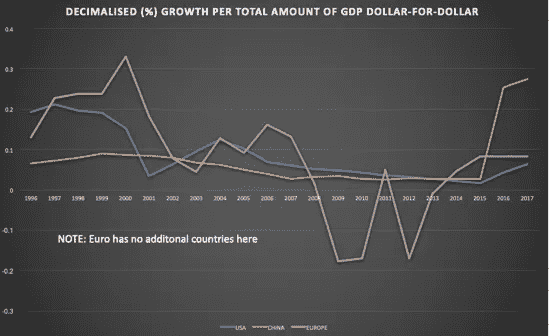

# 创新正在扼杀美国和欧洲

> 原文：<https://medium.com/hackernoon/innovation-is-killing-america-europe-b5f0f99b92f6>

## Z-Efficiency 这么说的

经济学中一个更为遥远的研究领域是 x 效率领域。x-效率是垄断企业的经营效率，这种效率通常由于它们的现有地位而丧失。

在数字货币市场，我[最近观察到](/altcoin-magazine/understanding-z-efficiency-in-blockchains-32b86bb6cdba)一种我们称之为 *z 效率*的配置效率降低的形式是如何被观察到的，事实上这已经是当今市场中的一个潜在问题。

在这篇文章中，我对 z 效率的定义更加宽泛，它是主要货币交易对的[创新](https://hackernoon.com/tagged/innovation)效率，这种效率通常会因为它们被赋予现有地位而丧失。根据 z-效率理论I 假设，正如在给定部门垄断的情况下生产和盈利效率降低一样，一旦一种货币成为主要贸易对时，在基础经济中 *创新效率*会发生*损失。*

## 将 Z 效率理论应用于现实世界的经济

在古典经济学中，**x-无效率**是由于成本最大化的净减少而产生的不完全竞争市场所导致的产量(数量)的差异。因此，**y-无效率**是导致产出减少的 y-曲率，因为底线利润由于 x-无效率而开始消失。

X- and Y-inefficiencies

我认为，在主权经济体中，当产品和成本是制造(货币)的相同来源时，垄断者——在这种情况下，是央行——会作弊，并开始制造自己的货币/信用。结果，货币供应量增加了。因此，货币成为世界商品和服务定价的基础货币对。由于可承受的可持续性受到侵蚀，增长受到损害，导致**z-低效率**，或创新/增长低效率。

z 低效率有两种类型:

**1)** 更高的成本= >更低的配置产出

**2)** 产量越高= >利润率越低 *(-z)*

Z-inefficiencies

在 Z(1)的情况下，创新实际上是不可能的，因为更多的钱必须投入到研发支出中，而研发支出对整体增长的影响小于前一年。

在 Z(2)的情况下，较高的增长率导致成本上升，迫使一个国家印出大量现金，导致 Z(1)。因此，与 x-和 y-低效率不同，z-效率是永久的闭环低效率，这意味着它们永远将经济困在生产和利润效率都低于标准的范围内，这样的经济注定会彻底崩溃。

这种 z-低效率发生的原因主要是(但不一定是唯一的)因为建立了本国货币作为基础贸易对(这意味着它是国际需求商品和服务总体购买的国际参考点)。

在建立一种货币作为基础定价机制的过程中产生的更广泛的效用是 Z(2)产生的原因，Z(2)然后导致系统性增长侵蚀(Z1)。

这种双重低效率也可以理解为一种两极市场均衡。在经典的供求经济中，供给和需求在一个自然平衡点相遇，在这个平衡点附近，产量和利润通常是目前最容易观察到的，从而导致 xy 无效率的减少。

然而，在存在大量 z 效率的货币经济中，需求的供给和供给的需求不断增长，导致两极分化，资本资产价格大幅升值(资产需求超过供给)，同时工资增长停滞(为公用事业过度提供劳动力)。

我认为，z-低效率是一种根本性的低效率，如果不永久性地改变财政货币供给和效用，这种低效率就无法得到补救，而这种改变将在短期内损害成本或供给。

z-低效率最容易在具有主要碱基对的货币(如欧元和美元)与具有大型国内经济(即高效用)但没有碱基对的货币中发现。

衡量创新的一个标准是 R&D 支出/收入的增长。我们可以像对使用 GDP 的公司一样，对国家轻松地执行这样一个等式。这张图表显示了 R&D 支出对不同地区 GDP 的增长效果。这里清楚地显示了 z-低效率。在下面的图表中，可以清楚地看到欧洲货币体系是如何利用获取资本成本较低的国家(如所列国家)的战略来提高总体增长与支出的比率(z-低效率类型 1)。

与此同时，美元在全球范围内对石油和黄金等商品的定价举足轻重，这种优势正在阻碍整体盈利能力(z-低效率类型 2)。

***Z-inefficiency Type 1****: Higher cost => lower allocative output*

因此，欧元区国家实际上在实施不可持续的增长战略，而美国最近的明显增长——尽管在美元对美元的回报率上远远落后于中国——将很快迫使其采取与欧元区类似的战略，或者打破美元，在美国全境实行区域化。

在商品和服务的全球定价方面，美元根本不可能与那些选择保持非基础货币对的国家竞争:资本成本太高，生产效率太低，盈利能力逐年下降。

此外，R&D 支出增加得越多，这种增加作为非基础货币对国家的竞争优势就被抵消得越多(这方面的一些证据存在于泰国最近的增长支出中，例如)。其原因是，随着成本越来越难以承受，那些享受优惠成本的人获得了消费者为了某些利益(如医疗保健)而出国旅游的好处。

***Z-inefficiency Type 2:*** *Higher quantity output => lower profitability (-*z*)*

在另一项研究中，我测量了各种全球货币的 z 效率，最底部的货币对是日元(日元本身通过套利交易成为一个重要的基准货币对)、美元和欧元。泰国、土耳其和中国位居榜首。无论你如何分割，证据都再清楚不过了:流通中的货币越广泛，效用越大，比较创新水平就越低，增长永久受阻和发展落后的风险就越高。

Most z-efficient currency pairs

我们还可以用什么方法来衡量创新？除了效率之外，衡量创新的其他方式是通过它的整体有效性。有效的创新增长将显示单位资源的总体增长。

有趣的是，美国相对于中国的 Z-效率损失要显著得多，而很明显，欧洲的 Z-效率 1 是存在的，因为增长与新资源的获取直接而惊人地对应。

在引入欧元之前，较富裕的欧洲国家的创新曾经非常有效，而美国几乎所有的创新都比该国让世界相信的情况要平淡得多。事实上，就欧洲而言，几乎从欧元问世的那一刻起，它就变得在创新方面极其低效，以至于在今天，它的有效性还是负面的。

这一点通过收购欧洲国家表现得最为明显:

Dead growth: Euro sans central-Asia

在这里我们可以清楚地看到 Z 效率对中国经济的影响；2012 年，中国国内人均资源增长开始超过美国，三年后，中国也变得更加高效(图 1)。因此，Z 效率首先是为了创造价值而最大限度地利用资源，其次是利用其他竞争国家的 Z 效率低下的经济资源，这些资源成为 Z 效率国家的 Z 效率的一部分。

这非常类似于在突然引入完全竞争的新私有化/分散化行业中分配 x 效率。换句话说，z 效率是一种竞争定位的形式，它使 z 效率低的国家付出最大的代价，并将这种代价分配给 z 效率高的国家的增长。

回想一下，z 效率和 xy 效率之间的区别在于，一旦它们失去，就几乎不可能重新获得，因为由于全球化的影响，z 效率低的经济体不断放弃增长，让位于 z 效率高的经济体。当时，全球化对美国和欧洲如此艰难，而对中国如此繁荣，原因很简单:后者没有广泛的货币基础，这削弱了其竞争性创新定位，而 z-低效率经济体仍拥有庞大的消费者基础，有着巨大的需求和消费配额。

从某种程度上说，这是寻求引入新创新的经济体的完美风暴。21 世纪初，随着美国技术引入中国市场，类似的事情也发生了，当时中国市场的创新增长效率极低；广大的消费者群对此欣然接受。然而，在 2001 年至 2005 年间，由于美元受到一些外部冲击，这种 z 效率受到侵蚀。

考虑到当时的社会政治框架，唯一合乎逻辑的结论是，信贷大幅增加，有效地稀释了每种资源的 z-效率，加上美元在被入侵的中东经济体中的广泛使用以及中国对人民币的严格监管，意味着这种 z-效率 2 很快开始在美国经济中扎根。

## 结论

z-低效率的结果是创新的系统性减少和国内经济的价值侵蚀，以至于战争或受影响国家金融体系的瓦解是唯一可能的解决方案。其结果是将 x 和 y 低效率的副作用结合在一起，并使它们复合，从而持续发生实质性的系统价值侵蚀，如果不拆除，这种侵蚀是不可逆的。

尽管看起来很不幸，但西欧国家和北美将永远无法团结一致庆祝经济胜利，这种局面持续得越久，受影响国家的每一位国内公民在社会、金融乃至最终个人方面将承受的后果就越严重。