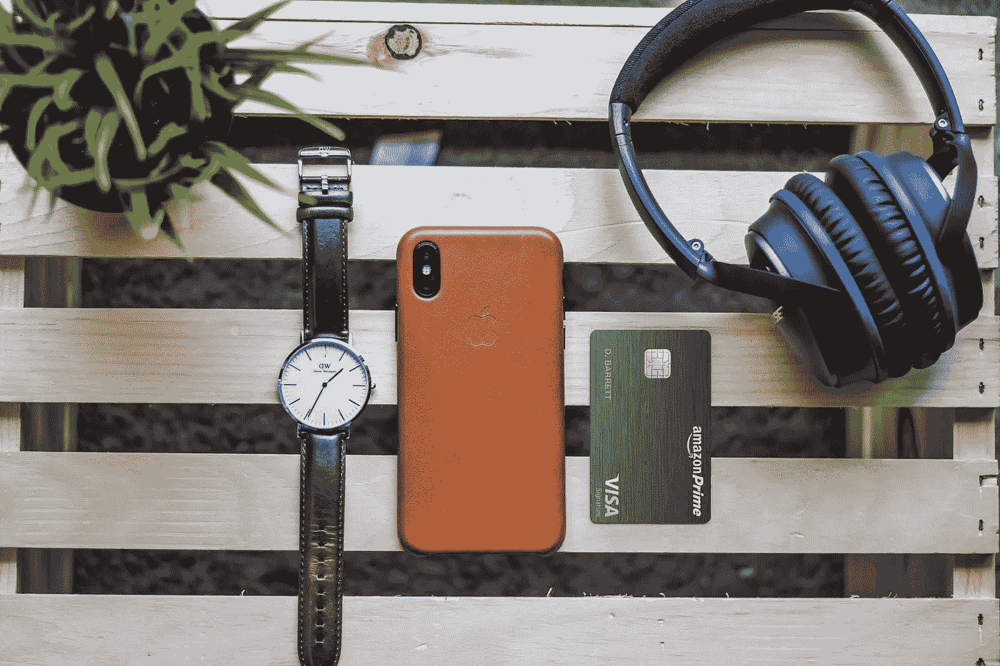

# 了解你的一切

> 原文：<https://medium.com/hackernoon/inside-amazons-moves-to-know-everything-about-you-8d523e5ca437>

Photo by Code Mnml on Unsplash

## 亚马逊是即将到来的隐私战争的下一个目标吗？

如果大肆收集个人数据是犯罪的话， ***亚马逊*** 更是罪大恶极。

不是的，冷静点。

如果你认为只有[脸书](https://hackernoon.com/tagged/facebook)和[谷歌](https://hackernoon.com/tagged/google)想控制你看什么和买什么，那你就错了。亚马逊，世界上第二大最有价值的公司，在建立你的个人信息档案方面也同样积极。

事实上，他们刚刚推出了一个产品，将加快这些档案的建设。

**亚马逊 Prime 奖励签证。**

在这篇文章的底部，我将列出亚马逊所知道的关于其客户的一切，摘自 Amazon.com 的隐私声明。

简单地说，它是很多的，而且它甚至没有具体提到两个主要组件；那张信用卡和亚马逊 Echo 产品(这些 Echo 我们留着以后用)。

信用卡令人印象深刻，就像优步在大约六个月前做的那样，亚马逊推出了他们自己的品牌 visa，宣传一个积极的奖励计划。

你在全食超市消费的所有钱都有 5%的返还，这可不是闹着玩的，毫无疑问，这在让人们注册这张卡的过程中起到了重要作用。

亚马逊是否出于好心将 5%的购买量返还给顾客？

他们想在全食超市和亚马逊之间建立更深层次的联系吗？

答案要曲折得多，也非常聪明。

亚马逊已经知道你从 Amazon.com 和全食超市买了什么，用信用卡 ***他们现在知道你还去了哪里，还买了什么***……不管在哪里。

> ***每一次购买，每一个地点，记录并添加到您的个人资料。***

所有这些都是为了追求更详细的个人购物者资料，这样他们和他们的合作伙伴(见文章底部)就可以卖给你更多的东西。

# 亚马逊收集和储存了你的哪些信息

> 完整的名单见:[https://www.amazon.com/gp/help/customer/display.html?nodeId=201909010](https://www.amazon.com/gp/help/customer/display.html?nodeId=201909010)

亚马逊存储的客户信息精选:

*   " ***您在我们的网站上输入的*** 或以任何其他方式提供给我们的任何信息"
*   你的电话号码
*   信用卡信息
*   购买商品的收货人，包括地址和电话号码
*   " ***您的朋友*** 和其他人的电子邮件地址"
*   “评论内容和发送给我们的电子邮件”
*   “个人资料中的个人描述和照片”
*   "财务信息，包括社会保险和驾照号码."
*   "用于将您的计算机连接到 Internet 的 Internet 协议(IP)地址"
*   到达、通过和来自我们网站的完整统一资源定位器(URL)点击流，包括日期和时间
*   “您用来拨打我们 800 号码的电话号码”
*   "有关您的位置和移动设备的信息，包括您的设备的唯一标识符*"*

# *奖励项目*

*在这一页的底部还有一段我觉得很有意思，关于脸书和它的合作伙伴分享数据。*

*“我们提供联合或共同品牌产品和其他服务的企业包括星巴克、OfficeMax、威瑞森无线、Sprint、T-Mobile、美国电话电报公司、J&R 电子、埃迪鲍尔和北方工具+设备。”*

# *结论*

*就像脸书一样，亚马逊这样做并不是为了作恶。他们这样做是为了更高效地向您销售产品，并提供更好的服务。*

**他们应该对此更加透明吗？**

*是的。*

**他们在保护我们的数据方面做得足够吗？**

*也许吧。*

**我们需要随时了解他们是如何收集数据的吗？**

*绝对是。*

**我们需要开始戴锡纸帽上街抗议吗？**

*没有。*

# *进一步阅读*

* [## 你的隐私对你来说值多少钱？

### 我打赌比你想的要少

hackernoon.com](https://hackernoon.com/how-much-is-your-privacy-worth-to-you-5078ce1eff38) 

如果你想对我写的东西发表意见，或者如果我能以任何方式帮助你写文章或帮助完善你的产品或技术战略，请给我写信:kerry@betterstory.co 或在 [Twitter](http://www.twitter.com/kmore) 上找到我。*