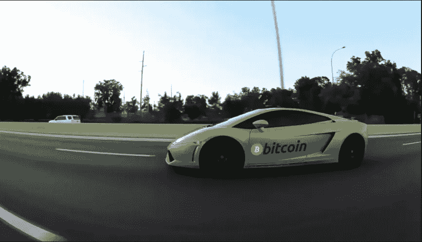
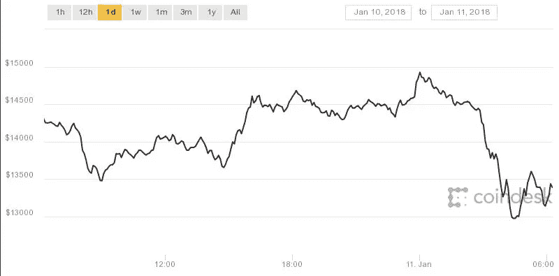
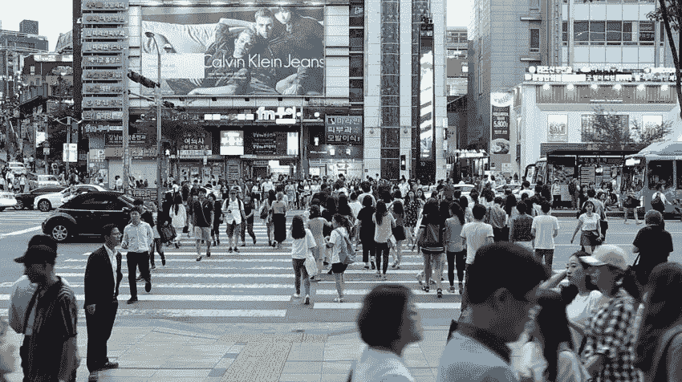

# 韩国加密货币大戏:自杀、离婚和破碎的希望

> 原文：<https://medium.com/hackernoon/inside-koreas-cryptocurrency-drama-suicide-divorces-and-broken-hopes-67866e26145f>

韩国是世界第 11 大经济体。它是三星、现代和起亚等科技巨头的所在地。这个国家自诩拥有受过高等教育的经济。但截至 2016 年，其就业不足率为 38%，这导致许多人从事他们大材小用的工作。即使是拥有良好就业记录的个人也难以负担平均 4.26 亿韩元(40 万美元)的房租。不断上涨的生活成本和无法获得替代收入的方式，让精通技术的千禧一代陷入了抑郁和绝望，并让他们相信他们不会比上一代人过得更好。

# **闪光的都是金子。(至少对韩国人来说)**

韩国很少有人很早就开始使用加密货币，但直到车牌上写着“比特币”的 Lambhorgini 上路后，韩国人才开始意识到“虚拟货币是真正的货币”，而不仅仅是一些愚蠢的“书呆子钱”。在加密货币价格飙升的情况下，韩国人对加密货币的兴趣在 2017 年底大幅飙升。

一份报告显示**10 个**韩国人中有 3 个投资加密货币，他们中的大多数人年龄在**20-30 岁之间**。“到月球”和“蓝宝”这个词传播得很快，这都归功于超强的连接能力——一名韩国青少年每天使用移动设备超过 4 个小时，所有家庭都可以上网，88%的人拥有智能手机。

> 这种兴趣主要归因于 3 个原因:
> 
> 1.早期密码交易员的浮华生活。
> 
> 2.韩国千禧一代认为他们在经济上不会比他们的父母或祖父母更好。
> 
> 3.缺乏替代投资选择。

对许多韩国人来说，这是通往一个更好的金融世界的大门，用他们自己的话说就是“我最终不会死于支付我不喜欢的公寓和汽车的费用”

# 忧心忡忡的政府开始镇压

当韩国人过着他们自己版本的“美国梦”时，司法部办公室内的气氛紧张起来。朴相基部长和他的官员对加密货币的投机性质感到不安。他们中的许多人认为这是赌博和一个便于洗钱和恐怖融资的系统。

虽然有政府不安的杂音，但直到 2017 年 9 月，该国的密码交易员的情况才变得更糟。

政府对加密货币不满的第一个迹象来自 9 月份对 ICO 的拟议禁令。

# 监管部门打击韩国交易所的时间表

***2017 年 9 月 29 日*** —官方暗示拟提出法律修正案禁止所有 ico。

***2017 年 12 月 13 日*** —禁止未成年人和非居民外国人交易。

***2018 年 1 月 9 日*** —韩国交易所 Coinone 和 Bithumb 的国税厅和警察突袭办公室。

***2018 年 1 月 11 日***——司法部长朴相基暗示将起草一项关闭所有虚拟货币交易所的立法。

BTC rate affected after the legislature announcment on Jan 11

***2018 年 1 月 30 日*** —禁止使用匿名银行账户进行虚拟货币交易。

***2018 年 5 月 11 日*** —韩国交易所因洗钱问题遭到突击检查。

# 政府辜负了千禧一代吗？

司法部长 1 月 11 日提议禁止加密货币交易所后，加密货币的价格大幅下跌。人们开始担心，并开始退出市场。在韩国，加密货币及其投资者的前景似乎很黯淡。他们中的许多人抵押了自己的房子来购买加密货币，现在不得不亏本出售。家庭破裂往往导致离婚。**这导致因加密货币投资亏损而自杀的报道数量激增。**看心理医生的病人数量有所增加，这种创伤被称为“比特币忧郁”。

# 为什么韩国对加密货币很重要？

韩国是一个痴迷于加密货币的国家，拥有超过 200 万交易者。韩国市场的加密货币价格比美国市场高出 51%。该国是三分之一主要密码交易所的所在地。事实上，韩元目前是比特币交易量第三大的货币，占整个 BTC 交易量的 5%以上。在某种程度上，它是以太坊交易量最高的货币。就连央行也不得不禁止员工交易加密货币，尤其是在工作时间。

> 加密货币市场的整体增长和采用在很大程度上取决于韩国监管机构如何对待它。

彻底禁止可能是对该行业的一个重大打击。然而，监管机构似乎对加密货币采取了更温和的立场，正在就监管该国的 ico 进行谈判。如果得到证实，这可能是一个巨大的推动，甚至可能飙升全球加密货币的价格。

# **关于 CoinSwitch**

[CoinSwitch.co](https://coinswitch.co/?s=korea_bitcoin_post)是世界上最大的加密货币交易所。它提供来自 KuCoin、Bittrex、Cryptopia、ShapeShift、Changelly 和 Changer 等领先交易所的 300 多枚硬币和 45，000 多对硬币的兑换服务。它为用户提供了一种基于价格和可靠性的跨多个交易所交易硬币的简单方法。

如果您有任何疑问，请写信给 support@coinswitch.co 的**。**

**加入我们的 [**电报组**](http://t.me/coinswitch_community) 来了解新硬币的添加和其他更新**

**快乐切换:)**

****