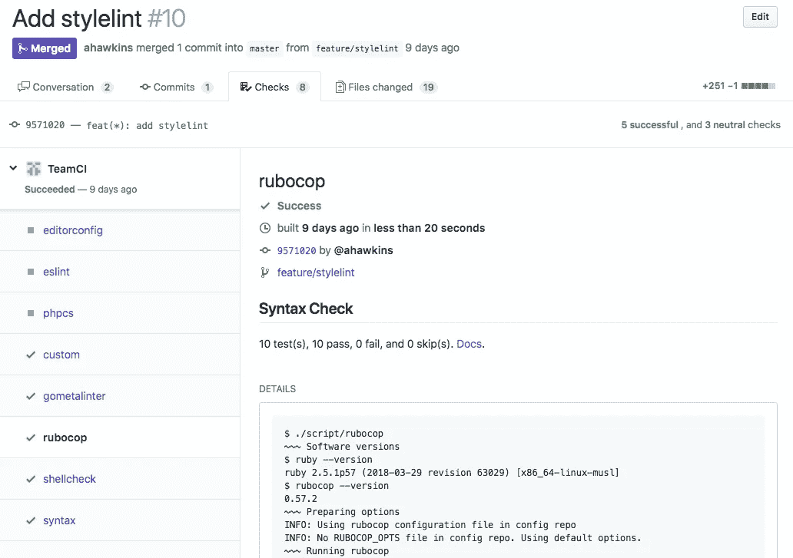
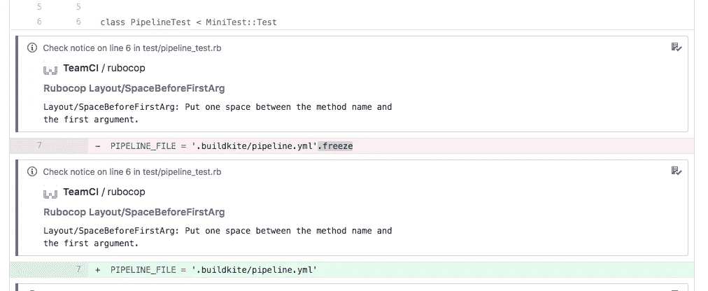
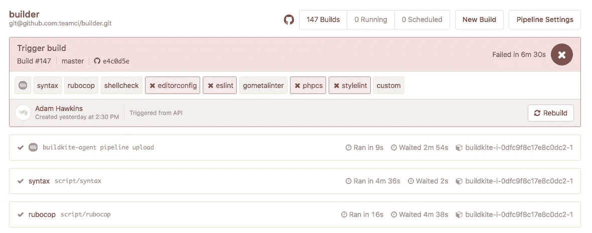

# TeamCI 检查运行代码的内部视图

> 原文：<https://medium.com/hackernoon/inside-teamcis-check-code-b12770de57a5>


Photo by [Blake Connally](https://unsplash.com/photos/B3l0g6HLxr8?utm_source=unsplash&utm_medium=referral&utm_content=creditCopyText) on [Unsplash](https://unsplash.com/search/photos/code?utm_source=unsplash&utm_medium=referral&utm_content=creditCopyText)

[TeamCI 的](https://teamci.co)核心针对代码运行多个静态分析工具，并向 [GitHub 检查 API](https://blog.github.com/2018-05-07-introducing-checks-api/) 报告。团队使用多种语言，这意味着工具用不同的语言编写，以不同的方式发布。TeamCI 的 check builder 必须考虑到多样性，同时足够灵活地采用新的工具和语言。我还希望授权用户改进他们的工具。这就是为什么[检查生成器](https://github.com/teamci/builder)是开源的。任何人都可以在 GitHub 上扔代码，并将其标记为开源，但这并不足以让人们开始攻击。这篇文章通过例子介绍了代码。除此之外，这只是一个有趣的例子，说明你可以通过努力和泼洒 Bash(国王万岁)来完成什么。

## 高级设计

我在以前的一篇文章中写过关于建立 TeamCI 的内容。如果您不熟悉 TeamCI 的工作方式，这是一个很好的起点。

[](/wipchat/building-a-faster-mvp-with-github-checks-52f0a91e5191) [## 使用 GitHub 检查构建更快的 MVP

### 我是如何节省时间、精力并打造 MVP 的。

medium.com](/wipchat/building-a-faster-mvp-with-github-checks-52f0a91e5191) 

这篇文章涵盖了 TeamCI 实际工作背后的技术细节。

每张支票(`rubocop`、`shellcheck`、`eslint`等)都是一个 Docker 图像。使用 Docker 使得支持任何语言或运行时变得微不足道。Docker Compose 管理配置。Docker 容器运行时在`/code`安装测试代码，在`/config`共享配置。`/code`也是工作目录。基于高山的图像是优选的。



TeamCI checks as seen in Github.

TeamCI 使用 [TAP 输出](https://testanything.org/tap-version-13-specification.html)解析结果并创建 [Github 检查注释](https://developer.github.com/v3/checks/runs/#annotations-object)。没有一个工具输出符合 TeamCI 要求的 TAP。幸运的是，它们都输出 JSON，所以每个 Docker 图像都包含一个将 JSON 输出转换为 TeamCI 的 TAP 的程序。



TAP annotations results in action on PR diff

每个 Docker 图像包括一个包装脚本。包装器脚本处理设置 CLI 选项、解析 JSON 以进行 TAP，并确定退出代码。示例职责是检查`/config`中的文件，并添加适当的`--config FILE`和`--output`选项。包装脚本以后缀`-tap`命名。所以`shellcheck`的包装变成了`shellcheck-tap`。包装器脚本可能不仅仅是设置选项，它们还可能指定要测试的文件。它们也是 Dockerfile 的`CMD`。简而言之，它们负责正确调用底层工具，输出 TAP，并确定退出代码。

TeamCI 使用三种退出代码:

*   `0`为了成功
*   `1`针对任何类型的故障
*   `7`用于跳过(比如运行一个 Ruby linter，但是没有 Ruby 文件)

只有当工具通过退出代码或输出传递结果时，才能确定跳过结果。不是每个工具都这样做，所以在这种情况下使用退出代码`0`。不幸的是，这在 Github PR UI 中表现为“通过”而不是“中立”。



A Check Suite as a Buildkite pipeline. Note that each check is step in the pipeline. Steps execute in parallel.

TeamCI 通过 [Buildkite](https://buildkite.io) 执行检查。使用 Buildkite 消除了管理基础设施的需要。TeamCI 使用 [Buildkite Elastic stack](https://github.com/buildkite/elastic-ci-stack-for-aws) ，它提供了可扩展的基础设施和功能性 Docker stack。GitHub 检查运行触发 Buildkite 构建。每个检查作为一个构建步骤运行。TeamCI 在每个完成的步骤上接收一个 webhook，并将结果反馈给 GitHub。

每个检查构建步骤克隆测试代码和相关的`ORG/teamci`配置报告并导出环境变量。[预命令钩子](https://github.com/teamci/builder/blob/master/.buildkite/hooks/pre-command)完成所有这些，因为它在所有构建步骤之间共享。这导致了精简的构建脚本。构建脚本使用`docker-compose run`和在`/code`和`/config`装载的卷运行相关检查。

验收测试涵盖所有检查。验收测试是用[球棒](https://github.com/sstephenson/bats.)写的。测试涵盖了`0,`、`1`和`7`退出案例以及定制配置案例(例如，`/config`中存在一个配置文件)。测试通过 BuildKite [仿真包装器](https://github.com/teamci/builder/blob/master/test/emulate-buildkite)运行，该包装器导出相关的 BuildKite 环境变量并执行钩子。命令在测试中被`test/stubs/bin`中的可执行文件存根化，并将`test/stubs/bin`追加到`$PATH`，从而优先于真正的可执行文件。测试套件[让 git 命令](https://github.com/teamci/builder/blob/9571020d6f278e8360c6294f3a8771b045d6eaf3/test/stubs/bin/git)使用 fixture 代码，而不是实际的 git 库。没有它，测试套件就无法工作。

## 检查代码演练

[](https://github.com/teamci/builder/pull/10) [## 通过 hawkins 拉动请求#10 teamci/builder 添加 stylelint

### 这个 PR 加了 stylelint。不需要预先配置。如果…则使用标准配置文件

github.com](https://github.com/teamci/builder/pull/10) 

让我们通过一个具体的检查来看看这在实践中是如何工作的。stylelint PR 是一个很好的介绍。让我们从[测试](https://github.com/teamci/builder/pull/10/files#diff-06c23813453c5cf411b828fb74a93c56)开始:

```
@test "stylelint: invalid repo fails" {
	buildkite-agent meta-data set 'teamci.repo.slug' 'stylelint/code'
	buildkite-agent meta-data set 'teamci.head_branch' 'fail'

	run test/emulate-buildkite script/stylelint

	[ $status -eq 1 ]
	[ -n "${output}" ]

	[ "$(echo "${output}" | grep -cF -- '--- TAP')" -eq 2 ]

	# Test for annotation keys
	echo "${output}" | grep -qF 'filename:'
	echo "${output}" | grep -qF 'blob_href:'
	echo "${output}" | grep -qF 'start_line:'
	echo "${output}" | grep -qF 'end_line:'
	echo "${output}" | grep -qF 'warning_level:'
	echo "${output}" | grep -qF 'message:'
	echo "${output}" | grep -qF 'title:'

	[ -n "$(buildkite-agent meta-data get 'teamci.stylelint.title')" ]
}
```

前两行是设置方法。TeamCI 通过构建元数据传递 git repo、branch 和 commit，因此校验码知道要克隆哪个代码。这两行设置了映射到 git fixture 的值。[夹具](https://github.com/teamci/builder/tree/master/test/fixtures)住`test/fixtures/$REPO/$BRANCH`。`git` [是](https://github.com/teamci/builder/blob/master/test/stubs/bin/git)实现的存根模式。

下一行通过 buildkite 仿真包装器执行检查，随后是对退出代码和输出的断言。这个测试断言 TAP 输出带有正确形状的注释。

测试涵盖了剩余的成功和配置文件案例。下面是对用户提供的配置文件的测试:

```
@test "stylelint: config file exists" {
	buildkite-agent meta-data set 'teamci.repo.slug' 'stylelint/code'
	buildkite-agent meta-data set 'teamci.head_branch' 'config_file'
	buildkite-agent meta-data set 'teamci.config.repo' 'stylelint/config'
	buildkite-agent meta-data set 'teamci.config.branch' 'config_file'

	run test/emulate-buildkite script/stylelint

	# The configured options should make the failing fixture pass
	[ $status -eq 0 ]
	[ -n "${output}" ]

	[ -n "$(buildkite-agent meta-data get 'teamci.stylelint.title')" ]
}
```

除了提供的配置 repo fixture 之外，结构是相同的。这些测试使用的夹具在使用默认配置时会失败，但在使用定制配置时会通过。因此，预期结果是`0`。

PR 包括预期的代码变更:

*   从`/stylelint`构建的`stylelint` Docker 图像
*   `/stylelint`中的`stylelint-tap`包装
*   一个`tapify.rb`，用于在`/stylelint`中将 JSON 转换为`tap`。
*   对`docker-compose.yml`的补充
*   对`Makefile`的补充
*   使用相应的夹具在`test/acceptance`中进行测试。

“通过测试的有效回购”也可能会给 fixture 带来不相关的代码文件。Stylelint 测试样式表(例如`**/*.css`，所以代码目录中的一个分散的 Ruby 文件应该不会导致失败。测试这个依赖于工具。Stylelint 需要一个显式的文件列表，所以使用了 glob。然而，对于像 php 代码嗅探器这样自己检测 PHP 文件的东西来说，情况并非如此。

## 包裹

一旦你理解了结构，添加一个新的检查就很简单了。我从最近的检查开始复制和粘贴，因为它们都足够相似。然后我调整测试、`-tap`包装器和`tapify.rb`。我从测试退出代码 1 开始。这允许我测试工具的预期工作，并检查 JSON 输出。事后再拧`tapify.rb`很容易。然后是创建传递装置、配置文件和 Docker 映像的繁重工作。

在以下情况下，添加新工具最为简单:

*   该工具自动检测可测试的文件
*   可以提供显式配置文件
*   该工具将 JSON 打印到标准输出
*   错误和无关信息打印到标准错误
*   该工具发出信号(通过退出代码或输出)表明没有找到可测试的文件
*   有一些排除文件的方法

我很喜欢写生成器。这是一项简单的任务，而且验收测试套件给了我足够的信心。这种体验也暴露了我在这些工具中偏好的语义。

你觉得怎么样？想要添加您自己的支票吗？请随意发送 PR，让 TeamCI 对您更有用。如果没有，那么至少你知道了用 Bash(国王万岁)进行 TDD 是可能的——而且很有趣。[测试期间免费测试 TeamCI](https://teamci.co)。

[](https://teamci.co) [## TeamCI——执行团队代码标准

### 根据团队编码标准自动测试团队代码仓库。

teamci.co](https://teamci.co)