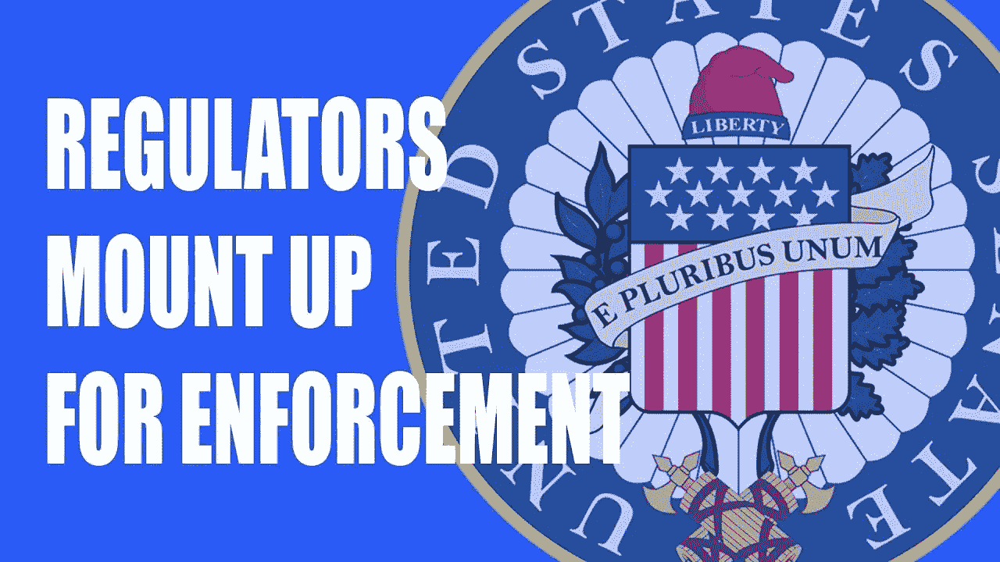

# 在证券交易委员会的参议院简报中

> 原文：<https://medium.com/hackernoon/inside-the-secs-senate-briefing-4b4df0df4abd>

昨天，CFTC 向 T2 参议院银行、住房和城市事务委员会做了简报。虽然对整个加密市场来说是积极的，但也有警告信号。

SEC 主席 Jay Clayton 表示，他将所有 ico 都视为安全产品。尽管对违规者将采取的执法行动缺乏明确性，但强调这些新公司是“我们执法部门的明确目标”。

J.CFTC 的负责人 Christopher Giancarlo 提供了一份有趣的资料，包括一份关于他身为霍德勒家族成员的侄女的声明。查看我们的视频以上的完整运行下来！

我还推荐看看我们的另一篇文章，关于证交会和 CFTC 提出的[十大要点。](https://hackernoon.com/top-10-points-made-by-the-sec-and-cftc-congress-testimony-on-cryptocurrencies-f4c71712624c)

# 缩略图占位符

下面是一个缩略图明确用于黑客中午。

