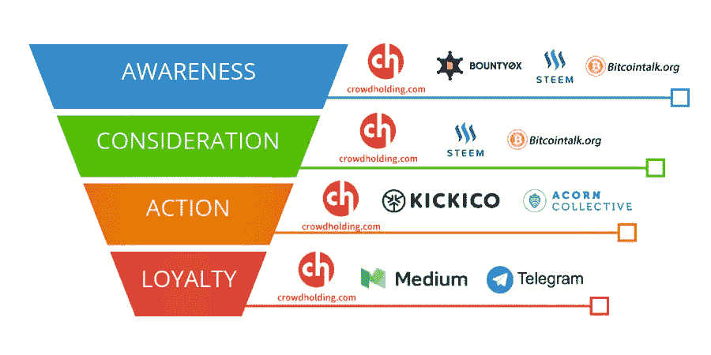

# 推出成功 ICO 的内幕提示

> 原文：<https://medium.com/hackernoon/insider-tips-for-launching-a-successful-ico-c89c8fc124f1>

ICO 或**首次发行硬币**是通过加密货币融资的一种形式。在这里，新项目出售其代币，以换取以太坊或比特币。这很像流行的首次公开募股，人们购买公司的股票。嗯，代币通常允许访问某个公司在获得所需资金后想要推向市场的产品，通常称为公用代币。理想情况下，它可以充当虚拟资产或材料的数字表示。

首次发行硬币可能非常诱人，但要开始发行并取得成功需要做大量工作。据报道，超过 80%的**ico**被认为是骗局。如果你要启动一个，这需要一个合适的策略。

首次发行硬币的投资已经变得越来越复杂，对那些进入这个领域的人要求更多。这意味着制定适当的战略变得至关重要。

话虽如此，以下是你需要正确遵循的步骤，以便**在 ICOs** 的世界中获得成功。

## **为区块链社区增值**

你需要首次发行硬币的原因是首先要考虑的。这可以让你在几周或几个月内获得资金，但必须明白，你的代币应该与你正在开发的产品相匹配，并且可以增加区块链的价值。简而言之，如果你的代币只是另一种加密货币，那么成功的机会微乎其微。

## **在哪里推出您的首次硬币发行**

当**推出 ICO** 时，地点非常重要，因为不同的国家有不同的政策来进行这种筹款。众所周知，对 ICO 友好的国家包括新加坡、香港、瑞士、开曼群岛和英属维尔京群岛。最重要的是要记住，如果你向美国居民提供代币，你将受到 SEC( *美国证券交易委员会*)的监管。理想情况下，您可能希望避免命名您的令牌安全，因为它会立即成为调查的对象。你也应该确保选择一个好的[品牌名称](http://brandnic.com)作为开始。

## **打造技术团队**

这是**推出 ICO** 的一个重要方面，因为你的团队能跑多远，你就只能带着你的公司跑多远。你将需要个人负责开发产品，其他人负责营销目的，以及一系列与推出新产品或项目相关的其他事情。你的核心团队应该包括在区块链有专业知识和经验的开发人员和工程师，以及开源社区的贡献者。除了核心团队，你还需要一些顾问。至少有一个人拥有法律学位并有帮助 ICOs 的经验。其他顾问应包括金融专家、知名人士、**成功 ico 的创始人**和**密码专家**。

## **您项目的路线图**

推出 ICO 的主要原因是你的产品。这就是为什么清晰明确的路线图对于创造一个有前途的首次发行硬币的形象是至关重要的。路线图可以将您的愿景转化为产生收入的产品。

## **创建白皮书**

这是一份已经成为任何计划**发布 ICO** 的团队必备的文件。白皮书详细介绍了您的项目将如何进行，您将开发项目的方式以及人们可以期待什么。这激发了项目投资者的高度信任感。

在你接触**密码社区**之前，白皮书是你应该在你的网站上发布的第一件事。这是因为，认真的投资者在考虑进一步行动之前，首先会寻找这份文件。

## **建立并加入你的秘密社区**

另一个特别重要的步骤！有效的行动需要到位，使您的 ICO 是众所周知的加密投资者，传统投资者和一般公众。以这个顺序开始是很重要的，因为你将首先面对一个鉴赏家和容易接受的观众，然后去面对一个不太熟悉 ICO 的公众。这将是轻率的花费大量的金钱来宣传你的高度技术性的 ICO 给不知情的公众，他们甚至不明白什么是 ICO。

**推荐文章:**

 [## ico 失败的 4 个主要原因

### 去年，如此多的 ico 被宣布和推出，但只有少数人在市场上取得成功并实现了他们的…

hackernoon.com](https://hackernoon.com/4-primary-reasons-why-icos-fail-43274fd34e2e)  [## 没有脸书、Twitter 和 Google 的区块链创业公司的最佳营销策略

### 随着加密货币作为一种强安全的资产和交易方式的出现，出现了一种新的安全模式

hackernoon.com](https://hackernoon.com/the-best-marketing-strategy-for-blockchain-startup-without-facebook-twitter-and-google-fad876defd6) 

所以，你需要决定一个预算来谈论你的 ICO 的发布。专门研究加密货币和 ico 的网站是让公众关注你的项目的好方法。你也可以接近专门从事加密货币或金融投资的 Youtubers，他们可以在他们的社区中谈论你的项目。

最理想的是有一个营销专业团队来支持你:一个营销总监，一个网络营销经理，一个社区经理。有必要考虑不同的获取渠道(Adwords、专业网站、脸书、Twitter、电视、广播等)及其各自的预算。

让你的社区参与进来帮助你了解你的 ICO 也是很有趣的。为此，有不同的方式来鼓励你的投资者谈论这个项目，比如空投，奖励让你出名的用户。你必须通过营销渠道让他们了解你的项目，比如 BitcoinTalk 论坛、Reddit 或一家可以帮助你为 ICO 发布进行[声誉管理的专业公司。你也要确保你有一个公共松弛，不和，电报，你可以与你的支持者保持联系。](http://velseoity.com/uncategorized/orm-for-new-businesses/)

## **选择代币销售方式**

大多数最初的硬币发行发生在以太坊区块链，因为它支持智能合约。这些是令牌自动生成和分发的基本工具。理想情况下，您必须使用一些术语，例如:

**-ICO 成功所需的最低金额。**

****硬上限** -这是允许加注的最大金额。**

****荷兰式行动方法** -这是一个不预先设定代币价格的过程。**

****混合方法** -包括组合各种销售模式。**

## ****智能合约和 Mint 代币开发****

**要生成令牌并实现分发的自动化，您将需要一个智能合约。ERC20 是业内的标准，你应该在将合同提交给以太坊区块链之前对其进行审核。**

## ****推出您的首次硬币发行****

**当重要的一天到来时，您的 ICO 将按照您在智能合约中的设置自动启动。最好有一个网络界面，让人们跟踪 ICO 的进展。从那以后，你的公司将被 ICO 上市网站、区块链专家、投资者和社交媒体关注者密切关注。**

**确保您定期与社区沟通，因为这可以向他们保证您仍然对您设想的产品的开发有信心。**

****推荐文章:****

** [## 密码交易员的下一代交易平台

### 这一切开始于大约十年前，当时第一种名为比特币的加密货币由一个不知名的团体推出…

hackernoon.com](https://hackernoon.com/the-next-generation-trading-platform-for-crypto-traders-6ef9020e3655)**