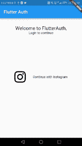

# 使用 Flutter 进行 Instagram 认证

> 原文：<https://medium.com/hackernoon/instagram-authentication-with-flutter-df6424d2d56c>

我决定通过构建一个移动应用来探索 [flutter](https://hackernoon.com/tagged/flutter) ，因为我真的很喜欢边做边学的方法。

如果您不熟悉 flutter，它是一个跨移动开发框架，可以为 Android 和 iOS 构建丰富的 UI 移动应用程序。目前它是一个 alfa 版本，并且是开源的。如果你需要更详细的介绍，我在这里写了一篇关于它的[帖子](http://developer-journey.com/2018/02/08/introduction-to-flutter/)。

在本文中，我们将构建一个带有 [Instagram](https://hackernoon.com/tagged/instragram) 认证的简单应用。对于这个应用程序，我们将使用[模型视图呈现器](/@develodroid/flutter-iv-mvp-architecture-e4a979d9f47e)模式。

让我们来构建我们的 UI。

# 登录屏幕

UI 由一列 3 个元素构成:2 个文本小部件和一个包含 2 个元素的行小部件(一个图像小部件和一个文本小部件)。关于建筑布局的更多细节，可以阅读[本](https://flutter.io/tutorials/layout)。

# 商业逻辑

如果用户点击登录按钮会发生什么？presenter 类将负责登录操作。

insta 是一个使用 OAuth 处理 Instagram 授权的类，如 API 文档[中所述。](https://www.instagram.com/developer/authentication/)

我们来看看 Instagram 类。

这个课程的灵感来自于 [Kevin Segaud](https://medium.com/u/f8fc0ac87056?source=post_page-----df6424d2d56c--------------------------------) 关于[脸书认证](/@segaud.kevin/facebook-oauth-login-flow-with-flutter-9adb717c9f2e)的帖子。

我们有 3 个组件:getToken 函数、_server 函数和令牌类。

getToken 函数遵循 [oauth 认证标准](https://oauth.net/2/)的 3 个步骤:

1.将用户定向到授权页面，用户可以使用其凭据登录。

2.用户批准授权请求，我们在重定向 url 上获得授权代码。

3.用访问令牌交换授权码。

为了将用户引导到授权页面，我们使用了 Flutter Web View 插件。

函数 *_server* 创建一个等待重定向 uri 的服务器。当客户端发送一个带有参数“ *code* 的请求时，服务器接收并返回这个参数。

Token 类只是一个普通的 dart 对象，包含在访问令牌中收到的信息。

你可以在 github 上找到整个项目。

就是这样:Instagram 认证现在是真实的了！

希望你喜欢这篇文章，在此之前，我的朋友，愿{code}与你同在！

如果你想尝试 Flutter，我邀请你在官方[网站](http://flutter.io)了解更多信息。

我也邀请你加入 flutter 社区:

*   [与颤振工程师和用户实时聊天](https://gitter.im/flutter/flutter)
*   [在我们的邮件列表中讨论 Flutter、最佳实践、应用程序设计以及更多内容](https://groups.google.com/d/forum/flutter-dev)

**资源**

[flutter.io](http://flutter.io)

[https://www.instagram.com/developer](https://www.instagram.com/developer)

*原载于 2018 年 2 月 23 日*[*developer-journey.com*](http://developer-journey.com/2018/02/23/instagram-authentication-with-flutter/)*。*