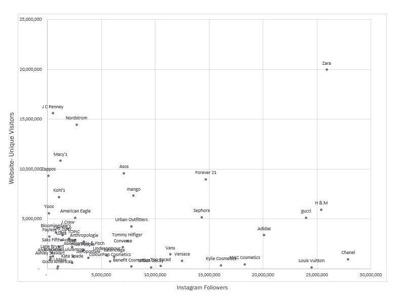
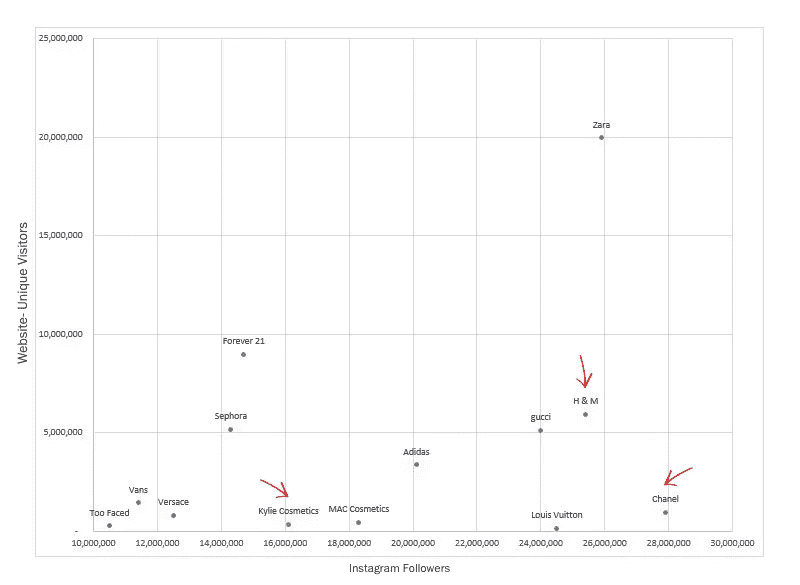
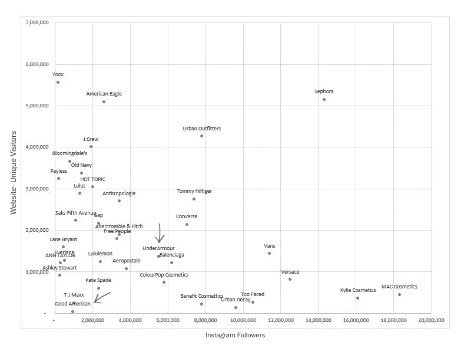
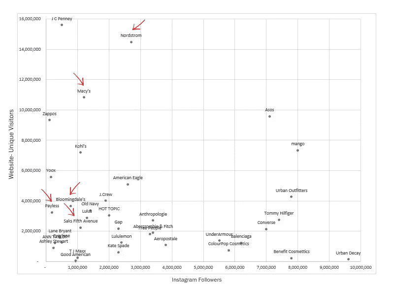
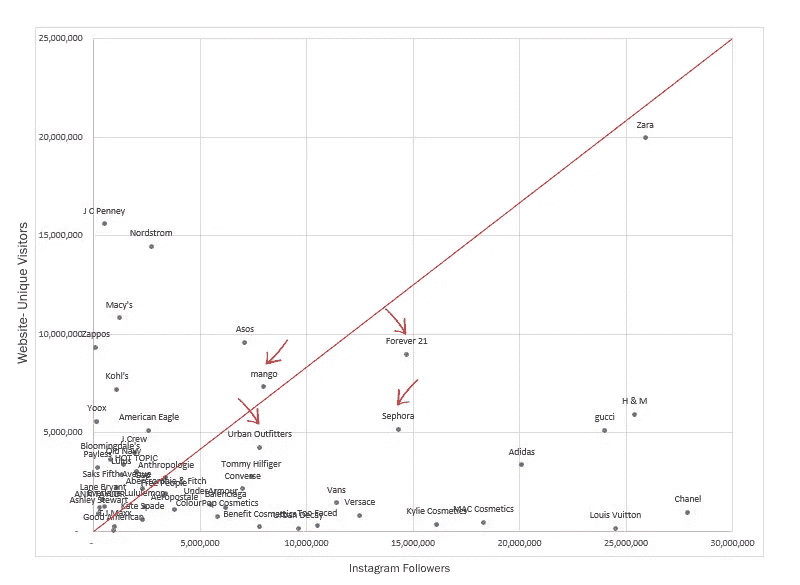
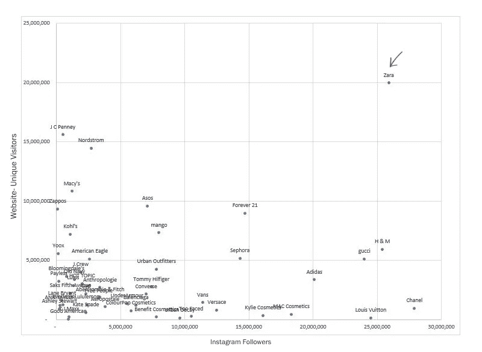
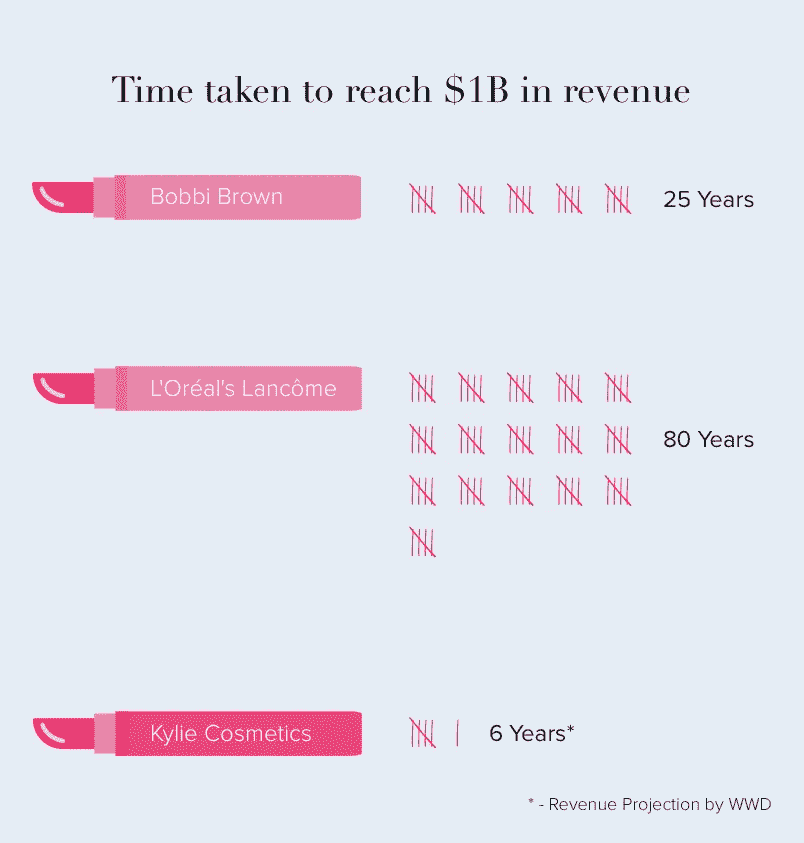

# Instagram 电子商务——从婴儿到“老板宝宝”

> 原文：<https://medium.com/hackernoon/instagram-ecommerce-from-baby-to-boss-baby-1572f3be2e33>

2010 年 10 月 6 日，Instagram 以前所未有的速度闯入社交媒体领域，在发布后的几个小时内成为最大的照片分享应用。自那以后，随着脸书以童话般的 10 亿美元收购阿里巴巴，它们的发展更上一层楼。

> Instagram 的增长最能体现在其名人用户上。贾斯汀比伯是娱乐圈和时尚界最受欢迎的名字之一，也是 Instagram 的早期用户，他用了 8 个月的时间成为第一个拥有 100 万粉丝的人，而大卫·贝克汉姆在 2016 年只用了一天就达到了同样的里程碑。这些名人随后在他们的 Instagram 帖子上成为几个品牌的推广者。这是 Instagram 首次涉足电子商务和零售，尽管当时只是为了数字营销。

2017 年 3 月，Instagram [推出了他们的购物功能](https://business.instagram.com/blog/a-better-shopping-experience-on-instagram/)，允许美国的企业在他们的帖子上标记产品，并将它们链接到网站上各自的产品页面。这是他们旅程中的一个关键转折点，因为它将 Instagram 开辟为一个新的电子商务渠道，新功能的推出，如[应用内支付](https://www.theverge.com/2018/5/3/17316938/instagram-in-app-payments-feature)和[可购物的 Instagram 故事](https://techcrunch.com/2018/06/12/instagram-adds-shopping-tags-directly-into-stories/)(两天前刚刚推出)，表明 Instagram 电子商务将继续存在。

为了进一步研究 Instagram 的影响，我们 PipeCandy 研究了美国时尚零售领域的大约 50 家公司。我们选择了一些顶级品牌和零售商，以观察美国电子商务和零售市场中不同类型的公司对 Instagram 的采用或缺乏。出现了相当多的趋势和推论。

*   **新一代电子商务让 Instagram 独树一帜:**时尚品牌非常喜欢 Instagram 电子商务，积累了大量粉丝，现在他们通过 Instagram 使用可购买的帖子进行销售。
*   **名人锁定票房:**一些品牌与名人合作，利用他们的广泛影响力在 Instagram 上推广产品和销售。
*   **错过好戏的老派零售商:**主要的实体零售商正在坐等他们的实体和网站销售，当品牌开始使用 Instagram 作为成熟的渠道时，这将受到严重影响。
*   **大品牌吃蛋糕并拥有它:**很少有大品牌也开始投资 Instagram，同时仍然主要通过他们的网站销售，保持大门敞开。
*   **电子商务巨头在 Instagram 上保住了他们的宝座:**一些公司，包括本报告中没有提到的公司，已经利用其品牌的知名度轻松获得了数百万粉丝，同时继续在在线销售方面超越竞争对手。

上面的图表显示了这 50 家公司在 Instagram 和他们自己的网站上的表现，通过绘制他们在 Instagram 粉丝和网站上每月独立访客的图表。让我们深入研究列出的趋势和推论，并对它们进行分析。

**新一代电子商务让 Instagram 成为他们自己的**

图表底部标记的是像凯莉化妆品和香奈儿这样的新公司，它们完全采用 Instagram 电子商务渠道，只专注于社交媒体平台，拥有数百万粉丝，但网站访问量不到 30 万次。

这是什么意思？最好的品牌和影响者认为 Instagram 比一个电子商务网站更重要，对于服装、配饰、风格和时尚等顶级类别来说，他们把钱花在嘴上。

虽然香奈儿和其他类似品牌也通过其他零售商销售，但他们在 Instagram 上的主导地位为一个等待爆发的新渠道打开了大门，使他们处于完全利用它的有利地位。

就像电视明星凯莉·詹娜的化妆配件品牌 Kylie Cosmetics 一样，这些 Instagram first 品牌中有几个是根据 Instagram 名人建立的。他们仅仅通过照片和视频向超过百万的粉丝推广这些品牌。

**名人锁定票房**

名人推销产品并不是一个新现象。但对于痴迷于社交媒体的一代人来说，社交媒体拉近了明星与粉丝的距离，由名人诞生的品牌获得了新的成功。

像安德玛和 Good American 这样的公司在图表上表现不佳。他们的网站访问量很低，在 Instagram 上的存在感一般。但这些公司仍然做得很好，因为对他们来说真正重要的是支持他们的影响者的受欢迎程度。他们的粉丝现在用钱投票，有影响力的人现在自己也是一个销售渠道。

这是 Instagram 领先于 Snapchat 或 Twitter 的地方。

> 虽然这三个网站都可以访问名人，但在 Instagram 上，你可以购买道恩·强森正在推广的安德玛 t 恤，然后向世界展示你如何摇滚(双关语！)那件 t 恤。这就是影响者对销售产生巨大影响的原因。例如，科勒·卡戴珊的《好美国人》在第一天就获得了 100 万美元的收入。

虽然其中一些公司有自己的实体店，但许多公司通过零售商销售，这些零售商通常很难适应 Instagram。这可能是零售商的致命弱点。

**老派零售商错失良机**

那些大人物进展如何？不太好。如上图所示，像 Nordstrom、Bloomingdales、Macy's 这样的大型零售连锁店在 Instagram 上并不多见。这在一定程度上可以理解。直到最近，Instagram 还只是一个电子商务的数字营销平台，零售商很乐意让品牌自己进行营销。

但当 Instagram 成为一个成熟的电子商务平台，品牌能够直接向顾客销售时，零售商将受到冲击。

诺德斯特龙和梅西百货在网上有很强的影响力，也通过他们的网站销售。他们应该能够适应 Instagram 电子商务，但仍不会损失太多。但是 Bloomingdales，Payless 和 Saks Fifth Avenue 在他们的网站和 Instagram 上落后了，并将受到这一新渠道的影响。

但一些老牌品牌似乎已经明白了这一点。

**大品牌吃蛋糕也有**

当一条线穿过这张图表时，你可以看到一小群公司围绕在这条线的上半部分。这些公司很好地适应了 Instagram，并专注于他们的电子商务商店，充分利用了这两个渠道。

如图所示，芒果、Forever 21 和丝芙兰等公司似乎已经了解了 Instagram 电子商务的潜力，并很早就开始投资。

同样围绕这条线，图表顶部是 Zara。

电子商务巨头保住了他们在 Instagram 上的宝座

拥有 2000 万访客和 2000 万 Instagram 粉丝的 Zara 似乎在这两方面都处于领先地位。Zara 是耐克等大品牌的代表，这些大品牌被排除在入选的 50 个品牌之外。耐克在 Instagram 上有大量粉丝，不仅仅是因为消费者有兴趣从他们那里购买，而是因为他们关注他们的新品和运动时尚趋势。其他明显的名字，如亚马逊和沃尔玛，是通用的市场，而不是特定的时尚，所以他们也被排除在外。

我们将何去何从？

Instagram 只是一个开始。

> 在中国，微信[使用迷你程序](https://www.techinasia.com/wechat-mini-programs-ecommerce)在一个消息应用程序上连接卖家和客户，为整个聊天群提供团体折扣等服务。通常定价约 6 美元一包的纸尿裤以 3 美元的折扣价卖给一群邻居妈妈，如果她们都愿意买的话。在发布的一年内，这些迷你程序现在每天有 1.7 亿用户。

中国也有相当创新的产品目录直播流，从坡道步行到幕后生产，人们在观看直播视频时购买产品。这增强了人们对网上购物的信心，并清除了假货卖家。随着直播视频在 Instagram 上成为一个受欢迎的功能，尤其是在名人中，他们可能不久就会推出类似的功能。

Instagram 电子商务还将导致电子商务公司增长和销售的量化方式发生变化。网站流量曾经是一个明确的指标，但凯莉化妆品公司在 18 个月内实现了 4.2 亿美元的收入，并且有望在网站访问量不到 30 万次的情况下[实现 10 亿美元的收入，这一事实表明了 Instagram 的影响力。为了客观地看待这一点，以下是 Kylie Cosmetics 与其竞争对手相比的增长情况。](https://www.cnbc.com/2017/09/14/how-kylie-jenner-turned-kylie-cosmetics-into-a-420-million-empire.html)

PipeCandy 可以帮助你绘制 Instagram 等渠道的趋势图，并预测你应该与[合作、收购或参照的突破性品牌。](https://pipecandy.com/ecommerce-competitive-intelligence/)