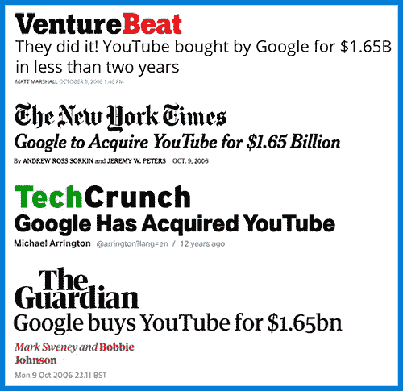
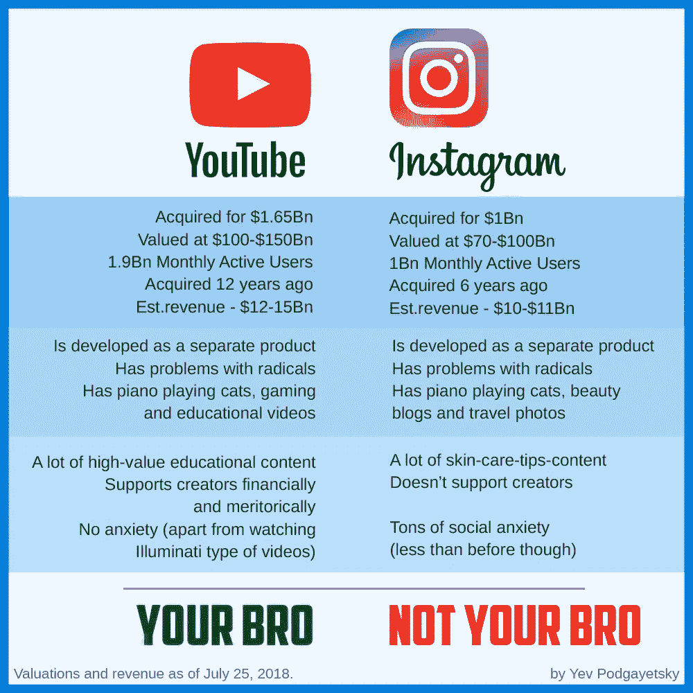

# Instagram 并不是科技史上最好的收购

> 原文：<https://medium.com/hackernoon/instagram-wasnt-the-best-acquisition-in-the-history-of-tech-31bf3a3bcf87>

最近，YouTube 引入了一个新的 2000 万美元的基金来激励教育类的创作者。随着关于被脸书收购的初创公司[的创始人](https://techcrunch.com/2018/09/24/instagram-founders-leave/)[离开](https://www.theverge.com/2018/4/30/17304792/whatsapp-jan-koum-facebook-data-privacy-encryption)公司[的讨论持续不断](https://www.theverge.com/2018/10/22/18010030/brendan-iribe-oculus-ceo-leaves-facebook-quit)，我决定再次关注 21 世纪两起最受关注的成功科技收购。

如今，我们的孩子是由 YouTube 养大的，我们的青少年是由 insta gram 养大的。然而，我们可以假设在 2018 年很少有人会知道这两项服务，除非它们被母公司紧密整合和推广。根据彭博情报部门的数据，2018 年 7 月初，Instagram 的价值高达 1000 亿美元，而 YouTube 的价值可能高达 1500 亿美元。相比之下，麦当劳当时才 124 美元。

## 衡量价值

这些公司可能有合理的基于收入的估值，但是对人类的净正价值呢？

每月分别有 19 亿人和 10 亿人观看 YouTube 和 Instagram。两家公司都是弹钢琴的猫和超级傻的假唱的家。两人都与激进分子和极端分子有矛盾。两家公司都以独立的产品和品牌运营。为了了解他们创造了什么价值，我不得不从我们今天所知道的公司的起源说起。

## 选择母公司

2012 年，[谷歌](https://hackernoon.com/tagged/google)、[脸书](https://hackernoon.com/tagged/facebook)和仍然很有前途的 Twitter 开始相互竞争 Instagram。就像谷歌一样，脸书几乎拥有无限的设计和开发资源。真正吸引创业公司创始人的是他们的产品可以整合的网络的巨大规模和潜力。

In 2012, Mike Krieger and Kevin Systrom were looking in the very bright future

随着时间的推移，用户对什么值得发布在 Instagram 上，什么不值得发布有了大致的共识。发布照片的质量标准很高，因此日活跃用户的数量开始下降。复制这些故事是使 feed“民主化”的合理方式，Instagram 没有错过这个机会。剩下的就是历史了。

## IGTV

在无耻地抄袭 Snapchat 之后，这家公司的目的是什么？无耻地抄袭 YouTube。

由于缺乏改进短格式内容的想法(因为 Snapchat 正在消亡)，Instagram 决定冒险进入迄今为止被 YouTube 垄断的领域。虽然，有一个小问题:

> “Instagram 巩固了自己作为社交媒体领域的*的地位，以提供简短、有趣的视频更新。不是作为一个更长的地方，生产的东西。为此，每个人都知道你可以去 YouTube。”——麦迪逊·马龙·基歇尔为 Intelligencer 撰稿。*

观众没有看到看 IGTV 的理由。而公司[并没有真正尝试](http://nymag.com/intelligencer/2018/10/instagram-igtv-flop.html)去说服它。并非所有的高级用户都知道 IGTV，这导致最大的内容制作商与其他格式相比只有一小部分的观看量。IGTV 现在在哪里？观众人数少，内容少，没有创始人。他们和再次推动复制这种格式的扎克伯格之间有内部冲突吗？我不知道。
Stories 是 Instagram 产品的延伸，但 IGTV 的提议太遥远，无法成功。简单地复制产品已经行不通了，你必须提供额外的价值。用户群的力量不是无穷的。

## 高昂的价格标签

2006 年，16.5 亿美元被认为是科技行业令人兴奋的一笔钱。不过，谷歌已经准备好付出代价。短短两年内，YouTube 推出了 480p 视频，随后在 2009 年推出了 1080p 视频。许多专家预测该公司将面临大量诉讼，但早在 2008 年，世界就看到了 VEVO——最著名的音乐合作伙伴之一，允许用户免费观看喜爱的音乐视频，而不侵犯版权。在 Instagram 刚刚被脸书收购的那一年，《江南 Style》已经突破了 10 亿次观看，成为历史上第一个达到这一点的在线视频。

随着 YouTube Red、 [YouTube Gaming](https://techcrunch.com/2018/09/18/youtube-to-shut-down-standalone-gaming-app-as-gaming-gets-a-new-home-on-youtube/) 和 [YouTube Live](https://techcrunch.com/2018/10/25/youtube-is-closing-the-gap-with-twitch-on-live-streaming-report-finds/) 经历稳步增长，通过 YouTube Learning 进一步扩张并利用另一个巨大的行业是完全有意义的。今年夏天，访问者已经每天产生 10 亿次学习内容的浏览量。

## 不断增长的类别和支持创作者

是的，YouTube 正在投资教育制造商，以建立一个安全、优质的影响者网络。这些有影响力的人不会发布自杀后尸体或纳粹宣传的视频，从而吸引更多大规模的广告商，从而为公司创造更多资金。但这一步也大大有助于在世界上建立精英制度，使教育档案，比国会图书馆大几倍，对每个人都免费开放。这太棒了。

与 Instagram 不同，YouTube [关心它的创造者](https://creatoracademy.youtube.com/page/lesson/edu-channel-start)(他们中的大多数[)。今年 7 月，该公司推出了版权匹配工具，可以搜索 YouTube 上传的内容，以发现是否有人窃取并重新发布了创作者的原创内容。](https://mashable.com/2017/09/28/youtube-outside-links-partnership-program/)

## 他们要去哪里？

在这两个平台上，你将学习如何让你的指甲看起来很华丽，但你在 Instagram 上找到高价值教育视频的机会有多大？甚至那些向你出售他们的直运课程、承诺在马尔代夫获得被动收入的家伙，也选择 YouTube 作为他们的核心平台。

尽管 Instagram 是在六年后被收购的，但发展中数字经济的融合在持续增长，并且[赶上](https://hans.vc/douyin-tik-tok/)一年比一年容易。问题是，在三年内，不断扩张的 YouTube 将与 Coursera 竞争，Twitch 将拥有[十亿](https://techcrunch.com/2018/10/25/youtube-is-closing-the-gap-with-twitch-on-live-streaming-report-finds/)用户，而 Instagram 和半个脸书将继续对市场的变化做出反应，在[副本](https://techcrunch.com/2018/10/24/facebook-musically-competitor/)之后加盖[副本](https://newsroom.fb.com/news/2016/10/introducing-workplace-by-facebook/)。假设扎克伯格是 Systrom 和 Krieger 的糟糕透顶的 CEO，他是他们离开的唯一原因吗？不完全是。

当然，我意识到这是两个不同的故事，讲述了两个不同的收购，但是…我能想象没有 YouTube 的互联网吗？没有。我能想象青少年在 Instagram 之外的其他应用程序中发布自拍吗？是的。

注:正文中的估值是从 2018 年 7 月 25 日开始，在脸书股票[于 7 月 26 日被 20%](https://variety.com/2018/digital/news/facebook-q2-earnings-1202884337/) 碾压之前，以及在 10 月整个股市变得“看跌”之前。截至本文撰写之日，脸书的估值较 7 月 25 日下跌了 33%，而谷歌的估值较 7 月 25 日下跌了 18%。收入乘数的不确定性导致了估值范围的扩大。