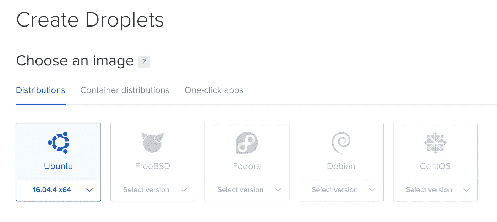
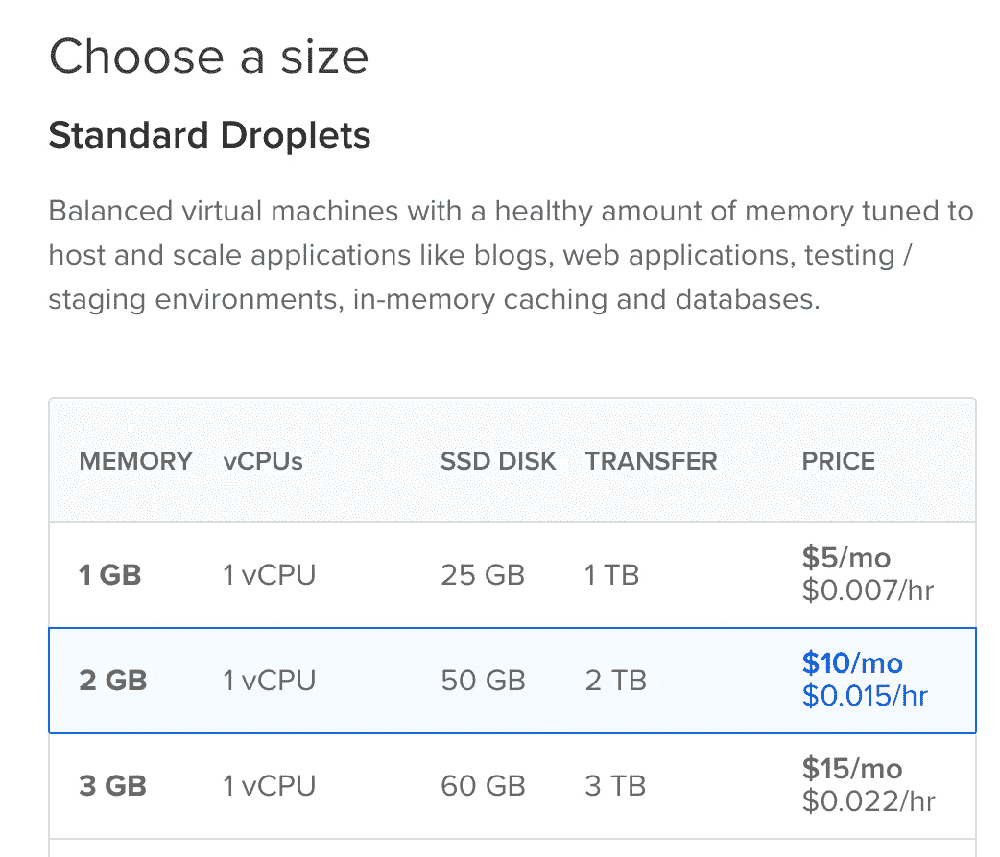
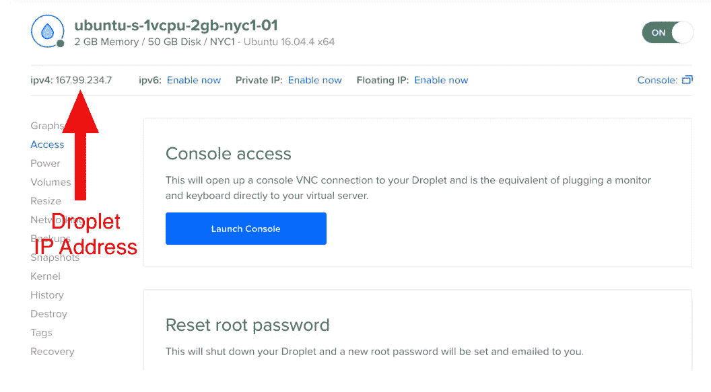

# 在 5 分钟内在数字海洋上安装一个宇宙动力的 Nuxt.js 应用程序

> 原文：<https://medium.com/hackernoon/install-a-cosmic-powered-nuxt-js-app-on-digital-ocean-in-5-minutes-567225a26fe8>


数字海洋(Digital Ocean)是一家深受开发者喜爱的托管服务提供商，它为部署和管理应用基础设施提供了一个高度直观的界面。在本教程中，我将向你展示如何在数字海洋上安装和部署一个由[宇宙驱动的](https://cosmicjs.com) [Nuxt.js](https://nuxtjs.org/) 应用程序。只需几个命令和几分钟，您就可以在可扩展的数字海洋水滴上启动并运行一个由宇宙驱动的应用程序，为团队协作做好准备。

# 入门指南

首先，让我们看看我们将在数字海洋水滴上安装什么。我们将安装:

1. [Node.js](https://nodejs.org/en/)
2。[宇宙 CLI](https://www.npmjs.com/package/cosmic-cli)3。 [Nuxt.js 网站样板文件](https://cosmicjs.com/apps/nuxtjs-website-boilerplate)
4。 [Nginx](https://www.nginx.com/)

# 创建液滴

前往[https://www.digitalocean.com](https://www.digitalocean.com/)登录/注册。登录后，创建一个新的 droplet。我推荐 2GB 内存的 Ubuntu。然后点击“创建”。



# 设置你的水滴

创建 Droplet 后，您应该会收到一封电子邮件，其中包含您的 SSH 登录和密码说明。

**SSH 进入您的 Droplet**
使用您选择的命令行工具，使用发送给您的信息登录您的服务器。

```
ssh root@your-droplet-ip
Enter your password: the-password-they-emailed-to-you
```

**安装 Node.js**

```
curl -sL https://deb.nodesource.com/setup_10.x | sudo -E bash -
sudo apt-get install -y nodejs
```

检查是否安装了 Node.js:

```
nodejs -v # this should output v10.x.x
```

安装 Cosmic CLI
如果您还没有安装，请[创建您的免费 Cosmic JS 帐户](https://cosmicjs.com/signup)。

现在你可以安装 [Cosmic CLI](https://www.npmjs.com/package/cosmic-cli) ，这是一个强大的工具，可以帮助你在 Cosmic JS 帐户中搭建新项目和执行操作。

```
npm i -g cosmic-cli
```

**登录并安装 App**
接下来，我们需要通过 CLI 登录 Cosmic JS。使用以下命令登录后，输入您的电子邮件和密码:

```
cosmic login
```

如果你去 [Nuxt.js 网站样板应用页面](https://cosmicjs.com/apps/nuxtjs-website-boilerplate)，你会注意到安装这个应用程序只有一个命令。运行以下命令:

```
cosmic install-app nuxtjs-website-boilerplate
```

然后会提示您创建一个新的存储桶或选择一个现有的存储桶。选择“创建新的存储桶”并为您的存储桶添加标题。此时，将会发生一些事情:示例内容将被导入到您新创建的 Bucket 中，Nuxt.js 应用程序代码将被下载到您的数字 Ocean Droplet 中。然后，您将看到安装状态:

```
Success!
App code located at /root/nuxtjs-website-boilerplate
```

运行以下命令启动应用程序:

```
cosmic start-app
```

一旦您看到状态“打开 [http://localhost:3000](http://localhost:3000/) ”，您的应用程序就构建好了，您可以在端口 3000 上访问您的 Droplet IP 来查看您的应用程序。(见下面截图找到你的 Droplet IP 地址)。



所以看着上面的截图，我会去[http://167.99.234.7:3000](http://167.99.234.7:3000)，我会看到应用程序:


**安装 Nginx**
现在我们已经安装了我们的 app，让我们安装 [Nginx](https://www.nginx.com/) 。Nginx 将使我们的应用程序在端口 80 上运行成为可能(端口 80 是分配给在 http 域上运行的网站的端口)。这将允许我们只查看 IP 地址(没有端口)的应用程序，并指出一个 IP 域。

停止正在运行的应用程序(Control+C ),运行以下命令安装 Nginx:

```
sudo apt-get install -y nginx
```

接下来，让我们配置 Nginx 从端口 80 到端口 3000 运行代理:

```
sudo rm /etc/nginx/sites-enabled/default
sudo vim /etc/nginx/sites-available/cosmicjs
```

编辑该文件，使**与**完全相同，如下所示:

```
server {
    listen 80;
    server_name example.com;
    location / {
        proxy_set_header   X-Forwarded-For $remote_addr;
        proxy_set_header   Host $http_host;
        proxy_pass         "http://127.0.0.1:3000";
    }
}
```

请注意，我们将 proxy_pass 设置为端口 3000，这允许 Nginx 充当反向代理，将端口 80 上的所有传入请求转发到端口 3000 上的 Node.js 应用程序。

接下来，我们需要将我们的配置符号链接到`sites-enabled`以供 Nginx 使用，因为它当前在`sites-available`中:

```
sudo ln -s /etc/nginx/sites-available/cosmicjs /etc/nginx/sites-enabled/cosmicjs
```

**重启 Nginx**

现在我们需要重启 Nginx 来应用这些更改:

```
sudo service nginx restart
```

现在再次运行 start 命令:

```
cosmic start-app
```

一旦应用程序启动，转到您的 IP 地址(没有端口号)，您应该看到您的应用程序运行干净，没有在网址端口号。

此时，您可能希望在后台运行该流程。对于这一点， [PM2](https://www.npmjs.com/package/pm2) 是一个很好的解决方案。

**添加域名**
当你准备好给你的网站添加域名时，你需要做两件事:

1.请到您的域名注册机构，将 IP 地址添加到您的域名记录中。
2。从上面(服务器名)添加你的域名到你的 Nginx 配置，然后重启 Nginx，你的网站就上线了！

**邀请团队成员**
邀请团队成员帮助管理内容，登录 Cosmic JS 并转到您的 Bucket >用户。或者运行以下命令，通过 Cosmic CLI 邀请团队成员！

```
cosmic add-user --email someone@myteam.com --role editor
```

# 结论

Digital Ocean 是一个直观的应用程序托管服务提供商，可以快速轻松地启动服务器。有了 Cosmic JS 附带的工具，您可以拥有一个连接到 CMS 的网站，在数字海洋上启动，在几分钟内就可以与您的团队成员共享。如果你对[宇宙动力应用](https://cosmicjs.com/apps)有任何疑问，请加入 Slack 上的对话[，并在](https://cosmicjs.com/community) [Twitter](https://twitter.com/cosmic_js) 上联系我们。期待看到你的作品！

> 这篇文章最初出现在宇宙 JS 网站上。