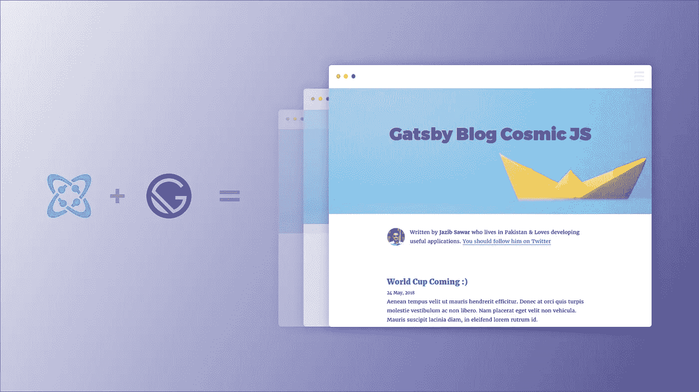
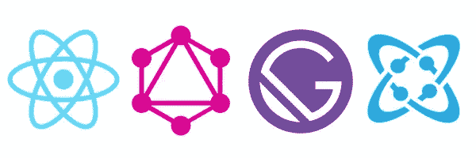
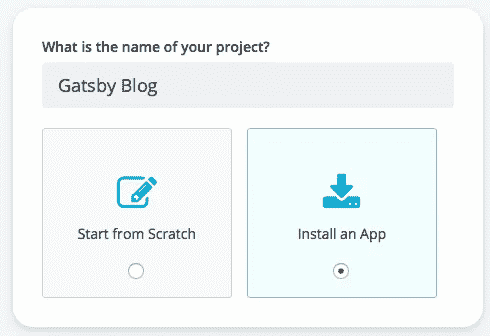
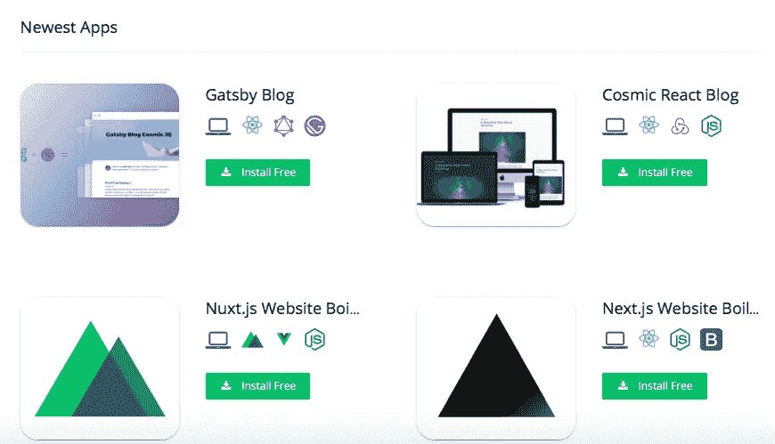
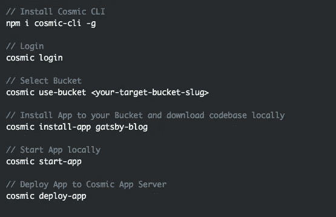

# 安装一个使用 React、GraphQL 和 Cosmic JS 构建的 Gatsby 博客

> 原文：<https://medium.com/hackernoon/install-a-gatsby-blog-built-using-react-graphql-and-cosmic-js-7e6c434844c>

Cosmic JS 刚刚推出了它的 [Gatsby 源码插件](https://www.gatsbyjs.org/packages/gatsby-source-cosmicjs/?=gatsby-source-cosmicjs)，用于使用 Cosmic JS 作为数据源建立高速网站。Cosmic JS [社区](https://cosmicjs.com/community)成员 [Jazib Sawar](https://cosmicjs.com/jazibsawar) 使用 React、GraphQL 和 Cosmic JS 建立了第一个 Gatsby 博客。在这篇博客中，我将演示如何安装这个使用 Gatsby 和利用 Cosmic JS 的力量构建的速度极快的博客🔥🚀⚡️

**TL；博士:** [盖茨比博客](https://cosmicjs.com/apps/gatsby-blog) [盖茨比博客演示](https://cosmicjs.com/apps/gatsby-blog/demo)[盖茨比博客代码库](https://github.com/cosmicjs/gatsby-blog-cosmicjs)
[盖茨比源代码插件](https://www.gatsbyjs.org/packages/gatsby-source-cosmicjs/?=gatsby-source-cosmicjs)  [使用宇宙 JS 源代码插件构建一个盖茨比博客](https://cosmicjs.com/articles/build-a-gatsby-blog-using-the-cosmic-js-source-plugin-jhzwvr45)

**第一步:创建一个新的存储桶**

**第二步:安装盖茨比博客**

**通过 Cosmic JS CLI 安装** 在您首选的命令行工具中运行以下代码，一次一行。前往 [Cosmic CLI NPM 页面](https://www.npmjs.com/package/cosmic-cli)了解更多信息。

Cosmic JS 让开发人员和非技术编辑的混合团队能够在轻量级堆栈上更快地构建应用程序和更灵活地管理内容。安装示例应用程序是在您的 Bucket Dashboard 中构建原型并熟悉简单的内容建模示例的好方法。要安装来自宇宙 JS 社区的 Gatsby 博客，[注册](https://cosmicjs.com/signup)。

[Cosmic JS](https://cosmicjs.com/) 是一个 API 首创的基于云的内容管理平台，可以轻松管理应用和内容。如果你对 Cosmic JS API 有任何疑问，请通过 [Twitter](https://twitter.com/cosmic_js) 或 [Slack](https://cosmicjs.com/community) 联系创始人。

[卡森·吉本斯](https://twitter.com/carsoncgibbons)是 [Cosmic JS](https://cosmicjs.com/) 的联合创始人& CMO，这是一个 API 第一的基于云的[内容管理平台](https://cosmicjs.com/)，它将内容从代码中分离出来，允许开发人员用他们想要的任何编程语言构建流畅的应用程序和网站。