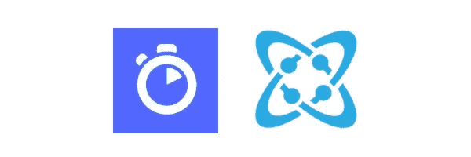
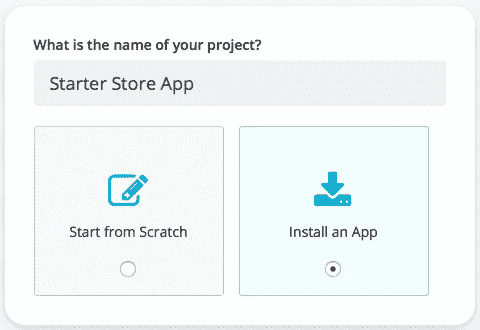
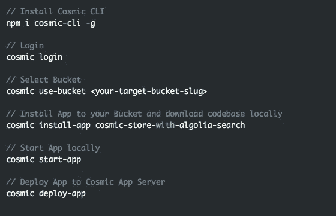

# 安装由 Algolia 和 Cosmic JS 支持的 Starter Store 应用程序

> 原文：<https://medium.com/hackernoon/install-a-starter-store-app-powered-by-algolia-and-cosmic-js-dd91fe77e75>

[Chris Overstreet](https://cosmicjs.com/chrisoverstreet) 刚刚在 Cosmic JS [社区](https://cosmicjs.com/developers)发表了一篇精彩的[文章](https://cosmicjs.com/articles/connecting-algolia-to-cosmic-js-for-awesome-search-functionality-ji63cq6q)，演示了如何将 [Algolia](https://www.algolia.com/) 与 [Cosmic JS](https://cosmicjs.com/) 同步，为项目提供快速而强大的搜索功能。他使用 React、Redux 和 Node.js 构建了一个示例[应用程序](https://cosmicjs.com/apps/cosmic-store-with-algolia-search)，该应用程序利用 Cosmic JS [Webhooks](https://cosmicjs.com/docs/webhooks) 与 Algolia 集成，为应用程序的搜索提供动力。

在这篇博客中，我将用几个简短的命令安装 [Starter Store 应用程序](https://cosmicjs.com/apps/cosmic-store-with-algolia-search)。🔥🚀⚡️

**TL；DR:** [Starter Store App](https://cosmicjs.com/apps/cosmic-store-with-algolia-search)
[Starter Store App Demo](https://cosmicjs.com/apps/cosmic-store-with-algolia-search/demo)[Starter Store App code base](https://github.com/cosmicjs/cosmic-algolia-store)  [将 Algolia 连接到 Cosmic JS 以获得令人敬畏的搜索功能](https://cosmicjs.com/articles/connecting-algolia-to-cosmic-js-for-awesome-search-functionality-ji63cq6q)

**第一步:创建一个新的存储桶**

**第二步:安装 Starter Store 应用**

**通过 Cosmic JS CLI 安装** 在您喜欢的命令行工具中，一次运行一行代码。前往[宇宙 CLI NPM 页面](https://www.npmjs.com/package/cosmic-cli)了解更多信息。

请注意，这不是一个电子商务网站的交钥匙解决方案。它缺少一些你需要的功能(如支付处理)。不过，如果你对在你的 Cosmic JS 项目中添加搜索感兴趣，可以查看一下[源代码](https://github.com/cosmicjs/cosmic-algolia-store)。这可能是你项目的一个很好的起点！

Cosmic JS 让开发人员和非技术编辑的混合团队能够在轻量级堆栈上更快地构建应用程序和更灵活地管理内容。安装示例应用程序是在您的 Bucket Dashboard 中构建原型并熟悉简单的内容建模示例的好方法。要安装来自宇宙 JS 社区的 Starter Store 应用程序，[注册](https://cosmicjs.com/signup)。

[Cosmic JS](https://cosmicjs.com/) 是一个 API 第一的基于云的内容管理平台，使管理应用和内容变得容易。如果你有关于 Cosmic JS API 的问题，请在 [Twitter](https://twitter.com/cosmic_js) 或 [Slack](https://cosmicjs.com/community) 上联系创始人。

[卡森·吉本斯](https://twitter.com/carsoncgibbons)是[宇宙 JS](https://cosmicjs.com/) 的联合创始人& CMO，宇宙 JS 是一个 API 第一的基于云的[内容管理平台](https://cosmicjs.com/)，它将内容与代码分离，允许开发者用他们想要的任何编程语言构建流畅的应用和网站。