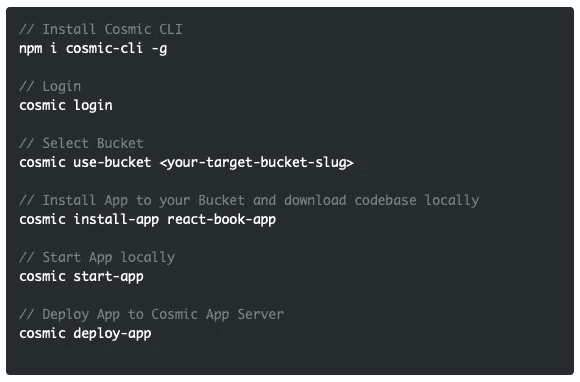

# 分 3 步安装和部署 React Book 应用程序

> 原文：<https://medium.com/hackernoon/install-and-deploy-a-react-book-app-in-3-steps-4b0062284ee>

Cosmic JS 使管理 React 应用程序的内容变得容易。Cosmic 使开发人员能够构建现代的、基于内容的应用程序，而无需维护已安装的 CMS 基础设施。Cosmic Dashboard 为内容创建者提供了无与伦比的、令人愉快的内容创建体验。

在本教程中，我将演示使用 Cosmic JS CLI 安装一个新的 Cosmic 驱动的 React 应用程序，该应用程序最近由 [Cosmic JS 社区](https://cosmicjs.com/apps)推出。图书应用程序是使用 React 和 Redux 构建的，内容由 Cosmic JS 提供。内容创建者可以管理书籍，包括图像、标题、内容、作者和书籍流派/类别。通过键入作者姓名或书名，可以实现搜索功能。按图书类别排序，并从自定义管理仪表板发布图书卡。

您可以安装、部署和管理 React Book 应用程序的每个部分的内容，所有这些都可以从您的 Cosmic JS Bucket 仪表盘中完成。让我们开始吧。🔥

# TL；博士:

[React Book App](https://cosmicjs.com/apps/react-book-app)
[React Book App Demo](https://cosmicjs.com/apps/react-book-app/demo)
[React Book App code base](https://github.com/cosmicjs/react-book-app)
[浏览 Cosmic-powered React App](https://cosmicjs.com/apps?languages=React)

# 分 3 步安装和部署 React Book 应用程序

## 第一步:创建账户

[**报名**](https://cosmicjs.com/signup) **参加宇宙 JS +安装** [**宇宙 CLI**](https://github.com/cosmicjs/cosmic-cli) **+创建新桶**

## 步骤 2:安装🛠️

**通过** [**宇宙 CLI**](https://github.com/cosmicjs/cosmic-cli) **:** 安装

Cosmic JS 提供了通过 Bucket Dashboard 或 Cosmic CLI 进行安装的选项。我使用 Cosmic JS CLI 设置了我的示例:

运行`cosmic -h`获得所有命令的列表。运行`cosmic [command] -h`了解特定命令选项的详细信息。现在，您已经启动并运行了 React Book 应用程序，可以完全通过您的 Cosmic JS Bucket 仪表盘和命令行终端工具进行管理。

## 步骤 3:部署🚀

**Cosmic JS 提供部署选项给:**

✅宇宙 JS 应用服务器(仅用于测试)
✅部署到 Zeit
✅部署到 Heroku
✅部署到 Netlify

通过选择我想要部署的代码库并选择“部署到 Cosmic”，我可以将我的 React Book 应用程序部署到 Cosmic JS 应用程序服务器，以测试我将通过 Cosmic JS 仪表板进行的实时编辑。

# 结论

当抛弃已安装的内容管理系统并采用 API 优先还不够快时，请查看来自 Cosmic JS 的[入门应用](https://cosmicjs.com/getting-started)，让项目在几秒钟内启动并运行。🔥

了解更多关于[向 Cosmic JS 社区贡献您自己的项目](https://cosmicjs.com/contribute)的信息。如果您对使用 Cosmic JS 构建应用程序有任何意见或问题，[请在 Twitter 上联系我们](https://twitter.com/cosmic_js)和[加入 Slack](https://cosmicjs.com/community) 上的对话。