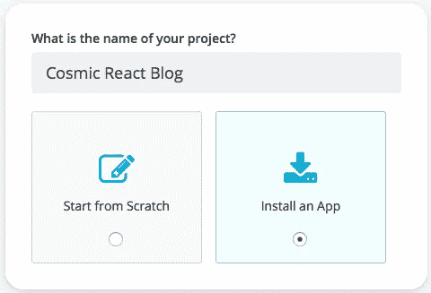
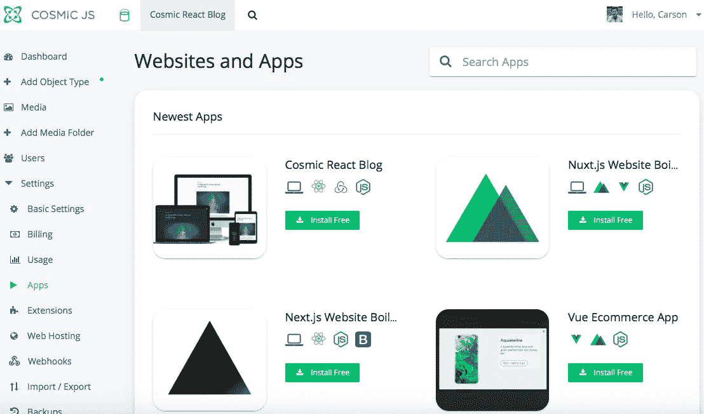
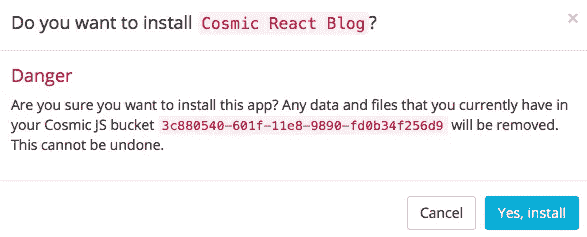
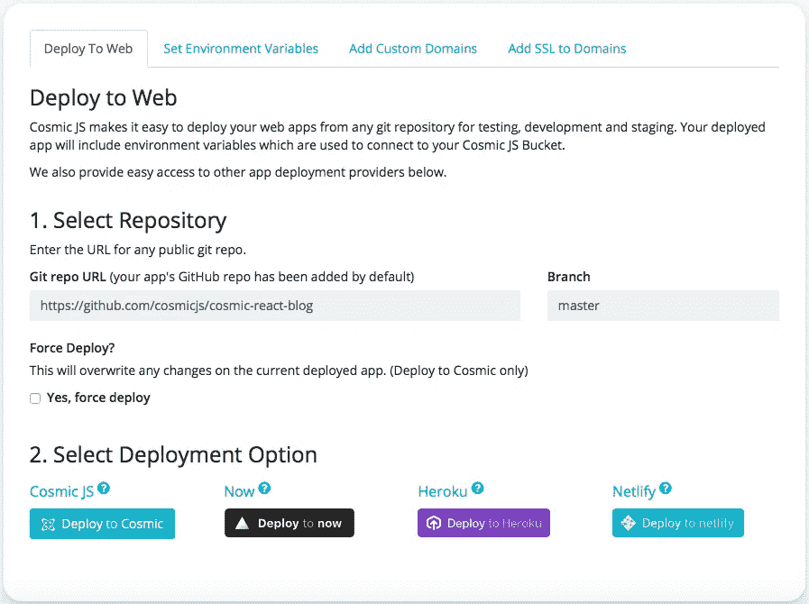
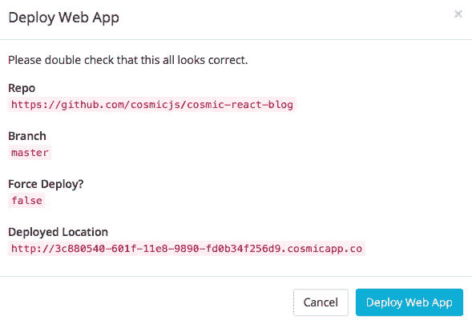

# 用 Cosmic JS 安装和部署 React + Next.js 博客

> 原文：<https://medium.com/hackernoon/install-and-deploy-a-react-next-js-blog-with-cosmic-js-629e7359d115>

Cosmic JS [社区](https://cosmicjs.com/community)是一个由开发人员、编辑和创意人员组成的强大团队，他们使用 Cosmic JS CMS 和 API 来运行他们的内容驱动型应用程序，从而不断地更快地构建应用程序。本周[克里斯·奥弗斯特里特](https://cosmicjs.com/chrisoverstreet)贡献了一个[宇宙反应博客](https://cosmicjs.com/apps/cosmic-react-blog)，建立在 React.js、Next.js、Redux 和 Node.js 之上。所有的内容、数据和文件都由宇宙 js 提供动力。我将通过几个简单的步骤演示如何安装和部署这个 [Cosmic React 博客](https://cosmicjs.com/apps/cosmic-react-blog)。请看下文，了解 Chris Overstreet 是如何创建博客的。

# TL；博士:

[宇宙反应博客](https://cosmicjs.com/apps/cosmic-react-blog) [宇宙反应博客演示](https://cosmicjs.com/apps/cosmic-react-blog/demo) [宇宙反应博客代码库](https://github.com/cosmicjs/cosmic-react-blog) [用宇宙 js 为 React + Next.js 博客提供动力](https://cosmicjs.com/articles/powering-a-react-nextjs-blog-with-cosmic-js-jhjckj2d)

# 1.创建新的存储桶

# 2.安装宇宙反应博客

# 3.部署到 Cosmic JS 应用服务器进行原型开发

Cosmic JS 还提供了与 Zeit、Heroku 和 Netlify 的部署集成。为了便于本博客的演示，我将部署到 Cosmic JS。Cosmic JS 建议只使用 Cosmic JS 应用服务器作为示例应用程序和内容模型的原型和登台环境。

宇宙 JS 应用程序生态系统的繁荣归功于我们令人惊叹的社区。如果你想开发应用程序和扩展，并作为付费社区贡献者贡献博客，请前往 [Cosmic JS Jobs](https://cosmicjs.com/jobs) 查看应用程序开发人员、开发倡导者等职位的空缺。

 [## 乔布斯|宇宙 JS

### Cosmic JS 是一个云托管的内容平台，提供了一个灵活而直观的 CMS API。建立网站和…

cosmicjs.com](https://cosmicjs.com/jobs) 

我希望本教程对你有所帮助。如果你对[宇宙 JS](https://cosmicjs.com) 系统的特性有任何问题或意见，我很乐意听听。你可以参考我的 [Cosmic JS 简介](https://cosmicjs.com/carsongibbons)来获取更多关于如何直观地导航 Cosmic JS 仪表盘的内容。

[Cosmic JS](https://cosmicjs.com) 是一个 API 优先的内容管理平台，它将内容和代码解耦，允许开发人员以任何编程语言构建应用程序，同时为非技术编辑提供基于云的编辑器来管理内容。