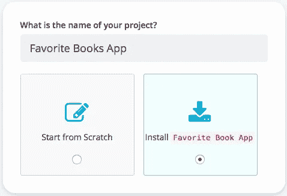

# 安装 Node.js 列表应用程序来保存您最喜欢的书籍

> 原文：<https://medium.com/hackernoon/installing-a-node-js-list-application-to-save-your-favorite-books-6f8fde3b5267>

在这篇博客中，我将演示如何安装一个简单的 Node.js 应用程序，它是为狂热的读者构建的，用来保存他们最喜欢的书籍的列表。使用 [Cosmic JS](https://cosmicjs.com/) 你可以在这个列表中添加书籍，此外，还有一个购买书籍的链接。主页显示列表中的当前图书，并附有图书的简短描述。要获得更多关于这本书的信息，你可以点击“更多信息”按钮。这将带你到一个页面，在那里它显示了这本书的完整描述，以及完整的图片和在[亚马逊](https://cosmicjs.com/extensions/amazon-product-search)上购买的链接。

**TL；博士:** [喜欢的书 App](https://cosmicjs.com/apps/favorite-book-app)
[喜欢的书 App 演示](https://cosmicjs.com/apps/favorite-book-app/demo)
[喜欢的书 App 代码库](https://github.com/cosmicjs/favorite-book-app)
[如何构建喜欢的书应用](https://cosmicjs.com/articles/favorite-book-app-jif76rkm)

我们将使用 [Cosmic JS](https://cosmicjs.com) 来安装和管理我们最喜欢的图书应用程序的内容、数据和文件。

**报名宇宙 JS**

Cosmic JS 使内容管理者和开发者能够更好地合作。通过提供直观的管理仪表板、强大的 API 和灵活的用户角色，应用程序的构建速度更快、重量更轻，并且您的整个团队在这个过程中节省了时间。从[报名](https://cosmicjs.com/signup)开始。

**安装喜欢的书 Node.js 列表 App**

**通过 Cosmic JS CLI 安装**

在您首选的命令行工具中，一次运行一行代码。前往 [Cosmic CLI NPM 页面](https://www.npmjs.com/package/cosmic-cli)了解更多信息。

Cosmic JS 让开发人员和非技术编辑的混合团队能够在轻量级堆栈上更快地构建应用程序和更灵活地管理内容。安装示例应用程序是在您的 Bucket Dashboard 中构建原型并熟悉简单的内容建模示例的好方法。要安装来自宇宙 JS 社区的最喜欢的书籍应用程序，[注册](https://cosmicjs.com/signup)。

[Cosmic JS](https://cosmicjs.com/) 是一个 API 第一的基于云的内容管理平台，使管理应用和内容变得容易。如果你有关于 Cosmic JS API 的问题，请在 [Twitter](https://twitter.com/cosmic_js) 或 [Slack](https://cosmicjs.com/community) 上联系创始人。

[卡森·吉本斯](https://twitter.com/carsoncgibbons)是[宇宙 JS](https://cosmicjs.com/) 的联合创始人& CMO，宇宙 JS 是一个 API 第一的基于云的[内容管理平台](https://cosmicjs.com/)，它将内容与代码分离，允许开发者用他们想要的任何编程语言构建流畅的应用和网站。