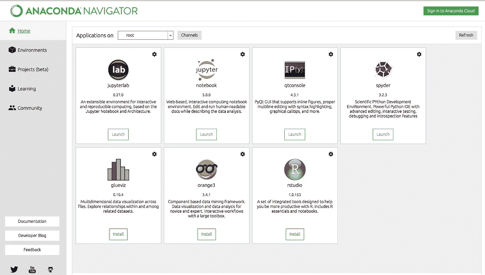

# 在 Windows 上安装 Python 和 Anaconda

> 原文：<https://medium.com/hackernoon/installing-python-and-anaconda-on-windows-f9059ba8b136>

本教程将向您展示如何在您的机器上安装 Python(通过 Anaconda)。

在开始安装之前，让我们进一步了解一下 Anaconda 到底是什么。Python 是一种编程语言，它将被安装在机器上，在此之上可以安装不同的 ide 和包。除非安装了 IDE，否则 Python 本身不会很有用。这就是 Anaconda 出现的原因。

要学习 Python 编程的基础和编程语言的细微差别，请查看这本[优秀的书](https://amzn.to/2LXiJuP)，书名为[艰难地学习 Python](https://amzn.to/2LXiJuP)。

Anaconda 安装了 IDEs 和几个重要的包，比如 NumPy，Pandas 等等，特别是为了[数据科学和机器学习](https://amzn.to/36CxZFk)的目的，这是一个非常方便的包，可以下载和安装。

第一步:你可以从[这里](https://www.anaconda.com/download/)或者从下面的链接下载安装程序。

 [## 下载-蟒蛇

### 下载 Anaconda 发行版|发布日期:下载对象:高性能发行版轻松安装…

www.anaconda.com](https://www.anaconda.com/download/) 

第二步:选择你所在的操作系统。

步骤 3:在 Python 3.6 部分，选择 32 位/64 位选项。

下载应该在这之后开始。这是一个相当大的文件，所以下载可能需要一些时间。

步骤 4:与安装人员一起完成安装过程。

步骤 5:安装完成后，在开始菜单中搜索 Anaconda Navigator。你会看到类似这样的东西(它可能会在未来的更新中改变)。

Anaconda Navigator Homepage(your screen might slightly defer in case of a newer version)

在这里你会发现几个应用程序，其中 **Spyder** (在这里找到文档)将被广泛用作编写和运行我们代码的 IDE。

# 更新 Anaconda

1.  从开始菜单打开 Anaconda 提示符。
2.  导航到 ***anaconda*** 目录。
3.  运行 ***conda 更新*conda**

恭喜你！！你已经成功安装了 Anaconda，现在你可以开始学习[机器学习](https://amzn.to/36CxZFk)了！！

要开始使用 Python 进行[机器学习，请查看](https://amzn.to/36CxZFk)[这个](https://amzn.to/36CxZFk)优秀的资源。

祝你有美好的一天:)