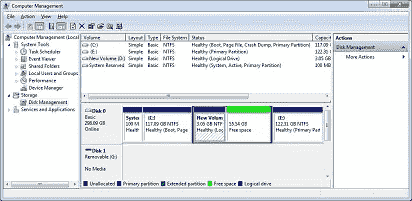

# 为深度学习安装 Ubuntu 18.04 和 Windows 10(双引导安装)

> 原文：<https://medium.com/hackernoon/installing-ubuntu-18-04-along-with-windows-10-dual-boot-installation-for-deep-learning-f4cd91b58557>

[Source](https://fossbytes.com/ubuntu-18-04-bionic-beaver-release-date-features/)

在你的电脑上安装 Ubuntu 18.04 和 windows 10 的简短指南。

# 预设置

*   强烈建议您在继续之前备份重要文件，即使这种方法已经过多次测试。
*   使用微软工具[在这里](https://www.microsoft.com/en-us/software-download/windows10ISO)创建一个 Windows [可引导](https://hackernoon.com/tagged/bootable) pendrive(故障保护)。
*   禁用快速[启动](https://hackernoon.com/tagged/startup)
    **(使用搜索，打开电源选项)电源选项** > **系统设置** > **选择电源按钮做什么**并取消选中**打开快速启动框**。

[Source](https://lifehacker.com/enable-this-setting-to-make-windows-10-boot-up-faster-1743697169)

*   禁用安全启动
    -搜索高级启动选项
    -点击立即重启
    -选择故障排除>高级选项> UEFI 固件选项设置>重启
    -将打开下一个 BIOS 设置，这将根据您的设置而有所不同
    -导航至启动选项卡
    -禁用安全启动
    -您可能需要打开/关闭传统支持

[Source](https://www.avira.com/en/support-for-home-knowledgebase-detail/kbid/1811)

*   为 Ubuntu 创造“自由空间”
*   这是你想分配给 Ubuntu 的空间总量
*   使用搜索，打开“创建和格式化硬盘分区”

*   选择要从中分配空间的分区。
*   单击“收缩分区”
*   你会看到自由空间。

# 创建安装程序

*   从[这里](https://www.ubuntu.com/download/desktop)下载 Ubuntu 18.04 的最新镜像。
*   你需要一个 4GB 以上的记忆棒。
*   如果你使用的是 Windows，使用[这个工具](https://rufus.akeo.ie)进行快速设置。
*   如果你有 Ubuntu 系统，使用内置的启动盘创建器。
*   在目标 PC 上，重新启动并进入 BIOS，并启用从 USB 启动。
*   重启并进入 Windows。
*   导航到高级启动选项。
*   点击重启。
*   选择 USB(UEFI)或 USB(UBUNTU)或 USB 选项。
*   你会发现这个屏幕。
*   选择安装 Ubuntu。

# 安装 Ubuntu

*   选择语言

[Source](https://tutorials.ubuntu.com/tutorial/tutorial-install-ubuntu-desktop?_ga=2.120547080.164498141.1528985834-1164819070.1501830984#10)

*   安装时忽略更新(如果您的互联网速度较慢，安装会变慢)
*   选择语言。

[Source](https://tutorials.ubuntu.com/tutorial/tutorial-install-ubuntu-desktop?_ga=2.120547080.164498141.1528985834-1164819070.1501830984#10)

*   选择其他东西
*   找到你之前创建的“自由空间”。
*   点击“+”
    接下来，您需要为您的操作系统分配空间并进行交换。
*   把大部分空间给/
    (我更喜欢给/和/home 分配一个单独的空间。原因:某些安装，特别是 CUDA 可能会超出分配给/)的大小

[Source](https://itsfoss.com/install-ubuntu-dual-boot-mode-windows/)

*   给两倍的内存空间进行交换。就我个人而言，我有一个 16GB 的内存，分配 64GB 只是为了给我额外的空间来处理巨大的数据集。

[Source](https://itsfoss.com/install-ubuntu-dual-boot-mode-windows/)

*   设置您的登录凭据

[Source](https://tutorials.ubuntu.com/tutorial/tutorial-install-ubuntu-desktop?_ga=2.120547080.164498141.1528985834-1164819070.1501830984#10)

*   最后点击安装

[Source](https://tutorials.ubuntu.com/tutorial/tutorial-install-ubuntu-desktop?_ga=2.120547080.164498141.1528985834-1164819070.1501830984#10)

*   最后，重启。

就这样，你完了。

*如果你觉得这篇文章有用并想保持联系，你可以在 Twitter 上找到我* [*这里*](http://twitter.com/bhutanisanyam1) *。*