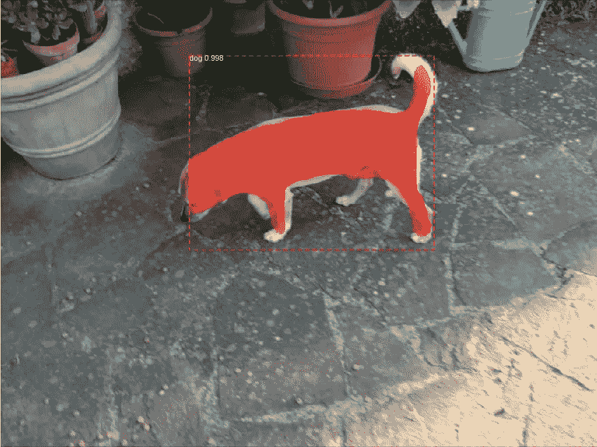

# 基于自定义数据集的 Google Colab 实例分割

> 原文：<https://medium.com/hackernoon/instance-segmentation-in-google-colab-with-custom-dataset-b3099ac23f35>

本文提出了一个简单而免费的解决方案，使用自定义数据集在 Google Colab 笔记本中训练 Tensorflow 模型进行实例分割。

[上一篇文章](https://hackernoon.com/object-detection-in-google-colab-with-custom-dataset-5a7bb2b0e97e)是关于使用自定义数据集在 Google Colab 中进行对象检测的，在那里我训练了一个模型来推断照片中我的狗的边界框。我的文章的主角又是我的狗:在这种情况下，我们向前迈进了一步，我们不仅识别边界框，我们甚至进行像素分类。


Instance segmentation with my dog

*与上一篇文章相比，我们持有相同的特征:*

*   *唯一的要求是数据集，用标注工具*创建
*   *一个单独的 Google Colab 笔记本包含所有的步骤:它从数据集开始，执行模型的训练并显示推理*
*   *它运行在 Google Colab(支持 GPU 的环境)和 Google Drive 存储中，因此* ***它完全基于免费的云资源***

这些特性允许任何遵循本教程的人创建一个实例分割模型，并在 Google Colab 中测试它，或者导出模型以在本地机器上运行。

本文的源代码，包括样本数据集，可以在我的 [Github repo](https://github.com/RomRoc/maskrcnn_train_tensorflow_colab) 中找到。

# 选择框架

有各种开源框架来实现实例分割，您可以在斯坦福大学的[本演示文稿](http://cs231n.stanford.edu/slides/2018/cs231n_2018_ds06.pdf)中找到概述。

我们放弃了不是基于 Tensorflow 的解决方案，例如基于 Caffe2 的脸书 Detectron，因为我们决定在已经与 Tensorflow 集成的 Google Colab 中训练模型。

最受欢迎的框架之一，易于使用且记录良好，是 Matterport Mask R-CNN。根据我的测试，这是可用的最简单和最健壮的实现之一。

此外，我在其他实现中遇到的一个大问题是将注释输出文件转换成框架输入格式。需要明确的是，一旦使用图形工具创建了数据集的像素标注，就应该将其转换为训练框架定义的输入格式。

Matterport 在一篇清晰的[文章](https://engineering.matterport.com/splash-of-color-instance-segmentation-with-mask-r-cnn-and-tensorflow-7c761e238b46)中开发了这项任务，演示了如何将注释文件转换为 Matterport Mask R-CNN 格式。

# 制作数据集

在上一篇文章中，我们创建了边界框注释来获得对象检测模型，现在我们将训练实例分割模型，因此我们创建像素级掩模注释来定义数据集中对象的边界。在各种可用的工具中，我选择了一个直观且做得很好的工具:牛津大学的 **VGG 图像注释器(VIA)** ，你可以在项目的[官方页面](http://www.robots.ox.ac.uk/~vgg/software/via/)中看到文档。此外，很容易将 VIA 与 Matterport 框架集成。

这个工具不需要任何安装，你只需要下载软件包，用现代浏览器打开`via.html`文件。

创建一个好的数据集来实现一个性能良好的训练模型是很重要的。在不同的光照条件下，从不同的角度和在不同的背景下拍摄物体的照片，是获得良好的通用模型和避免过度拟合的好原则。


Dataset of dog

在注释过程的最后，我创建了具有以下结构的“images.zip”文件:

```
images.zip
|- "train" directory
  |- jpg image files of training data
  |- "via_region_data.json" annotations file of training data
|- "val" directory
  |- jpg image files of validation data
  |- "via_region_data.json" annotations file of validation data
```

最后，我将 zip 文件上传到 Google Drive，以便在培训和测试过程中使用。我将数据集文件包含在我的 Gitub repo 中，其中包含狗图像的像素注释。

# 培训模式

所有的步骤都在谷歌 Colab 笔记本包括在我的回购。在我的例子中，训练过程持续大约半小时，有 5 个时期，为了得到更准确的模型，你可以增加时期的数量和数据集的大小。

我选择了支持 Python3 GPU 的环境，使用 Google Colab 中提供的 Tesla K80 GPU 长达 12 小时。笔记本的后续步骤是:

**安装需要的包**:用 Tensorflow 安装 Matterport 实例分割的包、库和环境变量。

**下载并提取数据集**:下载 Google Colab 文件系统中的 images.zip 数据集，之前上传到 Google Drive 中。用 image.zip 数据集的 Google Drive id 更新`fileId`变量。

**编辑设置文件**:我的 repo 中的代码受 Matterport Splash of Color sample 的启发，要使用不同的数据集运行，您应该用对象的名称替换出现的“balloon”和“Balloon”。

**训练模型**:在训练过程中使用预先训练的权重应用迁移学习。选项有 COCO 和 ImageNet。

训练过程输出神经网络的结构和各种参数，如网络结构(Resnet50 或 Resnet101)。

```
Using TensorFlow backend. 
Weights:  coco 
Dataset:  dataset/ 
Logs:  /logsConfigurations: 
BACKBONE                       resnet101 
BACKBONE_STRIDES               [4, 8, 16, 32, 64] 
BATCH_SIZE                     2
...
GPU_COUNT                      1 
GRADIENT_CLIP_NORM             5.0 
IMAGES_PER_GPU                 2
...
Selecting layers to train 
fpn_c5p5               (Conv2D) 
fpn_c4p4               (Conv2D) 
fpn_c3p3               (Conv2D) 
fpn_c2p2               (Conv2D) 
...
```

在培训流程的 Tensorboard 图表下方:


Tensorboard charts

# 推理

最后，我们可以用训练好的模型运行测试数据集推理。

输出包括推断数据(图像分辨率、锚点形状等)，以及带有边界框、分割遮罩和置信度得分的测试图像。



# 结论

如果您想在单个对象类上运行实例分段，您可以对我的 Github 代码做一些小的修改，并使其适应您的数据集。

我希望你喜欢这篇文章，万一留下一些掌声，它将鼓励我写关于计算机视觉的机器学习的其他实用文章:)