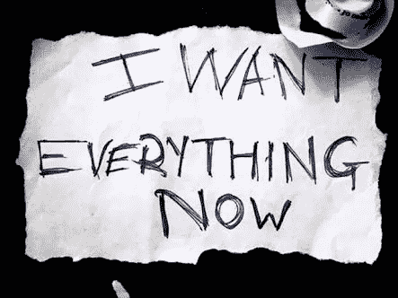

# 即时满足。

> 原文：<https://medium.com/hackernoon/instant-gratification-a21913eacda>

> “我们是历史的中间孩子，伙计。没有目的和地点。我们没有大战。没有大萧条。我们的大战是一场精神战争…我们的大萧条是我们的生活。我们都是在电视上长大的，相信有一天我们都会成为百万富翁、电影明星和摇滚明星。但我们不会。我们正在慢慢了解这个事实。我们非常非常生气。”-恰克·帕拉尼克，搏击俱乐部

我最喜欢的电影。

恰克设法用一段文字写出了我们生命的意义，这是多么美妙而又令人恐惧的一种方式。

从我们生命的一开始，我们就接触到这些屏幕，我们可能会在这些屏幕上度过我们生命的 90%，如果不是更多的话，在这些屏幕上，主要是广告和每个他妈的行业都在出售一种想法，即我们一定会过上美好的生活(顺便说一下，这种美好的生活是社会选择的，而不是我们)，我们可以多么容易地在我们的生活中达到这种水平。

如果真的那么容易，为什么大家都不这么做呢？

我认为我们这一代人，通常被称为 Z 世代，是最喜欢即时满足感的一代，因为我们是在科技的熏陶下长大的。

想暴看一场表演，网飞浑身发冷。我想要一部新手机，亚马逊会在晚上 9 点前送货上门。想知道你的朋友在 instagram 或任何其他社交媒体网站上做什么。

我们不记得没有微波炉、iPhones、即时热水、脸书、Myspace，你能想到的，我们都有。在我们生活的这个时代，你不必为了任何事情离开你的家。如果你想让最新、最酷的餐馆三明治送到你家门口，Zomato 的应用程序可以满足你(更不用说，他们有竞争对手，所以你有选择)。通过你的指尖，你可以接触到世界上所有的信息——那么为什么还要用一本书呢，对吗？

你明白了吗？

Z 世代不相信耐心这个概念。

> "忍耐是痛苦的，但它的果实是甜蜜的."
> 
> —*印度的一句流行谚语。*

但是我们怎样才能摆脱这种瞬间的满足感呢？从长远来看，这种满足感基本上是空虚的，它破坏了我们人性的一部分。

并非所有的即时满足都是不好的。及时想要或需要事物、经历或产品并没有错。用现实的时间感和耐心来平衡我们的欲望是很重要的。然而，即时满足本身并不是一件坏事。但是像**在 7 天内减掉 7 公斤**和**在 20 岁前成为百万富翁这样的事情，仅仅使用这个简单的技巧**实际上剥夺了我们的这一重要特征，即耐心，这在我们的生活中非常重要。

我的意思是，如果我们调查一下，所有这些公司都在赚大钱，只是因为我们现在想要一切。它们之所以存在，基本上是因为驱使人类满足其需求、欲望和欲望的驱动力。这些需求、欲望和欲望可以像呼吸、饮食一样是基本的需求。但它们可能像对 iPhone x 或其他酷新产品的“需求”一样复杂。

> 即时满足已经成为每个行业的核心。

unsplash

我自己已经屈服于这一点，并不真的为此感到自豪，但这是一个大问题，并正在被避免，因为在所有即时满足正在使我们的生活变得更简单和更好。事实上，我们的父母希望我们付出一切，如果我们要求他们，他们会给我们任何东西，这是在恶化我们的未来。

举个例子，一个孩子不费吹灰之力就能得到从必需品到奢侈品的所有东西，而当这个孩子进入现实世界时，他必须为所有东西工作，而不是简单地要求去夏威夷度假，这会毁了他。

眼下，即时满足似乎是人类的福音，因为它给了我们快乐，但我们应该放眼全局。

如果你想知道我是如何努力对抗即时满足的短期满足感的，看看我的另一篇文章。是关于我做的一个关于无聊的实验。是的，听起来很奇怪，我知道。请在评论区告诉我你对即时满足的看法。

 [## 我无聊的 30 天。

### 在当今世界，我们几乎不会感到无聊。

theascent.pub](https://theascent.pub/my-experiment-on-getting-bored-57c203bed2ff) 

感谢阅读。😀

查看我的个人资料了解更多信息。[放弃](https://medium.com/u/be1f7f12215d?source=post_page-----a21913eacda--------------------------------)