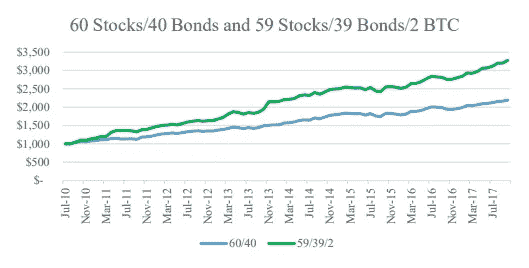

# 机构投资者现在使用 Shrimpy 来重新平衡他们的加密基金

> 原文：<https://medium.com/hackernoon/institutional-investors-are-now-using-shrimpy-to-rebalance-their-crypto-funds-34baef7b8718>

多年来，我们一直听说今年将是机构投资者开始购买加密货币的一年。如果不是 2017 年，肯定是 2018 年。事实是，机构投资者已经在购买加密资产，更多的人将会跟进。这不是一个通断开关，而是一个渐变。今年已有数百只专门投资加密货币的新对冲基金成立。我们确信明年我们会看到更多。

这是一个受欢迎的发展，不仅是因为对密码的需求增加，这将有助于价格的长期发展，而且还因为新的资本将加速技术发展。Crypto 显然会继续存在，而且越来越多的投资者正迫不及待地想要分一杯羹——前提是基础设施已经到位，而且他们能够进行适当的尽职调查。

## 机构投资者在证券市场配置不足

约翰霍普金斯大学凯里商学院的 Jim Kyung-Soo Liew 在 12 月发布了一篇研究论文[，显示机构投资者如何在比特币](https://papers.ssrn.com/sol3/papers.cfm?abstract_id=3082808)中配置不足。他的风险分析显示，这些基金应该至少有 1.3%的资金是比特币。许多捐赠基金正在观望，养老基金可能会跟进。

Adding BTC to a portfolio increases real and risk-adjusted returns moving the Sharpe ratio from 1.76 to 2.03.

> “会有波动吗？当然，但对于机构投资者来说，他们需要长期考虑，”Liew 说。“没有人想成为第一个，但他们想成为快速追随者。”

## 先行者

幸运的是，Shrimpy 上已经有了先行者——机构投资者，他们使用我们的标准平台来管理他们的投资组合。应这些基金的要求，Shrimpy 正在开发一个专门为机构投资者设计的新平台。这个平台将提供市场上最强大的工具来管理机构基金。无论您管理的是一百万美元还是近十亿美元的加密货币，我们都有解决方案来完成您的管理流程。

虽然我们将专门为机构投资者开发解决方案，但这也将激励我们为非机构用户创造新功能。我们将获得更多关于需要哪些功能来继续使 Shrimpy 成为管理多样化加密组合的最简单、最安全的平台的信息。

让我们来看看我们的一些产品。今天已经支持 ***粗体斜体*** 项。其他项目在我们的路线图上，可以根据我们用户的需求进行优先排序。我们将涉及的领域包括:

# **再平衡**

近几十年来，再平衡一直是基金的基石策略。Shrimpy 是自动化这一过程的最简单的平台。

*   ***基于市值的自动再平衡。***
*   ***能够固定所需资产的百分比(例如:20% BTC，20%瑞士联邦理工学院)。然后，所有其他资产都可以按市值进行加权。***
*   安排重新平衡的确切时间和日期。
*   对再平衡交易流程的额外控制。例如，限制每小时交易多少资产，或根据市场走势优化交易。

# **多兑换支持**

在多个交易所持有资产降低了风险，增加了流动性。此外，这提供了类似套利的机会，Shrimpy 可以在这些交易所以最佳价格购买资产。

*   ***与币安、Bittrex 等顶级交易所整合。***
*   ***根据要求与比特币基地 Pro 等其他交易所整合。***
*   **跨多个交易所重新平衡。**
*   如果需要将资产转移到不同的交易所，可以发送通知。

# 安全性

Shrimpy 从一开始就考虑到了安全性。我们使用最大的技术创新者信赖的解决方案。Shrimpy 是市场上唯一一个为机构投资者设计的再平衡平台。

目前可用或即将可用的一些功能包括:

*   ***专为管理您的资产而设计的专用服务器。通过个性化的子域访问该服务器。例如 company name . shrimpy . io***
*   ***API IP 白名单所以你的服务器是唯一可以通过 API 进行交易的机器。***
*   ***附加 IP 白名单，限制对您服务器的访问。如果您希望只能从一个位置(如您的办公室)访问 Shrimpy，这将非常有用。***
*   ***由 Auth0 提供的双因素认证(“2FA”)，使用 Google Authenticator 移动应用程序。***
*   ***API 密钥经过加密，密钥管理植根于硬件安全模块(“HSMs”)。***
*   ***HSM 由 AWS 提供，使用 FIPS 140–2 验证硬件。***
*   ***HTTPS(所有网站数据通过加密传输层安全协议(“TLS”)连接传输(即 HTTPS)。静态和动态数据都是加密的—所有网络通信都使用至少 128 位 AES 加密的 TLS。该连接使用 TLS v1.2，使用 AES_128_GCM 进行加密和身份验证，并使用 ECDHE_RSA 作为密钥交换机制。)***
*   ***通过 Cloudflare 缓解 DDOS。***

# **冷藏监控**

交易所可能会遭到黑客攻击。为了降低这种风险，我们将提供允许您离线维护大部分资产的解决方案。这确保了资产的安全性，同时仍能为交易所提供足够的流动性，以进行必要的再平衡。

*   ***离线资产可以手动输入，以包含在重新平衡计算中。***
*   通过公共地址自动更新离线资产。

# **报告和监测**

在每次重新平衡之间和之后，你会想知道你的投资表现如何。允许 Shrimpy 为您的投资组合执行再平衡为我们提供了一个独特的机会来构建这些报告，并为您提供对您至关重要的指标的全面视图。

*   只读 API 密钥监控，以确保第二来源的验证。
*   再平衡报告，包括每笔交易、每笔交易中支付的费用以及进一步的总结。
*   绩效指标。
*   在线/离线资产监控。这将根据重新平衡活动和个性化因素，在资产应该从您的冷存储中在线提取或从交易所放入冷存储时发送通知。

# 签约雇用

现在，您已经对我们提供的解决方案有了更多的了解，请发送电子邮件至 *support@shrimpy.io* 与 [Shrimpy](https://www.shrimpy.io) 进行免费试运行。随着我们继续开发该平台，我们将与您一对一地合作，以确保我们的功能集符合您的需求。

我们目前向所有新的机构投资者提供 3 个月的免费服务。这包括我们必须提供的每一个功能和对定制开发的支持。不要错过最安全、最简单的方法来增加和管理你的基金。

你还有问题或者想看现场演示吗？请发送电子邮件至 *support@shrimpy.io* 给我们。