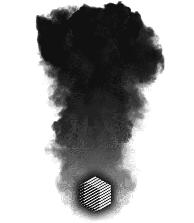
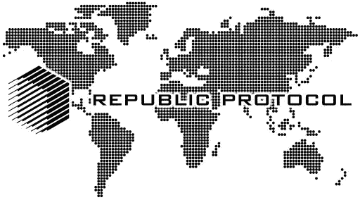
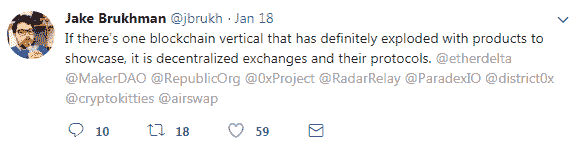
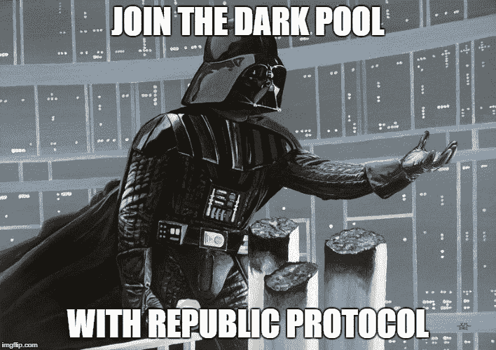

# 数百万美元正等着涌入加密货币，但他们却被困在场外——原因如下

> 原文：<https://medium.com/hackernoon/institutional-investors-want-to-get-in-on-cryptocurrencies-but-theyre-stuck-on-the-sidelines-26e05f9e3725>

# 你知道现在密码领域的主要玩家是谁吗？

“鲸鱼”也就是那些至少拥有价值数百万美元密码的人，在“老派”金融术语中，这些人被称为“高净值个人”(HNWI)。

这些 HNWI 是鲸鱼，因为每当他们在市场上交易时，他们都会因为交易量巨大而掀起巨浪。

但是这些鲸鱼是谁呢？？

嗯，他们包括比特币和其他替代货币的早期采用者/所有者、风险资本家、加密货币对冲基金、投资银行家和早期进入交易或投资的散户投资者。

这里最值得注意的是，市场的主体仍然是散户投资者，也就是像你我这样的人，或者他们在传统金融市场中喜欢称之为“父母”投资者。

如果我们要根据谁目前在加密领域拥有最大的市场份额来对投资集团进行排名，我的猜测是它看起来会像这样:

1.  早期采用者、霍德勒、密码爱好者和专家
2.  加密货币风险资本家和对冲基金
3.  散户投资者又名“妈妈和爸爸”投资者，或者在密码领域更恰当的称呼是“儿子和女儿”投资者。(千禧一代现在统治着这个领域，根据[区块链](https://hackernoon.com/tagged/blockchain)资本调查，加密货币对冲基金经理的平均年龄为 26 岁)
4.  投资银行和华尔街

现在的情况是，许多传统的老派金融机构，也就是所谓的*真正的*巨鲸，比如养老基金、保险公司、捐赠基金和共同基金，都想进入这个领域，但它们却进不去。

甚至许多传统的对冲基金、投资银行和其他知名投资者也不能、不会或还没有进入这个市场，原因如下。

这些机构投资者是真正的鲸鱼，因为如果你看看他们经手的资金总量，与目前的加密市场相比简直是个笑话。

例如，养老基金控制着超过 6 万亿美元的资产，然而加密市场的市值甚至还没有触及 1 万亿美元的大关。

“I’m beached as.”

# **机构投资者为何搁浅**

如果你参加了去年 11 月在纽约举行的 Consensus Invest 2017 大会，你可能已经听说了 1 万亿美元的加密市值。投资机构的负责人一致认为，这将使进入加密市场变得“可行”。

低于 1 万亿美元的任何东西对这些肥硕的鲸鱼来说都太小了，因为这些家伙就是这么有钱。在会议上，显而易见的是，insto 投资者对进入密码领域有着强烈的兴趣和愿望。

最近，安大略养老基金 OMERS 创建了一家专注于以太坊的上市公司，计划筹集 5000 万美元投资以太坊和 ERC20 代币。

# **泡沫？哈！我们才刚刚开始**

在撰写本文时，加密市场的总市值一直在 5500 亿美元左右波动。这可能看起来很多，但当你考虑到其他金融市场的规模时，这就像将吉娃娃狗与大丹狗进行比较。

# **市值对比:**

*   加密货币= 5500 亿美元
*   网络泡沫达到顶峰时= 3 万亿美元
*   黄金= 7.7 万亿美元
*   全球股票市场= 73 万亿美元
*   全球房地产= 217 万亿美元
*   衍生品市场= 544 万亿美元

好吧，你明白了，这些鲸鱼有很多钱可以玩，但它们还不能跳进海里，尽管它们中的一些非常想。

## 为什么会这样？

1.  缺乏法律法规——如果你在投资别人的钱，你不能拿着它在赌场上“投资”所有的钱。
2.  加密货币资产的安全和保管——这些人不知道区块链如何工作，更不用说如何安全地存储私钥了。即使他们这样做了，这些方法也不符合证券交易委员会在保管方面的规章制度。
3.  市场太小了，没有润滑的方法让这些鲸鱼滑入这个小池子而不引起巨浪，把液体溅到每个人身上。

关于(1)和(2)，我认为至少到 2018 年下半年，这些方面可能会取得坚实的进展。在这里，我真正想深入讨论的是第三点。

> 因为机构是证券市场供求背后最大的力量，他们在主要交易所进行大部分交易，并极大地影响证券价格——Investopedia

# **打开闸门让鲸鱼和水手通过**

你看，如果一个 insto 投资者现在带着 1000 亿美元进入加密市场，以我们目前 5500 亿美元的市值来看，这已经代表了整个市场的 20%了！

你能想象如果向这个市场注入 1000 亿美元会发生什么吗？不仅所有的东西都会疯涨，而且人们会拼命 FOMO，也想参与到导致价格飙升的行动中来。

机构投资者和真正的巨额资金对这个行业的影响是巨大的。

事实上，随着比特币期货的推出，我们已经见证并经历了其中一些影响，这实际上是这些投资者目前能够在这个领域“投资”并赚钱的唯一真正方式。

直到他们能接触到黑暗池…

# **什么是暗池？**

暗池是交易交易所，你可以通过一个隐藏的订单簿交易股票或其他资产。

这些东西之所以不被称为暗池，是因为使用它们的人非常富有，他们看不到堆积在他们面前的钱。

不，这是因为当你在暗池上交易或交换时，没有人能看到等待执行的买入或卖出订单。

这完全是匿名的，并且是“私下的”——或者至少是私下的。

在这种情况下，我们真的应该称它为黑暗海洋，因为通常只有最大的最邪恶的生物在这些“池子”里游泳，它们是鲸鱼和鲨鱼。

## **使用暗池有什么意义？**

它允许鲸鱼交易密码而不会严重影响市场价格。

如果他们想以 11，000 美元的价格购买大量比特币，而人们在交易所看到 1 亿美元的购买订单，这一购买墙将对价格产生强大的上行压力。

这就是为什么，在我看来，当你开始听到机构最终进入这个领域时，你可能会开始考虑泡沫何时破裂，谢天谢地，你会知道这些参与者何时进入，因为他们将对市场产生影响。

# **共和国前来救援**

除了暗池通过允许以最小的价格滑移进行交易来润滑 instos 的进入点之外，阻止他们进入的另一个主要因素是安全性和信任，无论他们与谁交易都不会欺骗他们，无论他们在什么交易所交易都不会被劫持或退出骗局。

事实是，自 2016 年以来，暗池已经出现在北海巨妖和 TradeZero 等交易所。那么，为什么 instos 还没有进入这个领域呢？

谁会用北海巨妖或 TradeZero 呢？如前所述，围绕加密资产的保管以及必须遵守的法律法规存在一些问题。

然而，这些交易所的另一个主要方面是，它们不是游戏中的主要参与者，它们没有保险，也没有提供大量的信任。

如果这些 instos 在这些交易所交易，他们的资金没有保证或安全，如果出于某种原因，它被黑客攻击，被盗，或丢失，而他们的交易。

如果这些 insto 要进入这个游戏，他们需要在各方面做好准备。

他们不能带着别人的钱进入这个市场，然后说*“啊，妈的，是的，呃，你的那 2 亿美元呢？它得到了 rekt，你得到了该死的交换，对不起兄弟！”*

**这就是** [**共和国协议**](http://www.republicprotocol.com) **的用武之地。**

> ***Republic 协议:用于以太、ERC20 代币和比特币对的无信任跨链原子交易的去中心化暗池。***

是的，我相信你会的，伙计！但是万一你没听清楚，让我来解释一下这意味着什么。

D 北海巨妖和 TradeZero 提供暗池，但它们是一个中央实体，买卖双方必须通过这个实体才能进行交易。

Republic Protocol 的目标是创建一个*去中心化的*暗池，稍后我们将解释为什么这很重要。

T **rustless:** 因为暗池是分散的，这意味着你不必信任任何人或任何事(除了协议)。

因此，交易所不太可能出现故障或遭到黑客攻击，导致你损失资金。交易所的设计方式允许你甚至不需要信任对方就能进行交易。

C

A **托米奇交易:**这源于暗池的去中心化，本质上是用一枚硬币交换另一枚硬币，而不需要经过交易所。因此，无论谁进行交易，本质上都是直接与另一方进行交易，要么是购买，要么是出售。

你可以把它想象成一个更好、更精致的 Shapeshift 或 Changely 版本，因为在这种情况下，你是在与另一个人进行一对一的点对点交易，而 Shapeshift 和 Changely 仍然需要进行交易，这导致了更高的费用和安全问题。

# **带它兜一圈**

《共和国协议》最终将为鲸鱼提供交易密码的能力，而不会引起巨大的繁荣或自杀热线电话的涌入，因为他们的交易会影响市场。

另一个主要好处是安全，因此鲸鱼不必担心通过集中交易失去所有的钱。当你谈论几千万或几亿美元的交易时，这是一个严重的问题。

我不会详细讨论 Republic Protocol 到底是如何完成他们设定的所有任务的，因为他们的白皮书中已经深入讨论了这些内容。

**TLDR 版**；他们概述了一个交换协议，该协议通过暗池提供隐私和安全，已经过数学和密码验证。

以下几件事引起了我对 Republic Protocol 的关注，也是我认为他们有很大机会成为首要的分散式暗池交易所的原因:

*   Republic 协议不依赖于以太坊，可以移植到任何其他平台，因此是跨链兼容的。这意味着几乎任何加密交换交易配对都是可能的。
*   在区块链领域，无论是外部还是内部，都没有竞争对手在做这些人正在做的事情。由于外部交易所是集中式的，区块链领域中提供分散式交易所的其他项目并非完全不可信，也不是围绕暗池和隐藏的订单簿建立的。
*   超过 900 亿美元的交易量是在比特币、以太坊和 ERC20 对之间完成的，这一数字只会随着时间的推移而增长。在传统金融市场中，暗池占美国所有交易的 20%到 30%,因此这可能意味着至少有 180 亿美元通过加密市场的暗池进行交易。
*   Republic Protocol REN 令牌有一个实际的使用案例，因为交易者需要它来支付交易费用，然后将这笔费用作为奖励支付给成功匹配和执行交易订单的矿工(节点)。REN 令牌还用作预防措施，防止 Sybil 攻击或恶意方试图破译价格、订单簿或市场中的流动性，因为需要有价值的金额作为设置节点或进行交易的预付保证金。

Republic Protocol 有一大堆顾问和合作伙伴:

*   **Loi Luu**—Kyber Network 的 CEO，这是一个类似于 0x 和 LoopRing 的去中心化交换协议
*   **Phabhakar Reddy**——投资者和顾问，Accel Partners
*   **Dorjee Sun**——首席运营官资讯，市场情报机构和交易平台
*   **John Ng Pangilinan —** 希格诺资本合伙人
*   阿努普·马拉尼(Anup Malani)——我查了一下这个人，就学术资历而言，他绝对是个老大([认真地说](https://www.law.uchicago.edu/faculty/malani))，他看起来是经济/贸易方面的顾问
*   **与 Digix Global** (第一家在区块链以太坊发行 ICO 的公司)合作，后者创造了 DGX 代币，这是一种由实物金条支持的数字货币。

该项目本身有一个强大的社区支持它，背后炒作。这可能是因为这意味着，如果这个项目真的成功了，新资金流入市场符合所有人的最大利益。

以下是在社区中创建和分享的 Republic Protocol 背后的宣传和热爱的一小部分:

好了，好了，足够的宣传和先令了，现在，让我们把事情降低一个档次，考虑项目和团队可能面临的挑战。

# **共和国礼宾团队**

## **张泰阳** —首席执行官

在 Neucode(一家专注于人工智能和高性能系统的软件和网络开发公司)担任董事 3 年，在 Virgil Capital(一家量化加密货币交易公司)担任联合创始人 1 年。

## **龙王——首席技术官**

计算机科学学士学位，在澳大利亚国立大学有 7 个月的研究经验，在 Neucode 担任首席软件开发人员不到 2 年。

## 诺亚·英厄姆——开发者

拥有数学背景和高级计算学士学位，在为 Republic Protocol 工作之前，在 TKBT 和 NICTA 有 9 个月的直接现场经验。

## **Susruth Nadimpalli——开发人员**

高级计算学士学位，有 4 个月的工作经验。

## **休·迎宾头，社区负责人**

高级计算学士学位和 4 个月的工作经验。

除了首席执行官和首席技术官，这个团队几乎没有工作经验，看起来像刚从学术界毕业的开发人员。首席执行官在加密货币交易方面有一些相关的背景知识和经验。

在这方面，开发人员似乎相对缺乏经验，这就引出了一个问题，即他们是否有能力建立协议。

从白皮书中可以清楚地看到，团队对如何构建协议有很强的技术知识和理解，然而他们是否真正拥有执行项目的经验和技术知识则是另一回事。

他们正在积极雇用开发人员和数学家来帮助加强这方面的团队，但这可能会平息这个问题。

# **流动性是关键！**

当 B2C2 的创始人 Max Boonen 在 Consensus Invest 2017 大会上被问及分散式交易所时，他提到大多数开发者都关注错了事情，因为*“流动性是关键，如果集中交易所的流动性更好，交易者会在任何一天偏好集中交易所而不是分散式交易所”。*

流动性肯定是一个关键因素，因为没有人希望在一个需要几个小时才能完成交易的交易所进行交易，这就像有人在 2018 年建立了一个 MySpace 账户来进行“社交”。

然而，Boonen 没有提到的是，流动性背后的一个主要因素是交易者对这种交易所和交易本身安全性的信心。如果没有人相信他们放入交易所的硬币是安全的或者能够被取出，那么没有人会在交易所交易。

然而，在这一点上，Republic Protocol 的顾问和合作伙伴肯定有助于为其他区块链项目以及机构投资者打开大门和机会，以帮助解决流动性问题。

Kyber Network 的保证流动性平台绝对符合 Republic 协议。

# **正在进行的工作**

截至目前，该项目是一个白皮书项目，但每天的进展和更新都在他们的 [github](https://github.com/republicprotocol) 上进行。团队路线图规划了 2018 年 Q2 奥运会的私有和公共测试网，Mainnet 将于 2018 年第三季度投入运营。

这里唯一关心的是团队是否有开发能力来执行和贯彻交付协议。

除此之外，路线图有一个现实的轨迹，甚至可能对他们有利，因为当 mainnet 上线时，这可能是我们看到一旦规则和法规以及保管问题的解决方案到位，大型机构投资者和主要参与者进入加密市场的时候。

距离我们看到*真正的*鲸鱼进入市场可能还有几个月的时间，但你肯定希望关注这个领域，观察事情如何进展和发展。

用 CoinFund 管理合伙人杰克·布鲁克曼的话说:

## 总之，以下是关键要点(TLDR):

1.  机构投资者*希望*进入加密货币市场，但他们有几个进入壁垒:(1)缺乏关于加密货币的规则和法规，(2)数字资产的保管和安全问题，以及(3)容易进入加密市场而不引起轰动。
2.  暗池交易所为高净值个人(即 WHALES 和 insto 投资者)提供了在不引起重大价格波动的情况下谨慎交易密码的机会。
3.  Republic Protocol 是唯一一个将提供分散且安全的暗池加密货币交易的区块链项目。
4.  继续关注这个领域，因为当机构投资者开始进入时，那就是我们真正开始飞向月球的时候，也是你可能要开始担心泡沫破裂的时候！

所以…

你想说什么？

你是不是要转向黑暗面，然后…

Don’t let the FOMO get you! Sign up today to make sure you don’t miss out ;)

如果你想了解更多关于共和协议的信息，请点击以下链接:

网址:[https://republicprotocol.com/](https://republicprotocol.com/)
白皮书:[https://Republic protocol . Github . io/white paper/Republic-white paper . pdf](https://republicprotocol.github.io/whitepaper/republic-whitepaper.pdf)博客:[https://medium.com/republicprotocol](https://medium.com/republicprotocol)电报:[https://t.me/republicprotocol](https://t.me/republicprotocol)Github:[https://github.com/republicprotocol](https://github.com/republicprotocol)

## **共和国协议审查**

CrushCrypto 评论:[https://crushcrypto.com/republic-protocol-ico-review/](https://crushcrypto.com/republic-protocol-ico-review/)

加密币回顾:[https://crypto coin . com . au/analysis/ico-analysis-Republic-protocol-token/](https://cryptocoin.com.au/analysis/ico-analysis-republic-protocol-token/)

YouTube 评论:[https://www.youtube.com/watch?v=4_xRUFkA754](https://www.youtube.com/watch?v=4_xRUFkA754)

**免责声明:**我将在 2 月 3 日即将到来的众筹中投资《共和协议》。