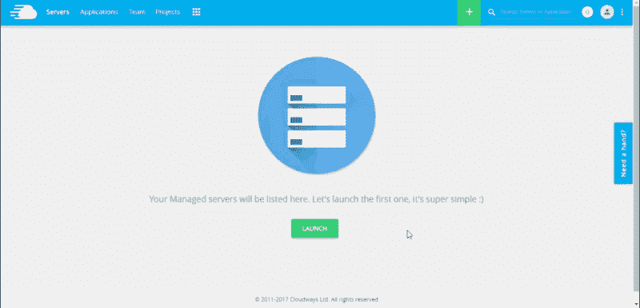
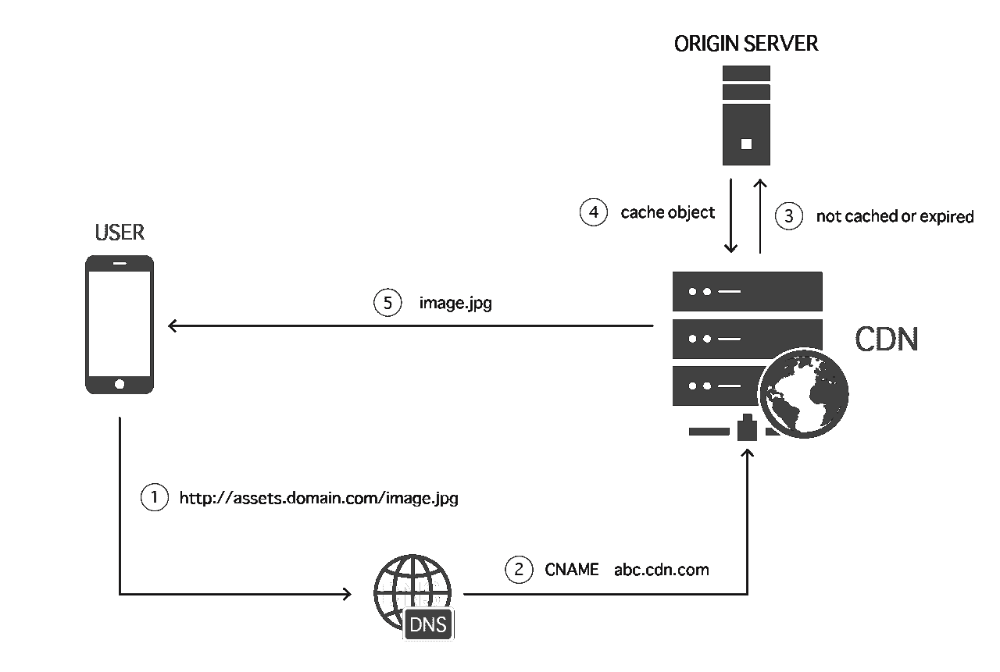
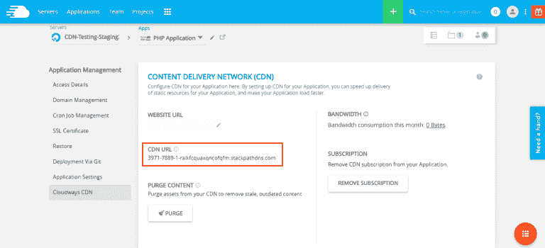
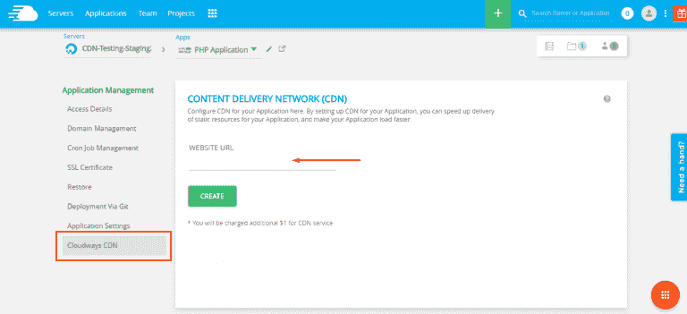

# 将 CloudwaysCDN 与 Laravel 集成

> 原文：<https://medium.com/hackernoon/integrate-cloudwayscdn-with-laravel-b569c4cc1a03>

内容交付网络(CDN)是位于整个网络的服务器群中托管的中间服务器的排列。CDN 的目标是尽可能快地传送内容，而不管托管网站的服务器在哪里。从技术角度来说，CDN 提供 web 缓存、负载平衡和请求路由，以确保快速的页面加载速度。


## CDN 如何为您的业务增值

不管你的业务性质如何，CDN 都会为你的网站增加价值。如果您对服务交付感兴趣，CDN 可以确保更快地将您的服务交付给客户。同样，如果你是一个产品或者一个平台，一个 CDN 可以让所有的访问者和用户享受你的产品而不会有延迟。

在所有情况下，CDN 都是网站和业务流程的重要补充。CDN 提供的高页面加载速度确保访问者能够更快地访问您的服务和产品(通常会带来更多的转化)。

CDN 的工作原理是存储网站静态内容的副本，并将其提供给客户端。这意味着来自客户端的请求不是由原始服务器完成，而是由最近的 CDN 服务器完成。这导致了快速的页面加载速度，因为数据是从最近的 CDN 服务器提供的。

为了方便用户，Cloudways 推出了 CloudwaysCDN，以确保所有 Laravel 应用程序都能为用户提供良好的 UX。在本文中，我将向您展示将 Cloudways CDN 与您的 Laravel 应用程序集成是多么容易。

出于本文的目的，我假设您有一个 Laravel 应用程序部署在 Cloudways 托管的 Laravel web 主机上。如果您不是这种情况，我强烈建议您尝试一下 Cloudways。只需注册一个试用版，然后按照下面的 GIF 进行服务器和应用程序设置。



## CDN 请求流

以下是 CDN 如何与您的网站一起工作。您网站上所有静态资产的 URL 都被替换为 CDN URL。比如:[T3、T5 变成了](http://mywebsite.com/img/logo.png) [**、**](http://cdn.mycdnprovider.com/img/logo.png) 。在这种情况下，文件 logo.png 将由 CDN 服务器提供，而不是托管文件的原始服务器。



CDN 有两种方式将数据从您的网站带入其网络。第一种方式是手动方式，即手动转移记录。在第二种方法中，内容被自动引入。在这两种方法中，CDN 继续指向网站资产，直到链接被改变。在这种情况下，CDN 通常负责刷新链接。

我将从演示为您的 Laravel 应用程序启用 CloudwaysCDN 的简单过程开始。

## 为 Laravel 应用程序启用 CloudwaysCDN

首先单击应用程序管理选项末尾的 **CloudwaysCDN** 选项。在打开的屏幕中，当您单击选项卡时，您将看到 CDN 配置屏幕。在这里，您将找到要插入网站 URL 字段的应用程序的 URL，然后单击“创建”按钮。



接下来，您将获得 Laravel 应用程序新生成的 URL:



## 这里需要注意几件事:

*   您可以在此屏幕上查看带宽使用情况。
*   您可以使用清除按钮清除 CDN 缓存中的旧内容。
*   您可以随时删除您的订阅

## 将 CloudwaysCDN 与 Laravel 应用程序集成

创造了**。/app/helpers.php** 文件并更新。/composer.json 如下

```
“autoload”: {“classmap”: […],…“files”: [“app/helpers.php”]},
```

要实现 Laravel CDN，需要在整个应用程序中使用全球范围的容量。为此，请在申请信封中附上 helpers.php 的记录。将附带的代码放入记录中。执行命令 **composer dump-autoload** 来转储自动加载程序，然后将以下代码添加到您的**中。/app/helpers.php** 。

```
<?php// global CDN link helper functionfunction cdn( $asset ){// Verify if KeyCDN URLs are present in the config fileif( !Config::get(‘app.cdn’) )return asset( $asset );// Get file name incl extension and CDN URLs$cdns = Config::get(‘app.cdn’);$assetName = basename( $asset );// Remove query string$assetName = explode(“?”, $assetName);$assetName = $assetName[0];// Select the CDN URL based on the extensionforeach( $cdns as $cdn => $types ) {if( preg_match(‘/^.*\.(‘ . $types . ‘)$/i’, $assetName) )return cdnPath($cdn, $asset);}// In case of no match use the last in the arrayend($cdns);return cdnPath( key( $cdns ) , $asset);}function cdnPath($cdn, $asset) {return “//” . rtrim($cdn, “/”) . “/” . ltrim( $asset, “/”);}
```

如果在**中没有定义 CDN URLs，将调用标准 asset()函数。/config/app.php** 配置文件。

## 设置 URL

现在，打开 **app/config/app.php** 或者您的环境的配置文件。将您的 CDN 域添加到 app.php 中，如下例所示:

```
‘cdn’ => [“77728–356013-raikfcquaxqncofqfm.stackpathdns.com” => “css|js|eot|woff|ttf,jpg|jpeg|png|gif|svg”],
```

就是这样。一切都准备好了。只需用新的 cdn()函数替换视图中的 asset()函数。例如，我使用了以下代码来链接 bootstrap.css 文件

```
<link rel=”stylesheet” href=”{{ cdn(‘css/bootstrap.css’) }}”>
```

## 全球助手

在视图中使用全局助手功能:

```

```

## 将 CDN 用于图像的示例:

```

```

在文件中用 cdn()替换所有 asset()函数，显著提高应用程序的性能。

## 结论

设置可配置且可行的 CDN 的关键理念是:

*   利用一个全球变量有效地获得你的 CDN 的网址
*   用 CDN 变量作为静态资产 URL 的前缀
*   利用设置记录来表征 CDN 变量
*   将您的 CDN 设置为从 inception 服务器获取资产
*   通过将您的资产放入一个正式的注册表来否定它们
*   利用 URL 重写讽刺已形成的注册表
*   在配置记录中保留一个重现号

拥有 CDN 可以让您的应用堆栈在执行和服务器负载方面获得各种优势。CDN 使您能够存储不经常更改的特定记录/档案，甚至是偶尔更改的文档。这将减少您的应用程序服务器需要处理的 IO 活动，另外还会降低传输速度。对客户来说，这意味着更好的执行。

Cloudways 与 StackPath(以前称为 MaxCDN)合作，为 CloudwaysCDN 提供一键激活。请注意，对于单个网站，每 25GB 带宽的月订阅费用为 1 美元。