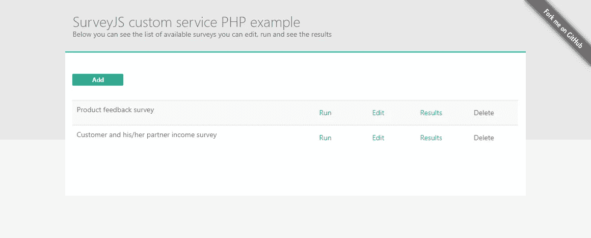
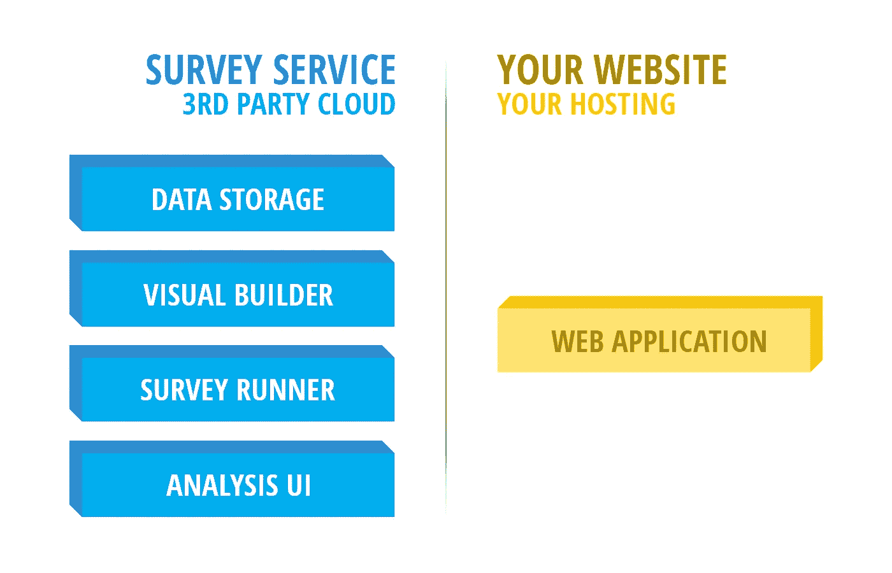
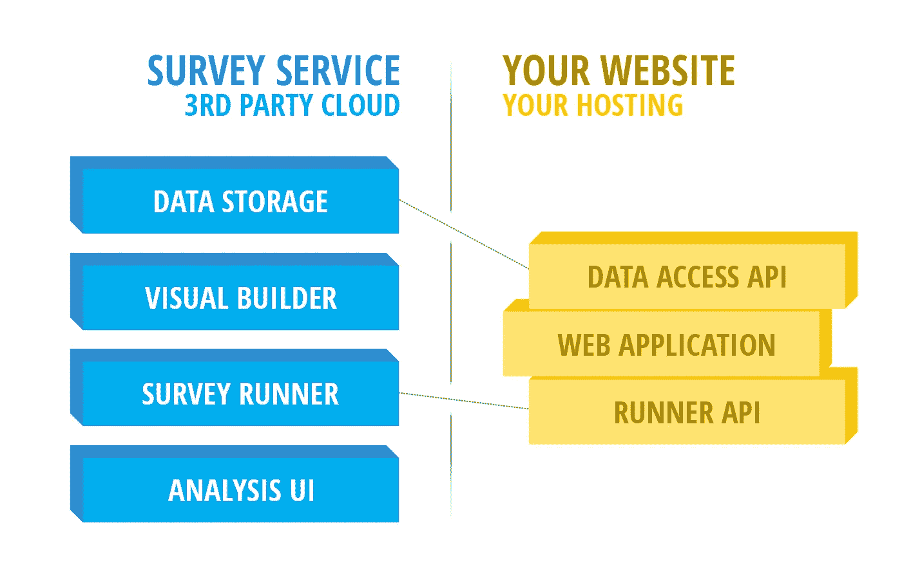
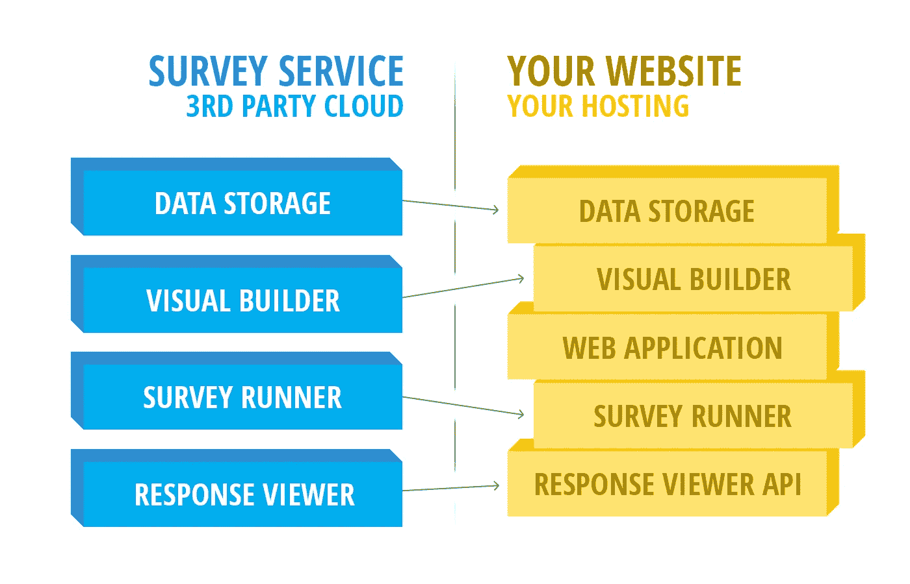
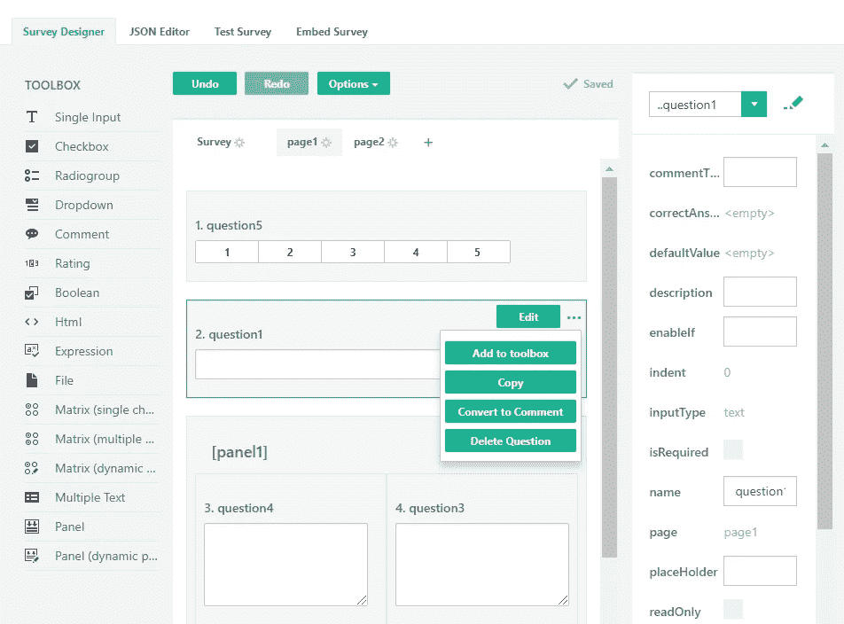
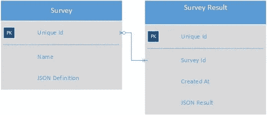

# 将整个调查生命周期集成到您的 Web 应用程序中

> 原文：<https://medium.com/hackernoon/integrate-the-entire-survey-life-cycle-into-your-web-application-21a11365a259>

您可以将 SurveyJS 用作常规的最终用户产品，这是一个独立的基于云的解决方案，具有完整的调查生命周期管理。您还可以将 SurveyJS 的任何部分变成您的——将我们的 UI 小部件集成到您的站点中，让我们的引擎与您的自定义存储一起工作，或者通过 API 与我们的后端进行通信。

为了展示 SurveyJS 的可能性，我们为三个流行的 web 开发平台——ASP.NET 核心、PHP 和 Node.js 创建了演示。这些应用程序展示了如何将调查管理的任何部分——从数据管理和构建器 UI 到执行和结果分析——嵌入到您自己的网站中。每个演示都有一个到 GitHub 库的链接，所以你可以查看源代码。

[](https://surveyjs-php.herokuapp.com)

*   [ASP.NET 核心演示](https://surveyjs-aspnet-mvc.azurewebsites.net/)
*   [Node.js 演示](https://surveyjs-nodejs.herokuapp.com/)
*   [PHP 演示](https://surveyjs-php.herokuapp.com)

这些集成功能使 SurveyJS 有别于其他产品。您可以针对任何需求定制解决方案，只需以最有利于您的应用程序的方式将各个部分组合在一起。

在介绍 SurveyJS 每个部分的集成基础知识之前，我将快速回顾三种最常见的集成策略及其各自的优势。虽然前两个足够常见，但最后一个是 SurveyJS 无可匹敌的。

# 零级集成:全部在云中

在这一级没有集成—从调查创建和执行到数据分析的一切都发生在第三方网站上。这种情况非常简单，图表仅用于介绍任何调查系统的构建模块。



**好处**:

*   零集成工作/适合没有编程经验的用户。
*   适用于电子邮件活动。

这种模型自然假设按月或按年计费，但是 SurveyJS 到目前为止在这种情况下仍然是完全免费的。

# 集成级别一:前端(运行者)

在这种情况下，最终用户可见的调查部分被集成到您的应用程序中。换句话说，用户不必离开你的网站，用户界面始终是一致的。通常，您还会得到某种数据访问 API。



**好处:**

*   除了问卷或测验的通常用途之外，您还可以使用调查库。例如，您可以创建一个订单。
*   完全定制，以符合您的网站的视觉外观。新服务版本推出时不会出现意外变化。
*   基于您网站的登录详细信息限制执行的能力。

SurveyJS 完全支持这种级别的集成，并且可以免费使用。

# 第二级集成:后端(数据源和构建器 UI)

这是很少有产品能够达到的集成水平。它允许您管理应用程序中调查生命周期的任何部分。您可以将数据存储在您选择的数据库中，您可以自定义调查构建器并将其嵌入到您自己的网站中，您可以通过 API 与后端进行通信，等等。



(我用“RESPONSE VIEWER”替换了“ANALYSIS UI”块，因为我们还没有为 SurveyJS 实现全面的数据分析仪表板。您仍然可以访问结果并构建自己的 UI，正如我在本文后面的一个简单示例中所示)

**好处:**

*   您可以让您的员工使用自定义构建器 UI 设计调查。在修改后的构建器中，您可以添加新的问题类型，删除不必要的选项，等等。
*   你可以使用自己来源的数据来构建问题。
*   您可以使用自己选择的数据库管理系统将数据存储在自己的服务器上。

我们来到了 SurveyJS 目前唯一需要付费许可的部分。要将测量构建器 UI 集成到商业应用程序中，您需要购买该库。它仍然免费用于非商业用途。

现在，我已经列出了*您可以整合哪些*，让我们继续讨论*如何整合*。

# 集成前端:调查运行器

我们在以前的文章中详细介绍了 Survey Runner 的功能:[满足 SurveyJS](https://hackernoon.com/meet-surveyjs-d8ac6a61db62) 和 [SurveyJS 超出 Beta](https://hackernoon.com/surveyjs-an-open-source-javascript-survey-library-with-versions-for-angular-2-react-vue-2086d988b974) 。我们的网站还包含了大量关于如何在使用不同客户端平台时创建和集成跑步者的例子:Angular 2+、jQuery、Knockout、React 和 Vue.js。

即使您正在使用定制的测量存储，工作流程也很简单:

*   从存储中加载 JSON 格式的调查定义。
*   使用它来创建 Survey Runner JavaScript 对象(如我们的示例所示)。
*   完成调查后，将 JSON 和结果保存到您的存储器中。

# 集成后端:调查编辑器

最简单的调查后端实现将包含以下元素:

*   包含调查列表的页面。
*   创建或删除条目的能力。
*   **使用集成编辑器用户界面构建/编辑调查。**
*   审查和分析调查结果。
*   安全系统启用角色和权限。

显示和管理测量对象列表并不复杂。最有趣的任务是集成调查构建器/编辑器。

与任何其他调查服务一样，我们已经实现了自己的最终用户构建器 UI。与其他提供商不同，我们允许您以小部件的形式获得该编辑器 UI，对其进行定制，并将其集成到您自己的网站中，如本[集成调查编辑器示例](https://surveyjs.io/Editor/Editor/)所示。



Integrated SurveyJS Editor

这种集成所需的基本代码如下所示。它使用本地存储加载并保存调查定义。查看我们的 [Plunker 示例](https://plnkr.co/edit/QFfuVI?p=preview)，看看这段代码的运行情况。

```
var storageName = "TestSurvey";// Create a Survey Editor with default options
var editorOptions = { };
editor = new SurveyEditor.SurveyEditor("editorElement", editorOptions);// Enable state indication (Saving, Loading, etc) in the toolbar
editor.showState = true;// Call saveSurveyFunc automatically on changes
// Otherwise a user will need to manually click "Save" 
editor.isAutoSave = true;// A callback function invoked when you must save changes
editor.saveSurveyFunc = function(saveNo, callback) {
    window.localStorage.setItem(storageName, editor.text);
    !!callback && callback(saveNo, true);
};// Load the survey definition from storage
editor.text = window.localStorage.getItem(storageName) || "";
```

关于这段代码的一些细节:

*   要 ***从数据库加载调查*** 定义，只需将调查 JSON 分配给编辑器的**文本**属性，如最后一行所示。
*   将 ***中的*** ***中的*** 定义保存到数据库中，在**中编写代码保存 SurveyFunc** 回调函数。 **saveNo** 参数有助于异步数据加载/保存操作。如果在您已经处理了 **saveNo=48** ，之后，一个带有 **saveNo=47** 的请求到达您的服务器，您知道它不是最新的版本，您应该忽略它。
*   回调函数告诉编辑器操作 **#saveNo** 是成功还是失败，由布尔参数指定。当您报告成功时，编辑器会将其状态从“保存…”更新为“已保存”。

在大多数情况下，您还需要自定义 SurveyJS 编辑器。关于如何做到这一点的详细说明最好留在另一篇文章中，我们已经在做了。这里我将只强调主要的定制功能。

*   本地化任何字符串，包括属性名。
*   隐藏顶部的三个选项卡(JSON 编辑器、测试调查、嵌入调查)。
*   隐藏右侧的属性网格。
*   从问题工具箱中移除任何问题类型，并添加自定义问题类型。
*   添加或移除属性，更改它们在属性网格或模式对话框中的位置。
*   注册新的或重写当前的属性编辑器。
*   删除/添加问题上下文菜单中的项目(“添加到工具箱”、“复制”等)。)
*   禁用所有元素或特定元素的拖放和其他操作。
*   将 [Ace 编辑器](https://ace.c9.io/)集成到 JSON 编辑器标签中，并且[选择 2](https://select2.org/) 而不是标准的下拉小部件。

要查看这些和其他功能，请看一下[我们的示例](https://surveyjs.io/Examples/Editor/)。

# 集成后端:查看结果

构建结果列表是一项简单的任务。您可以很容易地获得日期、时间戳、用户信息以及您需要的一切。一旦你完成了列表，你将需要显示个人的结果，这就是我们可以帮助的地方。

调查响应以 JSON 格式存储，您需要对其进行解析以在表格中显示结果，就像我们在 [SurveyJS.io 服务](https://surveyjs.io/Service/MySurveys/)中所做的那样。这很容易做到，正如 web 上针对任何服务器/客户机平台的无数示例所示。

或者，您可以将结果显示为只读调查，其中已经填写了回答。为此，您只需要两行代码。

```
survey.data = JSON.parse(yourJSONResultAsText);
survey.mode = "display";
```

要指示查看者在一页上显示所有问题，请添加以下行:

```
survey.isSinglePage = true;
```

回顾下面的 JSFiddle，以便更好地理解我们正在谈论的内容。

Results Page Example

# 集成后端:数据存储

如果您计划在您的终端存储数据，那么您必须至少创建以下两个具有一对多关系的表。



Survey Service Tables

JSON 字段是您存储调查定义和结果的地方。您可以将这些数据库值直接提供给调查人员或编辑人员，他们生成的结果也会直接进入数据库，无需任何转换或复杂的数据库结构。

除此之外，您可能希望为后端用户添加安全角色，保存数据日志，等等。SurveyJS 不提供这些特性，因为我们假设如果您想要这种级别的控制和集成，那么您的应用程序中可能已经有了这些系统。

当然，你不必使用定制的存储器，你可以很容易地利用[我们的服务](https://surveyjs.io/Service/MySurveys/)，任何人都可以免费使用。即使使用我们的存储，您也可以从应用程序的用户界面控制数据:

*   [私有 API](https://surveyjs.io/Help/Index/) 允许创建、编辑、查看和删除调查，以及获取调查结果。
*   [公共 API](http://api.dxsurvey.com/Help/Index) 允许您将应用程序中的调查结果发布到我们的存储中。

# 了解有关调查的更多信息

[SurveyJS](https://surveyjs.io/) 包括三种产品:

*   一个 [JavaScript 库](https://surveyjs.io/Overview/Library/)，使你能够在你的网站上进行调查(开源和免费)。
*   一个[云服务](https://surveyjs.io/Service/)，允许你创建和存储调查，下载和分析他们的结果(目前免费使用)。
*   一个可嵌入的[基于 JavaScript 的调查编辑器](https://surveyjs.io/Editor/Editor/) UI(提供免费的非商业和付费的商业使用许可)。