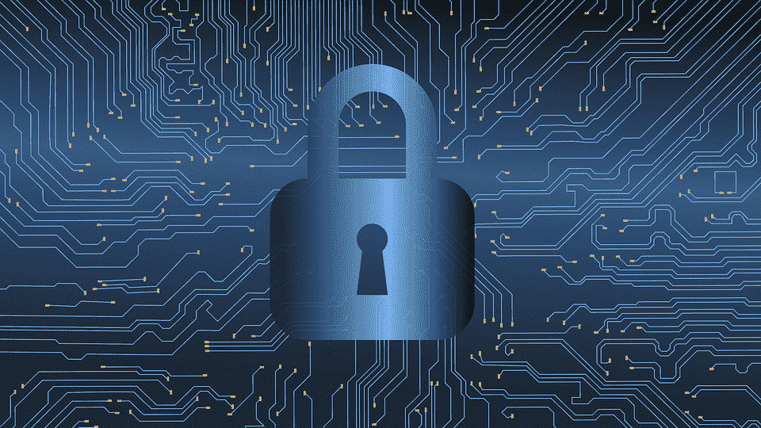

# 综合护理、物联网技术和区块链:最新进展

> 原文：<https://medium.com/hackernoon/integrated-care-iot-technology-and-blockchain-an-update-10daa0077a40>

Source: [Pixabay](https://pixabay.com/en/hacking-cybercrime-cybersecurity-3112539/)

物联网(IoT)设备的头号问题是什么？安全漏洞。作为物联网世界的一部分，许多设备足够智能来发送信息，但不够复杂来拥有自己的安全性。这意味着在你的家里，如果没有合适的控制器，你的智能灯泡可能会成为你网络其余部分的网关。

幸运的是，这些设备中的大多数都提供了合理的安全性。例如，飞利浦 Hue 智能灯泡由一个中央集线器控制，没有它，灯泡将无法工作，安全性包含在该集线器中。可穿戴设备、移动设备，甚至更敏感的数据呢？

考虑一下连接到手机的 Fitbit 或其他智能手表。他们多久连接一次公共 Wi-Fi？许多是通过蓝牙技术访问的，这种技术有其自身的弱点。此外，医生和护士使用基于应用的平板电脑访问电子医疗记录(EHR)数据，我们认为道德黑客需要关注移动设备、可穿戴设备和其他安全漏洞与医疗保健数据直接相关的领域的安全，而[设备必须符合 HIPPA 标准](https://hackernoon.com/hipaa-medical-data-security-for-web-developers-c877fcde0716)才能发挥作用。

# 集成护理和数据保护

我们拥有的医疗保健数据越多——我们从可穿戴设备和其他来源收集的数据越多——我们就越觉得有必要提供综合护理。“将行为健康和初级健康结合在一起很有挑战性，”行为健康医生索菲亚·墨菲在[谈到综合护理的需求时解释道。她继续解释道:“我们正在开发将集成扩展到其他站点的程序。目前，我们正处于收集数据和结果的阶段，以显示我们所做的工作是有效的。下一阶段是能够言行一致，这样我们就可以与其他学科合作，并表明当我们团结起来时，我们的患者会更健康、更快乐。”](https://asuonline.asu.edu/newsroom/sun-devil-life/need-integrative-care-doctor-behavioral-health)

这种数据共享伴随着自身的风险。静态数据比传输中的数据更容易加密和保护，无论它通过何种方式发送。在一个位置访问数据的个人越多，导致安全漏洞的人为错误风险就越高。

此外，还有“需要知道”的因素。虽然初级卫生和行为卫生从业者需要共同努力，以提供更好的整体患者健康，但并不是每一项数据都是相关的，有些数据甚至可能会使诊断偏向医疗领域的任何一方。

许多人认为社交数据应该受到与医疗数据相同或至少相似的保护，这种信息非常强大，但它可能会很容易产生问题并被恶意窃取，因为它可能对治疗有用。这是一个隐私的新时代，一个由患者和社交媒体用户控制，但由我们每天使用的程序和软件来保护数据的时代。

# 可穿戴设备、移动设备和 HIPAA

如上所述，可穿戴设备和移动设备很常见，并且用于各种目的。苹果刚刚结束了一项与斯坦福大学合作的[心脏研究](https://med.stanford.edu/appleheartstudy.html)，该研究使用了 Apple Watch 用户自愿提供的数据。这项研究检测了不规则的心跳事件，甚至那些与严重心脏疾病有关的事件，试图看看是否可以远程实现有效的诊断。根据这些数据，医疗专业人员可以实时警告患者潜在的风险。

这类设备的安全性如何？就像现代手机一样，手表通过蓝牙连接到公共 Wi-Fi 和其他设备。它们包含详细的个人和医疗信息。如果他们将这些信息传输给医疗专业人员，谁有责任在传输过程中保护这些数据？当我们展望远程医疗、更复杂的可穿戴设备以及远程诊断和监控的未来时，这是安全发展的重点。一些[物联网](https://hackernoon.com/top-10-iot-internet-of-things-app-development-companies-iot-solutions-leader-2018-590a979b71d1)领域的顶级应用开发者正专注于此。

HIPAA 规定医疗专业人员必须对患者数据保密。类似的标准必须适用于可穿戴设备和其他设备，以确保数据在设备上存放和传输给接收数据的人时受到保护。

# 区块链的潜在解决方案

医疗保健数据成为黑客攻击目标的原因是，这些数据富含他们想要的信息。他们可以获取这些信息，然后出售，创建假身份，或用于勒索软件攻击。有了姓名、社会保险号、地址和家族史，黑客可以做很多事情。

许多医疗保健提供商正在探索的一种解决方案是区块链提供的独特安全性。本质上，智能合同嵌入在数字代码中，并存储在透明、安全的数据库中。存储在那里的数据不能被删除、修改或以其他方式篡改。

目前，大约 15%的医疗保健应用已经采用区块链技术进行商业部署，但预计到 2025 年，这一数字将上升至 55%。以太坊的开源平台 HealthHeart 就是这样一个平台，它不仅允许医生访问，还允许患者查看谁在访问他们的记录以及访问的目的。

无论区块链作为医疗保健安全解决方案的未来如何，物联网如何与区块链互动，以及这对综合护理有何影响，都有待观察，但有一点是明确的:有道德的黑客和程序员必须关注最常用于访问和传输这些数据的设备，这意味着移动设备和可穿戴设备可能会在很长一段时间内成为焦点。