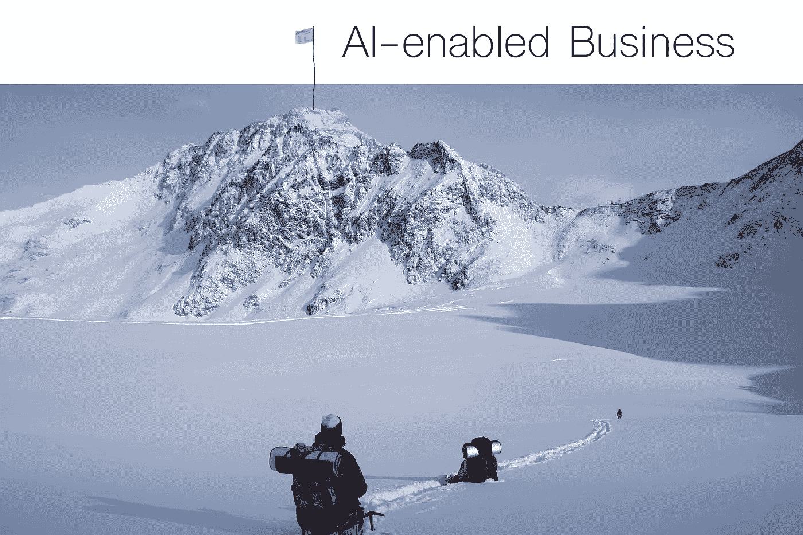

# 集成 AI？这里有三个你将要遇到的问题。

> 原文：<https://medium.com/hackernoon/integrating-ai-here-are-3-problems-youre-about-to-encounter-f0f89414608f>

AI-enabled business can be hard to reach

作为一个需要经营企业的人，无论企业规模大小，你都会被会议上关于人工智能有多棒的文章和演讲淹没。你会听到很多关于它能做什么，一些有趣的新研究的结果，以及关于它将如何改变你的业务的模糊断言。

事实上，它能够也将会改变你的业务，但前提是你能克服进入壁垒。

对人工智能本身有很多关注；机器学习模型及其算法，其准确性，以及所有令人惊叹的新突破。很分散注意力。让我展示给你看:

[这个新的 Alexa 技能将播放人工智能生成的音乐](https://www.theverge.com/2018/3/14/17120588/deepmusic-alexa-skill-ai-generated-music)

[微软称其人工智能可以像人类一样翻译中文](https://www.engadget.com/2018/03/14/microsoft-ai-can-translate-chinese-as-well-as-a-human/)

[人工智能统治着你生活的更多部分。谁统治 AI？](https://www.wsj.com/articles/artificial-intelligence-rules-more-of-your-life-who-rules-ai-1520933401)

这很好，绝对值得关注。但让我们面对现实吧，你还有生意要做。在大多数情况下，你不是在试图煮沸海洋。

让我们来谈谈 AI 中真实的、实际的进入壁垒。

Just out of reach

## 数据集

拥有正确的数据集就是一切。如果你试图对文本或图像进行分类，请准备好成百上千的例子。但是数据集的大小不是真正的问题，而是范围。

如果你正在训练一个模型来检测篮球比赛中的徽标，你的训练集最好是篮球比赛中的徽标示例，而不仅仅是你从互联网上获取的徽标图片。准备好从你的视频中提取帧，并确保你有很多帧。如果你希望模型能够从许多不同的摄像机角度、照明方案等检测到徽标。您需要将其表示在数据集中。

当你的客户写支持邮件时，判断他们的“温度”也是如此。您可以训练一个模型来跟踪这一点，这在客户支持报告和监控中可能非常有用，但要准备好手动标记所有的样本数据。应该是你的邮件。你可以从现成的情感分析模型开始，但要真正获得准确的东西，你需要使用自己的数据集，代表你希望在你的公司收到的真实电子邮件的例子。

如果这听起来很难，那是因为它很难。这是最难的部分。

## 构建自己的机器学习

出于各种原因，这似乎是正确的举措。也许你认为这对知识产权很重要，或者会更便宜。都不是。

首先，你需要聘请专家。你的全栈开发者不是机器学习工程师。开发者和数据科学家是有区别的。这并不意味着他们不能兼而有之，但是假设你的所有开发人员都能构建模型是不安全的。

在机器学习中，每个问题都有不同的解决方案。有很多不同的方法来进行机器学习，正确的解决方案将取决于对问题的良好理解。人们拥有机器学习的 P.h.D .是有原因的。很难！

我接触过的大多数客户都组建了自己的机器学习团队，并试图建立模型来解决问题，他们看到这项工作花了一年的大部分时间。

但是，即使你有一个团队来为你的业务建立模型，你仍然有很长的路要走，因为它需要集成、部署和维护。这三件事本身都是不同的学科，需要独特的专业知识来完成。

要推出自己的机器学习，准备好花一笔小钱，至少有 12 个月的跑道，但不能保证成功。

**部署、扩展和维护**

有一些很棒的 web 服务提供机器学习即服务(MLaaS)。这些可能是构建您自己的模型的一个很好的替代方案。在某些情况下，您仍然会遇到数据集问题，但是您可能会遇到其他问题。

任何开发者都可以集成一个 API，但是对于 API 来说有不同的质量水平。有些很好，有些很糟糕。“好”是可靠性、易用性和可伸缩性的衡量标准。当前的 MLaaS 产品对于某些用例来说可能已经足够好了，但如果你试图用人工智能来转变你的业务，你会遇到这些提供商的问题。

所有这些提供者都是公共 API 端点。这意味着，您必须将潜在的敏感或私人数据发送到公共端点，然后偷偷送到您无法控制的幕后流程中。此外，你必须付费将你的数据移动到这些端点。那会很快变得昂贵。

这也是不可扩展的，因为这些端点将不得不具有节流，以防止您使它们的系统过载。毕竟，他们托管的是面向公众的云服务。

但最大的障碍可能是数据集问题。他们中的许多人不让你进一步训练模型，如果他们这样做，这是一个单独的过程，需要大量的处理和 GPU 加速才能发挥作用。例如，要实现在媒体中教会面部识别系统一张未知的脸的能力，或者纠正模型出错的结果，这可能是不切实际的。

您还面临着废弃的 API 的风险，这可能是一个很大的痛苦，或者对模型训练方式的更改可能会颠覆您围绕该过程建立的任何本体或逻辑。

## 抢先解决问题

AI 目前市场的这些空白就是我们启动[机盒](https://goo.gl/SqAt6j)的原因。我们希望为开发者提供开箱即用的人工智能功能，不需要任何机器学习知识来操作。我们将模型放入 [Docker](http://www.docker.com) 容器中，这样它们可以在任何地方运行(在本地或云中)，并且可以按需扩展。

我们发明了新技术来减少训练模型所需的数据量。在某些情况下，模型是预先训练好的，不需要训练数据就可以开始运行。在其他情况下，你可以用一个简单的例子来教模型新的东西。不再需要收集 50 个人脸的样本，有了机器盒子，你只需要一个样本就可以开始了。

动态训练也很重要。如果出了问题，您可以在生产过程中，将它教给机器，让它从错误中学习。

AI 不再遥不可及。任何开发人员现在都可以通过简单地运行 Docker 和编写 API 来实现强大的机器学习。也许我们正在煮沸海洋！