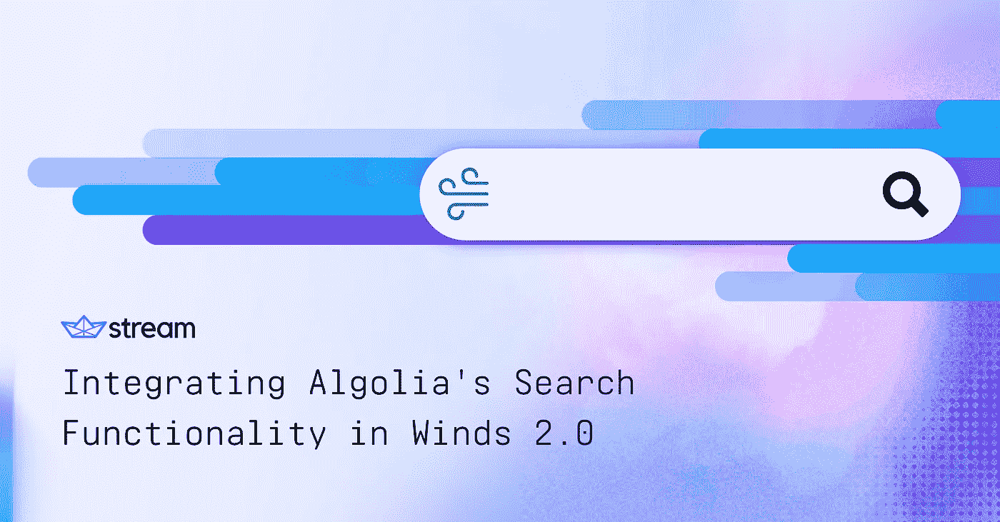
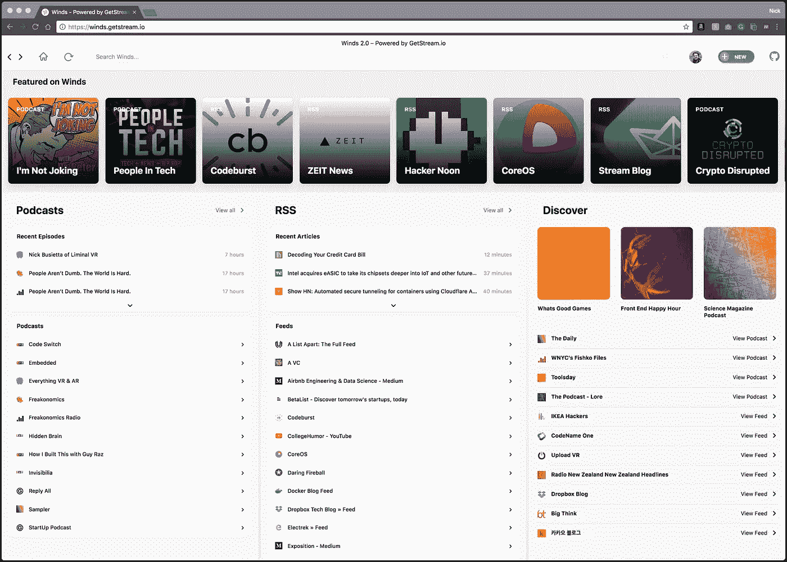
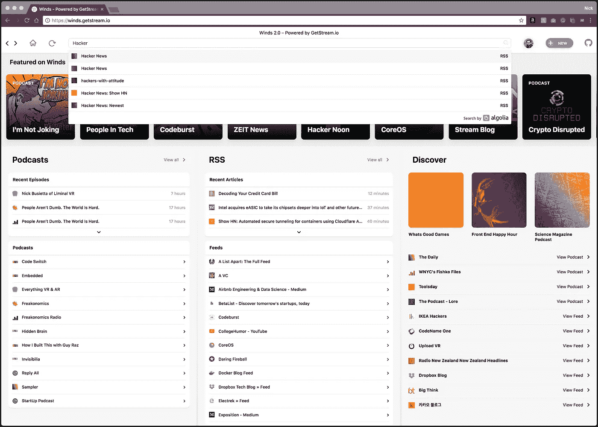
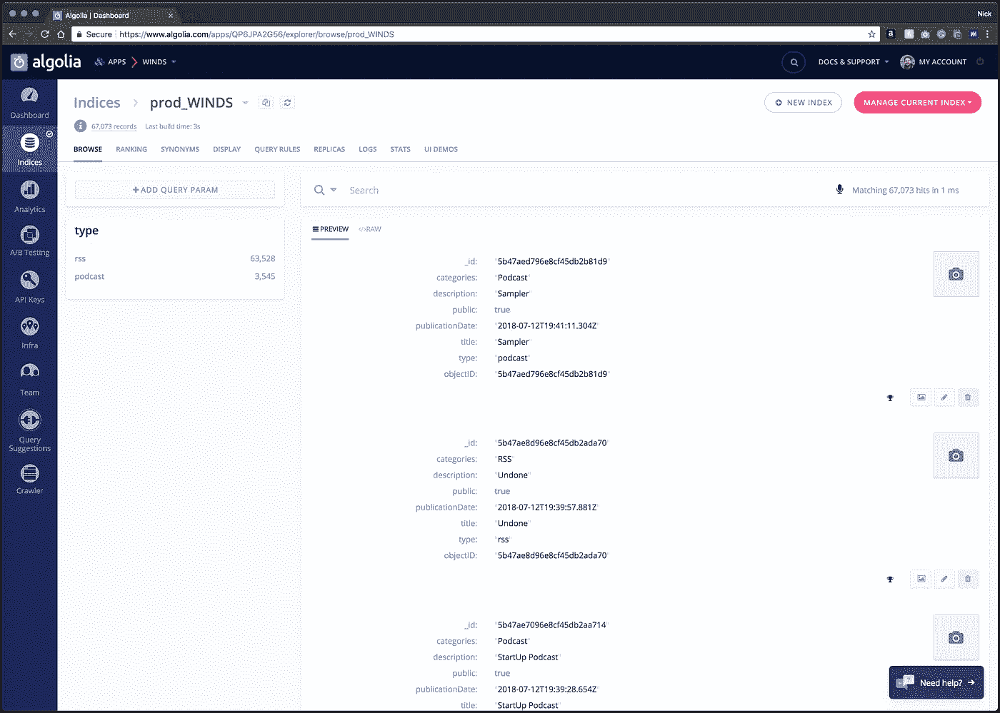
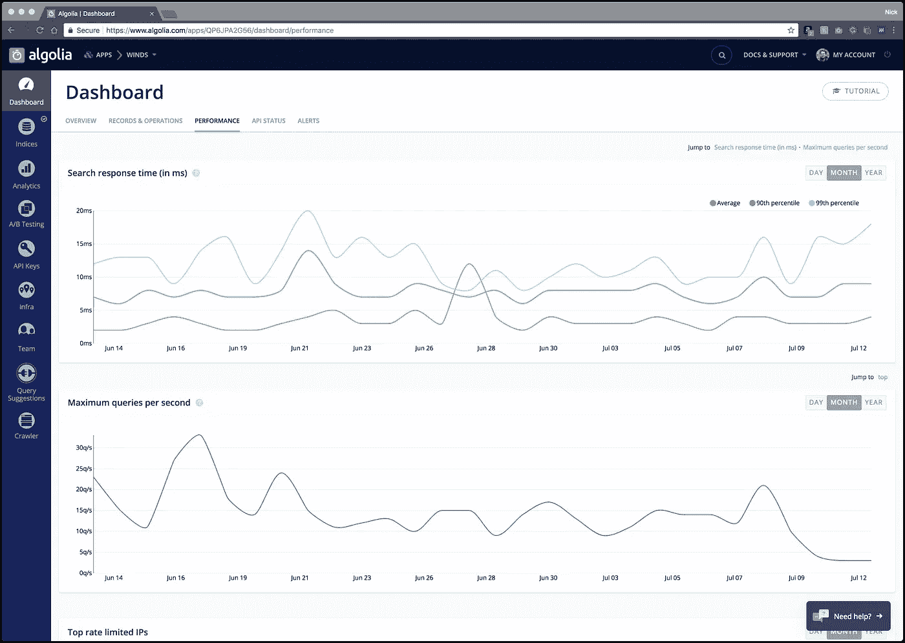

# 在 Winds 中集成 Algolia 搜索——一个漂亮的 RSS 和播客应用程序

> 原文：<https://medium.com/hackernoon/integrating-algolia-search-in-winds-a-beautiful-rss-podcast-application-f231e49cdab5>

今年早些时候， [Stream](https://getstream.io/) 推出了 [Winds 2.0](https://getstream.io/winds) ，这是我们广受欢迎的面向 macOS、Windows 和 Linux 的开源原生应用程序的第二次迭代，它提供了一种全新的消费 RSS 订阅和播客的方式。如果你没有用过 Winds，你可以在 https://getstream.io/winds 的[报名。或者，如果你只是想要一个视觉效果，下面是 Winds 的截图:](https://getstream.io/winds)

对于我们正在编译和查询的所有内容，我们需要一种直观的方式来呈现内容供用户搜索。这就是 Algolia 出现的原因。Algolia 是一个易于使用的插件，允许像我们这样的开发人员为我们的用户创建独特的搜索和发现体验。最棒的是，Algolia 是 ***闪电*** 快，可从后端仪表盘或前端代码配置，返回给用户的结果高度相关。

在本帖中，我们将做一个快速的技术深度探究，看看我们是如何处理 Winds 的安装和配置的。如果你想跟进，Winds 是一个开源项目，可以在 GitHub 上找到。

# 入门指南😇

Algolia 通过了解传统开发人员希望在对付费计划做出长期承诺之前试用产品，完善了他们的开发人员入职流程。考虑到这一点，他们通过提供开源选项的免费层来支持社区；唯一的要求是你在搜索栏中显示 Algolia 标志(如下图所示)。

如果你对使用 Algolia 感兴趣，开始使用他们的免费开源计划，该计划提供 10，000 条记录和 100，000 次操作。只需填写此处的表格，Algolia 团队将会回复您——他们的支持团队也快如闪电！

> 注意:这个职位不需要帐户。我们只是讨论风的集成，而不是讨论项目中的一般安装。然而，这篇文章*可以*作为在你自己的应用中安装 Algolia 的指南。

# 阿尔戈利亚一体化👨‍💻

与 Algolia 集成非常简单。因为我们使用的是 Node.js，所以安装了 Algolia (algoliasearch)提供的 JavaScript 客户端[。此外，为了使事情变得更加简单，我们创建了一个助手文件，可以轻松地将搜索结果(作为对象)传递给:](https://www.npmjs.com/package/algoliasearch)

if 语句的第一部分用于生产或开发环境，因为它检查有效的 Algolia 密钥和秘密。后半部分用于伪造对 Algolia 的测试请求。

# **当我们需要添加一个*单个*对象时，下面调用我们的一个控制器内部:**

# 要添加多个对象，Algolia 支持使用以下代码进行批量插入:

添加完所有内容后，它们会显示在我们的索引中(见下文)！

# 从 Algolia 获取搜索结果🔎

在应用程序方面，您可以通过多种方式在 Algolia 中搜索和浏览数据。一个例子可能是 JavaScript 客户端**algolia search**；您也可以选择使用更高级的、基于组件的抽象，比如 [InstantSearch.js](https://community.algolia.com/instantsearch.js/) 。需要注意的一点是，无论您使用何种方法，您都应该尝试从客户端获取结果，以减少延迟。

在我们的 React 应用程序中，我们获取结果并用以下代码填充一个下拉菜单:

与 Algolia 集成的美妙之处在于，您可以构建一个界面，以多种方式搜索和浏览您的数据。因为显示搜索结果所需的所有数据都已经存在于我们的 Algolia 记录中，所以呈现时的复杂性很小，所以我们可以避免可能会显著降低其他工具的速度或效率的方法。

# Algolia 的性能🏃‍

如前所述，我们从客户端获取结果。这是为了避免在我们通过 API 传输结果时可能遇到的任何延迟。不管查询是什么，Algolia 的搜索响应应该在低毫秒范围内。这要归功于 Algolia 背后的基础设施。这是一个相当有趣的阅读，如果你像我一样，你会想阅读这篇文章，它涵盖了 Algolia 与 Elasticsearch 的速度测试。

下面是一个截图，展示了 Algolia 的搜索功能在包含 70，000 多条记录的数据集上有多快(以毫秒计):

# 最后的想法🤔

不管你的搜索需求如何，我们强烈推荐使用 T2 算法。它快速、易于配置，由像您这样充满热情的开发人员构建。最后，我可以自信地说，我们玩得很开心，讨论了所有让我们在搜索中提供终极用户体验的可能性。

想了解更多关于风能的信息，请继续关注[未来关于科技和风能的博客文章](https://getstream.io/blog)，并在 Twitter 上关注我，地址为 [@nickparsons](https://twitter.com/nickparsons) 。如果你认为我错过了什么，请在下面的评论中留言。寻找快乐！🎉