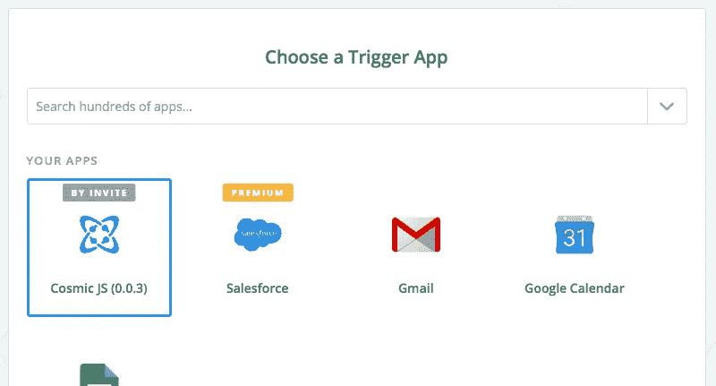
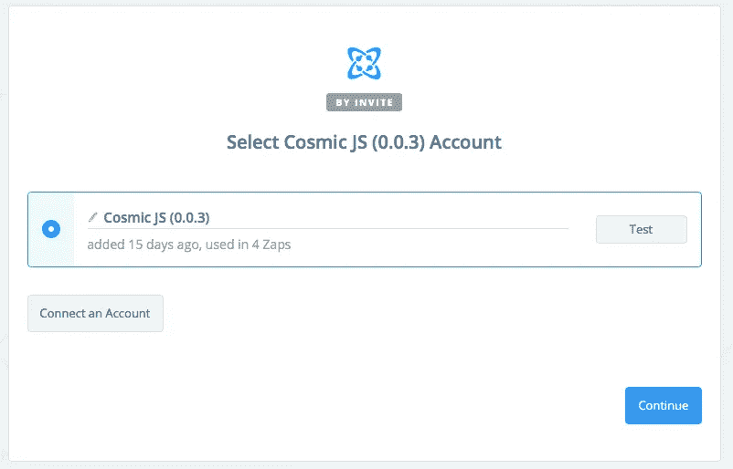
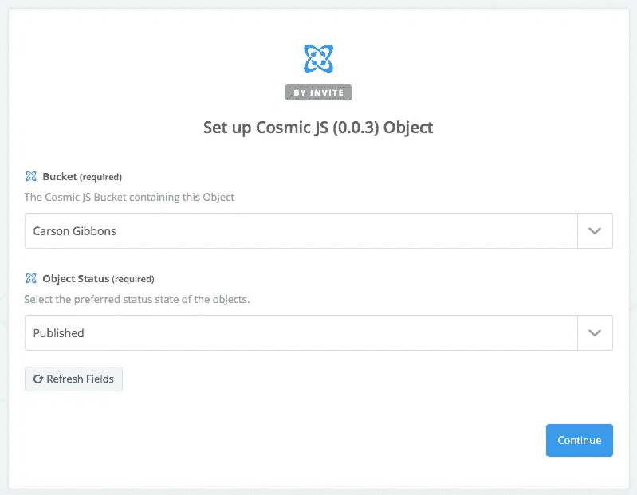
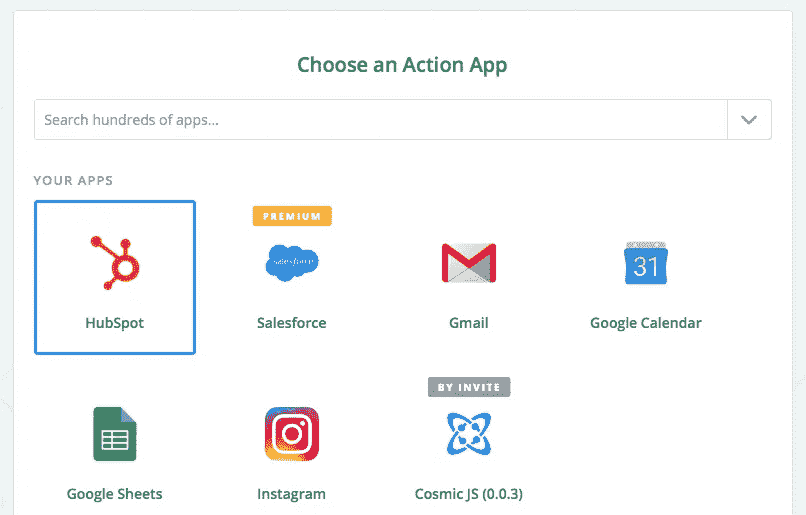
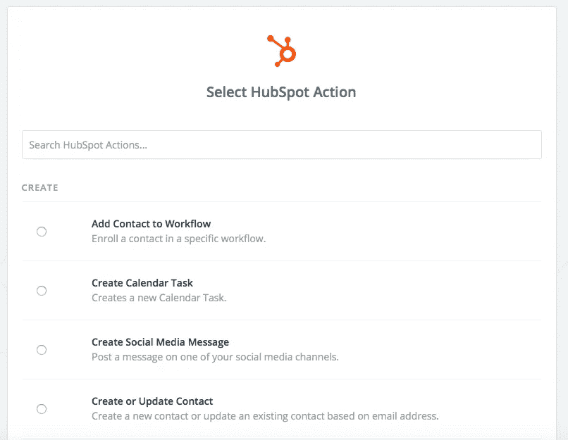
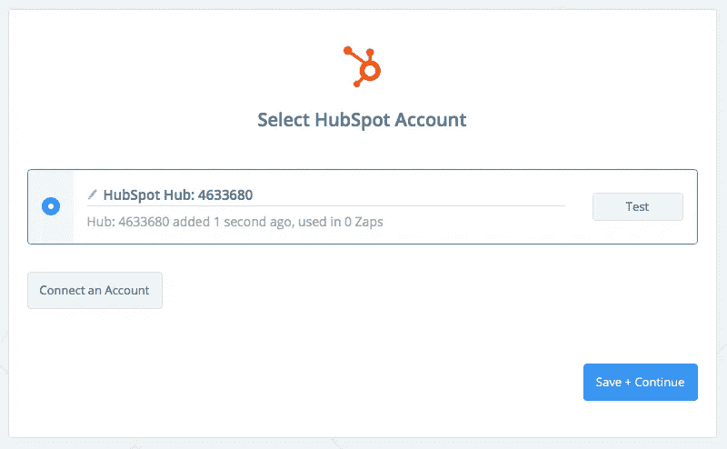
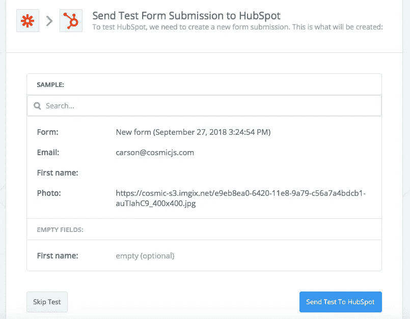
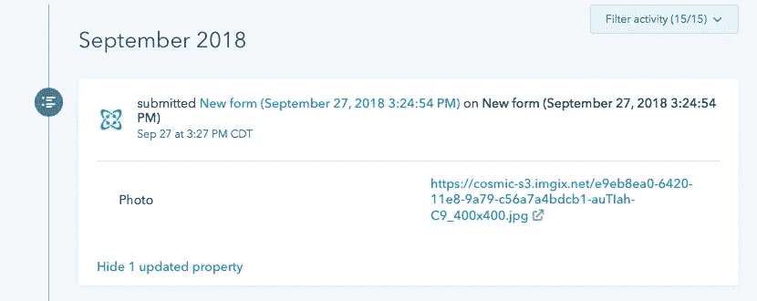
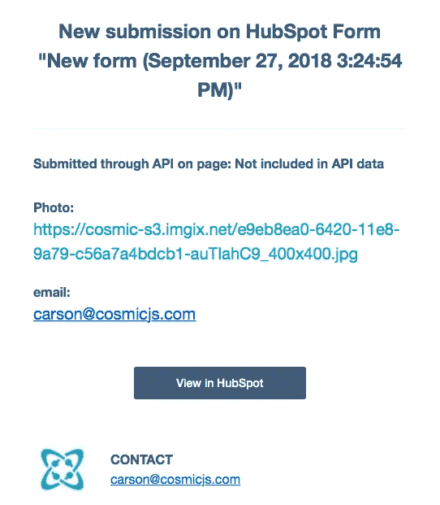

# 将 Cosmic-powered 内容与 Hubspot 集成

> 原文：<https://medium.com/hackernoon/integrating-cosmic-powered-content-with-hubspot-54e2c7d4205>

Hubspot 是一个集客营销和销售平台，帮助公司吸引访客、转化销售线索和接近客户。 [Zapier](https://zapier.com/) 通过允许人们连接和自动化他们使用的应用程序，赋予人们互联网超能力。使用 Zapier 将你的宇宙驱动的内容与 Hubspot 连接起来很容易，并且不需要编码。在这篇文章中，我将演示当你在[宇宙 JS](https://cosmicjs.com) 桶中发布对象时，如何向 Hubspot 添加新的表单提交。

[**点击这里用 Zapier**](https://zapier.com/app/login?next=/platform/public-invite/5784/d94417b158f78245932516dc472dbfbe/) 连接 Cosmic JS 到 Hubspot

# 选择一个触发 App: Cosmic JS

# 选择您的触发帐户

# 选择您的触发器

# 选择一个行动应用:Hubspot

# 选择中枢点动作

# 选择您的 Hubspot 帐户

# 测试

我设置了一个测试来从我的 Bucket 中提取新发布的对象，以便在我的 Hubspot 仪表板中添加一个表单:在这个例子中，发布的对象正在用电子邮件地址和照片附件填充一个新的表单提交。

# 扎皮尔试验

# 轮毂点测试

**轮毂点仪表板视图**

**Hubspot 电子邮件通知**

你的 zap 现在准备好被打开和享受！现在，每当我在我的 Bucket 中发布一个新对象时，都会在 Hubspot 中提交一个新的表单，为更快的团队协作做好准备。

# 结论

使用[Cosmic JS Zapier Integration](https://zapier.com/platform/public-invite/5784/d94417b158f78245932516dc472dbfbe/)可以很容易地自动化您最喜欢的应用程序的工作流程。通过在 API 中启动您的内容，您可以确保您的内容、工作流和流程的终极可移植性和可扩展性。

如果您对使用 Zapier 将您的宇宙 JS 对象集成到其他应用程序的工作流中有任何意见或问题，[请在 Twitter 上联系我们](https://twitter.com/cosmic_js)和[加入 Slack 上的对话](https://cosmicjs.com/community)。