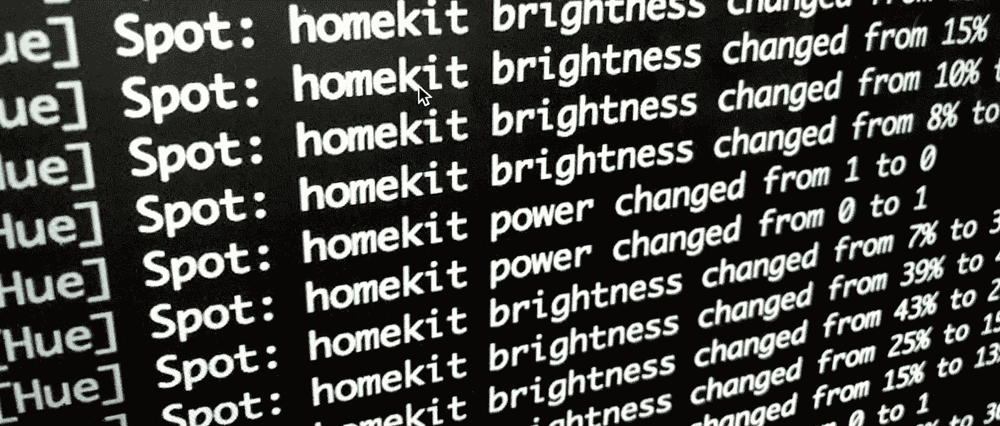
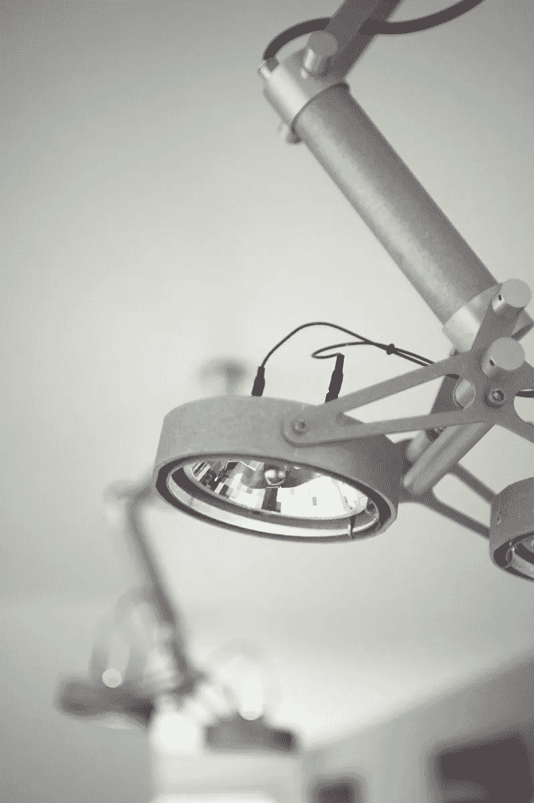
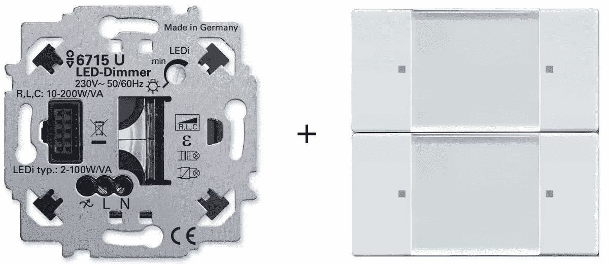
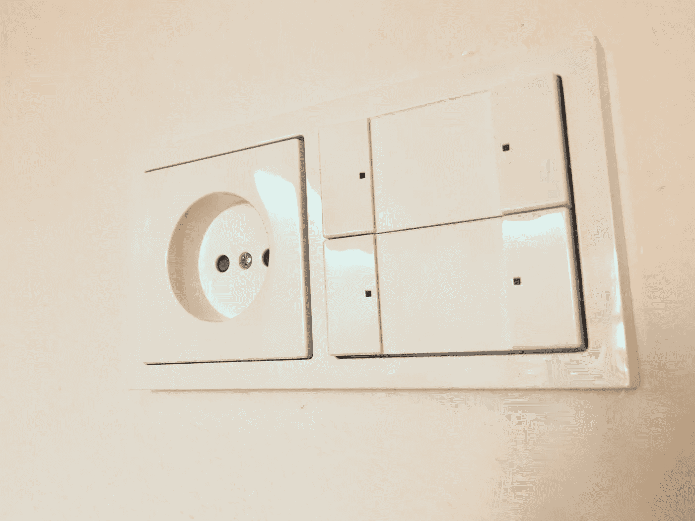
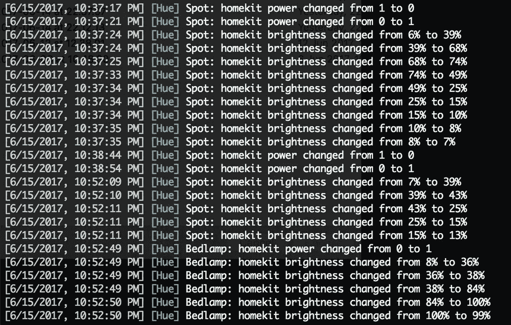
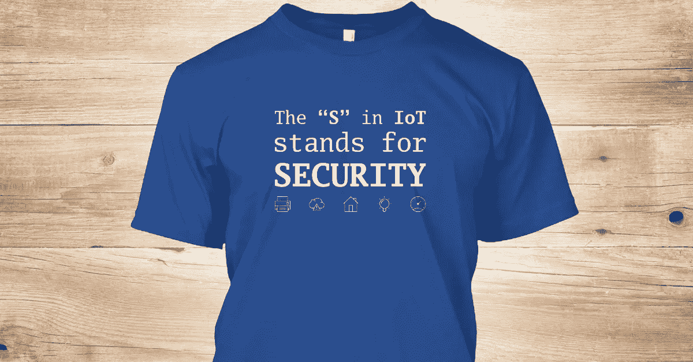

# 在我的智能家居中集成哑灯

> 原文：<https://medium.com/hackernoon/integrating-dumb-lights-in-my-smart-home-philips-hue-busch-jaeger-zigbee-homekit-658bfdfd1cd0>

*注意:我住在荷兰，因此所有关于电气外形和布线的解释仅适用于欧洲地区。*

它始于卧室里一个难以触及的电灯开关。由于房间的重建方式，入口在主灯开关的对面。这意味着每当你晚上进入时，在黑暗中跌跌撞撞地寻找开关。给房间重新布线以在入口附近放置一个开关被证明几乎是不可能的，所以我想我应该试试这些飞利浦 Hue 入门套件中的一个——两个“智能”灯泡和一个将它们连接到你的家庭网络的桥——看看这是否能解决我的问题。这个选择被证明是一种入门药物，因为现在，八个月后，我有了 16 个智能灯泡，三个灯带，两个用于“哑”灯的墙内智能调光器，几个无线遥控器，运动传感器和一些软件，让它们无缝地协同工作。

我写这篇文章是因为在这方面有相当多的开拓性，而且没有很多全面的信息。然而更重要的是，**我最终拥有了一个智能照明系统，我的女朋友、岳母和孩子们可以轻松可靠地使用它**、**和**，因为**、**我不想最终不得不远程解决开灯这样的基本问题。

## 基础知识:飞利浦色相和 Zigbee 平台

当你开始使用家庭自动化时，你正在有意识或无意识地为某个物联网平台做出选择。这是因为您需要一种方法来从您的控制设备(如电话或遥控器)与您的智能设备(如灯泡)进行通信。有许多标准可以实现这一点，如 Wi-Fi 和蓝牙，但也有专门为物联网应用设计的其他标准，如 Thread、WeMo、ZigBee 和 Z-Wave。

除此之外，还有智能家居系统，如 Apple Homekit、Google Home 和 Amazon with Alexa，它们试图将所有平台捆绑在一起，并为您的设备提供语音控制访问。例如，在苹果 Homekit 中，我可以制定一个规则，如果我的飞利浦运动传感器检测到运动，它会将我的智能恒温器设置为 20 摄氏度。它之所以有效，是因为即使两个设备本身并不知道彼此的存在，但它们都是“Homekit 兼容的”，将它们放在一个保护伞下。

我不打算讨论每一个的细节，但是在扩展您最初的选择时，记住这些平台和系统是很重要的。我选择飞利浦 Hue 是因为它使用专门为物联网应用制定的 Zigbee 标准:一种低功耗、低数据速率的网状网络。此外，Hue 与苹果、谷歌和亚马逊的三大家庭自动化系统配合良好。最后，飞利浦积极选择开放他们的平台，这意味着您可以将其他供应商的 Zigbee 设备添加到平台中，如 Innr、Osram Lightify 或 IKEA Trå dfri，而不会损失任何功能。

回想起来，飞利浦 Hue 给我提供了一个很好的起点。如果你最终发现飞利浦的灯泡、遥控器和运动传感器不能提供你需要的一切，你可以很容易地将其他供应商的设备添加到系统中，只要他们使用通用的 Zigbee 标准。这为你提供了相当多的选择和灵活性。

## 在我的智能家居中集成“哑”灯

我有一个模块化的 Nomad 灯具已经超过 20 年了。这是一个经典的设计，我的使用 AR111 卤素灯泡，不完全是我期待飞利浦发布的色调启用版本。

a Modular Nomad with AR111 halogen bulbs — no smartness here

当你为你的客厅设置了所有这些灯光场景时，有点遗憾，它们中没有一个对那个不属于系统的主灯有任何影响。

我开始寻找智能壁式调光器，为我的普通老式无光灯供电。最初我以为 Lutron 是唯一一家生产我需要的产品的制造商，但是他们的设计是为美国市场量身定做的。

然后我偶然发现了 [Busch-Jaeger](https://www.busch-jaeger.de/en/products/product-solutions/remote-control/zigbee-light-link/) ，这是一家德国公司，为欧洲市场提供了一系列支持 Zigbee 的室内控制元件。他们有一系列调光器、开关和电池供电的发射器，可以与您现有的 Zigbee 设置集成。

Busch-Jaeger Zigbee 系列应分为两组:

*   与控制元件结合的嵌入式调光器或开关
*   独立的电池供电发射机，可以挂在墙上

我之所以强调这一点，是因为调光器的控制元件和电池供电的发射器看起来完全一样，所以你必须注意你点的东西。此外，当你买一个调光器时，你需要在它上面安装一个控制元件，它才能工作。缺一不可。

此外，**所有的** **嵌入式控制都需要永久电源，这意味着你需要在墙上的插座中安装一根中性线。**如果现有的开关或调光器在同一位置有电源插座，您将有一根中性线。如果没有，你要么[自己拉一根中性线](https://www.youtube.com/watch?v=4-77YdzI_0Y)，要么找电工来做。

对于我的模块化 Nomad，我订购了 6715U 调光器，并在其上安装了 6736–84 四按钮控制元件。

Order these two elements as a set to get a working product

通过这个控制元件，我可以使用顶部的两个按钮直接控制调光器，并将底部的两个按钮分配给我的智能照明设置中的场景，将我家里的任何灯光组合设置为特定的颜色和强度。Busch-Jaeger 还提供了两个和八个按钮的控制元素，因此您可以灵活地使用您的方法。

Everything combined with a power outlet and a frame

我已经有了一个电源插座，所以不需要使用中性线。在将所有东西都安装到墙上后，我必须将调光器添加到我的 Zigbee 网络中。我会帮你省去几个小时的咒骂，按下各种 [Konami-code](https://en.wikipedia.org/wiki/Konami_Code) 风格的按钮却无济于事。最后，**将这些设备添加到 Zigbee 网络的最可靠方法是使用 Touchlink，您可以将设备靠近 Hue 网桥进行配对。**

遗憾的是，我已经把所有东西都装在了我的墙上，所以我没有把我的设备放在我的 Hue 桥上，而是拿了一根延长线，一根长网线，把我的桥对着调光器。然后，我用[色调灯](https://itunes.apple.com/us/app/hue-lights/id762009425) iOS 应用程序强制桥梁进入触摸链接模式，瞧

在这个障碍之后，调光器在 Hue 应用程序中显示为“可调光”，允许我将其集成到现有的场景中。快乐的日子！底部的两个按钮可以通过以下方式进行配置:首先只打开您希望包含在场景中的灯光，然后按住按钮十秒钟以上以启用编程模式，然后将所有这些灯光设置为所需的强度和颜色，最后再次按下按钮进行确认。请记住，这些按钮不会在 Hue 应用程序中显示。事实上，触发场景甚至不涉及色调桥，发射器直接在 Zigbee 网络级别上控制灯光。

然后我发现 Busch-Jaeger 调光器没有出现在苹果家庭应用程序中，Siri 抱怨说不是你场景中的每个设备都有反应。这很糟糕，因为我越来越喜欢能够从苹果 Home 应用程序单独控制每一台智能设备，或者使用 Siri，而不是单独使用每个制造商的应用程序。

很公平，接受挑战…

## 将 Hue bridge 看到的非飞利浦设备添加到 Homekit

当支持 Homekit 的飞利浦 Hue bridge 发布时，只有灯接触到了苹果 Homekit。自 2017 年 10 月的 Hue 更新以来，飞利浦遥控器和运动传感器也可以在 Homekit 中使用，当飞利浦运动传感器检测到运动时，可以打开支持 Homekit 的恒温器等选项。然而，**任何被 Hue bridge 识别的非飞利浦制造的设备都不会暴露在 Homekit** 下，包括我新买的调光器。

为了解决这个问题，我使用了 [homebridge](https://www.npmjs.com/package/homebridge) ，一个轻量级 NodeJS 服务器，你可以在你的家庭网络上运行，它模拟了 iOS HomeKit API。我有一台 Mac Mini 作为服务器和媒体中心运行，所以很容易开始使用。你也可以选择在专用的 [Raspberry Pi](https://github.com/nfarina/homebridge/wiki/Running-HomeBridge-on-a-Raspberry-Pi) 上运行。我唯一需要的插件是 Erik Baauw 的非常优秀的 homebridge-hue。它得到了很好的支持和维护，宜家 Trå dfri 仅在推出几天后就获得了支持。

在安装和配置 homekit-hue 插件后，连接到我的 Busch-Jaeger 调光器的灯出现在 Home 应用程序中。打开它们，使用家庭应用程序或通过 Siri 改变亮度，将所需的命令发送回 Zigbee 网络。现在，我有了一个完全无缝的灯光设置，可以使用墙内遥控器、装有 Hue 应用程序的智能手机或我家里任何使用 Home 应用程序或 Siri 的苹果设备来控制灯光。

Watching homebridge sending commands to my lights

## 安全性

物联网的营销方式非常注重家庭内外的便利性。飞利浦公司宣传说，可以在你度假的地方开灯，让潜在的窃贼以为你在家。这很好，但它需要远程访问您家中的设备。

德国智能恒温器制造商 tado 播放电视广告，演示当你离你的房子越来越近时，它如何逐渐加热，不仅需要远程访问，还需要连续的手机地理定位。嗯，没有。

飞利浦自 1892 年以来一直从事灯泡制造业务，我对他们在这一领域的技能非常有信心。我不确信他们在运行一个安全的 web 服务来保证我的数据和凭证的安全方面同样熟练。鉴于[物联网安全的糟糕状态](https://boingboing.net/2017/11/16/unsafe-at-any-speed-2.html)，我主动选择不使用他们允许远程访问的服务，因为即使是以安全为生的公司也不总是做得好。

如果当我不在的时候访问我的家庭设备真的是我需要的东西，那么我会对苹果更有信心，因为他们对 Homekit 设置了很多限制，以保护开发者和用户双方的安全和隐私，例如在你被允许设置它之前需要两步验证。

## 结论

如果你的房子里的灯只使用 E27、E14 或 GU10 插座，你愿意只使用飞利浦灯泡和遥控器，再也不碰你现有的墙内开关，那么实际上，未来就是现在。但我认为这不太现实或实际。

我想几乎每个人最终都会像我一样遇到障碍。有许多解决方案可以克服它们，但是没有一个适合普通用户。虽然我选择的 Busch-Jaeger 解决方案运行良好，但它没有通过父母测试，因为他们很容易在自己的房子里模仿。

浏览各种技术论坛，很明显，人们迫切需要一种比目前可用的解决方案更标准、更优雅的墙内开关解决方案，例如，本指导视频展示了如何修改 Hue Tap 开关，使其适合 Eltakto 框架，看起来像普通开关。

飞利浦生产标准墙壁开关和调光器解决方案的可能性似乎很小。在 Hue 应用中提供更好的第三方设备支持，并将其暴露给 Homekit 等智能家居平台，似乎同样微不足道。最终，这些都是广泛采用的障碍，所以我不指望我的父母会很快加入智能照明的行列。