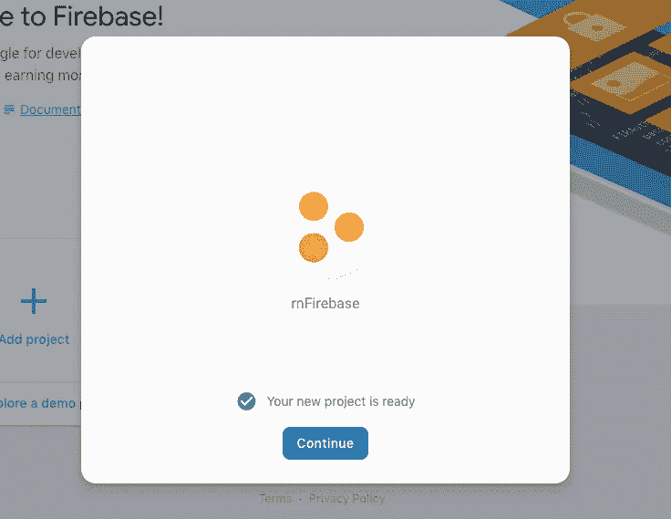

# 集成 Firebase 和 React Native

> 原文：<https://medium.com/hackernoon/integrating-firebase-with-react-native-967ced8a4a88>


Firebase 是一个后端即服务( *BaaS* )，它为使用 React Native 开发移动应用程序的移动开发者提供了一个优势。作为一名 React 本地开发人员，通过使用 Firebase，您可以开始构建 MVP(最小可行产品)，**保持低成本并快速构建应用程序原型**。

在本教程中，我们将学习如何开始将 Firebase 与 React 本机应用程序集成。我们还将在 Firebase & React Native 的帮助下从头开始创建一个小应用程序，看看它们是如何协同工作的。

# 入门指南

[Firebase](https://console.firebase.google.com/?pli=1) 是一个被谷歌收购的平台，拥有一个健康活跃的社区。该社区中的大多数用户都是 web 和移动开发者，因为 Firebase 可以帮助进行移动分析、推送通知、崩溃报告，并且开箱即可提供电子邮件和社交认证。

要开始，你需要一个目标移动操作系统，不管你是选择 iOS 还是 Android 或者两者都选。如果是第一次设置 React 原生开发环境，请参考 [React 原生官方文档](https://facebook.github.io/react-native/docs/getting-started)。你需要 sdk 工具和 Android Studio 来为 Android 设置一个开发环境。对于 iOS，只需要在 macOS 上安装 Xcode 即可。您还需要具备:

*   [Nodejs](http://nodejs.org/) ( `>= 8.x.x`)和 npm/ [纱线](https://yarnpkg.com/lang/en/docs/install/)安装完毕
*   [react-native-cli](https://www.npmjs.com/package/react-native-cli) ( `>= 2.0.1`)

React Native 作为两个 npm 包分发，`react-native-cli`和`react-native`。我们将使用`react-native-cli`来生成一个应用程序。从安装`react-native-cli`开始:

```
npm install -s react-native-cli
```

现在，让我们创建一个名为“rnFirebaseDemo”的新 React 原生项目:

```
react-native init rnFirebaseDemo
```

当上面的命令运行完毕后，使用`cd rnFirebaseDemo`遍历到项目目录。现在，让我们通过运行以下命令之一来检查一切是否正常工作，以及我们的 React 本机应用程序是否已正确初始化:

```
# on macOS
react-native run-ios# For Windows/Unix users
react-native run-android
```

该命令将在 iOS 模拟器或 Android 模拟器中运行如下所示的默认屏幕，但由于我们是第一次运行该命令，因此需要花费一些时间。


# 添加 Firebase

要将 Firebase 添加到我们现有的 React 本机应用程序中，我们需要安装依赖项。

```
yarn add firebase
```

当我们在代码编辑器中打开项目时，其结构如下所示:


我们需要做一些修改，然后才能真正开始构建我们的应用程序。在根文件夹中创建一个`src`目录。这是我们的应用程序组件和屏幕的位置。此外，在`src`目录中，我们将创建两个文件夹:`screens`和`components`。


`screen`目录将包含我们需要向最终用户显示的所有 UI 相关组件，而`components`文件夹将包含任何其他将被使用或重用来显示用户界面的组件。

让我们用一个新文件`Home.js`在`screens/`中创建我们的第一个屏幕，主屏幕。

```
import React, { Component } from 'react';
import { View, Text } from 'react-native';export default class Home extends Component {
  render() {
    return (
      <View>
        <Text>Home Screen</Text>
      </View>
    );
  }
}
```

我们的下一个屏幕是`Add Item`。创建一个名为`AddItem.js`的新文件。

```
import React, { Component } from 'react';
import { View, Text } from 'react-native';export default class AddItem extends Component {
  render() {
    return (
      <View>
        <Text>Add Item</Text>
      </View>
    );
  }
}
```

我们的最后一个屏幕将是我们需要显示的项目列表。在同一个目录中，创建一个名为`List.js`的新文件。

```
import React, { Component } from 'react';
import { View, Text } from 'react-native';export default class List extends Component {
  render() {
    return (
      <View>
        <Text>List</Text>
      </View>
    );
  }
}
```

为了在不同的屏幕之间导航，我们需要添加`react-navigation`库。我们将使用最新版本`3.0.0`。

```
yarn add react-navigation
```

接下来，我们将安装`react-native-gesture-handler`。如果你使用 Expo，你不需要在这里做任何事情。

```
yarn add react-native-gesture-handler
```

下一步显然是运行下面的命令并链接我们刚刚安装的库:

```
react-native link
```

添加这个包之后，让我们再次运行构建过程:

```
# on macOS
react-native run-ios# For Windows/Unix users
react-native run-android
```

现在，让我们添加 Home 组件作为我们的第一个屏幕。在`App.js`中添加以下代码。

```
import React, { Component } from 'react';
import { createStackNavigator, createAppContainer } from 'react-navigation';
import Home from './src/screens/Home';// we will use these two screens later in our AppNavigator
import AddItem from './src/screens/AddItem';
import List from './src/screens/List';const AppNavigator = createStackNavigator({
  Home: {
    screen: Home
  }
});const AppContainer = createAppContainer(AppNavigator);export default class App extends Component {
  render() {
    return <AppContainer />;
  }
}
```

在此阶段，如果我们转到模拟器，我们将看到以下结果:


主屏幕出现了。我们将添加另外两个屏幕作为到`AppNavigator`的路线，以便通过主屏幕导航到它们。

```
const AppNavigator = createStackNavigator(
  {
    Home,
    AddItem,
    List
  },
  {
    initialRouteName: 'Home'
  }
);
```

现在，我们的堆栈有三个路由:Home 路由、AddItem 路由和 ListItem 路由。Home 路径对应于`Home`屏幕组件，AddItem 对应于`AddItem`屏幕，ListItem 路径对应于`ListItem`组件。堆栈的初始路径是`Home`路径，这是在我们有多个屏幕并且需要描述一个起点时定义的。

之前，我们定义了一个具有三条路线的堆栈导航器，但是我们没有将它们连接起来以便在它们之间导航。嗯，这也是一个简单的任务。库为我们提供了一种管理从一个屏幕到另一个屏幕以及从一个屏幕到另一个屏幕导航的方法。为了实现这一点，我们将修改`Home.js`。

```
import React, { Component } from 'react';
import { Button, View, Text } from 'react-native';export default class Home extends Component {
  render() {
    return (
      <View>
        <Text>Home Screen</Text>
        <Button
          title="Add an Item"
          onPress={() => this.props.navigation.navigate('AddItem')}
        />
        <Button
          title="List of Items"
          color="green"
          onPress={() => this.props.navigation.navigate('List')}
        />
      </View>
    );
  }
}
```

在上面的代码中，我们从`react-native` API 添加了一个`Button`组件。`react-navigation`将一个导航道具以`this.props.navigation`的形式传递给堆栈导航器中的每一个屏幕。我们必须在`onPress`功能上使用与我们在`AppNavigator`下的`App.js`中定义的相同的屏幕名称进行导航。

您也可以在两个屏幕`AddItem`和`List`上使用您自己的样式手动定制后退按钮，但是在我们的演示中，我们将使用默认按钮。


# 用 Firebase 创建数据库

转到 [Firebase](https://firebase.google.com/) 控制台，从你的谷歌账户登录，然后创建一个新项目。



然后，我们将在`src/config.js`中的一个新文件中添加数据库配置。

```
import Firebase from 'firebase';
let config = {
  apiKey: 'AIzaXXXXXXXXXXXXXXXXXXXXXXX',
  authDomain: 'rnfirebXXX-XXXX.firebaseapp.com',
  databaseURL: 'rnfirebXXX-XXXX.firebaseapp.com',
  projectId: 'rnfirebase-XXXX',
  storageBucket: 'rnfirebase-XXXX.appspot.com',
  messagingSenderId: 'XXXXXXX'
};
let app = Firebase.initializeApp(config);
export const db = app.database();
```

config 对象是你在 Firebase 中创建一个新项目并进入**将 Firebase 添加到你的 web 应用**部分后，填写你得到的细节的地方。同样在 Firebase 控制台中，从左侧栏中，单击**数据库**，然后选择第一个选项:((实时数据库))。然后，转到“规则”并粘贴以下内容:

```
{ "rules": { ".read": true, ".write": true } }
```


# 将应用程序中的数据添加到 Firebase

在本节中，我们将编辑代表输入字段和按钮的`AddItem.js`。用户可以向列表中添加一个项目，它将被保存到 Firebase 数据中。

```
import React, { Component } from 'react';
import {
  View,
  Text,
  TouchableHighlight,
  StyleSheet,
  TextInput,
  AlertIOS
} from 'react-native';import { db } from '../config';let addItem = item => {
  db.ref('/items').push({
    name: item
  });
};export default class AddItem extends Component {
  state = {
    name: ''
  };handleChange = e => {
    this.setState({
      name: e.nativeEvent.text
    });
  };
  handleSubmit = () => {
    addItem(this.state.name);
    AlertIOS.alert('Item saved successfully');
  };render() {
    return (
      <View style={styles.main}>
        <Text style={styles.title}>Add Item</Text>
        <TextInput style={styles.itemInput} onChange={this.handleChange} />
        <TouchableHighlight
          style={styles.button}
          underlayColor="white"
          onPress={this.handleSubmit}
        >
          <Text style={styles.buttonText}>Add</Text>
        </TouchableHighlight>
      </View>
    );
  }
}const styles = StyleSheet.create({
  main: {
    flex: 1,
    padding: 30,
    flexDirection: 'column',
    justifyContent: 'center',
    backgroundColor: '#6565fc'
  },
  title: {
    marginBottom: 20,
    fontSize: 25,
    textAlign: 'center'
  },
  itemInput: {
    height: 50,
    padding: 4,
    marginRight: 5,
    fontSize: 23,
    borderWidth: 1,
    borderColor: 'white',
    borderRadius: 8,
    color: 'white'
  },
  buttonText: {
    fontSize: 18,
    color: '#111',
    alignSelf: 'center'
  },
  button: {
    height: 45,
    flexDirection: 'row',
    backgroundColor: 'white',
    borderColor: 'white',
    borderWidth: 1,
    borderRadius: 8,
    marginBottom: 10,
    marginTop: 10,
    alignSelf: 'stretch',
    justifyContent: 'center'
  }
});
```

在上面的代码中，我们从`config.js`和`db`添加了一个 Firebase 数据库实例，然后通过`addItem`和`handleSubmit()`推送用户添加的任何项目。当您按下按钮**添加**从输入值中添加项目时，您将得到一条警告消息，如下所示。


要验证数据是否在数据库中，请转到 Firebase 控制台。


# 从数据库中提取项目

为了从 Firebase 数据库中获取数据，我们将在`List.js`中使用对`db`的相同引用。

```
import React, { Component } from 'react';
import { View, Text, StyleSheet } from 'react-native';
import ItemComponent from '../components/ItemComponent';import { db } from '../config';let itemsRef = db.ref('/items');export default class List extends Component {
  state = {
    items: []
  };componentDidMount() {
    itemsRef.on('value', snapshot => {
      let data = snapshot.val();
      let items = Object.values(data);
      this.setState({ items });
    });
  }render() {
    return (
      <View style={styles.container}>
        {this.state.items.length > 0 ? (
          <ItemComponent items={this.state.items} />
        ) : (
          <Text>No items</Text>
        )}
      </View>
    );
  }
}const styles = StyleSheet.create({
  container: {
    flex: 1,
    justifyContent: 'center',
    backgroundColor: '#ebebeb'
  }
});
```

对于`ItemComponent`，我们在`components/ItemComponent.js`中创建一个新文件。这是非屏幕组件。只有`List`会用它来`map`并显示每个项目。

```
import React, { Component } from 'react';
import { View, Text, StyleSheet } from 'react-native';
import PropTypes from 'prop-types';export default class ItemComponent extends Component {
  static propTypes = {
    items: PropTypes.array.isRequired
  };render() {
    return (
      <View style={styles.itemsList}>
        {this.props.items.map((item, index) => {
          return (
            <View key={index}>
              <Text style={styles.itemtext}>{item.name}</Text>
            </View>
          );
        })}
      </View>
    );
  }
}const styles = StyleSheet.create({
  itemsList: {
    flex: 1,
    flexDirection: 'column',
    justifyContent: 'space-around'
  },
  itemtext: {
    fontSize: 24,
    fontWeight: 'bold',
    textAlign: 'center'
  }
});
```

这一步结束了 Firebase 数据库与 React 本地应用程序的集成。您现在可以添加新的数据项并从数据库中获取它们，如下所示。


# 结论

在本教程中，我们向您展示了如何将 Firebase 与 React 本机应用程序集成。你没有一个完整的服务器来创建一个 API，并进一步使用一个数据库来原型化或**构建你的应用程序的 MVP**。

你可以在[这个 Github repo](https://github.com/JscramblerBlog/rnFirebaseDemo) 里面找到完整的代码。有问题可以直接发微博到[@ amani self](https://twitter.com/amanhimself)问作者。

*原载于*[*blog.jscrambler.com*](https://blog.jscrambler.com/integrating-firebase-with-react-native/)*由* [*阿曼米塔尔*](https://blog.jscrambler.com/author/aman-mittal) *。*