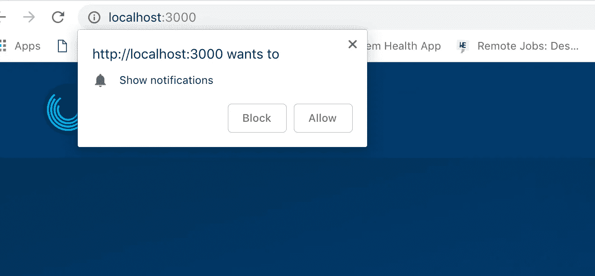

# 在 React Web 应用程序中集成推送通知(CRA)

> 原文：<https://medium.com/hackernoon/integrating-push-notifications-in-your-react-web-app-cra-22d3010392e>

mobify.com

为 react 应用程序实现推送通知非常简单，除非你必须在用 [Create React App](https://github.com/facebook/create-react-app) 构建的应用程序上这样做，你可能会有一个新的服务工作者文件要处理。

作为一个稍微熟悉 CRA 应用程序的文件夹结构的人，你会知道这将导致冲突或一个服务人员试图覆盖其他人。

事情变得很复杂。

这有三个原因:

1.  使用 CRA `npm run build`的默认脚手架流程，自动生成服务人员。如果你现在经历它，可能需要一段时间才能理解它在做什么。
2.  您不能简单地编辑这个文件来包含您的 firebase service worker 方法和导入。你将不得不特别做`npm run eject`，这意味着你将不得不靠自己。
3.  当你下一次`npm run build`你的项目时，你必须使用 **Webpack** 插件来生成合适的服务工人。

npm 包 ServiceWorkerWebpackPlugin 就是一个例子

这些插件的工作方式是发布一个动态的**服务工作者**文件，用一个运行时助手代替默认的 ***sw*** 。

# 解决方案

另一种方法是避免修改。/src 和在/build 中生成的文件(我们实际上没有这方面的业务)，它很可能被命名为类似“registerServiceWorker.js”的名称。

您应该尝试将新的服务人员放在公共/资产文件夹中，这是用于保存我们的资产的文件夹。我的服务人员名为“firebase-messaging-sw.js”

这个想法是，webpack 不会将 js 文件捆绑在 public/assets 文件夹中，这与。/src，然后我们可以调用它，并在 react 应用程序的根目录下注册它。

我决定这样构建我的应用程序:

在 initializePush()函数中，我们将询问用户是否希望我们给他们发送通知。并且它仅在注册/更新服务工作者文件之后被调用。

> 在浏览器对新旧文件进行二进制比较之后，服务工作器被更新；在比较后发现输出差异时，它将安装新的服务工作器，然后生成新的令牌。

下面是第一次请求向用户发送推送通知时显示的模式。

Show notifications modal

接下来，根据您当前的 firebase 实例获取令牌。您会注意到这个函数有 *requestPermission()* 函数和*消息传递*。 *getToken()* 然后是 *sendTokenToServer()* 都在**里。然后()**连锁。这是否意味着每次我们到达代码中的这一点时，都会从 firebase 获得一个新的令牌？

显然，事实证明我们没有。每次函数被调用时，我们不会得到一个新的令牌。实际情况是，第一次调用 getToken 方法时，会进行网络调用，一旦检索并使用(发送到我们的后端)对 *getToken* ()的后续调用，令牌将从缓存中返回。

# **临时演员**

`message.onMessage()`

当客户端打开应用程序时，接收发送到此客户端的消息。

`self.addEventListener("notificationclick",()=>{})`

当客户端点击从应用服务器发送的通知时调用。

`message.setBackgroundMessageHandler`

此方法处理客户端没有打开应用程序时收到的消息。

记得在另一个目录中实例化你的 firebase 实例，以防你错过了，这里用到了；`import messaging from 'config/firebase'`

祝你好运！