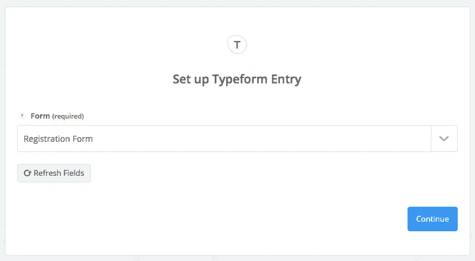
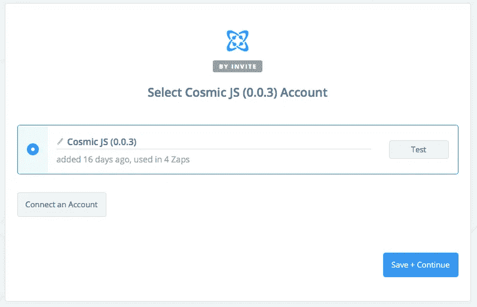

# 将字体数据集成到 Cosmic JS 中

> 原文：<https://medium.com/hackernoon/integrating-typeform-data-into-cosmic-js-348ebbc78d2e>

Typeform 是一个在线软件即服务，它可以让你建立对话表格、调查、测验、登陆页面等等。 [Zapier](https://zapier.com/) 通过允许人们连接和自动化他们使用的应用程序，赋予人们互联网超能力。使用 Zapier 将你的 Typeform 生成的内容与 [Cosmic JS](https://cosmicjs.com) 连接起来很容易，并且不需要编码。在这篇文章中，我将演示如何在 Cosmic JS 中发布包含调查响应的新对象，因为它们是以 Typeform 完成的。

[**—>点击这里使用 Zapier 将 Typeform 连接到 Cosmic JS。**](https://zapier.com/app/login?next=/platform/public-invite/5784/d94417b158f78245932516dc472dbfbe/)

# 选择触发器应用程序:类型表单

# 选择您的触发帐户

# 选择您的触发器表单

我继续从最近的一个类型表单中找出一个条目来测试我的 Zap。

# 选择一个动作 App: Cosmic JS

# 选择你的宇宙 JS 帐号

在这一点上，我简单地阐明了我要向其发送我的 Typeform 响应的对象类型，以及我希望我的内容模型如何布局。我选择我想通过名字/姓氏+注册响应，如下图所示。

# Zapier 测试视图

# 宇宙 JS 对象视图

# 看看它的实际效果

# 结论

我鼓励你使用[Cosmic JS Zapier Integration](https://zapier.com/platform/public-invite/5784/d94417b158f78245932516dc472dbfbe/)开始自动化你最喜欢的应用程序的工作流程。我们的目标是帮助您的团队使用您最喜欢的工具更快地构建应用。

如果您对使用 Zapier 将您的宇宙 JS 对象集成到其他应用程序的工作流中有任何意见或问题，[请在 Twitter 上联系我们](https://twitter.com/cosmic_js)和[加入 Slack 上的对话](https://cosmicjs.com/community)。