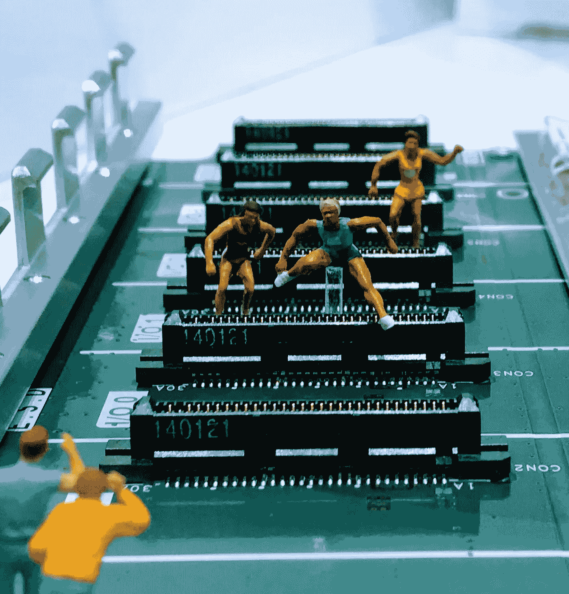
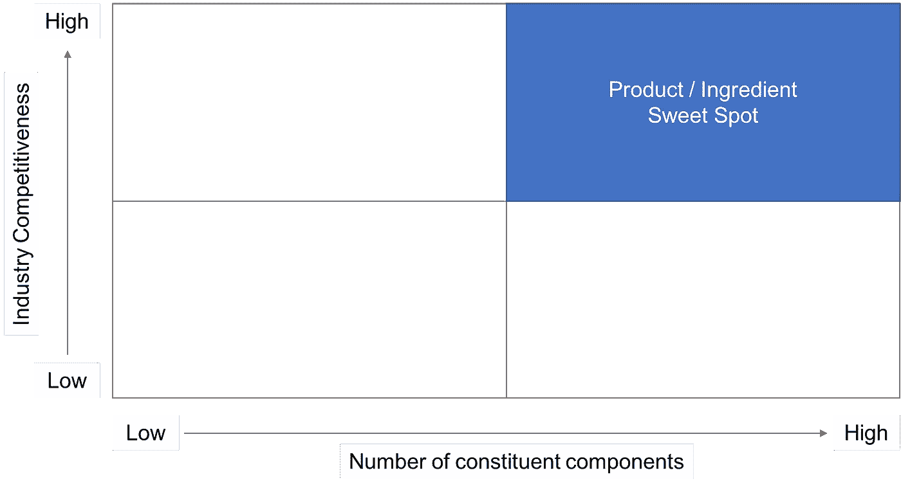

# “Intel Inside”和创业公司的发展计划

> 原文：<https://medium.com/hackernoon/intel-inside-and-a-growth-plan-for-startups-a207e289d3d>

## 让你的产品成为必不可少的成分。

Credit: John Cameron via Upsplash

在我们谈论英特尔和成分品牌之前，我创造了一个工具来帮助缩短确定 B2B 合作伙伴所需的时间。如果你想下载一份，请继续阅读(基于网络的版本即将推出)。

英特尔是一个成分品牌。这是一个品牌支持另一个品牌的独特例子。我们从贴在数百万台电脑上的“Intel Inside”标签中了解到了这一点。

大多数企业家都不相信 Intel Inside story 是如何为一条重要但被低估的发展道路铺平道路的。这是因为它需要时间来证明一个产品或服务是值得取代现有产品的一个组成部分。

我能想到的描述配料品牌的最佳比喻是链条中的环节。

每个产品都是由链接(组件)组成的。当你第一次构建一个产品的时候，每一个链接都足够强大，能够执行它的功能并与其他链接集成。

每个环节都需要投资(无论是购买还是建造)来使产品发挥作用，由于资源有限，无论是人才能力还是资本，每个环节都可能只是足够好，而不是充分优化以成为同类最佳。

如果你的产品被定位为同类最佳，它有可能成为一个重要的组成部分。你的品牌将受益于被介绍给新的受众，成为让一个更大、更知名的品牌变得更强大的纽带。

# 英特尔的成分品牌潜力

20 世纪 90 年代，英特尔制造了计算机芯片。当时他们的年收入约为 5 亿美元。Intel Inside 标签将该公司从众多计算机组件中的一个提升为个人电脑所有者眼中的*基本硬件组件。英特尔报告 2018 年 4 月盈利 160 亿美元。*

虽然 *Intel Inside* 是一个品牌建设的主线，并为英特尔的发展和多元化创造了机会，但它也为出于两个原因试图建立品牌的企业家提供了一个重要的例子。

首先，建立消费者品牌很难。你只需要看看初创公司在脸书和谷歌广告上花了多少钱就能引起注意。而且，如果客户不愿意留下来，对每次收购的小成本感到满意是不够的。

第二，虽然发展合作伙伴关系是扩大消费品牌的关键，但你的产品为现有的大规模品牌提供动力的关系要有效得多。

如果一分钱一分货，你刚刚开始认为你的品牌可以成为一种配料，你需要采取三个步骤来实现作为配料品牌的增长潜力。

# 第一步:了解产品/ *成分*适合度

我花了很多时间思考这种适合，在 AirShr，我帮助 inkl 成长，今天，我建立了一个生物技术公司。三个因素似乎有助于确定一种产品是否可以成为一种成分。

第一个是关于一个产品是否可以被定位为世界上最好的。要获得这个奖项，产品需要在它的领域足够独特。我还发现，“独一无二”并不一定意味着显著的吸引力。AirShr 和 inkl 都有社会证明，但当成为配料品牌的想法成为一种选择时，它们仍在增长。

虽然发展社会证明需要时间，但我认为创始人可以从第一天开始就检查“产品/成分”的最佳点。我认为这个甜蜜点是由剩下的两个因素组成的:行业竞争力和组成一个产品或体验的组件数量。后者最好通过思考酒店来解释。酒店客房体验由大量的产品和服务组成。每一个都需要以一致的标准采购和供应，以使体验工作良好。

## 配料品牌生活在这个甜蜜点有三个原因

Credit: Phil Hayes-St Clair

首先，在竞争激烈的行业中经营并提供含有大量组成成分的产品的企业通常以竞争为中心，对成本敏感。这是因为这些构成产品(如酒店设施)的价格变化会影响最终产品的利润。一系列组成产品的成本波动越大，利润率的压缩就越大，在酒店的例子中，利润率就是房间销售的利润。

再加上竞争激烈的市场面临着新模式(比如 Airbnb，如果我们扩大住宿类比的话)的干扰，成本敏感度增加。成分品牌，尤其是可扩展的软件产品，可以提供有竞争力的价格稳定的产品(由于它们的相对规模),这些产品可以预期地增长，并降低大品牌的成本敏感度。

其次，配料品牌可以利用外包的 R&D 和已经制度化的产品开发。换句话说，配料品牌可以扮演产品供应商的角色，因为对成本敏感的企业习惯于减少(或取消)R&D，以降低固定成本。另一个同样有效的动机是决定保持警惕，利用来自初创公司的创新，而不是试图建立一个负责发明新事物的内部团队。不管怎样，从“生产”到“购买”模式的转变为配料品牌创造了这个机会。

第三，创业光环效应对大品牌来说很重要，[尤其是那些容易被颠覆的品牌](https://philhsc.com/bringing-knife-gun-fight/)，他们将创业视为差异化的来源。

我还发现这个框架有助于思考为什么一个品牌的成分潜力低。

创造新市场(即低行业竞争)的公司，其产品由相对少量的“原材料”组成，可能会非常关注内部 R&D、产品开发和增长。在很大程度上，这将大多数品牌排除在配料产品之外。

# 步骤 2:确定合作伙伴

寻找合作伙伴并不是一开始就直接去 LinkedIn，在一个“大品牌”中查找你可能认识的人，然后试图进行介绍。

这也不是盲目接受旁观者关于你的公司应该与谁合作的建议。毕竟，除非他们有具体的介绍，否则他们的想法通常会增加公司大楼的噪音。

我开始依赖 18 点框架来确定企业对企业(B2B)的合作伙伴。它可以作为一个过滤器来节省时间，并且:

*   询问基本重要的合作伙伴关系问题，这些问题在“我们应该与[大品牌]合作”的构思过程中经常被忽略
*   揭示激励措施如何与合作伙伴保持一致
*   确定为什么应该避免合作关系

## 为什么你应该成为合伙人很重要

当我对下面的陈述回答“是”的时候，我通常相信就伙伴关系而言是存在的。

1.  我们可以进入新的市场和销售网络
2.  我们可以创造收入
3.  我们可以获得专业知识和专业技能
4.  我们也许能获得战略投资或退出
5.  他们没有资源来建造我们已经建造的东西(例如，想要许可知识产权) *****
6.  他们的品牌受益于与创业公司的合作(创新光环)
7.  他们在合作伙伴关系方面有着良好的声誉/记录 *****
8.  两家公司可以分享测试新市场的风险和收益
9.  两家公司都能取得收入 *****
10.  我们可以将内部资源集中在核心活动上
11.  我们可以利用通过合作实现的规模
12.  我们可以积极地改变顾客对我们品牌的看法

然而，这 12 个因素不应该被孤立地考虑。

## 为什么你不应该合作更重要！

通常有六个因素可以抵消为什么你应该**而不是**与另一家公司合作。其中包括:

1.  拥有相似/相同的 IP
2.  财务不安全或有信用问题
3.  在合作关系中声誉/记录不佳 *****
4.  刚刚参与一项公司交易(近期中断)
5.  从哲学上反对合作(“做了一次，灾难，下不为例！”)
6.  没有值对齐 *****

星号表示的“支持”和“反对”建立伙伴关系的观点有细微差别。

“为什么您应该成为合作伙伴”下面有三个超级激励因素。换句话说，当这些因素的答案都是“是”的时候，合作关系富有成效的机会就会大大增加。

我最有成效的 B2B 伙伴关系分享了这三个因素。首先，我的合作伙伴有一个明确的“购买”(而不是构建)心态。其次，他们有与小公司合作的悠久历史。第三，他们对两家公司都能赚钱感到兴奋。如果我再深究一下最后一点，我的合伙人希望我的企业能够长期存在，就像他们希望一个小的创业公司能够成功一样。

红旗活在账本的另一边。如果一家公司在合作关系方面有不良记录，要小心。这一点很容易通过查看一家公司最近五次与合作伙伴关系相关的新闻稿来发现。如果有大量关于新合作关系的一次性新闻稿，蜘蛛的感觉应该会开始刺痛。尤其是对于那些没有持续合作故事的公司来说。

如果我不确定，我会联系已经与大品牌建立合作关系的企业的创始人。他们的观点通常很能说明你能期待什么。

一旦你有了一份可能接受你的品牌作为关键因素的公司名单，是时候利用你拥有的每一种关系来获得热情的介绍，为决策者指明道路。

💻 [**而这里就是我在文章顶部提到的工具**](https://www.dropbox.com/s/uo2p355lq652qsr/Incentive%20Analysis%20PHILHSC.COM_A.xlsx?dl=0) 。💻

放心使用分享吧，希望有帮助。

# 让你的伴侣光彩照人

讨好公司里的人，帮助他们成为你的布道者，是成为配料品牌的必要条件。这些关系的基础是信任，虽然这是一个旅程，但我首先过度强调准备好从一开始就创造价值。这包括拥有一种现成的产品，并了解我的潜在伴侣是如何思考、行为和受到激励的。重要的是，这还包括理解他们如何看待我的行为和激励。

作为一名创始人，我希望他们知道成为一个配料品牌是一种高效的增长方式。他们可能不知道这笔交易有多重要，但他们应该知道我的公司已经准备好采取一切合理的措施来使这笔交易成功。如果他们忽略了这一点，我很乐意澄清这一点。

“配料就绪”意味着能够:

*   堵住漏洞或成为有问题的产品、功能或供应链组件的有效替代品
*   拥有快速整合的方法
*   使用 runway 来消化完成交易所需的时间

通过定期的、移情的关系管理来实现这三个因素中的每一个，包括做一些不可扩展的事情(比如从悉尼到华盛顿参加一个小时的会议)，可以产生信任。

让你的伴侣发光是下一步，简而言之，这意味着让他们的生活变得更好。

这可能涉及战术措施，如快速响应问题。这也可能意味着为他们提供第一次或早期接触产品的机会，邀请他们开展活动，并通过帮助他们“达到”对他们来说重要的数字来提高他们在企业中的地位。

预计这将需要时间来协商更大品牌的自我。当他们努力在一个成熟的行业中脱颖而出时，预计他们的运营速度会比你希望的慢。并期待他们做出大胆的决定，将你的创业公司作为他们供应链的一部分。

玩这个漫长的游戏绝对有回报。尤其是对于那些能够理解并在他们(未来的)伴侣的背景下工作的人来说。

# 最后一件事…

宣称一个配料品牌的好处和光环需要时间和耐心。但是，不要等到你的企业产生了 1 亿美元的销售额，才开始与潜在的合作伙伴对话。大品牌被颠覆的速度正在加快。

英特尔展示了成为一种成分的价值。遵循以上三个步骤可能会为你的企业揭示一条相似的成长之路。

[菲尔·海斯-圣克莱尔](https://medium.com/u/d99e93af3a17?source=post_page-----a207e289d3d--------------------------------)是一位连续创业者。他每周都在自己的[博客](https://philhsc.com)上写关于创业公司成长的文章，并制作[创始人对创始人播客](https://foundertofounderpodcast.com)。