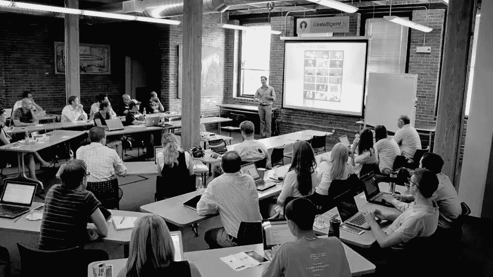

# 聪明. ly，以及为什么它很重要

> 原文：<https://medium.com/hackernoon/intelligent-ly-and-why-it-mattered-8072e9804bb2>

这篇文章最早于周日发表在丹尼斯·基欧汉的《完全偏见》周刊上。未来领取 UB， [***在此报名。***](https://utterlybiased.com/signup/)

我对 Intelligent.ly 的第一次访问记忆犹新。

我记得挂在整个教室里的公司标志是大胆的蓝色，与 Intelligent.ly 所在的整个 BzzAgent 办公室暴露在外的各种褪色的红色形成对比，至少我当时是这样认为的。

哈里森大道上的空间挂满了赛斯·明金色彩鲜艳的超大号画作。明金是戴夫·巴尔特在该空间的“常驻艺术家”。以前的仓库也是许多公司的所在地。不仅 BzzAgent([2011 年被收购后的 Dunn humby](http://[https://www.google.com/url?sa=t&rct=j&q=&esrc=s&source=web&cd=1&cad=rja&uact=8&ved=0ahUKEwi1oI-DmdXYAhUFleAKHSgoAJoQFggsMAA&url=https%3A%2F%2Ftechcrunch.com%2F2011%2F05%2F23%2Ftescos-dunnhumby-buys-bzzagent-for-60-million%2F&usg=AOvVaw2HuqYYTs9TUtlw_ypcqZUB))和 Intelligent.ly 在这里办公，多年来，像 Dunnhumby Ventures、Promoboxx、HelpScout 和 Smarterer 这样的其他组织也把这里称为办公之家。有一次，这位作家，作为 VentureFizz 的非官方波士顿万事通，在那里有一张小桌子。

在 Intelligent.ly 教室的最后面，有一些经典的巴尔特/霍奇斯风格。除了明金的巨幅动物画，还有一个小小的三角龙雕像，各种各样的小摆设，一个满是酒的厨房，还有相当多的酒——龙舌兰酒味道很重。上课的时候，总会有大量的里贾纳披萨，还有似乎永远不会停止供应的 PBR。

我不知道我去 Intelligent.ly 的第一个晚上是谁说的话——也许当时是无限的首席技术官亚伦·怀特(Aaron White ),但我可能弄错了——但我确实记得自己非常紧张，并渴望尽可能保持低调。那时候，我想是 2012 年的春天，我是当地一所私立学校的英语老师，隐约觉得是时候转行了。

我对创业越来越感兴趣，想更多地了解创办和经营一家小企业是什么样的。当时，Intelligent.ly 是在亲密而随意的环境中了解这一点的最佳资源。

在我参加的那次会议上，我试图在不引起太多注意的情况下跟上演示。我担心我会以某种方式暴露自己是一名教师——她的老板会反对这种兼职和职业探索——更普遍地说，是一个骗子。

在努力保持萨满式隐身的同时，那天晚上我学到了足够多的东西，以至于被企业家的世界迷住了，尤其是波士顿的“创新”社区，多年来人们断断续续地提到这个社区。(这种措辞的使用将是未来 UB 时事通讯的重点。)

但引起我兴趣的不是演讲或演讲者。这是每个人对智能空间的热情——主持人、壁花、与会者、看似苦恼的初创公司、仍在 BzzAgent 工作的人或当时共享办公室的其他公司之一。太受欢迎了。晚上有一个明亮，轻松的空气，推而广之，在波士顿成为一个企业家的可能性。

这不是一个小壮举。这是 Intelligent.ly 与生俱来的独特之处。

虽然我上面解释的感觉是我自己的，但我相信许多人都有类似的经历，无论是在 Intelligent.ly 的老派课堂形式还是最近的领导力培训迭代中。

这段经历激发了一种激情，这种激情不仅让我的职业生涯，也让我的生活到达了意想不到的地方。

随着 Sarah Hodges 上周在 Medium 上发布 Intelligent.ly 将于 2018 年[关闭的消息，承认该组织不仅在当地一些企业的发展中，而且在包括我在内的许多人的生活中发挥的作用是很重要的。](/@sarahhodges/thank-you-for-5-wonderful-years-of-intelligent-ly-boston-25f639c42563)

Intelligent.ly 于 2012 年由戴夫·巴尔特(Dave Balter)创建，他目前是 [Flipside Crypto](https://flipsidecrypto.com/) 的合伙人，现任[支柱风投](https://pillar.vc/](https://pillar.vc/)合伙人莎拉·霍奇斯(Sarah Hodges)掌舵。当时，巴尔特负责收购后的 BzzAgent，霍奇斯完成了 RunKeeper 的成功营销工作，即将跳槽到 Smarterer。

去年，这两个在一起几年的夫妇结婚了。

在它首次开放时，Intelligent.ly 被比作纽约的共同工作/学习太空大会。回顾过去，我会说这不是一个非常恰当的比较。在我看来，GA 更像凤凰城大学，如果你有动力的话，那是一个学习的好地方。Intelligent.ly 有点不同。

Intelligent.ly 在其历史中不断发展，但即使在其最早期的形式中，它也对参与其编程的个人产生了影响。那时候去上课是一种冒险。它可能会引出一个利基商业主题的介绍，基于经验的关于提升小企业层级的指导，有机会结识波士顿一些最成功的公司的运营者并得到他们的指导，或者，老实说，有时间与志同道合的人见面和交往。

当编程最初开始时——在 500 Harrison 进行小型、私密的课程和讨论——重点是作为一种渠道，将波士顿创业世界以外的人带入内部。创始人、首席执行官、工程师、产品负责人、人力资源经理、律师等会出现，并深入研究他们为观众准备的演示文稿，这些观众可能包括全职妈妈、大学生、创意人员以及许多寻求在这座城市其他地方找不到的教育的人。通常情况下，会议结束时会有很长的问答时间。有时会有更长的、自发的会后聚会，在此期间，演讲者可能会和听众打成一片，回答他们的问题。

我相信，许多关键的招聘和许多意想不到的投资机会都来自这些计划外的沙龙。

随着巴尔特的其他一些项目的扩张——最明显的是 2014 年被 Pluralsight 收购的 Smarterer——intelligent . ly 搬出了南端，进入了不同的场所，包括当时由黛安·赫桑(Diane Hessan)领导的社区空间(Communispace)，即现在的 C-Space。在我的观察中，虽然班级仍然继续定期满员，但是 BzzAgent 的“后台”已经失去了很多活力。

近年来，Intelligent.ly 发展成了一种与其原始格式完全不同的格式。该计划的最新模式旨在培训从一小群当地公司(如 Dyn、DraftKings 等)中被认定为最具领导潜力的个人。这个版本的 Intelligent.ly 填补了许多没有时间或资金来培养下一代领导者的小组织的空白。我采访过的许多参加过这个项目的公司和个人，对这次经历都只有积极的评价。

Intelligent.ly 在过去五年中发展的原因与资金有点关系，因为与依赖个人报名参加创业课程相比，开发课程并与企业实体合作教育员工可以获得更稳定的收入。

你还可以从 Intelligent.ly 的增长曲线和最终结局中看到大波士顿地区在发展创新型公司和建立、运营这些组织并为其配备人员的创造性个人方面的长期突出地位的潜在可怕趋势。但那是以后的事了。

像大多数科技和创新项目一样，Intelligent.ly 也不能幸免于一些批评。

虽然总的来说，这个组织对许多人和当地的小公司产生了巨大的影响——我认为它是人们转行进入创业世界的理想场所——但有人可能会说，它在将波士顿周围的少数群体社区与创业生态系统联系起来方面做得不够。虽然许多人仍在试图找出这一缺陷，但我必须说，Intelligent.ly 在欢迎和给予女性机会，让她们在全市各行业担任更重要的角色方面远远走在了前列。

此外，可以说 Intelligent.ly 最大的资产之一，它早期类似俱乐部会所的环境，也可能被一些人视为过于内部化。在几乎每一个社会或商业集体中，察觉到内部人/外部人的二分法是波士顿人的典型特征，所以我不太相信那些从这个角度看待 Intelligent.ly 的人。

归根结底，在过去的五年多时间里，Intelligent.ly 在波士顿的商业领域扮演了一个有影响力的角色，并帮助许多波士顿人提升了职业生涯。

我个人会深深怀念 Intelligent.ly。

许多从我自己的经历中脱颖而出的美好回忆。

观看 HubSpot 首席技术官兼联合创始人 Dharmesh Shah 完成一个关于“企业家的集客营销”的演示，对我来说是一个启示。我不知道有如此商业头脑的人也能同时变得机智、鼓舞人心和坦率。

我在 Intelligent.ly 认识了一些人，现在我认为他们是至关重要的朋友和知己，包括巴尔特、霍奇斯、杰西米肯的肯·德金格和 HubSpot 的凯蒂·伯克等。仅仅这一点就给那些在没有智慧的情况下无法建立类似的深层联系的人带来了痛苦。

我仍然有一些人，其中许多人已经建立了自己不可思议的职业生涯，他们走到我面前，感谢我教的关于改变职业生涯的 Intelligent.ly 课程(恰好是 2013 年红袜队在芬威赢得世界系列赛的同一个晚上)。分享自己的故事对他人的影响是我很感激能够在 Intelligent.ly 的帮助下学到的一课。

最重要的是，将在我脑海中永存的智慧生活是通常在喝啤酒时的随意交谈，深入探讨各种话题，既有博学的，也有大二的，这些话题实际上可能会改变一个人看待世界的方式，以及一个人在世界中的潜在地位。

在过去的几年里，波士顿“创新”社区的面貌发生了迅速的变化，看起来如此之快，以至于我们没有意识到一个独特的时代可能已经结束或正在消退。

这一时期的关键特征 MassChallenge、Bostinno、Techstars、Startup School 等组织蓬勃发展；HubSpot 和 Wayfair 等成功上市；年轻的创始人向月球进发；风险投资随处可得——可能是关键人物的大胆无畏，也可能是渴望点燃企业和组织管理者的激情或变革。

智能生活是那个时期的基石。虽然它可能会以其他形式回来，但我很高兴经历了这个组织的全盛时期。

# 完全偏见和波士顿的下一个“俱乐部会所”

在过去的一周里，回想 Intelligent.ly，我脑海中浮现的是巴尔特、霍奇斯和工作人员用该程序创造的友好环境。

在我看来，这是过去几年波士顿所缺乏的。

随着 2018 年完全偏颇的回归，将会有一些变化，我希望所有的变化都是朝着更好的方向。我想做的一件事是复制我喜欢 Intelligent.ly 早期的东西:一个悠闲的、相互支持的社区。

下周我将展示更多细节，但我只想分享我对完全偏见的下一阶段感到非常兴奋。

谢谢你的合作。

-D

别忘了订阅每周简讯！