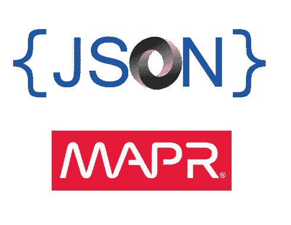
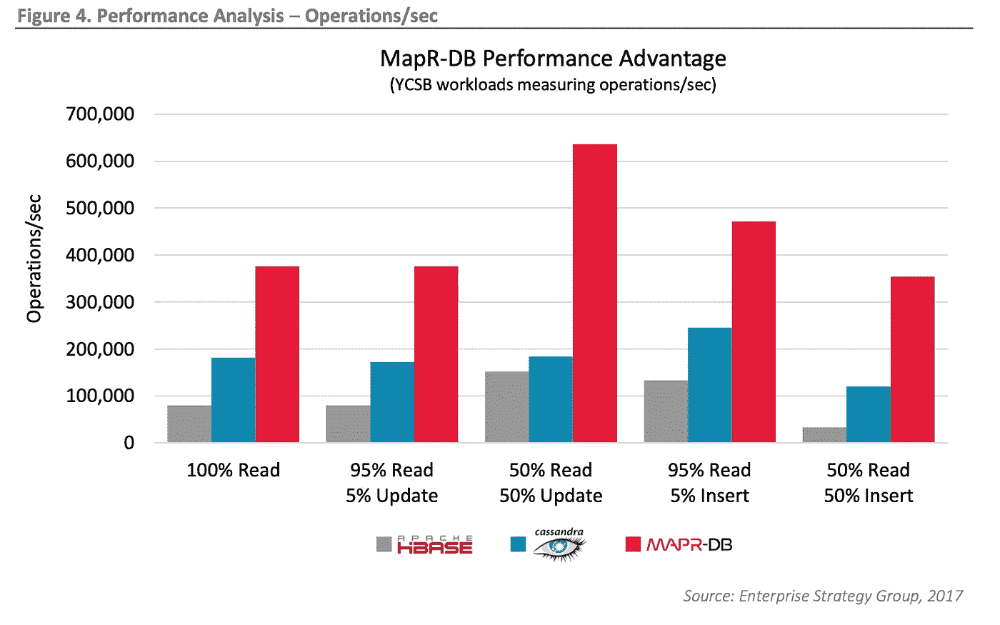
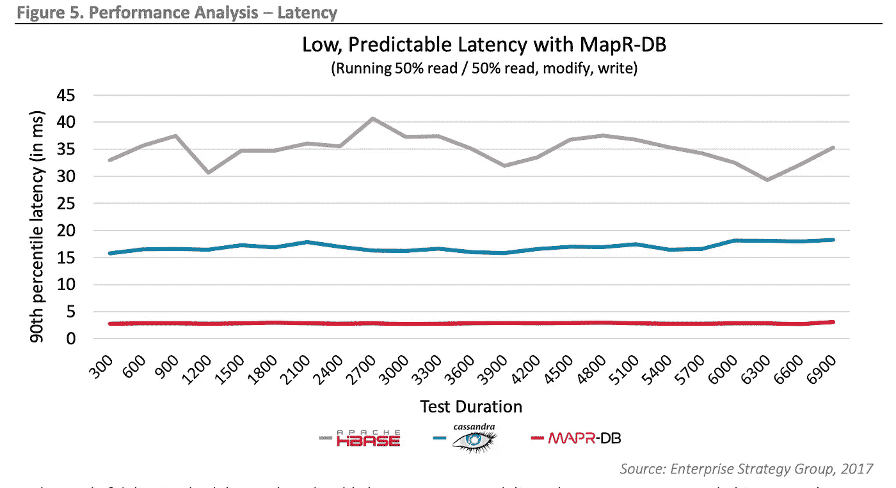

# 与 MapR-DB 交互

> 原文：<https://medium.com/hackernoon/interacting-with-mapr-db-58c4f482efa1>

apR 平台是一个很好的选择，可以解决与当今企业庞大且持续增长的数据集相关的许多问题。

高效的分布式文件系统以及强大而简单的标准流 API 是该平台成功的关键因素。然而，它最著名的部分之一是它的分布式、非 T2 SQL、高度可用的 JSON 数据库。

MapR-DB 支持 HBase API 以实现回溯兼容性，但最新的 OJAI API 是它的核心。

让我们看一个可以存储在 MapR-DB 中的文档的例子。

这是 MapR-DB 可以存储的纯 JSON。这份文件可以像我们想要的那样复杂。实际上对文档大小、字段或递归嵌套字段的数量没有限制。

文档存储在 MapR 集群中，因此对表的读写是并行进行的，分散了工作负载，并获得了令人印象深刻的性能数据，如一些独立的基准测试所示。

下面的图片展示了其中的一些。

MapR-DB 每秒可以完成比竞争对手多得多的操作。

MapR-DB 保持低延迟、恒定和可预测。

> 整个对比可以在这里找到*。*

*当读取或更新文档时，MapR-DB 知道文档的哪一部分需要被读取或更新，并且只有那些部分被实际接触。MapR-DB 试图有效地操作文档、表和底层文件系统，以保持最佳性能。*

# *查询 MapR-DB*

*MapR-DB 是非 *SQL* 数据库，因此它本身不支持 *SQL* 。[***OJAI API***](https://github.com/ojai/ojai)是与 MapR-DB 交互的首选方式，通过使用该 API，我们可以利用该数据库提供的所有功能。*

*我们可以使用任何提供的客户机在 MapR-DB 上运行查询。下面是一个使用 Java API 创建文档的例子。*

*正如我们所见，API 允许以友好的方式操作对象，因为它们代表 JSON 文档。*

*通过 OJAI API，我们可以对 MapR-DB 进行各种操作，比如插入、更新等…*

*基本上，从任何能够使用 OJAI API 的应用程序，我们都能够在 MapR-DB 中完成大部分工作。然而，我们可以问自己，需要不同处理能力的其他类型的工具呢？*

*例如，BI 工具可以执行计数、分组、求和等聚合操作。另一方面，我们还应该能够快速查看数据库中的值，而无需编写应用程序，但这在 MapR-DB 中可能吗？让我们探索我们的选择。*

# *MapR 数据库外壳*

*MapR-DB 提供了一个名为`dbshell`的工具，可以使用它的本地语言查询数据库。*

*使用`dbshell`我们可以探索我们有哪些表，以所有可能的方式查询它们等等。让我们看一些例子。*

*让我们先列出我们在`path`名下的桌子。*

*让我们在这个表中插入一些值。*

*现在，让我们列出文件。*

*我们可以通过`id`查询。*

*或者我们可以使用任何其他字段。*

*请注意查询是如何完成的。这是 OJAI 查询语言和 API 在发挥作用。这是 MapR-DB 的固有特性。*记住，它不是 SQL 数据库。**

*正如您所想象的，`dbshell`是体验 MapR-DB 如何工作以及进行快速简单探索的好方法。然而，可能很难将它视为大型复杂查询的首选工具。*

*让我们继续探索我们拥有的选项以及如何使用它们。*

# *Apache Spark 的 MapR-DB 连接器*

*MapR 为 Apache Spark 提供了一个连接器，可用于 MapR-DB 之上的大型数据处理。*

*该连接器可用于不同的 Spark APIs，如`RDD[A]`、`DStream[A]`和`DataFrame/DataSet[A]`。*

*为了使用连接器，我们必须首先向我们的 spark 项目添加正确的依赖项。下面是来自`[Reactor](https://github.com/anicolaspp/reactor)`项目的一个`build.sbt`文件。*

*现在，我们应该可以毫无问题地使用连接器了。*

*上面的例子只显示了应用程序的一个片段，但是请注意连接器是如何用于从 MapR-DB 加载数据帧和将数据帧保存到 MapR-DB 的。对于前面提到的其他 Apache Spark 抽象，也可以这样做。*

*使用 Apache Spark 的 MapR-DB 连接器，我们打开了无限的可能性，因为我们可以将 MapR-DB 和 Apache Spark 的分布式特性结合在一起，因此我们能够真正大规模地处理数据。*

*尽管 Apache Spark 是我们工具集中最好的工具之一，但有时它还不够。我们需要问自己，没有编码经验的用户如何使用 MapR-DB 的强大功能，而不需要经历 Spark 的学习过程，老实说，这个过程不短也不容易。*

# *使用 Apache Drill 的分布式处理*

> *当我们需要 SQL 时，我们有 Drill。*

*使用 Apache Drill，我们可以查询 MapR 平台中的几乎所有数据集，无论它存储在哪里，如何格式化，或者大小如何。*

*与 Drill 的交互可以通过它的不同接口来完成。让我们从使用 drill shell 开始，因为它提供了一个非常简单的基于 shell 的解决方案。*

*我们可以看到，我们可以通过 Apache Drill 使用纯 *SQL* 查询 MapR-DB，这是非 *SQL* 数据库。正如所料，结果以表格的形式返回。正如您可能怀疑的那样，所有类型的查询都可以执行，聚合尤其有趣。*

*在 MapR-DB 上运行这样的查询是令人兴奋的。Drill 确切地知道如何将 *SQL* 查询转换成底层的 MapR-DB 查询语言。*

*需要注意的是，Drill 也在 MapR 集群上分布式运行，因此同样的数据分布和高性能原则在这里仍然适用。*

## *其他 Apache Drill 接口*

*外壳不是钻头支持的唯一接口。我们也可以使用 Drill through REST 接口。*

*此外，Drill 还提供了一个更友好的网络界面。伴随这些接口而来的是 JDBC 和 ODBC 接口。这些对于像 Tableau、Microstrategy 和其他与 Drill 连接和交互的 BI 工具非常重要。*

*我们之前讨论过的同样的想法在这里也适用。例如，Tableau 可以通过 JDBC 连接到 Drill，Drill 将在 MapR-DB 上运行分布式查询。这使得 MapR-DB 成为一个非常通用和强大的数据库。*

# *结论*

*MapR-DB 是最强大的非*SQL*选项之一。它在同一平台下提供 HBase 和 JSON 功能。它在 MapR 集群上分布式运行，共享底层平台(MapR-FS)上的大部分属性。MapR-DB 可以以多种形式进行查询，例如 OJAI API for application、`dbshell`for quick and simple interactions、Apache Spark for scale data processing 和 Apache Drill for *SQL* 查询和数据分析以及 BI 工具集成。无论使用何种工具，MapR-DB 都将性能放在首位，在任何规模下都保持低延迟和每秒快速操作，这使得它非常适合未来的下一代工作负载。*

**MapR-DB 的其他工具是独立开发的，比如* `[*maprdbcls*](https://github.com/anicolaspp/maprdb-cleaner)` *，这里* *可以找到* [*。它允许基于查询删除文档(记录)。*](https://github.com/anicolaspp/maprdb-cleaner)*