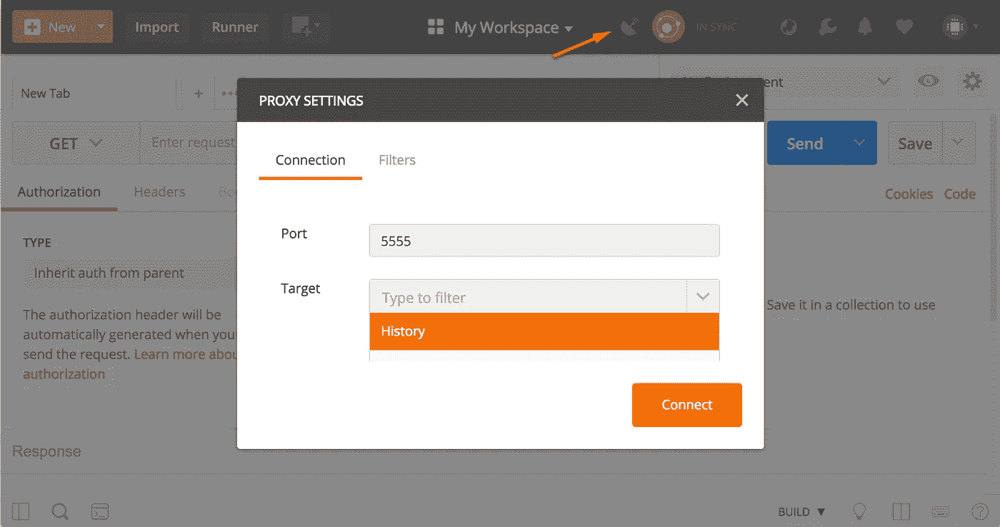
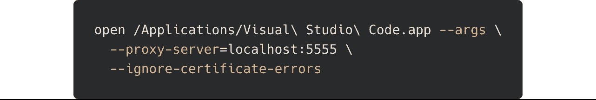
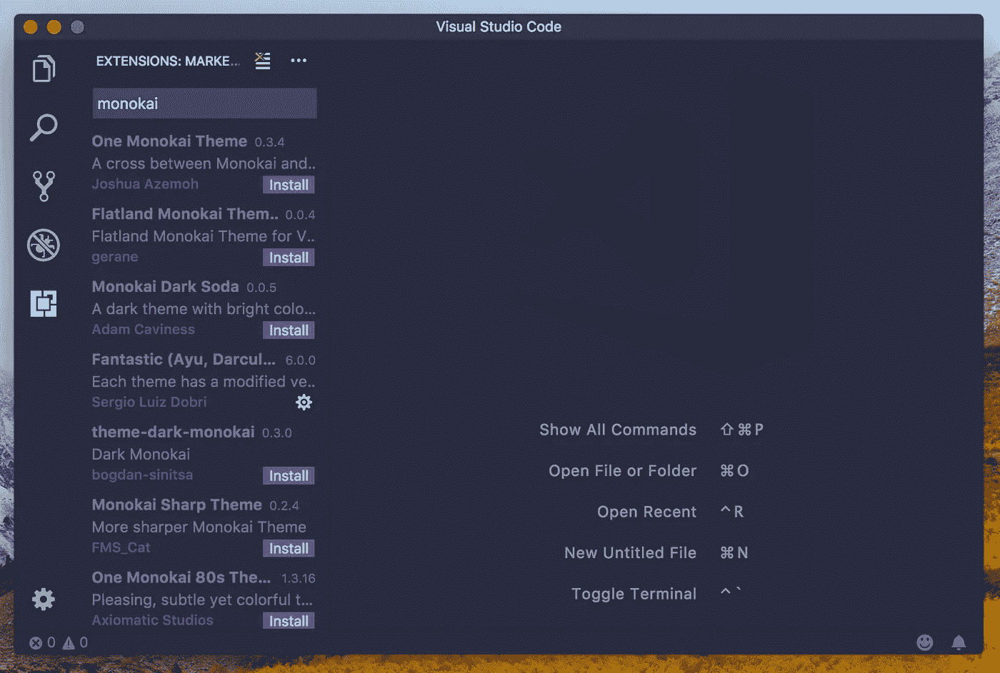
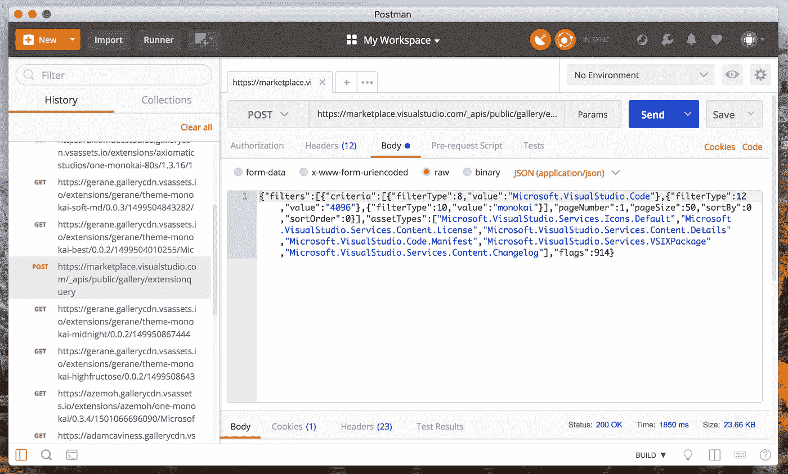

# 用 Postman 拦截来自电子应用程序的 HTTP 请求

> 原文：<https://medium.com/hackernoon/intercepting-http-requests-from-electron-apps-with-postman-6edc011b0c12>

并非所有的 API 都有文档记录。在最近的一个项目——[VSCodeThemes，](https://vscodethemes.com/)中，我着手清理没有官方 API 的 [Visual Studio Marketplace](https://marketplace.visualstudio.com/) 。

使用 Chrome 的网络检查器并捕捉来自桌面应用程序的请求，我可以逆向设计市场应用程序。

这篇文章将讲述如何使用 [Postman](https://www.getpostman.com/) 只需点击几下鼠标就能拦截来自[electronic](https://electronjs.org/)应用程序的 HTTP 请求。

# 启动邮递员代理

你要做的第一件事是打开邮递员。如果你没有，你可以从[这里](https://www.getpostman.com/)下载。

一旦打开，配置 Postman 的[代理服务器](https://www.getpostman.com/docs/v6/postman/sending_api_requests/proxy)就像点击*卫星*图标一样简单。

Click the **Satellite** icon to configure the proxy server.

使用默认值将在端口 5555 上启动代理服务器，并将所有输出记录到[历史](https://www.getpostman.com/docs/v6/postman/sending_api_requests/history)中。单击“连接”按钮启动代理服务器。

# 打开电子应用程序

随着代理服务器的启动，对它的任何请求都将被记录下来，并允许您以后重放它们。下一步是配置电子应用程序通过代理发送请求。

由于电子应用程序构建在 chromium 之上，我们可以使用几个命令行参数将应用程序内部的 HTTP 请求重定向到代理服务器。

以 VSCode 为例，打开电子应用程序:

Open VSCode from Terminal (macOS). [Copy the command](https://gist.githubusercontent.com/jschr/7fbdbd41ef092a1282ffaa23c45bc2a1/raw/f6e2c7f6970a5db0ccd086a4455d6d33d73aff30/open.sh).

`--args`之后的任何内容都作为参数传递给应用程序。我们将添加两个标志来将流量路由到代理服务器并启用 HTTPS。

第一个，`--proxy-server`告诉 chromium 使用一个[定制代理配置](https://www.chromium.org/developers/design-documents/network-settings#TOC-Command-line-options-for-proxy-settings)。将此设置为`localhost:5555`会将所有请求路由到 Postman 代理服务器。

第二个参数，`--ignore-certificate-errors`将暂时禁用证书检查。没有它，电子应用程序将错误地通过 HTTPS 发送任何请求。

# 向代理发送请求

现在，电子应用程序被配置为通过我们的代理路由 HTTP 请求，我们需要做的就是触发相关的 API 调用。

在这个例子中，我们搜索扩展来找出我们需要哪个端点来抓取 Visual Studio 市场。

Sending queries from VSCode to Postman Proxy.

# 浏览邮递员历史

发出请求时，你会开始看到它们出现在 Postman 的历史记录标签中。您可以在这里浏览电子应用程序提出的请求。

Browsing requests made through Postman requests.

点击请求上的*发送*会让你看到完整的回复。由于没有文档，更改参数并查看它如何影响响应将有助于您对 API 进行逆向工程。

# 结论

用 Postman 拦截来自电子应用程序的 HTTP 请求很容易设置。这当然只适用于电子应用程序。查看 [Charles proxy](http://Charles proxy https://www.charlesproxy.com/) ，它是一个全功能的工具，可以拦截来自你电脑的所有 HTTP 流量。

黑客快乐！