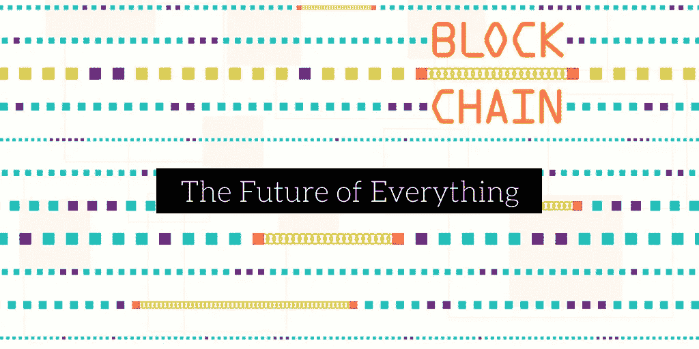

# 值得考虑的有趣的区块链初创公司

> 原文：<https://medium.com/hackernoon/interesting-blockchain-startups-to-consider-acb841c44040>

## 区块链技术的创造可能被证明是人类作为一个物种的转折点之一，因为它有可能改变人们做事方式的几乎每一个方面。

## 越来越多的公司期待区块链改善当前系统在安全性、可负担性和低效率方面的缺陷。我最近为 Volt 和 OkeyDokey 做了自由职业者的工作，所以我想加入一些关于他们和其他一些我喜欢的区块链初创公司的信息。

[**伏特**](https://volttech.io/public/Final%20VOLT%20White%20paper%200410.pdf)

VOLT 是一个 P2P 区块链当日送达平台，旨在为信使和客户创造一个更有益的交付生态系统。该系统是分散的，这意味着中心从等式中移除，留下一个客户直接连接到信使并且经纪费几乎被移除的系统。

任何人都将能够使用智能合同执行交付，信使将受到客户评级系统的激励。大门将为各种运输方式敞开，随后更环保的顾客可以选择更环保的运输方式。这有可能大大增加和改善当天送达的可及性，这方面的需求正在变得巨大。

[农庄信任 ](https://farmatrust.io/)

据估计，价值 2000 亿美元的假药正在流通，制药业现在并没有处于最佳状态。FarmaTrust 试图通过创造一个假药很难进入系统的生态系统来消除这个问题。

该系统结合了先进的数据分析、人工智能和区块链，为制药行业提供了一个蓬勃发展的地方。使用应用程序可以跟踪每个包裹，并在包裹从 A 点到 b 点的过程中使用区块链系统进行验证

[**OkeyDokey**](https://github.com/team-okeydokey/okeydokey/wiki/OKEYDOKEY-White-Paper)

OkeyDokey 致力于为资产所有者和租赁者提供一个更高效、更便宜、更便捷和自动化的资产共享过程。区块链技术将与智能锁相结合，智能锁将处理预订和支付，并允许所有者向他们选择的任何人提供对资产的访问，而不必在那里。

此外，OkeyDokey 将连接到许多第三方网站进行预订。这将增加 OkeyDokey 的客户群，并有助于避免同一资产在多个平台上重复预订。

[**熟了**](http://www.ripe.io/)

另一个有趣的区块链初创公司已经成熟，它利用分布式账本技术来跟踪从谷仓到叉子的食品。该系统通过遍布整个生态系统的专用扫描仪和传感器进行更新。该系统将是数据丰富的，因为它将与种植，收获和灌溉系统相结合。

这个想法是让食品行业的每个人都受益。例如，农民可以收到关于购买模式的信息，以了解在即将到来的季节种植哪种作物最有利可图。同样，商店经理可以看到收获信息，以计算出食物的价格和他们可以卖多少钱。

[**生命健康**](https://www.simplyvitalhealth.com/)

这家初创公司希望提高医疗记录的安全性、准确性和可访问性。这意味着正确的医疗保健提供者将获得所需的信息，为患者提供尽可能最好的医疗援助。

这是为医疗保健行业开发的首批符合 HIPAA 标准的区块链创收系统之一。这是一个基于价值的系统，这意味着医疗服务提供商被鼓励分享信息并保持信息更新。分散的区块链基础设施的性质意味着医疗记录将随着网络的变化而更新。

[**开集市**](https://www.openbazaar.org/)

比特币还没有被主要用作买卖物品的货币，但 Open Bazaar 试图改变这种情况。它创建了一个点对点市场，允许用户之间完成交易，而不收取你在亚马逊和易贝看到的费用。

该系统的另一个亮点是交易的完成速度。只需几分钟即可完成支付，系统上的所有节点都会更新，以确保安全完整性不会被破坏。

[**专柜**](https://tokensale.shopin.com/)

Shopin 初创公司正试图采用亚马逊的模式，但将数据所有权转移回个人购物者，如果成功，他们可能会彻底改变我们在线购物的方式。使用他们的系统，在线零售商被聚集在一起，为每个客户创建档案，评论可以提供产品推荐。

Shopin 已经筹集了超过 250 万美元，许多零售商已经同意使用这个平台。这一切都是为了在开始时吸引一些大型零售商，并从那里开始发展。

**结论**

这份名单上的区块链初创公司都是令人兴奋的想法，为社会带来了新的有益的东西。如果这些系统中的任何一个得到充分发挥，那么它将会使这些行业变得更好，在某些情况下，对每个人都有好处。

