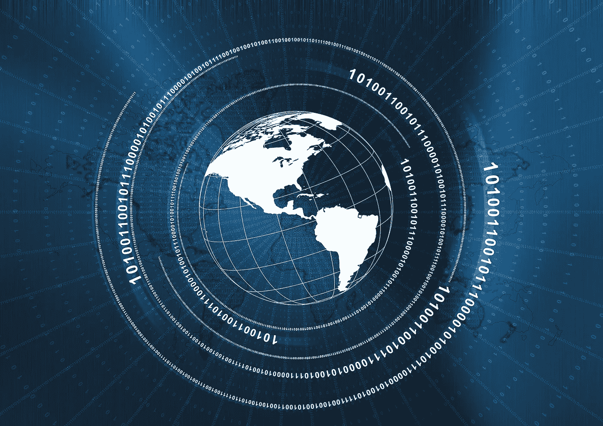

# 国际商业和网络安全

> 原文：<https://medium.com/hackernoon/international-business-and-cybersecurity-988f37c9e663>

[https://www.flickr.com/photos/kvinokurov/14658257525](https://www.flickr.com/photos/kvinokurov/14658257525)

网络安全对每个企业都很重要。一旦您收集了客户的个人信息、信用卡信息或任何其他数据，您就有义务确保这些信息在任何时候都得到保护和正确使用。

这不仅仅是一种道德义务。这是一个法律问题，最近在欧盟通过的[通用数据保护条例](https://eugdpr.org/) (GDPR)意味着公司必须更加透明他们收集的信息是如何存储和使用的。

这一切对一家国际企业意味着什么？这意味着存在挑战，包括您开展业务的国家/地区的法规、传输数据时的数据保护，以及各个国家/地区特有的威胁。

# 经营全球业务的挑战

Image Source: [Pixabay](https://pixabay.com/en/handshake-hands-laptop-monitor-3382503/)

在 T2，几乎每位首席执行官在经营全球业务时面临的最大挑战就是网络威胁。虽然对监管、地缘政治不确定性和不断变化的客户需求等其他问题也会影响运营全球业务所需的效率，但网络威胁是任何对话的重要组成部分。

原因是什么？在当今的市场上，一切都以数字方式运行，如果网络安全以任何方式遭到破坏，数据和效率都可能丢失。此外，公司保持客户数据安全的声誉也至关重要；一次违规可能会造成数百万的商业损失。

当服务器和其他物理数据位置位于具有不同安全协议的国家时，这尤其具有挑战性。这是 GDPR 试图解决的一个问题:监管的一致性。然而，人身安全和损害人力资产的[风险](https://hackernoon.com/global-security-in-an-age-of-rising-cyber-threats-d3006c2d7e7b)随着国际贸易而上升。

这些障碍是可以克服的，但它们需要灵活、适应各种环境并理解这些风险本质的领导。

# 为您的数字资产投保

Image Source: [Pixabay](https://pixabay.com/en/calculator-calculation-insurance-385506/)

保险呢？通常，您的业务政策应涵盖数字资产[，但在处理国际业务时，尤其重要的是您要注意您的政策类型以及与海外事件相关的条款。当您查看涵盖哪些数字资产时，有一些重要的问题要问。](https://www.thehartford.com/small-business-insurance/why-you-need-small-business-insurance)

*   你的政策是什么？它包括数据泄露保险吗？这是你的小企业保险计划的重要组成部分。
*   它涵盖和不涵盖哪些情况？该政策是否涵盖网络威胁？服务器的物理损坏？它包括多少费用？
*   国际事件会怎样？全球业务的关键是，您的小企业可能发生的许多事情都可能发生在美国境外。在这种情况下，您的保险涵盖哪些内容？

小企业保险不应该被视为一种成本，而应该被视为一种投资——但确保你的投资合理与否取决于你自己。全球业务需要一项国际政策，尽管成本可能更高，但这是所涉风险的内在要求。

# 适应性安全和全球业务

Image Source: [Pixabay](https://pixabay.com/en/abstract-geometric-world-map-1278061/)

由于人工智能和机器学习，现在有了一个新成员:[自适应安全](https://digitalguardian.com/blog/what-adaptive-security-definition-adaptive-security-benefits-best-practices-and-more)。这种方法的工作方式不同于简单地在攻击发生后立即做出响应并恢复丢失的数据。以下是对许多企业都有吸引力的自适应安全的一些功能:

*   预防:人工智能和机器学习使保护程序能够预测攻击的类型，并在数据泄露发生之前采取行动加以阻止。
*   检测:即使威胁通过了防火墙和加密，如果系统能够在造成任何损害之前检测到漏洞，它也可以被隔离和消除。
*   响应:自适应安全系统可以做两件事之一:第一，它可以立即对威胁做出响应，或者如上所述消除威胁，或者在最坏的情况下，在威胁无法恢复之前减轻一些损害。其次，它可以在策略和数据存储方法以及身份验证方面做出长期变化。
*   预测:自适应安全系统最强大的方面可能是它可以[通过行为分析](https://www.researchgate.net/publication/261061304_Predicting_client-side_attacks_via_behaviour_analysis_using_honeypot_data)预测未来的攻击，为预防又增加了一层。

自适应安全可能会成为大多数企业未来的标准，因为随着威胁变得越来越复杂，复杂的答案是唯一有效的方法。

在国际上做生意有许多挑战，但最大的挑战之一是网络安全，在全球范围内应对威胁要困难得多。了解这些挑战，确保您的数字资产得到保护，并尽可能使用适应性最强的安全工具来保护您的业务和客户的数据，这一点非常重要。