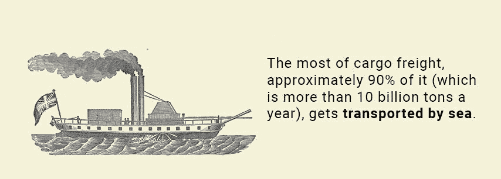
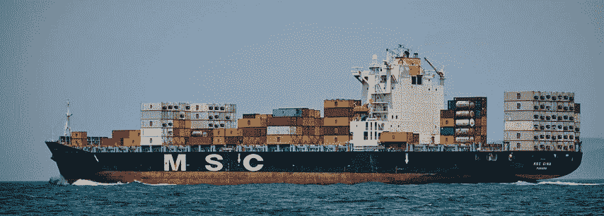

# 国际贸易:为什么我们应该停止一切写在纸上

> 原文：<https://medium.com/hackernoon/international-trades-why-we-should-stop-writing-everything-on-paper-127cd5200ff5>

考虑到我们在技术上已经走了多远，令人惊讶的是现代生活的许多领域都过时了。我们仍然发行纸币，使用实体身份证，我们仍然遵循一个世纪前的货物运输程序，严重依赖文书工作和不必要的官僚主义。问题是，现在有太多的公司参与到这个过程中，所以这种方法减慢了一切。让我们看一个例子。

> 感谢[agency.howtotoken.com](http://agency.howtotoken.com/)对创建该主题的支持(第一个拥有成熟 ICO 承包商的平台)

大部分货物运输，大约 90%的货物(每年超过[100 亿吨](https://www.statista.com/statistics/264117/tonnage-of-worldwide-maritime-trade-since-1990/))通过海运[到达](http://www.ics-shipping.org/shipping-facts/shipping-and-world-trade)。在到达港口之前，货物必须在某个地方由制造商生产或由农民种植。在到达港口之前，它可能会转手两到三次，我们所说的转手是指物流公司。每次货物移交给另一家公司时，必须移交大量的[文件](https://www.efilecabinet.com/cargo-insurance-certificate-and-document-management/):

*   CMR 文档，
*   货物保险证书，
*   国际商业发票、
*   装箱单和送货单。

准备文件可能需要时间，每一份文件都需要由不同的机构签署和交付(这可能需要数周时间，因为所有相关方不会在同一地点会面)。

当货物到达港口时，就会被卸载，通常会存放在仓库中，存储成本会迅速增加。然后，它被另一家公司装载到船上，通过海路运输到目的地港口，在那里再次储存起来。它将通过海关清关，通常由清关机构完成，然后被装载到卡车或铁路上，并通过更多的仓库进行分拣，因为那里有各种集装箱，装有各种产品。最终它将被运送到最终目的地。这一过程涉及多少方？高达 10 甚至更多。大量的文书工作和延误让所有相关人员不堪重负。

每艘运送货物的船只都将[提单(B/L)](https://www.investopedia.com/terms/b/billoflading.asp) 以打印的形式发送给收货方，这是一份船载货物的详细清单。在很多情况下，船只在提单交付之前到达，因为快递员往往比船只慢，没有提单货物无法进一步前进，从而导致延误。

造成延误的另一个原因是，所有的支付都是通过银行转账进行的，这种方式非常缓慢而且昂贵。通过 SWIFT 的跨境支付可能需要[长达 5 天](https://smartasset.com/checking-account/how-long-does-a-wire-transfer-take)才能完成，要经过几家银行，每家银行在这个过程中收取费用(电汇的平均总费用为 25 美元)。所有这些因素累积起来，费用累积起来，导致巨大的损失，如果发生严重的延误，损失高达数百万美元。货船，等待文件被交付或签署是港口的通常情况。实证研究表明，每艘货船在其寿命的 25%的时间里都在港口闲置。这种延误给工业造成了数十亿美元的损失，一艘船每闲置一天的成本可能低至 10，000 美元，高达 150，000 美元的费用，包括工资、港口费、仓库储存和运行费用。如果买方对一周的延迟收取 3%的罚款，每批货物的交付延迟罚款也可能高达数百万美元。

考虑到全球海运本身的价值占每年 3800 亿美元，这样的损失是一个十亿美元的数字。谁为此买单？消费者！财务负担总是由最终消费者承担，因为运营成本总是包含在零售价格中。因此，加快这一进程将惠及所有人，促进国际贸易，降低成本，同时提高海上贸易船队的效率。

# 解决办法是:保留区块链的所有记录

怎么解决？区块链技术是解决这个问题的理想方案。供应链的所有参与者可以自动选择，从某种自由拍卖的所有可用报价中选择，或者从合作伙伴列表中手动指定，每个公司在区块链上都有自己的地址。当然，必须有一个接口，否则没有人会直接使用区块链。区块链提供了透明度，因为供应链上的每一方都可以检查所有必要的数据，并节省否则将花费在官僚主义上的时间。这将减少雇佣邮递员和签署文件的需要，而且所有这些几乎都是免费的。

基本上，国际贸易可以在许多方面受益于实施区块链。

**1)** **数字文档流通**

每一个被认可的承运人或制造商或零售商都可以在文件上签名，从而确认货物的接收或货物的发送。一旦签名，签名不能被删除，这意味着签名者参与了这个供应链。它总是在那里，在区块链，它可以在几秒钟内被检查。所有货物属性都可以在区块链上记录，所有集装箱都可以清点，提单可以数字化，所有付款都可以通过区块链传送。节省发送和等待各种文件的时间有助于显著降低成本。等待文件的每一天都要额外花费运输价值的 0.6-2.1%的[费用，每个国际快递](http://unctad.org/en/PublicationsLibrary/rmt2015_en.pdf)[花费 50-75 美元](https://thecargocoin.com/docs/CargoCoin-Whitepaper.pdf)，每个贸易公司每年发送[成千上万](https://thecargocoin.com/docs/CargoCoin-Whitepaper.pdf)份文件。请在此举例说明成本。一个数字

**2)跟踪**

每一件货物都是由不同的承运人运送的，在运送的每个阶段都可能发生不好的事情。一些集装箱可能会丢失或被盗，或者易腐货物过期，直到最终客户购买并发现它，或者没有发现它并且消费者生病，才会被注意到。使用区块链，可以跟踪整个供应链，并可以测量每个承运人的交货时间。如果出了问题，很容易在区块链记录中找到。

**3)寻找送货承运人**

目前，它需要雇用在货物运输业务方面有多年经验的人，这些人有合适的关系，可以为你找到最好的报价，或者谈判出最好的运输价格。如果货运经理能够谈判 1%的折扣，它可以为一次运输节省高达 540，000 美元(一艘船可以运载 [18，000](https://www.bbc.com/news/magazine-21432226) 个集装箱，运载每个集装箱的成本是[3，000 美元](https://www.smartcompany.com.au/startupsmart/mentor/what-are-the-costs-involved-with-importing-products-from-china/)，这等于总共 5，400 万美元)。这比货运经理的年薪([$ 66000](https://www.payscale.com/research/US/Job=Cargo_Manager/Salary))还要高得多，甚至还包括奖金。区块链可以用来创建一个市场，制造商，运营商和零售商可以连接起来并签署交易，因此价格将由供需平衡有效调节，甚至不需要专门的经理来处理。

**4)发行智能合约**

聪明的合同是公正的，一旦货物交付，就付款。或者如果东西被偷了，这是可以解决的。创建智能合同比签发普通纸质提单更便宜，它减少了 50 美元的签发税成本，为单个公司每年节省了数十万美元。对于一家大型运输公司来说，这并不是一个压倒性的节省，但对于使用区块链的其他有益效果来说，这是一个令人愉快的补充。

总而言之，区块链的使用可以彻底改变这个行业，就像蒸汽船改变了海上贸易一样。好处显而易见。因此，问题是:我们是否朝着这个方向采取了任何步骤？

# 当前使用案例

当然，大公司简单地忽视这样的机会是愚蠢的。他们中的许多人已经在探索这种可能性。例如，沃尔玛(与 IBM 和中国零售商 JD.com 合作)宣布成立[区块链食品安全联盟](https://www.forbes.com/sites/rogeraitken/2017/12/14/ibm-walmart-launching-blockchain-food-safety-alliance-in-china-with-fortune-500s-jd-com/#65c68fe97d9c)，以改善中国的食品供应链。中国在食品运送方面存在问题，很多食品是[假的](http://www.viralnova.com/fake-food-china/)、[导致食物中毒](https://www.ncbi.nlm.nih.gov/pmc/articles/PMC3888022/)。提高中国食品供应链的透明度是他们的目标，而区块链的技术可以帮助他们实现这一目标。

另一家中国巨头阿里巴巴通过其子公司 Lynx International 和 T-Mall 采用了区块链的技术。在这里，区块链被用来跟踪他们的跨境物流服务的信息，如生产，运输，海关，检查和任何第三方验证。

这些开发面向中国本地市场，并不打算在全球使用。虽然大公司有资本尝试建设自己的基础设施，但中小型公司却被抛在后面，对吗？这就是为什么 [CargoCoin](https://thecargocoin.com/) 这个项目包含了这些国际贸易公司需要的几乎所有功能，旨在填补这一空白。它提供数字提单，以智能合同的形式集成在平台中。供应链的任何参与者都可以检查货物装运的状态，这提供了透明度，但同时，区块链的安全性防止了任何黑客攻击或工业间谍活动。获得访问权的唯一方法是拥有必要的访问级别。所有各方都有工具来交互和更改货物收据(包含货物描述的文件)、货物所有权或双方同意的目的地。

它还提供了一个通过智能合同雇佣船员的市场。这个市场看起来像市场上的一个新的解决方案。

总的来说，CargoCoin 为贸易和航运行业提供了完整的解决方案。这个项目的效用，如果大规模采用，将是巨大的。这是面向全球市场的物流区块链的一个很好的例子。

我们在航空运输行业已经有了现有的使用案例，比如波音公司的下一个项目，开发一个跟踪商用货机的平台，并为飞行分配安全的交通路线。当大家都在忙着海上贸易的时候，波音却在想天空。

区块链会成为国际物流低效率问题的解决方案吗？它当然有很大的机会这样做。使用它的好处太多，不能忽视，所以最终可能会成为货物运输中的标准。每个企业都想提高效率，降低成本，加快流程。这种创新的新区块链利用提供了一个完美的机会这样做。