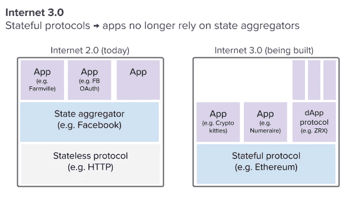

# 互联网 3.0 和国家聚合器的消亡

> 原文：<https://medium.com/hackernoon/internet-3-0-and-the-demise-of-state-aggregators-1575adffbd88>

去中心化的互联网(互联网 3.0)是一个激动人心的承诺，已经赢得了人心。但在比特币的十年里，我们还没有看到任何互联网 3.0 用例的主流采用。互联网的自然状态有没有可能是中心化？而如果不是，那么互联网 3.0 能不能把天平从中心化转向去中心化呢？

# 互联网 2.0:国家聚合器

首先，让我们来看看为什么我们所知的互联网最终走向了集中化。

互联网 1.0 提供了像 HTTP 这样的开放协议，并承诺每个人都可以在这些开放协议的基础上构建，并相信它们不会改变。然而，有一个问题:这些开放协议没有捕获状态(我们现在认为的用户数据)。所以，如果我点击了你网站上的一个按钮，下次我访问的时候，你没有办法记住我的动作。

为了解决这个问题，网景公司的 Lou Montulli 发明了 HTTP cookie。cookie 的第一个应用是记录用户过去是否访问过该网站。这个 cookie 和 HTTP 请求一起发送。随着时间的推移，cookie 中跟踪的信息量变得太大，因此 cookie 成为指向用户操作数据库的指针(类似于今天的 cookie)。

曲奇饼是 USV 大学的阿尔伯特·魏格纳所说的“国家聚合”的最早例子状态可以是浏览历史，但也可以是游戏动作、购买、消息等等。一些公司开始聚集状态，最终变得非常有价值。

国家聚合器成为互联网的主导者，互联网 2.0 的一个令人惊讶的结果是，许多最初的开放协议已经被国家聚合器所取代:

*   短信(信息):信使
*   SMTP(电子邮件):Gmail
*   HTTP(网络):Chrome
*   IRC(聊天):时差
*   FTP(文件传输):驱动器、Dropbox

互联网 2.0 也向我们展示了网络的力量。在没有开放协议的情况下，状态聚合器充当新领域的协议，例如:

*   支付方式:Paypal
*   搜索:谷歌
*   社交媒体:脸书
*   购物:亚马逊
*   信用:Equifax

国家聚合器实现了令人难以置信的结果:我们今天使用的所有神奇的互联网应用。毫无疑问，互联网 2.0 带来的产品和服务对社会产生了巨大的积极影响。

然而，我们开始看到一些主要的缺点(如隐私、垄断行为)，消费者开始报复。

集权是这些问题的根源。当一个状态聚合器增长到一定规模时，状态聚合器的激励、在其上构建的应用和用户会错位。Chris Dixon 在[为什么分权很重要](/@cdixon/why-decentralization-matters-5e3f79f7638e)中对此做了很好的阐述。

这种错位可以用“委托代理问题”来描述。在一个给定的系统中，有所有者(委托人)和雇员(代理人)，他们的激励很容易错位。上面的图表显示了随着时间的推移，国家聚合器如何不可避免地遇到委托代理问题，无论是对他们的用户还是对他们的补充。他们对员工也有这个问题。

互联网最终走向了集中化，因为分散的构件无法存储状态。集中式互联网带来了无数神奇的互联网体验，但也导致了激励机制的普遍失调。这是互联网的自然状态，还是有状态协议分散了互联网？

# 互联网 3.0:有状态协议

互联网 3.0 是对互联网最初承诺的回归，我们可以建立互联网，而不用担心国家聚合器会改变我们的规则。我们刚刚讨论了互联网 2.0 中集中化的力量有多强大。互联网 3.0 中去中心化的可能性有多大？

最重要的新概念是像以太坊这样的有状态协议。依赖于状态的应用程序不再需要构建在状态聚合器之上——它们可以直接构建在协议之上。

理论上，建立在有状态协议之上的互联网应该让除了国家聚合者之外的所有人受益。

*   协议层:令牌激励协议层的开发，减少了分散式协议与集中式协议竞争的可能性
*   App 层面:解决委托代理问题(可以信任)，降低构建 app 的门槛(状态可以免费拥有)
*   用户层面:解决委托代理问题

通过添加有状态协议和删除状态聚合器，我们应该会在协议和应用程序级别看到更多的实验，并全面改进一致性。

然而，正如我在介绍中提到的，我们还没有看到一个主流的互联网 3.0 用例。它的缺席很可能是因为糟糕的用户体验。应用程序笨重、不熟悉，并且无法扩展。底层技术对用户来说并不是不可见的:对于外行来说，区块链是令人困惑和害怕的。

# 结论

互联网不会不可避免地走向集中化。像 HTTP 这样的无状态开放协议和像脸书这样的国家聚合器的巨大价值导致了我们今天享有的统治地位。

像以太坊这样的有状态协议是去中心化互联网的貌似合理的驱动力。在协议级别捕获状态并减少状态聚合器应该会增加开发并改善激励的一致性。

然而，互联网的去中心化并不是必然的。如果没有有意义的技术进步和用户体验的飞跃，我们可能永远不会看到互联网 3.0 的主流用例。

总的来说，有理由感到谨慎乐观。生态系统正在快速发展，吸引着令人难以置信的人才，每天都在为科技和 UX 带来进步。按照这种速度，我相信我们会看到一个实现其最初承诺的互联网版本

*原载于 2018 年 3 月 14 日*[*【www.tonysheng.com】*](http://www.tonysheng.com/stateful-protocols)*。*