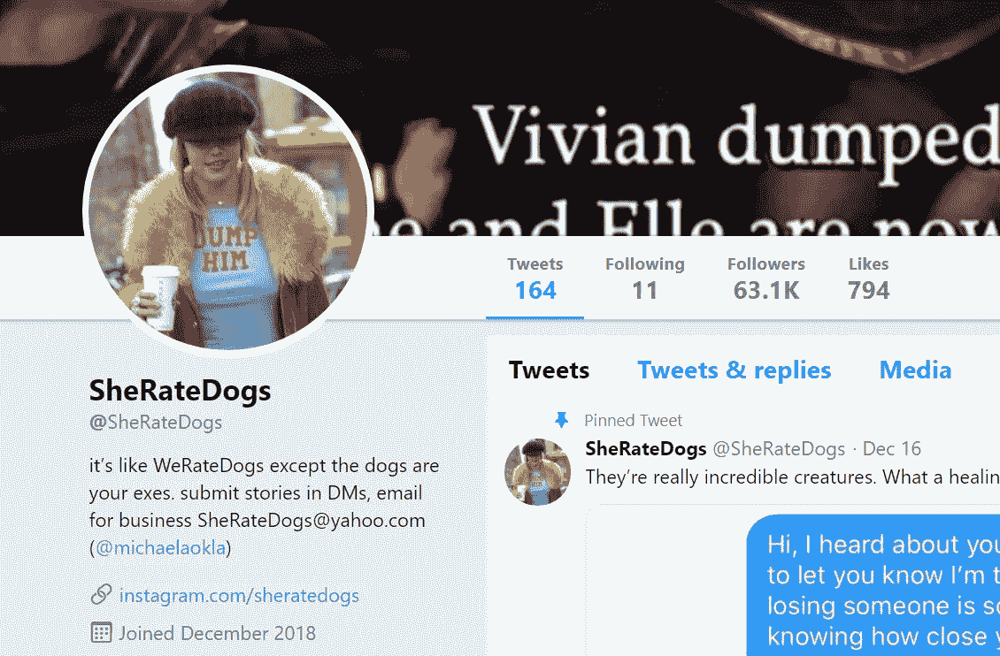

# 互联网文化综述#1:本周五大热门 Everipedia 页面

> 原文：<https://medium.com/hackernoon/internet-culture-roundup-1-top-five-trending-everipedia-pages-of-the-week-3f788c01e085>

Everipedia 是一部关于新兴文化主题的百科全书。在这里，我们将审视最独特的维基，这些维基原本会被传统的看门人忽略，包括一位无所不在的历史学家、一位受人爱戴的寡妇、一个有争议的值得迷因的 Twitter 账户、一位崭露头角的 DJ 和一位受人尊敬的环城路记者。

Anthony Taylor Michalisko

安东尼·泰勒·米卡里斯科

安东尼·泰勒·米查利斯科是印第安纳州的一名有线电视线路工，他承担了记录唐纳德·特朗普总统推特的责任。自 2016 年大选以来，他一直在这样做，他的动机是，他的书可以被未来的学者用作历史分析的来源。到目前为止，他已经出版了两本书 [*特朗普总统的推文 2016:大选版*](https://everipedia.org/wiki/lang_en/president-trumps-tweets-2016-general-election-edition/) 和 [*特朗普总统的推文 2017:特朗普总统推文的历史档案*](https://everipedia.org/wiki/lang_en/president-trumps-tweets-2017-a-historical-archive-of-president-trumps-tweets/) (这两本书都有 Everipedia 页面)。

Audrey Geisel

奥黛丽·盖泽尔

《宠儿》的作者苏斯博士的遗孀奥黛丽·盖泽尔上周在圣地亚哥的家中去世。1991 年她丈夫去世后，盖泽尔开始掌管他的遗产。她建立了苏斯企业，并监督了许多努力，包括将苏斯博士的作品制作成主要的电影，包括《洛拉克斯》、《戴帽子的猫》、《霍顿听到了谁！》，还有“圣诞怪杰是如何偷走圣诞的”尽管她工作努力，慈善努力，但维基百科上盖泽尔的名字只把他丈夫的页面重定向了。

Screenshot of SheRateDogs

[雪橇犬](https://everipedia.org/wiki/lang_en/sheratedogs/)

每隔一段时间，就会产生一个社交媒体句柄，它能立即吸引网络世界的注意力。SheRateDogs 由[米凯拉·奥克兰德](https://everipedia.org/wiki/lang_en/michaela-okland/)创建，是一个 [Twitter](https://twitter.com/SheRateDogs) 和 [Instagram](https://www.instagram.com/sheratedogs/?hl=en) 账户，分享前男性恋人试图与前女性伴侣重燃爱火的令人作呕的截图。这些账户越来越受欢迎，特别是 Twitter，在不到一周的时间里聚集了超过 5 万名粉丝，并被《每日邮报》和 Mashable 等媒体报道。

CARBIN performing live

[卡宾](https://everipedia.org/wiki/lang_en/carbin-dj/)

麦肯齐·莫罗(McKenzie Morrow)，更为人所知的名字是卡宾，是一名 dubstep DJ 兼制片人，他在 2018 年取得了巨大的成功。他和[AFK](https://everipedia.org/wiki/lang_en/afk-dubstep-jimmy-blythe/)[Boss](https://soundcloud.com/afkdubstep/afk-x-carbin-boss-ft-cody-ray-4)合作的歌曲在 SoundCloud 上有超过 150 万的浏览量，并且他在他的艺术家本周焦点系列中被[exception](https://www.instagram.com/excisionofficial/)认可。经过一系列演出和主要唱片公司的发行，卡宾将在 2019 年取得成功。

Michael Tracey pictured on Twitter

迈克尔·特雷西

驻华盛顿特区的自由记者迈克尔·特雷西在许多著名的出版物上发表过文章，包括《拦截》、《每日野兽》、《美国保守派》、《卫报》等。他以前是《少壮派》的调查记者，也是《VICE》的专栏作家，报道美国选举、美国公民自由、政治腐败和外交政策。目前，Twitter 上有超过 80，000 名粉丝，许多人都很好奇 Tracey 接下来会报道什么。

 [## Everipedia:区块链百科全书-黑客正午

### 区块链百科全书 Everipedia 和独立科技媒体网站 Hacker Noon 合作，以更好地…

hackernoon.com](https://hackernoon.com/everipedia/home)