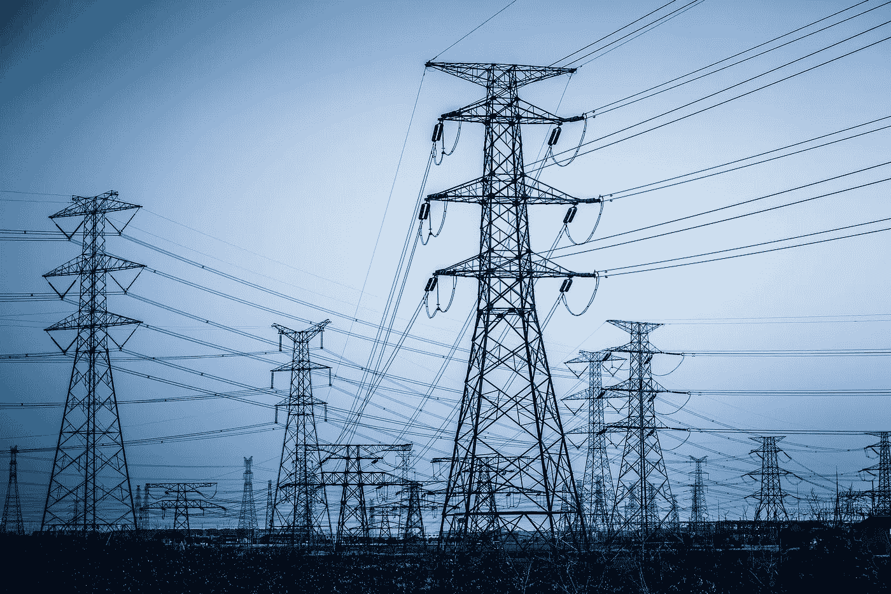

# 能源互联网:物联网催生的新能源商业模式

> 原文：<https://medium.com/hackernoon/internet-of-energy-new-energy-business-model-enabled-by-iot-7b487ee7501f>

物联网(IoT)有能力影响我们的许多服务和公用事业。事实上，数量如此之多，以至于在这个概念对全球大宗商品的大扫荡中，甚至包括了能源本身。以下是你需要了解的关于能源互联网的知识。

随着对无碳世界的追求继续，三个 d——去碳化、去中心化和数字化正在改变能源行业。这是在物联网推动风力涡轮机和太阳能系统效率的背景下发生的，风力涡轮机和太阳能系统看起来将代表全球能源消耗的未来。新的互联能源商业模式已经出现，它被称为能源互联网。

# 能源互联网解释说

今年是 2018 年，对清洁能源的需求从未如此之高。面对全球变暖，主导发达市场的政府面临着减排压力，而国际能源署的预测显示，2005—2030 年间全球能源需求将增长 55%。

近年来，能源的获取已经增加，但是随着[联合国](https://www.un.org/development/desa/en/news/population/world-population-prospects-2017.html)估计到 2040 年全球人口将进一步增长 20 亿，未来几年将导致太阳能和风能的巨大压力，以满足这种不断增长的需求。

另一个因素是由于旧的集中系统无法整合新的单元，如太阳能电池板，导致能源网格分散。[运营商声称](https://aurus.website/2018/01/03/power-grid-tennet-paid-a-billion-euros-for-emergency-interventions/)每年都有数十亿花费在[稳定故障电网](https://labs.eleks.com/2015/05/power-system-stability.html?utm_source=medium&utm_medium=referral &utm_campaign=Republ-Internet-of-Energy-Blog)上，其中一部分转嫁到消费者身上。

一个解决方案以能源互联网的形式出现，其技术可以为分散的、更智能的能源电网和稳定的电力供应提供基础设施。

# 权力的未来

能源互联网是建立在数据基础上的，这些数据是由具有不同应用的传感器网络收集的。

通用电气是在涡轮机中使用传感器来监控产量和生产率的集团之一。这些信息被输入电脑，提供外部因素的信息，如天气或燃料成本，从而产生最佳表现的建议。

人工智能在这种情况下是理想的，因为它能够比人类更快更有效地分析数据。2017 年，美国能源部在检查了过去的电力波动以确定更加稳定和高效的电网的答案后，称赞了这一概念。

量子计算是能源玩家非常感兴趣的另一个领域。它处理和存储数据的能力比传统计算机更快，这使它非常适合石油钻井平台，在那里成千上万的传感器被用来收集设备性能的信息。

进一步去中心化的核心是区块链；被中国国家电网公司吹捧为[获取电力使用和市场价格等信息的一种方式。然后，数据可以与政府机构和私营企业共享，以加深对该国能源消耗的了解。](https://labs.eleks.com/2016/10/secure-document-transfer-built-top-blockchain-technologies.html?utm_source=medium&utm_medium=referral &utm_campaign=Republ-Internet-of-Energy-Blog)

# 结论

几乎在能源互联网的每一个使用案例中，都有一个潜在的主题:连通性。通过一个安全、分散的网络收集、分析和交易数据，能源行业可以开始找到一条为全球人口提供可再生能源的道路。

事实是，太阳能和风力涡轮机无法单独解决我们的问题。随着中国每年浪费的可再生能源足以为北京提供一整年的电力，显然需要一个网络来更好地利用这些设备。

鉴于对能源需求的不断增长，以及 100 多年前的生产模式，我们的公司必须接受能够加速生产的创新。通过能源网络，我们可能已经找到了答案。

[联系](https://eleks.com/contact-us/?utm_source=medium&utm_medium=referral &utm_campaign=Republ-Internet-of-Energy-Blog)了解您自己的组织如何从分散式解决方案和物联网中受益。

*原载于 2018 年 5 月 10 日*[*【eleks.com*](https://eleks.com/blog/internet-of-energy-new-energy-business-model/?utm_source=medium&utm_medium=referral &utm_campaign=Republ-Internet-of-Energy-Blog)*。*