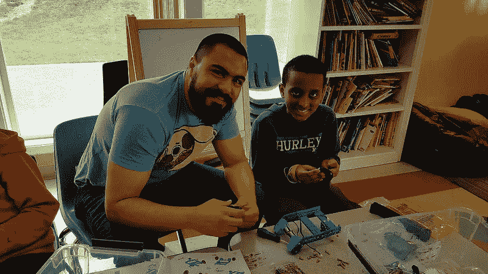

# 采访:科技和教育能解决社会不平等吗？

> 原文：<https://medium.com/hackernoon/interview-can-tech-and-education-solve-social-inequality-14afdc402dcb>

科技行业创造了数百万个工作岗位和前所未有的财富水平。它让全球各地的人们能够解决各种各样的问题，改善他们周围的社区。编码是我们这个时代最有价值的技能之一，世界各地的学生比以往任何时候都更早地开始学习它。

问题？教育负担能力、社会和种族差异以及性别歧视。许多低收入家庭的孩子从未接触过计算机，也没有机会学习计算机科学，更糟糕的是，他们不相信自己能成为软件工程师，认为这是特权人士的专利。

好消息是，有一群出色的工程师在致力于缓解这些问题，今天我采访了微软的软件工程经理费尔南多·桑切斯，他也是非营利组织“[Geeking Out Kids of Color](https://www.gokic.org/)”(GOKiC)的联合创始人，该组织致力于通过计算机科学教育来增强有色人种儿童的能力，以便他们能够利用技术来帮助他们的社区产生积极影响。他的故事不仅鼓舞人心，而且我希望它能影响到那些认为自己不被允许进入科技行业的孩子。

**你是如何开始从事科技行业的，你是如何为在微软找到工作做准备的？**

电子游戏一直是我的逃避方式。当我还是个孩子的时候，我被欺负，像许多其他孩子一样，电子游戏对我来说是一个安全的空间。结果，我生活的很大一部分被电子游戏塑造了。有一天我醒来发现这是我一生中最快乐的一天，我的父母买了一台超级任天堂。我记得玩了几个星期的超级男人！直到有一天我下定决心，我要创造自己的电子游戏。我把这件事告诉了我的父母，他们毫不犹豫地给了我正确的建议，我需要学习编码。

快进一下，在微软找到一份工作实际上是一段坎坷的旅程，我花了漫长的 4 年时间和 4 次面试才最终成功。最有趣的是，我最大的恐惧不是我的编码技能或我没有准备好，而是我几乎不存在的英语。我的流利程度仅限于相当于 T4 的 nde 图书馆？这成了我准备工作的第一个标记，我参加了一年的强化班，这给了我所需要的自信。

被拒三次是很难的，但我把它当成了动力。感谢家人、老师和朋友的支持，我找到了 3 份工作，这些工作教会了我一些关键技能，如果我想加入微软，这些技能最终会派上用场。随着我的热情，我不断练习我的算法和数据结构技能，甚至有机会参加 ACM 编程竞赛的世界总决赛！最后，在我准备毕业的时候，我接到了两个电话:微软和研究生院。两个都被录取了！那天晚上，我做了一个从未后悔的决定。我加入了微软。

科技行业正在创造越来越多的高薪工作，但社会不平等也在加剧，让一些人落在了后面。你认为解决这个问题的最好方法是什么？

值得一提的是，我们不能在不谈论特权和压迫制度的情况下谈论社会不平等。社会不平等并不遵循均匀分布，当我们听到美国有一部分人生活在贫困中时，并不意味着每个人都有同样的贫困可能性。不平等是由交叉性的特权和权力形成的。这就是问题难的地方。当我们谈论高薪技术工作时，我们最有可能谈论的是来自富裕社区的工作，在这些地方，他们需要的只是一点推动，维持循环，并将服务不足的社区抛在后面。我坚信，通过提供公平的资源、教育和批判性思维，我们可以有所作为，让它成为跨越社会交叉点的公平游戏。不容易，但我相信人类是聪明的，我们来解决吧！

**当你看到为中学生提供编程课程的广告，尤其是在像西雅图或三藩市这样的科技中心，你会怎么想？**

昂贵的，特权的，专属的。我记得有人曾经问我:*你为什么不用 Sammamish 教 CS？*仅供参考，萨米米什是华盛顿(也是美国)最富有的城市之一。为什么我们要保留特权，把收入最高的工作给那些拥有最多选择的人？如果我们真的想解决社会不平等问题，我们就需要把我们的努力集中在那些历史上得不到充分服务和代表不足的社区。令人惊讶的是你不需要走远；从西雅图驱车 15 分钟，你就能看到科技泡沫所隐藏的现实。没有电脑或互联网的服务水平低下的社区，更不用说学校里的科技教育了。让我们把这些课程带到落后的社区。让我们带来公平。

众所周知，性别和种族多样性是大多数大型科技公司优先考虑的问题。为什么你认为这是一个如此重要的话题？

我记得有一篇[文章探讨了机器学习应用如何继承人类偏见](https://www.technologyreview.com/s/607955/inspecting-algorithms-for-bias/)，特别是刑事司法系统中的种族主义。反应不一，对一些科学家来说这是令人愤慨的，*计算机怎么会是种族主义者？他们只是执行代码*。对于社会科学家来说，这一点很清楚，他们运行一个程序来预测累犯，当结果不正确时，黑人被标记为再犯的可能性增加一倍。它掀起了巨大的波澜，以至于现在机器学习研究有了自己的研究分支，以减少我们程序中的偏见。当然，算法并不是天生的种族主义者，但由于我们对它们进行编码和训练的方式，它们正在学习背后团队的偏见。对于任何掌权的主要参与者来说，确保新的研究、技术和产品有适当的代表性是必要的，因为它们将决定我们的未来如何发展。

**当你开始学习计算机科学的时候，你有没有一个榜样？对你有什么帮助？**

我做到了。事实上，在我的一生中，我有许多塑造了我个性的榜样，包括我对计算机科学的热情。我家里的每个成员都成了我的第一个榜样，他们创造了支柱，我赖以生存的价值观，我也学到了知识的价值。在大学里，我的院长和几个老师培养了我对计算机科学的热情，我们仅仅通过编码就可以做的惊人的事情，以及创造知识和教授知识的重要性。当我加入微软时，我的一位朋友，一位了不起的女性、公民和活动家，启发了我袖手旁观我的价值观和对社会问题的思考。然后我遇到了我的下一个榜样，我的坏小子经理，当我在微软成长的时候，他更努力地鞭策我，并且总是相信我。最后，我的合作伙伴，他帮助我把我学到的一切与我的社会责任结合起来，最终回馈我的社区。

许多有影响力的人，甚至在我的计算机科学研究之外，帮助我形成了我的价值观和我不断学习、教学并成为我所在社区的积极成员的动力。

**你是如何加入 GOKiC 这样的非营利组织的，它的核心目标是什么？**

我参与的根源可以追溯到大学时代，那时我意识到我是有特权的。那是我生命中的一个关键时刻，从那以后，一种不断增长的社会债务感占据了我。我记得与我最亲密的朋友的无数次令人惊叹的谈话，塑造了我的价值观和我的信仰。到我毕业的时候，很明显，我需要用我的技能为社会造福…但是什么呢？怎么会？我只知道为什么。

直到多年后，在成为移民后，我遇到了 GOKiC 的执行董事佩德罗·西里亚诺。生活在西雅图这个令人印象深刻的科技中心，我对身边发生的社会不公视而不见。佩德罗是催化剂，这个反应打破了我的幻想。我毫无察觉地喝着知识的水。令我深感震惊的是，从总体上讲，我对压迫的了解是如此之少，具体来说，我对种族及其全球影响的了解是如此之少。我需要一个框架、词汇和自信。当我学会了基本原则，我准备好了，我知道该做什么。

这是一个很长的故事，但很重要，因为这是 GOKiC 的核心和我们的使命:缩小服务不足社区的 STEAM 教育差距，让孩子们成为新知识的创造者，并提供他们所需的东西，以对他们的社区产生积极影响。

你喜欢这篇文章吗？ [**订阅**](https://geekonrecord.com/subscribe/) **通过邮件获取新帖。**

*图像通过* [*GOKiC*](https://www.facebook.com/gokictech/)

*原载于 2018 年 8 月 1 日*[*geekonrecord.com*](https://geekonrecord.com/2018/08/01/interview-can-tech-and-education-solve-social-inequality/)*。*