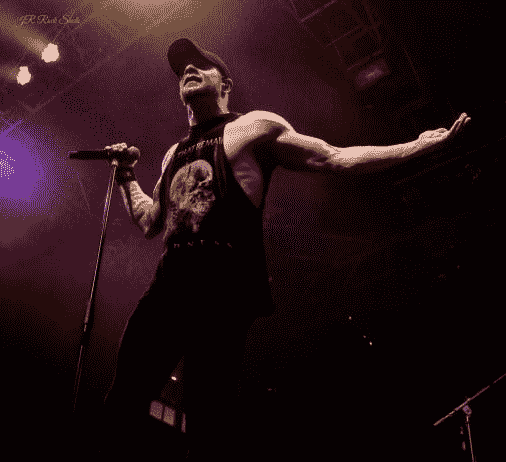

# 采访:Phil Labonte 的所有遗迹和加密货币

> 原文：<https://medium.com/hackernoon/interview-phil-labonte-of-all-that-remains-857de142c1e5>

最近，我有幸与美国音乐家菲尔·拉邦特聊天，他是重金属乐队**的主唱、创作人和主唱。这个乐队已经发行了八张录音室专辑，全球销量超过一百万张。菲尔还为其他重金属乐队演唱，如 *Killswitch Engage* 和*五指死亡拳*。**

**

*首先，能够和你说话真的很酷。我是这个乐队的忠实粉丝，再次感谢你在百忙之中抽出时间和我在这里交谈。*

*菲尔:当然，随时都可以。*

***麦克格拉夫 *:*** 我想把重点放在 crypto 上，我相信你已经做过十亿次关于这个乐队的采访了。我觉得很酷的是，我想我看到你转发了我的一个东西，我就想，“哦，妈的，看看这个。”你对加密很感兴趣，我觉得这很酷。*

*我想先说的一件事是，你是如何进入 crypto 的，是什么吸引了你？*

***菲尔:**首先，我很早就接触到了加密和比特币，那是在比特币基地之前，在去年的连胜之前，我当时觉得，“这很酷。”数字货币。这是一种摆脱美联储元的方式，听起来很棒。*

*我不知道如何得到它，我不知道你能在哪里得到它，你能在哪里购买它。我记得在 2016 年底，或者 2016 年中期，我再次感兴趣，但比特币好像是 700 美元。*

*我甚至不知道你可以把比特币分解成不止一个比特币，所以我当时就想，“我现在真的没有钱去买几个比特币之类的东西。”它就这么消失了——不是真的消失了，而是不在我的脑海里了。*

*去年 12 月，我们开始巡演，我们的巡演经理对加密感兴趣，他拥有比特币，他告诉我，“嘿，看看这个。你应该得到比特币。”我说，“我想买一些，只是不知道哪里能买到，我知道这很贵，诸如此类的。”*

*他说，“不，伙计。”然后他告诉我，你可以用一个 Satoshi 或者别的什么把它分解到小数点后第八位，他给我看了比特币基地的应用程序。然后我买了一些，下载了比特币基地，买了一点点，这时候我开始关注比特币到底是什么。*

*对普通人来说，这就像是“这是互联网的钱。”远不止这些，还有各种不同的硬币可供选择。那是我对它的接触。*

*一旦我得到了比特币基地，我就开始在 YouTube 上看东西，开始听东西，注意图表，并试图理解技术分析和所有与加密和整个空间相关的不同方面。*

*这是我的介绍，一个人刚刚向我展示了比特币基地，这就是我从那以后一直试图做的事情，我告诉我所有的朋友，“看，只是为了获得比特币基地的应用程序并购买价值 5，10 美元的东西，不管你买多少，只要买得足够多，这样当你看到关于比特币的东西时，它会提高你的意识，你不会只是说，“比特币。”然后继续你的一天，你会说，'比特币'你会注意的。"*

*我认为空间最需要的是普通人有理由去关注它。那是我的介绍。*

> *“这是一种摆脱美联储元的方法，听起来很棒。”*

***麦克格拉夫:**在某种程度上，我也有类似的经历。我是一年前加入的。大约是去年五月。我加入是因为一些朋友告诉我 Litecoin，我在比特币基地也有类似的经历。*

*我在去年 alt 赛季的高峰期开始，我在愚蠢的事情上投入了很多钱，得到了 rekt，并通过这种方式学到了很多艰难的教训。*

*这就引出了我的下一个问题，你到底是做什么的？你交易吗？你是我的吗？你只买蘸酱吗？你对它有什么看法？*

***菲尔:**以上，我有一个矿工跑，现在就在楼下，有 6 个，1070 TI 的跑。我的房子上有一个太阳能电池板，这是一个很好的抵消采矿成本的方法。我想扩大规模，开始在我的谷仓里经营农场。*

*获得一些 ASICs 来挖掘实际的比特币，而不是挖掘以太坊并以比特币支付。我现在正在用 NiceHash 挖掘云资金。我想成为一名真正的比特币矿工。我确实会做一点交易。我试着买蘸酱。*

*现在，我被困在交易中。我拿着一袋比特币，因为我买错了时间。我在等待它再次达到盈亏平衡，这样我就可以卖掉它，开始再次进出交易。这真的是我一直想做的。*

*我有一些硬币，不是很多。我有一些 Monero，虽然我知道人们会讨厌这个，但我确实有一袋相当大的 Ripple。*

*这没什么不对的。我在一枚硬币背后的心态是；我是个商人。当一天结束时，我喜欢长期投资的袋子很少，但我不在乎硬币是什么，如果它能让我在交易中赚钱。这才是我关心的。*

*不久前，我曾拥有一袋 Ripple 牌香烟，当时它正在进行一次大型的抛物线运动。事情就是这样。如果它能让我赚钱，我很高兴。我的目标是制造更多的比特币。*

*菲尔:是的，我也是。这真的是我的目标，因为我相信它将成为默认货币，或互联网的储备货币。我认为这是一件非常现实的事情，因为一切都是用比特币定价的。*

*所有的密码都是用比特币定价的。我认为在可预见的[未来](https://hackernoon.com/tagged/future)也会如此。显然，就像我说的，我是个菜鸟，我对[比特币](https://hackernoon.com/tagged/bitcoin)一无所知，但有人比我更有经验，知道的也比我多得多。*

*据我所知，仅仅因为它的名字和比特币是人们的主要入口这一事实，我认为比特币将在一段时间内成为主流，当然就像 Myspace 一样，可能会有另一个杀手级应用出现。*

*我听了很多安德烈亚斯·安东诺普洛斯的东西。他说的关于透明度的东西，我认为很重要。我认为它被设计成像金子一样，这一点很重要。我认为比特币作为互联网的储备货币可能会有很长一段时间。*

*某样东西会出现并取代它的位置。我不认为现在需要其他东西，因为一旦你进入这个领域，你就会知道比特币不是最快的，还有莱特币和其他支付速度更快的硬币。*

*如果你想要更私密的东西，你可以得到隐私币之类的东西。有不同的硬币用于不同的东西，一旦你接受了这个事实，在一个已经扩大的货币市场中，密码只是更多的货币，美元，日元，等等，等等，不管它是什么。*

*一旦你明白了这一点，那么比特币是否和签证交易一样快就变得无关紧要了，因为比特币是互联网的黄金。*

> ***“比特币是互联网的黄金。”***

*麦克格拉夫:我支持你。我认为你也指出了一个非常关键的点，那就是比特币是所有交易所的共同点，虽然你有以太坊，对其中一些交易所来说是不同的东西，但我不知道我所有的交易圈里有一个人是基于以太坊进行交易的。*

*每个人都用比特币交易，直到你看到反转发生，就是这样。这是“黄金”标准。*

*菲尔:我觉得除了‘这是新的’之外，还必须有一个理由，并且有比特币所没有的效用。仅仅因为硬币有比特币没有的效用，这并不意味着人们会停止说比特币是加密货币和互联网或其他货币的价值储存手段。*

*我知道我不会是那个想出杀手级应用或者下一个杀手级应用的人。我仍然不明白为什么其他加密货币会取代比特币，因为一切都很容易在比特币中变化，一切都以比特币定价。*

*我看不到它的必要性，这是 Antonopoulos 说的另一件事，他说，我认为 TCP IP，还有其他更好的协议，或者已经出现的更好的协议。*

*一旦有了基础设施，当你可以在它的基础上构建的时候，把一切都变得更好是没有意义的。我觉得很多奥特币都是这么做的。这就像比特币就在那里，当然比特币有一些缺陷，人们可以提出来说，“这我不喜欢。我不喜欢它。”*

*有其他硬币可以满足你的需求，在可预见的未来，比特币不会成为大狗的想法对我来说没有意义，在这一点上。*

***麦克格拉夫:**显然，我们已经讨论过比特币。你还有其他你认为很酷的项目吗？任何 ICO 的可能或任何你认为提供革命性变化的东西？*

***菲尔:**老实说，我仍然觉得自己太没经验了，不知道什么是好硬币，什么是好代币。*

*很好。这意味着你不买疯狂的炒作和诸如此类的废话，只是把你的钱扔来扔去，所以这很好。我认为这是一个非常负责任的回答。*

*我也是这样，我已经这样做了一年，我只投资了一个 ICO，我对保证金交易也有同样的想法。我从来没有接触过保证金交易，因为我对它了解不够，而且我很害怕。*

*菲尔:我甚至都不知道怎么缩写一个东西。*

*[笑声]*

*菲尔:是的，你知道卡特·托马斯是谁吗？*

*麦克格拉夫:这个名字我很熟悉。*

*菲尔:他有一个很棒的播客叫做[硬币掌握](https://itunes.apple.com/us/podcast/coin-mastery-building-your-cryptocurrency-empire/id1251624136?mt=2)。这是一个非常酷的播客，基本上每次他发布的时候我都会听。他有同样的想法。他真的很有趣。*

*麦克格拉夫:我一定会去看看的。听起来我差不多已经知道这个答案了，但是你是比特币还是比特币现金？*

***菲尔:**【笑】比特币。罗杰很有趣，罗杰称比特币为核心也很可爱，但就在昨天，我看到他在推特上说的一些话，我忍不住回复说，“罗杰，这不是比特币核心。是比特币。没人管它叫比特币核心，除了你。是比特币。别闹了。它不会流行起来的。”*

> ***“是比特币。别闹了。它不会流行起来的。”***

*不，不是的。我最喜欢的是一次又一次不断滚动的美国消费者新闻与商业频道民意调查，比特币每次都让他们大获全胜。*

*菲尔:是的。太疯狂了，来吧。*

*你有没有任何秘密的 Twitter 个性，你真的很喜欢关注，或者有没有其他人你真的很喜欢关注，但你没有提到？*

*菲尔:我喜欢[密码兰德](https://twitter.com/crypto_rand)，他很有趣。 [Crypto Cobain](https://twitter.com/CryptoCobain) 爆笑。我喜欢看图表的家伙进行技术分析。他们只是丰富的信息，那些家伙，我不会错过他们上传的视频。*

*老实说，对我来说，找到让我讨厌的人比找到我喜欢的人更容易，但我不会赶走他们。*

*我猜这就是你跟踪我的原因。我大概就属于那种，那种烦人的那种。[笑]*

*菲尔:不，一点也不。我真正喜欢的一件事是加密世界里的人们是多么的有创造力和有趣，他们想出了这些名字和 Twitter 账号。密码 Cobain 是另一个只是杀了我所有的时间。*

*肯定有一些影响存在，当他们说话时，我会密切关注。切德斯，刚刚战胜癌症的家伙。如果你看到这个，切德，恭喜你。对你来说很好。*

*我开始关注他，我注意到他的推文是，“我会战胜我的三期癌症，”我想，“哦，上帝，这真是他妈的斗争。”太糟糕了，我因为癌症失去了家人，大多数人都是这样。看到这一点，这是一个拖累。*

*然后我记得看到他发帖的那一天，“[我战胜了我的三期癌症](https://twitter.com/BigCheds/status/988504275830689792)”我就像，手举在空中，是的，我在想，“我从来没见过这个人。”我从来没有和这个人说过话，我想我们甚至没有在 Twitter 上互动过，但我只是觉得像一个巨大的指控，是的，感谢上帝，这太棒了，或者不管你选择的神是什么，我都不在乎-只是，是的，超级兴奋和高兴这个人战胜了他的癌症，因为这是一个他妈的混蛋。*

**

> ****“我从来没见过这个家伙。我从来没有和这个人说过话，我想我们甚至没有在 Twitter 上互动过，但我只是觉得像一个巨大的电荷，是的，感谢上帝，这太棒了。”****

*嗯，我们已经谈了一点，但是你对加密的未来有什么看法？你说你认为它会成为互联网的共同标准。关于那个话题，你还有什么要补充的吗？*

*菲尔:我认为迈克菲可能不得不吃掉那个家伙。*

**

***麦克格拉夫:**【笑】我最近刚买了一件[衬衫](https://wearencrypted.com/products/short-sleeve-unisex-t-shirt)，上面写着 100 万或者胸围，是他脱了衬衫打着领带的照片。那是我现在最喜欢的衬衫。迈克菲是我最喜欢的人物之一，因为他有多疯狂。*

*我认为他是个好人。他只是被误解了，或者我不知道该怎么说，但是我爱他。我真的很喜欢跟着他。*

*菲尔:他很棒。他很搞笑，他总是走来走去，中指在空中，他就像，“如果你想和我一起酷，如果你不在这里你去，去他妈的自己。”我只是说，“是的，约翰，是的，是的，太棒了。”他太棒了。*

*麦克格拉夫:这是一个很好的说法。当你经历了你的加密之旅，你有什么建议给刚刚进入这个场景的人吗，也许是你在这个过程中学到的一些经验？*

*菲尔:我真的觉得我很幸运，在泡沫的顶峰时期，我发现了比特币基地和所有的事情。有些人可能会说，“你为什么不想在六个月前入学呢？”等等等等。但我觉得我没有时间去投入，去沉浸在兴奋中，然后做一件愚蠢的事情，比如，再抵押我的房子，这样我就可以买密码或任何东西。*

*我见识了吹泡泡的威力。这也给了我一个买入的机会，平均我的买入，一路，一路，一路下跌。我在 6500 点或者——就在接近底部的时候买了一些比特币，所以我对此感觉很好。*

*我当时想，“伙计，我现在要买这个。”我学到了很多东西，因为就像我说的，这是一件新事物。这强化了我对钱是什么的看法，它不是美元，而是一种观念。*

*我明白了这是我们一生中可能会遇到的最大的机会。我当时太小，还不能真正利用互联网。我记得互联网出现之前的日子，但是—*

> *“这强化了我对钱是什么的看法，它不是美元，而是一种理念。”*

***麦克格拉夫:**就像网络泡沫一样？*

*菲尔:是的，网络泡沫之类的东西。我 43 岁，所以我是一个 20 岁出头的青少年，当网络泡沫正在发生时，我完全专注于乐队和演奏音乐。*

*这似乎对你很有效。[笑]*

*菲尔:是的，没关系。我的日常工作并不糟糕，但是我什么都不懂。我没有钱投入网络泡沫，即使我知道。我觉得这是另一个机会，实际上可能比网络泡沫或互联网变得无处不在更重要。*

*我认为很可能在未来——我认为在未来 10 年内，比特币会像互联网加密货币一样无处不在。我仍然认为，10 年后比特币仍将是最大的赢家。*

*我看不出有什么不可以的。我不知道我能挑出一件我学到的事情。如果我能给人们建议的话，那就是如果你买的东西坏了，拿着它，拿着它。特别是，如果你谈论的是大狗，你可能应该，当你开始的时候，远离 Altcoin 的，直到你学会一个体面的数量。*

*我买了一些硬币，我没有花很多钱，我也没有失去我的衬衫或任何类似的东西。Altcoin 的存在是为了好玩，但我不知道 Altcoin 的存在和好玩才是购买 crypto 和进入这个领域的真正目的。*

*这很有趣，但我不认为这是最重要的事情。*

***麦克格拉夫:**在我看来，比特币是你的廉价股票，你在寻找那张幸运彩票，让你在任何情况下都能获得一大笔比特币。我知道你比这个领域的普通人要老，我会说，密码领域是十八九岁，大部分是 20 岁出头。我 32 岁了。我想我可能有点老了，即使对小组来说。在年龄方面看到一些广泛的范围也是很酷的。*

*这让我想到，你认为要完全被主流接受需要什么，奶奶突然有了比特币需要什么？*

***Phil:** 我听到 Antonopoulos 谈到的一件事，我也同意他所说的，那就是这很容易。*

> ***“这一定很简单。”***

***麦克格拉夫:**我百分之百同意。*

***Phil:** 事情是这样的，对我来说，如果我知道比特币基地，我会在两年前购买比特币——或者一年前，无论什么时候比特币基地出来，如果我知道它，我就会知道它有多简单。*

*我认为，当机构资金进来时，每个人都在谈论这个问题，我不知道会出现这样的情况，一些公司会进来，然后第二天比特币会增加 10 倍或更多。*

*我认为你进入这个空间的方式越多，对这个空间就越好。我认为这是最重要的。我认为技术方面，闪电网络或交易速度之类的东西都是次要的，我认为所有重要的东西都已经到位了。*

*现在，需要发生的事情是它需要变得更容易，因为我一直希望 everywhere 永远采用 Apple Pay，但它还没有真正实现。我喜欢这种不用再带着钱包到处走的想法。*

*我可以把身份证留在车里，把驾照留在车里，然后拿起手机，用手机支付我想要的任何东西。这是我最想要的，不用担心钱包和手机。*

*我更希望这一切都在我的手机上，一旦你可以用比特币或任何地方的硬币做到这一点，那就是我会一直使用的东西。我认为随着越来越多的人更频繁地使用 crypto，这一天就会到来。*

*我认为真正的问题是它需要易于使用，一旦解决了这个问题，那么像交易发生的速度之类的事情，这些都是工程师可以担心的事情，他们会解决的。*

*一旦更多的人开始使用网络，开始在日常生活中使用比特币，这就会变得很自然，因为现在我总是会看看我是否可以用比特币支付，我买的任何东西我都会看，特别是在网上，任何接受比特币的地方，我都会用比特币支付。*

*我最近在一月中旬用比特币买了一台笔记本电脑，我认为这是有史以来最酷的东西，虽然很奇怪，但同时我几乎觉得我没有花钱，因为我的银行账户没有改变，但能够直接用比特币支付并完成交易仍然非常酷。*

*菲尔:那也是我期待的一天，那时我可以说，“好吧，付款——”他们会接受维萨卡、万事达卡、现金或比特币。我也在枪的世界里，这是一件事，你会看到很多持枪的人，如果你走进一家枪支商店，现在，我不是在谈论像沃尔玛或大型连锁枪支商店，或任何东西。如果你走进一家小型枪支商店，我几乎可以保证，如果你带着一枚金币走进去，你可以带着任何你想要的枪走出去。*

*枪界的人对贸易和物物交换的理解远远超过你的普通人。我的朋友有一家我参与的枪支商店，如果有人走进来说，“我想要那个，我有半盎司的黄金给你。”他会说，“是啊。毫无疑问。毫无疑问。”*

*如果有人对我说，“哟。我想买那把枪，我给你十分之一比特币。”你知道的。好吧，就这么简单。这是毫无疑问的，因为对我和那些和我想法一样的人来说，这实际上是有价值的，它会上升，或者至少会保持不变。*

*然而，美元远没有人们想象的那么稳定。他们没有看到通货膨胀。他们不会去想它。他们没有考虑到通货膨胀正在慢慢侵蚀你的钱和东西的价值。*

*在任何交易中，我都会选择白银、黄金和比特币，如果来交易的人或想要交易的人是同一个人，我会选择它们而不是美元。比起美元，我更喜欢它们。*

***麦克格拉夫:**你是否发现自己被怀疑论者包围，或者你周围的大多数人似乎都是赞同的，或者——?*

***菲尔:**乐队里的大多数人都有一些比特币。其实我觉得大家都有。我认为我们的吉他手迈克可能是最慢的，我不认为他有，但他有比特币基地，他只是没有真正去购买它。*

*我说，“伙计，你错过了一个机会。如果你两个月前买的话。比最低的时候多了 2000 美元。”其他人都很感兴趣。我在音乐行业找到的大多数人，他们通常都是思想相当开放的人。如果你是一个有创造力的艺术家，你就会成为艺术家。*

*今天早上我和[五指死亡拳](https://fivefingerdeathpunch.com/)的[杰森·胡克](http://www.jasonhook.com/)聊天，我们在胡扯，我向他提到了我的矿工之类的东西，他说，“是的。我有一些。我的朋友，等等，等等。"*

*Zoltan，我知道他喜欢莱特币之类的东西。音乐行业有很多人，在有密码的乐队里。我不太了解商业方面的人，但我知道肯定有很多艺术家有加密货币之类的东西。*

***麦克格拉夫:**那真是酷毙了的人。*

*菲尔:真的很酷。*

*感谢您抽出时间与我交谈，我真的很喜欢。*

*菲尔:随时恭候。*

*你可以在这里找到菲尔和他的乐队、*、*和他们的巡演日程[。](http://allthatremainsonline.com/#tour)*

*你可以在 Twitter 上关注他[这里](https://twitter.com/philthatremains)和我自己[这里](https://twitter.com/JoshMcGruff)。*

**