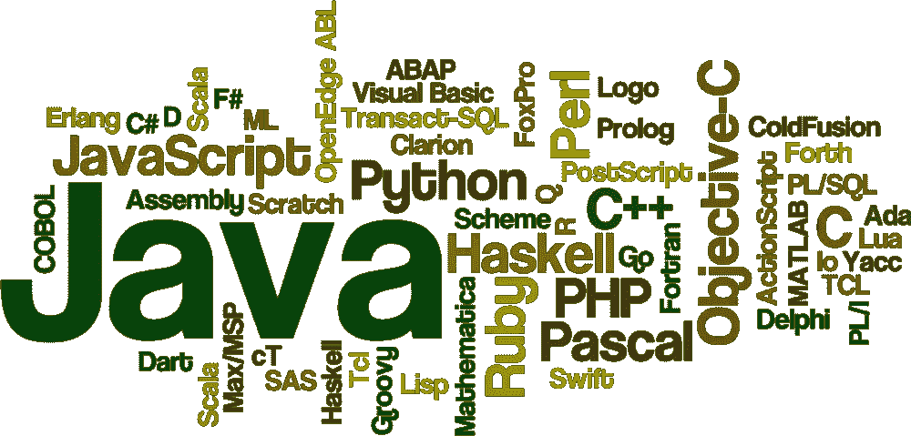
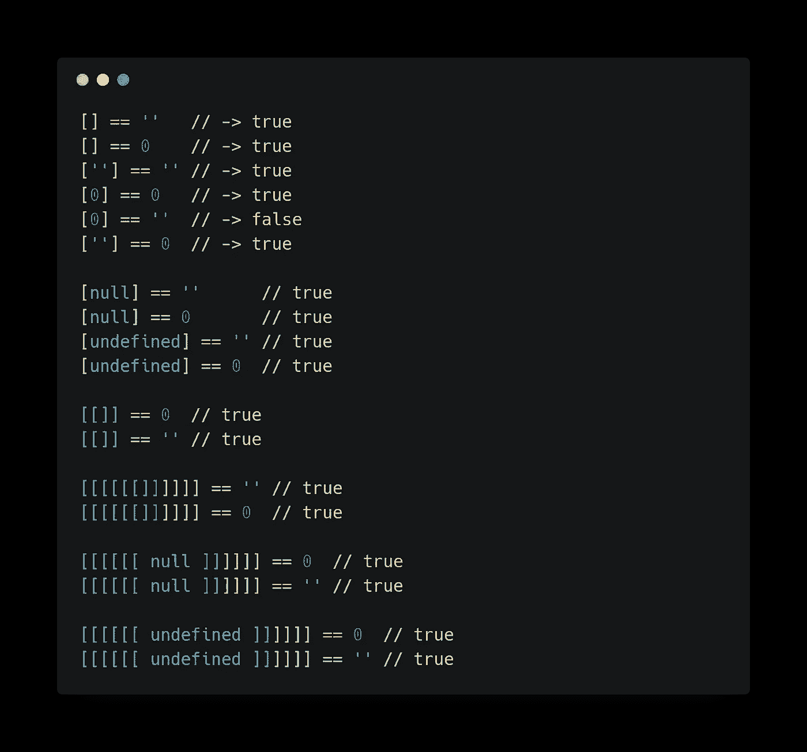

# 采访印度独角兽网站的开发者

> 原文：<https://medium.com/hackernoon/interview-with-a-paytm-web-developer-a02739454c4a>

## 与印度最大的金融科技公司之一的开发人员进行了一次内容丰富的问答。

最近我有机会采访阿比纳夫·潘迪，他是这个国家最大的创业公司之一的开发人员。Abhinav 喜欢写 Node.js APIs，整天和数据库扯皮。阅读这篇文章，找到他对一些问题的看法，我希望这些问题与那些希望磨练技能并在大公司找到工作的年轻开发人员非常相关。

*免责声明——这不是来自上述初创公司的财务建议。*

# 你公司的工作文化是什么？

我认为自己很幸运能和这样一个非凡的团队一起工作。我们的工程经理非常乐于助人，我们可以很好地协调工作。我的团队成员经验丰富，由于开放的文化，我们可以自由交流。每个人总是乐于互相帮助。当他们陷入困境时，没有人会犹豫寻求帮助。

# 你是怎么在独角兽找到工作的？

那是一个有趣的问题！因此，该公司组织了联合校园实习，许多来自德里 NCR 地区的学生都提出了申请。第一轮是黑客地球上的在线回合。我们必须在 45 分钟内解决 3 个问题。这些问题在概念和难度上差异很大。我记得在一个问题中，我们必须反转一个矩阵，在另一个问题中，我们必须添加非常大的数字。英国夏令时也有一个问题，但我不记得具体内容了。

尽管许多学生都说他们表现很好，但我们学院只有两名学生入围了下一轮。我记得我感到非常高兴和幸运，我是从 200 名学生中被选中的人之一。

下一轮全是数据结构问题，在那一轮之后，我面临两个问题的挑战，这两个问题可以用动态编程来优化解决。公司的技术领导坐在我前面，所以我很紧张，但我已经很好地复习了我的概念。正因为如此，我能够为这两个问题编写伪代码，同时考虑到所有可能的极端情况。

# 就印度就业市场而言，我们现在应该学习哪些技术？

招聘的参数因公司而异。有些测试你的数据结构和算法知识，而有些测试你对核心计算机科学概念的掌握，如操作系统、并行计算等。而其他人则专注于产品，测试一个人的开发技能。

我建议，为了增加你的机会，你应该从 C、Java 和 Python 中选择一种语言来解决算法问题，然后学习你的特定领域中使用的语言。在 Web 开发中，可以是 HTML、CSS、Javascript。在 ML 中可能是 Python。所以选择领域而不是技术或语言。

# 你最喜欢 Web 开发的哪些方面？

嗯，我最喜欢的是我们经营的规模。我不知道确切的数字，但你可以假设我们每秒钟要处理 1000 多个请求。仅仅是查看服务器日志和修复东西以保持一切顺利运行，对我来说就是极大的激励。我发现编写 SQL 脚本将数百万条目从一个表迁移到另一个表也很有趣。

# 你学习 JavaScript 时最大的障碍是什么？

Code from [WTFJS](https://github.com/denysdovhan/wtfjs)

我不会说这是一个障碍，但一开始我确实很难理解 JavaScript 的异步本质。但是一旦成功了，那感觉就像是一个巨大的成就。它改变了我的思维方式。我意识到这有多大的潜力，这也是我发现 Node.js 令人惊叹的原因。

# JavaScript 领域出现了如此多的新事物。你保持相关性的方法是什么？

谢谢你问这个问题，这是我经常被问到的问题之一。这将是一个很好的媒介来一劳永逸地回答这个问题。

每个人都应该明白的一件事是，他们不是在一场无所不知的竞赛中，没有人能做到，这样做也没有什么好处。选择一个领域，并努力掌握该领域的核心概念。你可以关注所有新出现的东西，如果有时间的话，你可以尝试一下，但是没有义务。

最重要的是完成工作。如果你知道 React，那么很好，你可以建立单页应用程序，没有必要知道 Angular。你也可以将一些事情委托给未来。当你遇到问题时，你可以四处寻找最适合你的解决方案。如果您所做的只是部署单个服务器节点应用程序，那么您现在不需要学习 Kubernetes。

# 你对当前的招聘流程有什么看法？

我认为没有一个正确的方法来判断一个候选人。有这么多的因素必须考虑，目前没有一个过程是完美的。很棒的一点是，许多公司都在积极研究适合许多人的新工艺。所以让我们对此保持乐观。

# 应该向开发人员询问关于数据结构和算法的问题吗？

关于数据结构和算法的事情是，它们是一个很好的方法来发现一个人是否逻辑健全，是否知道如何编写基本程序。发展技能也可以在工作中获得。此外，公司需要一个共同的基础来测试所有的申请人，DS-Algo 问题是一个很好的工具。

感谢 Abhinav 抽出时间回答我的问题。你的见解很有帮助。

如果你喜欢这篇文章，请喜欢，分享和鼓掌。如果你想阅读更多精彩的文章，请在 [Twitter](https://twitter.com/dev__adi) 和 [Medium](/@adityaa803/) 上关注我，或者订阅[我的简讯](https://buttondown.email/itaditya)！