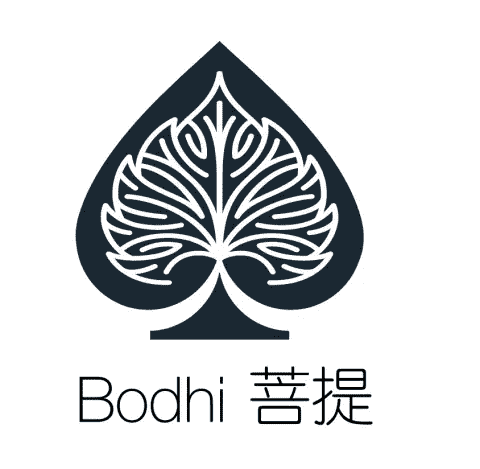

# 采访菩提网络:区块链预测市场如何帮助农民对冲风险和仲裁过程

> 原文：<https://medium.com/hackernoon/interview-with-bodhi-network-how-a-blockchain-prediction-market-can-help-farmers-hedge-risks-and-4ecd667d567e>

Photo by [meriç tuna](https://unsplash.com/photos/CE1OvMrZumQ?utm_source=unsplash&utm_medium=referral&utm_content=creditCopyText) on [Unsplash](https://unsplash.com/search/photos/farming?utm_source=unsplash&utm_medium=referral&utm_content=creditCopyText)

基于区块链的预测市场能帮助农民保护他们的利润吗？为什么区块链预测市场需要仲裁程序？以下是我从菩提网络创始人林那里学到的。(不需要技术背景。)

# **预测市场的通常用途是什么？**

“作为一个预测市场，我们不为别人做预测。我们为人们提供一个市场或交易平台来做预测，”林说。

博彩市场可能是预测市场最常见的用例。例如，我可以打赌某个队会在某场棒球比赛中获胜。如果我赌对了队，我就能赢点钱，要不然我就输掉我存的钱。**但是预测市场不仅仅是为了赌博。**

有了预测市场，你可以预测你想知道的事情，比如政治选举的某种结果的可能性，或者天气。这是基于一种被称为群体智慧的理论，这意味着来自足够多的人的聚合预测结果可能比任何专家的预测都更准确。

Photo by [Chris Liverani](https://unsplash.com/photos/2y7yiuEgT3k?utm_source=unsplash&utm_medium=referral&utm_content=creditCopyText) on [Unsplash](https://unsplash.com/search/photos/gambling?utm_source=unsplash&utm_medium=referral&utm_content=creditCopyText)

# 预测市场如何为农民对冲风险？

农民希望预测一年的天气或降雨量，因为这让他们知道他们可以收获多少作物，他们应该投资多少，以及他们一年可以赚多少钱。

“说今年你种了庄稼。这种作物的收成与降雨量有关。我知道今年我在种植上投资了多少？但是降雨量，我不知道，”林解释说。

然后他向我解释了预测营销是如何帮助农民规避风险的。

“如果我投资了，想保证收益怎么办？我可以花额外的钱赌天气不好或降雨量不足。如果天气真的很好会发生什么？我可能会损失一些钱，但我获得了巨大的收获。如果真的不好呢？你可以避开那些预测好天气的人。尽管你的农作物收成不好，但你的预测是正确的。你会被风险对冲。这在金融衍生品中很常见，”他解释道。

Photo by [Agence Producteurs Locaux Damien Kühn](https://unsplash.com/photos/t2nC3sC-bdQ?utm_source=unsplash&utm_medium=referral&utm_content=creditCopyText) on [Unsplash](https://unsplash.com/search/photos/farmers?utm_source=unsplash&utm_medium=referral&utm_content=creditCopyText)

# 为什么是区块链？

一些区块链平台如[以太坊](https://hackernoon.com/tagged/ethereum)有智能合约。智能合约是一个自动程序，可以记录赌注，事后检查结果，然后支付金钱。它是自动的、开放的、快速的、不可逆的。此外，它存储在许多计算机中，因此当它被操作时，许多计算机必须达成共识才能批准交易，这使得欺骗非常困难。

通常预测市场使用以太坊区块链，但菩提使用来自中国的 Qtum，类似于以太坊，也是一个竞争对手。所以我问菩提为什么用 Qtum 而不是以太坊。林告诉我，目前他们的目标是中国市场，Qtum 更适用于这个市场，但他们希望以后在更广阔的平台上扩展。

有趣的是，Bodhi 瞄准了中国市场，但它的总部和主要开发基地却在硅谷。

# 为什么要仲裁？还是对结果有争议？

有许多预测市场，如 Augur 和 Gnosis，都是基于区块链技术的。他们都有一些争议过程或仲裁。为什么需要这样做？

以 2018 NBA 西部决赛结果为例，如果我想查看结果，我只需谷歌一下。ESPN 会告诉我勇士队赢得了西部决赛。如果我检查其他渠道，他们会给我同样的结果。我不会争论它；这是事实，每个人都同意。我为什么要质疑一个事实？

“在区块链中，没有一个中心化的节点来设定结果。即使有，你也不能相信它，因为它可能被黑客攻击，或者可能被恶意操纵等等。一个集中的系统总是有那个问题。即使它已经工作了几百年，你也不能相信它。而这正是试图解决的问题，”林解释说。

林告诉我，邪恶的黑客可以利用中央数据提供商的漏洞，通过改变打赌的结果来赚钱，即使是很短的一段时间。

林接着说，“……99%或 99.999%的数据是可以信赖的。但是当一个黑客看到这种微小的可能性，只需在很短的时间内改变结果，就能赚取巨额金钱时，他会怎么做呢？鉴于许多人投票支持正确的结果，这个黑客总是会投票支持错误的结果。这个黑客只需要攻击第三方数据提供商“甲骨文”(这可能是我之前举的例子中的 ESPN)，他就可以轻松获得巨额报酬。”

由于区块链的性质，如果钱或代币被发送给邪恶的黑客，钱或代币将会消失。

“在这个区块链的世界里，交易一旦完成，就完成了！交易无法恢复，”林补充道。

这就是为什么预测市场都需要仲裁机制:以可靠的方式报告正确的结果。

菩提在结果出来后的 48 小时内做。你可以报告任何结果，但你必须存放一些菩提硬币。如果你是诚实的，你发布的结果与实际结果相符，你将获得奖励。否则，你会失去所有的存款。假设你一开始存了 100 个硬币。存款后，你将接受所有公众的评判。基于结果已经知道的事实，公众要么认同你的结果就什么都不做，要么不认同就多存几个币，去反驳之前的结果。但是为了开始反驳，你需要加上上一轮 10%的硬币。如果上一轮存款是 100 个硬币，现在你需要 110 个硬币来开始新一轮。那么你就有了一个暂时的结果。这个过程会一直重复，直到大家都认同这个结果。

这个仲裁就是说，事后，结果出来之后，人们如果对结果有质疑，可以提出仲裁。但是他们必须为开始仲裁付出代价。这样结果就不会被单个恶意者轻易改变。即使他们这样做了，也有办法逆转这种恶意行为。

这是我的采访，以防你感兴趣。但是，它是中文的，所以我写了这篇文章！

注:没有收到任何公司对这篇文章的补偿。