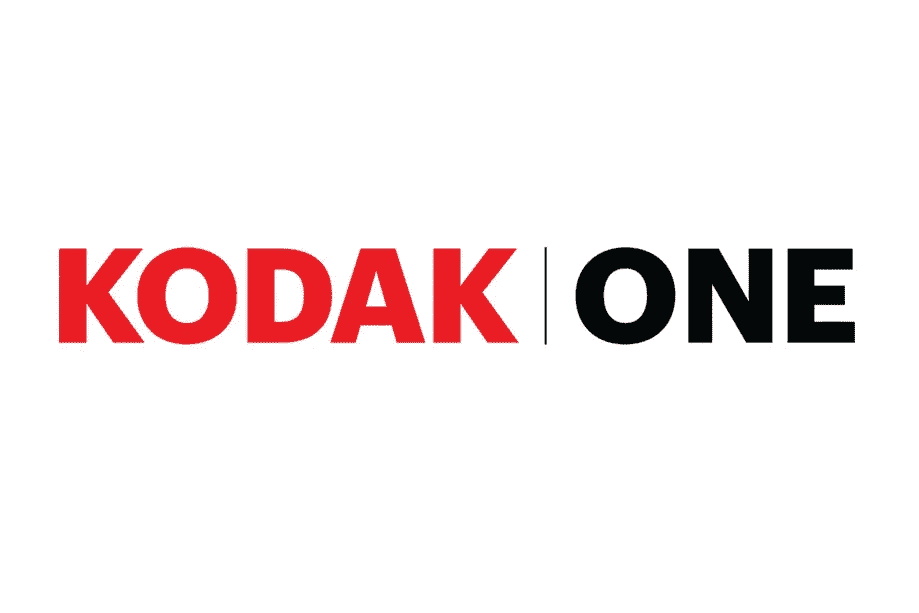
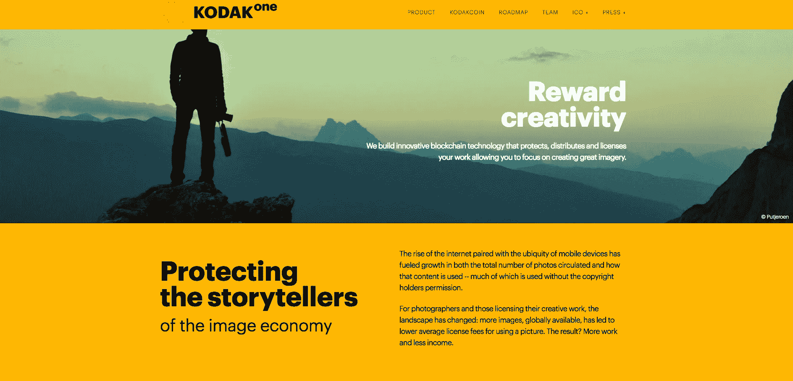

# 采访 KodakOne:柯达正在利用加密炒作吗？

> 原文：<https://medium.com/hackernoon/interview-with-kodakone-is-kodak-capitalizing-on-the-crypto-hype-c695e57c8b0d>

At CES 2018, Kodak announced the launching of the KodakOne protocol, a virtual economy that revolved around the photographer. It seemed like convenient timing- the total market capitalization for cryptocurrencies was nearing an all-time high at 800 billion USD. Green was across the board for a large majority of tokens across all major exchanges. Incidentally, Eastman Kodak’s stock on the New York Stock Exchange skyrocketed by conventional metrics. In a span of three days (from January 8th to January 10th), the price of Kodak’s stock nearly tripled from $3.10 to $10.70\. As of Friday, May 4th, KODK traded at $5.29 on the New York Stock Exchange.

## KodakOne 的公告是否表明他们打算利用加密炒作，还是加密本身就有价值？

最近，我和[科达康](https://www.kodak.com/kodakone/default.htm)的首席执行官[简·德内克](https://www.linkedin.com/in/jan-denecke-2199b675/)以及科达康的首席运营官·菲利普·科恩在加州威尼斯一家古色古香的咖啡馆坐在一起。我们花了大半个小时深入探讨摄影师面临的乏味补偿过程，以及 Wenn Digital(与柯达合作开发 KodakOne 区块链协议的公司)如何计划赋予摄影师权力和保护摄影师的知识产权。

## KodakOne 想解决什么问题？

照目前的情况来看，侵犯一个人的照片大约需要点击一到两次。在很短的时间内，一个摄影师的内容可以被数百个网站不正当地使用。

在当前的空间中，摄影师与技术提供商签订合同来运行网络爬虫(实质上是搜索整个网络，以确定他们的照片在哪里被使用)。当意识到他们的照片被使用了 x 次*后，摄影师将不得不雇佣一个法律团队来确认，并联系网站管理员，并根据管辖范围，发出停止和终止信。*

*因此，根据 knh 的说法，摄影师要花费大量的时间和金钱来履行 de factor 项目经理在侵权检查方面耗时且昂贵的职责。大量资金必须按比例分配给流程中的所有相关方；这通常会使摄影师寻求补偿的初衷落空。*

**

> *许多人没有意识到的是，当一项数字资产被发布到互联网上时，你不知道它会去哪里。区块链正在解决这个问题——你将确切知道图像的走向，你将知道如何控制它。”— Jan Denecke，KodakOne 首席执行官*

*有关侵犯版权的法律界限因地区而异。通过创建分布式账本并集成人工智能来运行爬虫，中间人被消除(这为摄影师节省了时间和成本)。摄影师清楚地看到照片被用于何处，并因此得到相应的科达币补偿。在分布式账本上跟踪照片分布的能力有望将潜在的侵权者变成未来的客户。*

## *他们将如何在短期内解决这个问题？*

*在接下来的 12 个月中，KodakOne 团队将重点关注产品开发、社区建设和管理。KodakOne 平台计划在 12 月进行测试，与一些知名摄影机构和摄影师建立合作关系。*

*KodakOne 平台将于 2019 年第三季度和第四季度全面推出。根据科恩的说法，最重要的一点是建立社区，并邀请来自世界各地的摄影师利用 KodakOne 平台。该团队甚至设想了一个市场，将在以后建立，它将简化图像创建过程中的所有垂直行业。*

**

*KodakCoin 可以让摄影师预订机票、酒店房间、外包模特以及从主要制造商那里购买摄影设备。该协议可能会阻止网络效应的一个巨大障碍是，人们根本不知道区块链如何能让图像创作者受益。在 2019 年第三季度和第四季度 KodakOne 平台正式推出之前，将在外联和社区管理方面做出重大努力，以教育公众和发展虚拟摄影师经济。*

*它在路线图上的最新任务是:完成证券交易委员会对 Reg-D 投资的批准(这将使高净值或机构投资者能够参与 ICO)。*

*你怎么想呢?KodakOne 将有效地授权摄影师与他们的协议吗？*

*如果你喜欢这个内容，请点击订阅[我们的邮件列表。您将获得 Lunar Labs 的早期测试版，这是一套优化您的加密货币交易体验的工具，以及直接发送到您电子邮件的最新加密新闻和市场更新。您也可以通过](http://bit.ly/2ozZ20H)[点击此处](http://bit.ly/2GUSqRl)访问我们的网站，了解更多我们的工作！*

**原载于 2018 年 5 月 14 日*[*lunardigitalassets.com*](https://lunardigitalassets.com/insights/2018/interview-kodakone-kodak-capitalizing-crypto-hype/)*。**