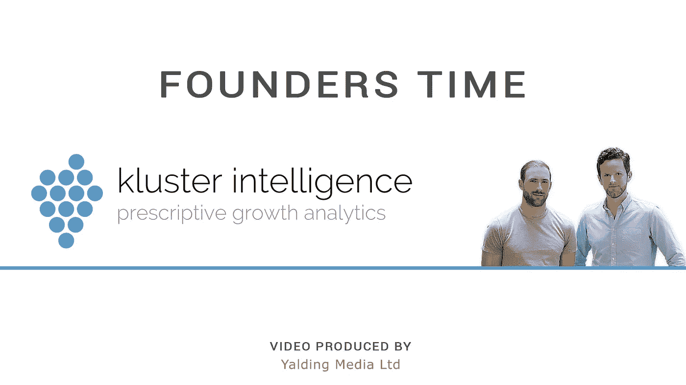

# 采访 Kluster 的联合创始人丹·汤普森和罗里·布朗

> 原文：<https://medium.com/hackernoon/interviewing-dan-thompson-and-rory-brown-co-founders-of-kluster-key-takeaways-cdc580acbfa2>

上周，我们非常幸运地采访了 [Kluster](https://kluster.com/) 的联合创始人[丹·汤普森](https://uk.linkedin.com/in/dan-thompson-728153126)和[罗里·布朗](https://www.linkedin.com/in/rory-brown-kluster)。他们友好地分享了他们创业历程的故事，他们对 Kluster 的愿景以及他们目前面临的挑战。

以下是我们采访 Dan 和 Rory 时获得的三大独特见解:

是什么让你想辞去全职工作？你们是怎么认识的？[2:45]

所以我和丹从大学起就是很好的朋友。我们过去常常在酒吧见面，讨论如何将人工智能和数据科学应用到销售领域。我知道在销售领域，我们收集了如此多的数据。在我的业务中，我们会向客户收取一定比例的费用，我请丹制作了一个小型计算器，可以计算出销售主管时间的机会成本。所以我们建立了一个小模型，我会用它来尝试向我们的客户收取更多的费用，因为他们可以节省大量的时间。这就像滚雪球一样，Dan 开始用 R 编写代码，并开发了一个闪亮的工具。

*我们使用了它，并把它展示给市场上我认识的许多人。这个问题够大吗？是的。你会花钱买它吗？是的。你会花多少钱？只是尽我们所能验证我们的小版本，并一直坚持下去。*

**你在努力解决哪些具体问题？你对 Kluster 的愿景是什么？【6:19】**

罗里: *所以我们试图解决的问题是——我们有很多商业团队，他们现在已经在云客户关系管理系统上收集了相当多的数据。主要有两个问题:心智和能见度。从可见性开始——尽管他们拥有所有这些数据，但在他们知道发生了什么之前，他们离结果日太近了。这意味着你不能做出反应，你不能预测，你不能帮助人们从任何不好的事情中恢复过来。第二件事是心态，出于某种原因，许多人认为‘我的数据不好，我的数据不好’，他们没有意识到的是，他们收集了很多数据，这些数据非常有用。所以有一点心态的转变，我们也在努力解决，因为你可以比你自己更多地利用这些数据，它比你想象的要好得多，所以你就是这样。视觉——丹？*

丹:*k luster 的愿景是我们要成为欧洲领先的销售分析提供商，我们的使命是帮助我们的客户以更有效的方式发展壮大。*

**你目前试图解决的最大挑战是什么？【11:10】**

罗里: *我认为商业上的主要问题是我们如何更快地销售，以及如何增加我们所销售产品的价值。与此相关的是产品的技术性和可扩展性。我正试图卖出大量的这种产品，让它卖得更快。这意味着这些人需要一个既灵活又非常可扩展的产品，这是一个巨大的挑战。他们的工作非常出色，但这并不容易。*

如果时间不够，可以在 SoundCloud 上听听采访。

或者，你可以看下面丹和罗里的完整采访。

*如果您想接受采访或与我们合作，请随时给我们发送* [*电子邮件*](mailto:info@founderstime.com?Subject=Founders%20Time) *。*

