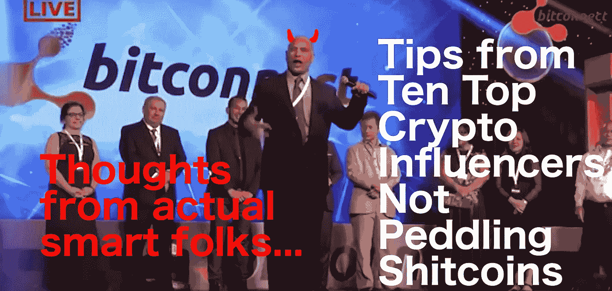

# 十大密码影响者访谈

> 原文：<https://medium.com/hackernoon/interviews-with-ten-top-crypto-influencers-1a0fee9b4020>

不可否认 ICOs 的疯狂刺激。比特币一直在膨胀(和崩溃),最终再次上升。

根据[硬币时间表](https://medium.com/u/ab16ff564feb?source=post_page-----1a0fee9b4020--------------------------------)，ICOs 仅在 2017 年就筹集了前所未有的 37 亿美元。虽然主流的 1 亿美元以上的公共 ICO 时代似乎已经成为过去，但这个领域作为一个整体正在快速发展。

2017 年 6 月，ICO 融资超过了早期风险投资，使行业对风险投资的未来感到愤怒。

该财团与乔伊·克鲁格([奥格](https://medium.com/u/f4d568271227?source=post_page-----1a0fee9b4020--------------------------------)和潘迪拉资本)、安迪·布罗姆伯格( [CoinList](https://medium.com/u/88ecffe5cb1?source=post_page-----1a0fee9b4020--------------------------------) 的首席执行官)、[吉尔·彭奇纳](https://medium.com/u/ca7d5a12c0ef?source=post_page-----1a0fee9b4020--------------------------------)和[卢·肯纳](https://medium.com/u/b01056393401?source=post_page-----1a0fee9b4020--------------------------------)举行了圆桌会议。对于密码爱好者和反对者来说，这都是必看的——当聪明人说话时，集中注意力是值得的。

**注意:**这篇文章仅仅是对一些行业领导者的观点和采访的综述，包括建筑商和投资者两方面。这需要一个生态系统，需要理解的机会——希望这篇文章对这两者都有所帮助。

# Gil Penchina 如何试图赔钱并打击 5 家独角兽公司以及加密货币的未来

吉尔·潘奇纳是有史以来最顶尖的超级天使之一，投资了 [Ripple](https://medium.com/u/951c695df315?source=post_page-----1a0fee9b4020--------------------------------) 、Brave、 [Polychain](https://medium.com/u/4df822acbecd?source=post_page-----1a0fee9b4020--------------------------------) 、Paypal、Filecoin、Civic、Linkedin、Cruise、Dollar Shave Club、Wealthfront、Discord、Fastly 以及一个名副其实的名字。在此之前，他在 Ebay 工作，负责 IPO 过程，现在他在 [AngelList](https://medium.com/u/5f84314adf6?source=post_page-----1a0fee9b4020--------------------------------) 上运营着 20 多个辛迪加，拥有数百万资金支持。今天，他冒险来到牌桌的另一边，带着 [Pryze](https://medium.com/u/1c75e9aeed5d?source=post_page-----1a0fee9b4020--------------------------------) ，一个致力于 ICO 预售的分散式抽奖系统。

## 听和学:

1.  吉尔如何早期投资贝宝
2.  为什么吉尔看好加密货币
3.  他确切的资产配置策略
4.  他是如何建立一个庞大的 Angellist 辛迪加网络的
5.  区块链对整个社会意味着什么
6.  ico 如何影响我们所有人

# 与[潘迪拉资本](https://medium.com/u/d25fb22875fb?source=post_page-----1a0fee9b4020--------------------------------)的[乔伊·克鲁格](https://medium.com/u/29c759230b77?source=post_page-----1a0fee9b4020--------------------------------)

乔伊在 2013 年建立比特币销售点系统之前，于 2011 年涉足[比特币](https://hackernoon.com/tagged/bitcoin)开采。2014 年，他从波莫纳学院(Pomona College)退学，参与创建了以太坊上第一个名为“占卜”的项目，2015 年，他们在以太坊上进行了第一次众筹。今年，他加入了潘迪拉资本公司，担任联席首席投资官，管理他们的数字资产基金……哦，他还管理着排名前 100 位的 AngelList 辛迪加之一。

## **边听边学:**

1.  为什么以太坊是未来的[加密货币](https://hackernoon.com/tagged/cryptocurrency)
2.  ico 对投资者和未来的初创公司意味着什么
3.  为什么第一对创业公司来说是最糟糕的
4.  天使投资人应该如何看待区块链
5.  衍生品市场正在发生重大转变

## 像这样？在 iTunes 或 [Android today](http://thesyndicate.vc/android) 上订阅辛迪加[播客，不会错过任何东西。](http://thesyndicate.vc/itunes)

# [Kendrick Nguyen](https://medium.com/u/42b47604dd55?source=post_page-----1a0fee9b4020--------------------------------) 谈 Angellist、ico 和股权众筹蚕食传统风险投资

肯·阮(Ken Nguyen)是神经科学和法律专业的毕业生，他将法律和心理学引入科技初创公司，建立了 Republic.co，这是最大、最成功的股权众筹网站之一。在创办 Republic 之前，Ken 是一名 Angellist 的员工，负责增长黑客和扩展。

## **边听边学:**

1.  Title 3 众筹如何影响初创企业融资
2.  为什么传统风险投资正在被颠覆
3.  ico 和 fintech 的未来
4.  股权众筹为什么能跑赢风险投资
5.  创业公司应该如何看待融资和接受投资者的资金

# 以 500 万美元的价格收购脸书 1/4 的股份

Lou Kerner 是 Flight.vc 的以色列创始人基金和社交互联网基金的创始人和管理合伙人。在此之前，娄是当时最大的社交媒体公司 Bolt 的社交媒体先驱，后来被 Myspace 征服。此后，娄投资了 Palantir、、Meetup、Klout、Plated 等公司。

## **边听边学:**

1.  关于交易流程，风投永远不会告诉你什么
2.  为什么以色列是投资的地方
3.  为什么加密货币正在颠覆我们所知的世界
4.  验证牵引力和市值的方法

# Julian Zawistowski 如何在[假人项目](https://medium.com/u/8b0d088e8160?source=post_page-----1a0fee9b4020--------------------------------) ICO 中筹集 860 万美元，以及此后密码和 ICO 的变化

Julian Zawistowski 是假人的创始人兼首席执行官，这家分散式超级计算机公司在 30 分钟内通过众筹/ICO 筹集了 860 万美元。朱利安的公司现在价值 2.8 亿美元，他坦率地谈到了建立一家加密公司、管理投资者和建立一项改变游戏规则的颠覆性技术。

## 听和学:

1.  加密货币格局是如何演变的
2.  ico 颠覆传统企业的方式
3.  当一家前期产品公司价值超过 2.8 亿美元时，会发生什么
4.  为什么区块链狂热者高估短期影响而低估长期影响
5.  加密公司应该如何准备 ICO
6.  加密货币和去中心化对政府和监管意味着什么
7.  为什么以太坊是未来的平台

# 加密货币、政治和政府的瓦解【Michael Weiksner 博士来自主席台资本

迈克尔·维克斯纳(Michael Weiksner)是讲坛资本(orthograph Capital)的创始人，这是一家专注于下一代平台公司的风险投资基金，该基金也在建立一个加密部门，专注于颠覆性的区块链机会。

此前，他为 EndlessTV 筹集了超过 250 万美元，这是一款创新的移动视频应用，是第一款提供可滑动购物的移动应用。在此之前，迈克尔创建了 e-thePeople，这是一个帮助公民通过技术参与政治的非营利组织，帮助了 1000 多万选民。

## 听和学:

1.  为什么大多数 ico 都是垃圾，区块链会破坏一切
2.  投资加密货币之前应该考虑什么
3.  传统创业公司在筹集后续资金时遇到的问题
4.  ico 如何影响创业公司和风险投资
5.  为什么美国的政治制度会导致灾难性的失败
6.  对冲基金应如何看待加密
7.  加密货币和区块链的大图景

# ICOs、以太坊、意大利山脉和与[的 Stefano Bernardi](https://medium.com/u/ce9b393bacac?source=post_page-----1a0fee9b4020--------------------------------)

斯特凡诺·贝尔纳迪坐在桌子的两端。作为 YC 支持的创始人和初创公司 hustler，Stefano 很早就进入了风险和天使投资领域，并且从未回头。Stefano 喜欢在阿尔卑斯山漫步，投资和写关于 crypto 和区块链的博客，帮助欧洲创始人找到他们的最佳状态并取得成功——顺便说一句，他经营着 Tokeneconomy.co，可以说是最好的加密时事通讯！

## 听和学:

1.  天使需要了解 ico 的哪些知识
2.  为什么欧洲正在经历一场创业革命
3.  如何在 Twitter 上寻找创业交易
4.  为什么投资者不需要住在创业中心就能成功
5.  加密货币和金融科技的未来

# Boost VC 的 Adam Draper 解释了为什么 Crypto 和 ico 实际上不够高端，以及未来可能会带来什么

亚当·德雷珀是 Boost.vc 的创始人，这是一家专注于创造科幻未来的加速器和基金。他们与区块链和虚拟现实公司合作并投资这些公司，但突破性业务除外。Adam 来自一个风险企业，正致力于延续 Draper 的卓越传统和推进未来。

## 听和学:

1.  为什么风投应该更关注加密技术
2.  风险资本如何有效地将 ico 纳入投资组合公司
3.  在风险家庭中长大如何影响前景
4.  为什么风投必须不断学习
5.  为什么 AR 被高估，ico 被低估

这是一个总结。希望这对你有帮助。如果是的话，请在下面的评论区告诉我，我会在未来做更多像这样的综述。

# 奖金:最佳加密播客名单

我不会把时间浪费在日交易类的节目上，如果这是你的游戏，那里有一些好的播客，但试图不断地为市场计时似乎是失败的秘诀。为了更深入地了解这一技术和行业，以下是其中的精华(排名不分先后):

1.  [被解开的](https://itunes.apple.com/us/podcast/unchained-big-ideas-from-worlds-blockchain-cryptocurrency/id1123922160?mt=2)
2.  [我们来谈谈比特币](https://itunes.apple.com/us/podcast/the-lets-talk-bitcoin-network/id640581455?mt=2)
3.  [比特币播客网](https://itunes.apple.com/us/podcast/the-bitcoin-podcast-network/id1000457699?mt=2)

# 结束语

基于区块链的技术和加密货币有可能扰乱当今的许多行业和机构。虽然炒作过度，投机是彻头彻尾的可怕，在我看来，这个空间的未来甚至比预期的更大更光明。

也就是说，在时间表和可伸缩性方面，还有许多问题没有得到解答。我没有所有的答案，我只是随大流。

想法？

请在下面的评论中分享你的观点、猜测和行业见解。我们要去哪里？我们什么时候到达那里？

> 时机就是一切…

# 学到了什么？单击👏说“谢谢！”并帮助他人找到这篇文章。

如果您喜欢该内容，请按住鼓掌按钮！它帮助我获得曝光率。

***鼓掌 50 次！***