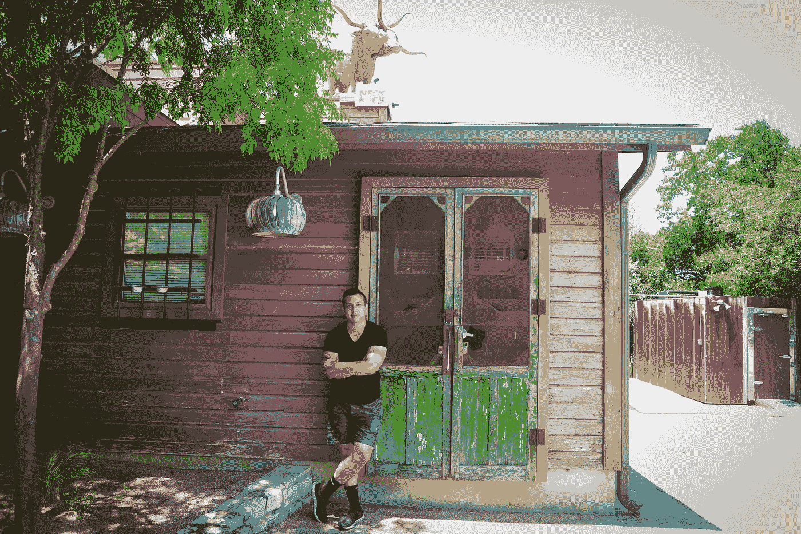
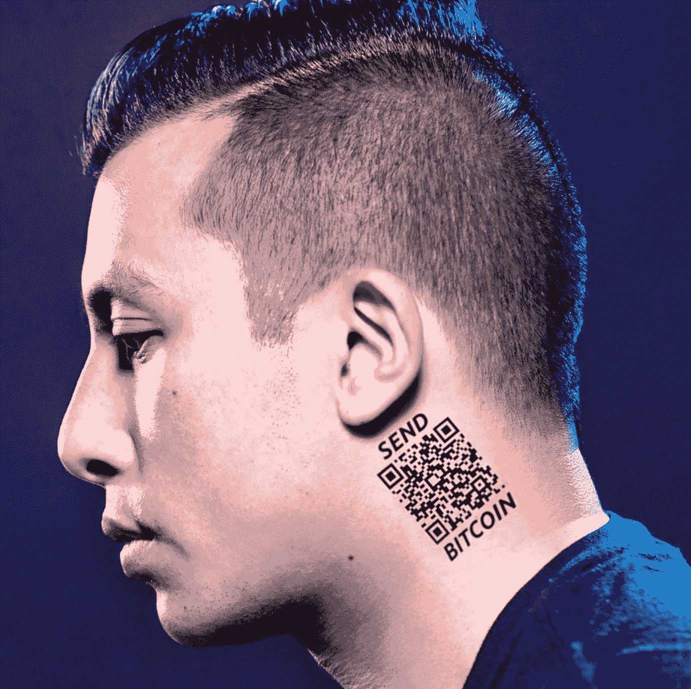
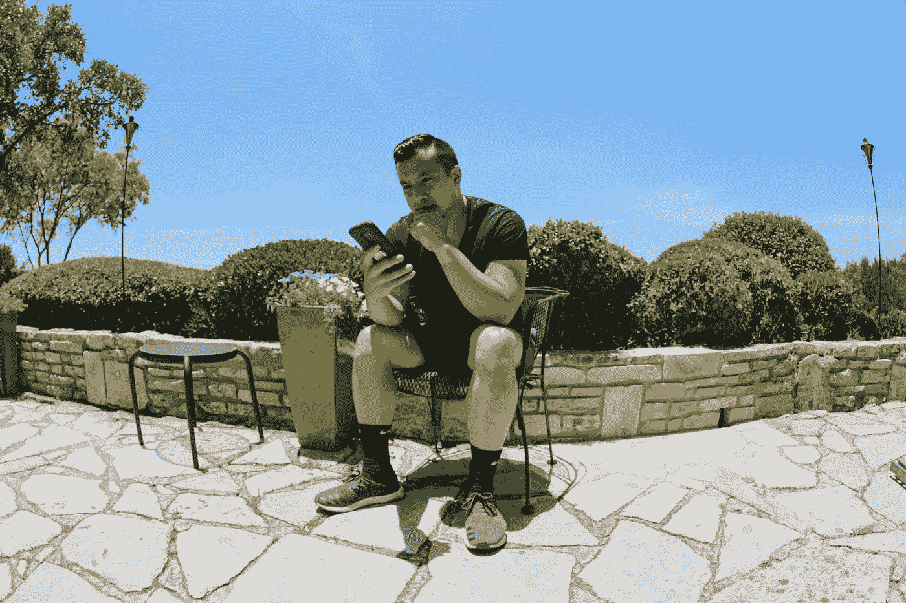
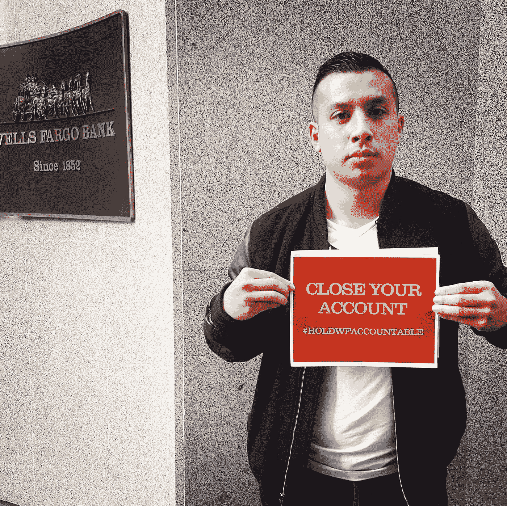
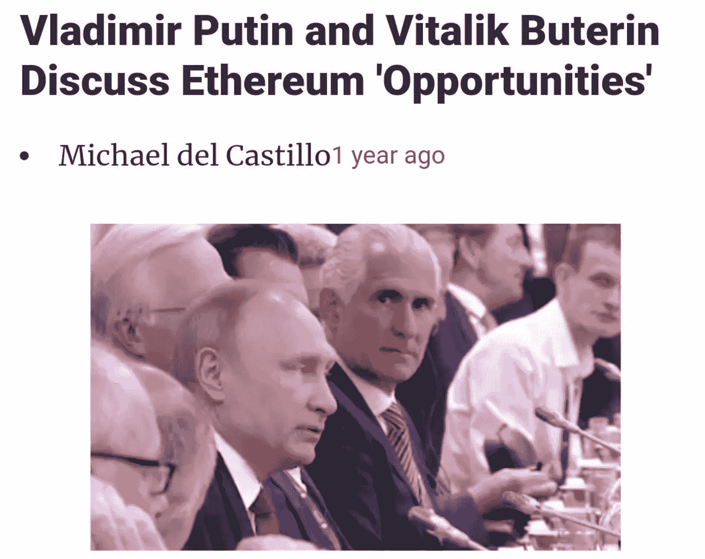
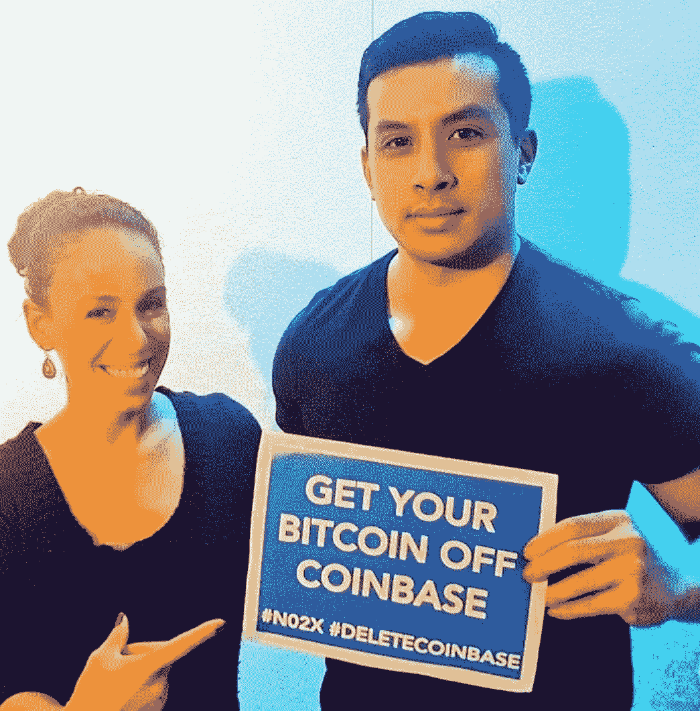
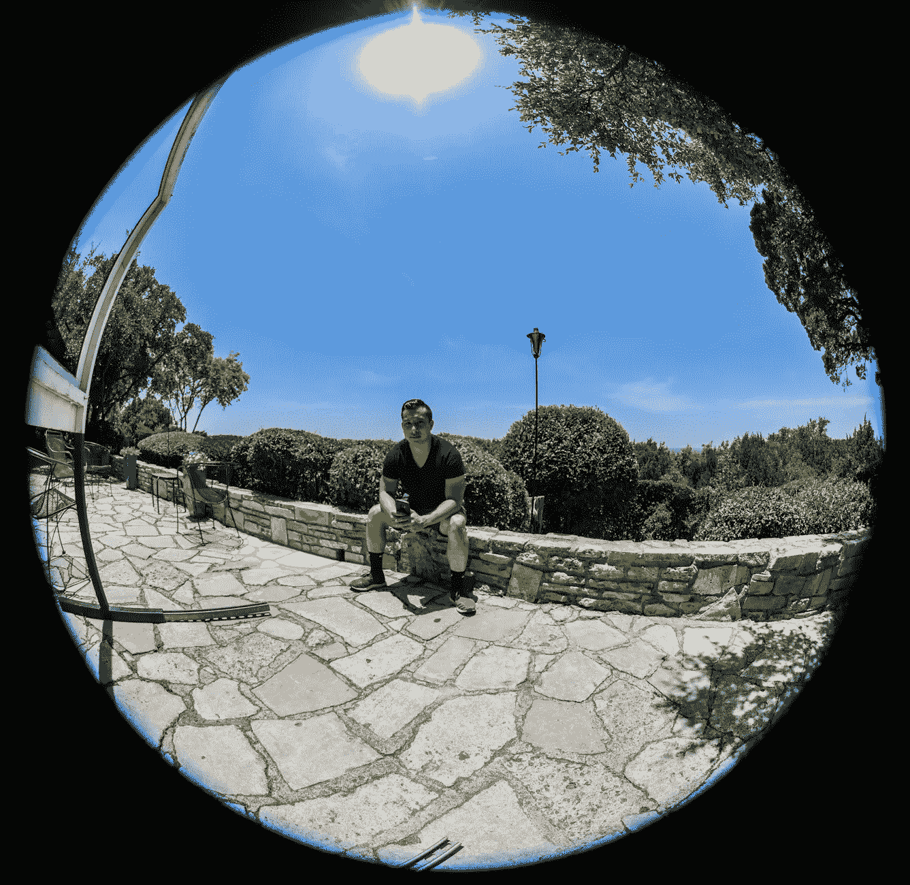

# 走进火中:凯文·范访谈

> 原文：<https://medium.com/hackernoon/into-the-fire-interview-with-kevin-pham-af8d7a2d1267>

There is a lot more to Kevin Pham than what you see on twitter.

还记得几年前富国银行因其不道德的新客户销售行为而被曝光吗？凯文·法姆是一名前雇员，他出现在许多大型新闻网上，讨论他们不正当的商业行为。他还发起了[让富国银行负起责任运动](https://www.facebook.com/events/1047074072072498/)，鼓励客户在 facebook 上关闭账户，该帖子迅速走红，引起了全国的关注。

你们中的许多人可能也知道比特币世界的凯文，他从不羞于发表自己的意见，这些意见经常会触怒他人。事实上，这家伙发了这么多微博，我经常想知道他什么时候睡觉。我是通过一个共同的朋友介绍给凯文的，他说我们应该谈谈。一周后，我们面对面坐着吃午餐，讨论比特币、狗屎硬币和对我们来说最重要的东西。

我意识到的第一件事是，世界上大多数人每天看到的网上角色只是他真实身份的一小部分。对于一个我认为我们只会对比特币有共同爱好的人来说，我发现我们在很多事情上都有共识。我被他迷住了。我打断了我们的谈话，说，我想采访你。我认为这个世界需要真正了解你是谁。

吃过午饭后，我们的谈话中有太多东西需要解开。最让我产生共鸣的一件事是，家庭对凯文来说是最重要的，甚至比金钱更重要。在所有反体制和反大企业的花言巧语之下，他只是一个像我们许多人一样的普通人。

在比特币和加密领域，许多人只看到他们选择的人。我从我做过的许多采访中了解到，你不能通过封面来判断一本书，凯文·范就是一个很好的例子。

Many people may recognize Kevin from this photo on his social media.

**在线身份:**凯文·范

RJ: 投资者和推特评论员。

虽然我并不真的从刻板的职称角度思考。我看到需要说的事情，我就说出来；我看到需要做的事情，我就去做。就这么简单。

**在$BTC 游戏中的岁月:**

五

人们怎么可能认识你？

推特。

**别人怎么跟你？**

[推特](https://twitter.com/_Kevin_Pham) &多嘴多舌。

你的背景、教育或正规培训是什么？

我的正式专业背景是商业银行。我的正规教育是金融和经济学。

你认为大学重要吗？

总的来说，我不喜欢美国人盲目地将大学视为高中毕业后的下一步，尤其是那些不知道自己一生想做什么的人。

如果你不知道你这辈子想做什么，你最不应该做的事情就是欠下六位数的债务来解决这个问题。

你应该尝试在尽可能多的不同领域工作，并让自己接触到这些领域，然后再做出巨大的经济承诺，那就是大学学费。

把它想象成约会和婚姻。对大多数人来说，在做出承诺之前，你需要约会来了解你自己和你喜欢什么。

我认为一个很好的中间立场是在接受普通教育的同时实习和做不同的工作，这样，当选择专业时，你可以做出更明智的决定；这样做也能让你远离债务。

一般来说，你对未来的不确定性越大，你应该欠的债务就越少，因为这些债务的偿还是非常确定的。

**你是什么时候对比特币和加密产生兴趣的？**

2013.

**你在这个领域最美好的经历是什么？**

身处比特币是一种永远美好的体验，因为我喜欢新奇古怪的东西。

但如果我必须选择一个，那就是当比特币达到 2 万美元时，我早期迷上比特币的一个朋友给我发短信说，他会有足够的钱送他的孩子上大学，这让我无法控制地哭了。

就在那时，我发现用比特币来帮助我爱的人，对我来说比让自己变得富有更有意义。

**告诉我们你最大的比特币或加密失败。**

积极交易，而不仅仅是 hodling。

Kevin doing what he does best — posting on twitter.

**你个人从哪里获得比特币或加密新闻？**

Twitter、我的个人网络和加密新闻渠道，如比特币杂志、The Block 和 Coindesk。

**有哪些别人不知道的你引以为豪的事？**

我和一个我不知道是变性人的人约会过。但是当我发现我并没有厌恶地拒绝她时，我们成了朋友，互相学习，我还帮她付了手术费。

真是大开眼界。

不过，我觉得吹嘘这件事很奇怪。

**你能给刚接触比特币世界的人的最佳建议？**

通过买一点来增加游戏的趣味性。这将激励你学习比特币以及理解比特币所需的晦涩知识。

你在哪里长大？

圣何塞东区。

你是哪种类型的孩子？

我花了很多时间自娱自乐，四处奔跑，播放我脑海中想象的冒险故事。

你会给年轻时的自己什么建议？

少想，多做。

你是以质疑权威的方式长大的吗？

不，我实际上是在一个传统的越南家庭中长大的，这个家庭强调尊重和服从权威的重要性。

质疑权威对我来说是与生俱来的，这大概也是为什么我总是和权威人物闹矛盾。

你揭露了富国银行的许多黑幕。是什么让你想说出来？

通过卖空股票进行投机。我相信，如果你要做一件让你面临个人风险的事情，就必须有个人回报。

我不相信殉难。

比特币在这个意义上也是一样的。比特币是智力上最容易防御的加密技术。通过操纵比特币，你会被激励去找出其他密码的逻辑不一致之处。

Kevin started the [Hold Wells Fargo Accountable movement on facebook](https://www.facebook.com/events/1047074072072498/) and it went viral.

**富国银行最终因此遭遇了什么？**

首席执行官被迫辞职并退还奖金。

**之后你的生活有什么变化？**

给了我更多的自信。我一直认为我这辈子都疯了。那次经历教会我相信自己的直觉。

**对你有什么不满吗？**

令人惊讶的是，没有。我没有听到富国银行的任何消息。联邦调查局确实试图和我谈话，但原因不明。

你在许多银行都做过幕后工作。是什么让你离开的？

缓慢的步伐，低劣的技术，官僚主义，所有你必须处理的法规遵从性。

许多人没有意识到你有风投经验。为什么你会鄙视大部分 VC 的？

我认为它们被夸大了，并从监管保护主义(如合格投资者要求)衍生的自营交易流中受益匪浅。

看着他们被一个匿名的推特账户欺负，证实了我的直觉。

类似于上大学，我认为创业者不应该盲目地向风投投钱/融资。风投专门寻找高速增长的公司，并不是所有的初创公司都符合这种情况。

Kevin Pham interview on the Doug Polk Podcast

有没有你会给通行证的人？

是啊。风投不是铁板一块。我喜欢[彼得·泰尔](https://twitter.com/peterthiel)、[比尔·格利、](https://twitter.com/bgurley)、[查马斯·帕里哈皮蒂亚](https://twitter.com/chamath)、[马特·奥科](https://twitter.com/mattocko)、[迈克·梅普斯](https://twitter.com/m2jr?lang=en)。

**作为以太坊的早期投资者是什么感觉？**

这是非常逆向的，因为你必须在 2014 年就已经精通并拥有比特币才能投资。我也很享受这种投资的自由性质。

是什么让你成为反对声音最大的人之一？

道救助，它是集中在 Vitalik，其高度的时间偏好，其不安全，和裙带行为，他们的社区参与，以防止美国证券交易委员会称之为安全。

道德风险、集权和裙带资本主义与比特币所代表的一切都是对立的。

你对维塔利科·布特林有什么不满？

他是以太坊的核心人物。当有人谎称他死于车祸时，ETH 的股价暴跌。

我不区分非人类和人类集中的失败点，因为“这不太好”

**你在早期投资以太坊和比特币时学到了什么，对你今天有帮助吗？**

投资有趣冷门的东西挺好的。

**你有没有担心过俄罗斯政府或其他可疑人物会因为你在推特上发的东西而追杀你？**

是的，这就是为什么我鼓励私下支持我的人大胆发言，以减少我的单点失败风险。

我不想成为任何人的殉道者。尽管我非常怀疑我是否重要到足以让俄罗斯拿与美国的关系冒险。

你对加密技能有什么想法？

我们都在先令一些东西。比特币制造者为比特币卖命。每个人都谈论他们的书。在这方面保持警惕不幼稚就好。

**关于你为何如此致力于比特币，你想向世界传达什么信息？**

人们用时间(生命)换取金钱。如果你控制了金钱，你就可以奴役他人。

如果我们想解放人类，充分发挥其潜力，我们需要尽可能分散对金钱的控制。

**你认为自己是比特币最大主义者吗，你对这个标签感到舒服吗？**

比特币最大化是一个贬义词。维塔利科·布特林为了侮辱以太坊的怀疑论者。我基本上是一个怀疑论者，而比特币恰好是逻辑矛盾最少的密码。

**比特币最大的敌人是谁？**

国家，我们正威胁着伴随着垄断货币创造而来的巨大权力。

**以下哪一项实际上是建立健全货币的最大威胁？**

极权主义。

**你衡量比特币成功的标准是什么？**

长寿。

Kevin is not shy about sharing his opinion about Coinbase.

你为什么如此坚决地反对像比特币基地这样的企业？

我的观点是，他们无耻地参与监管捕捉，以创造一个全球垄断，他们可以监视数十亿人的金融活动。

他们基本上成为了金融界的脸书。

你会推荐人们在哪里购买比特币？

OTC、Bisq 或 Cashapp。

关于保管自己的比特币，你能给人们什么建议？

不是你的钥匙，不是你的硬币。

你害怕扳手袭击吗？

是的，这就是为什么我害怕接受以我为主角的采访。

你发了很多微博。你怎么有时间发这么多微博？

我的大部分收入来自投资资本收益，我喜欢简单的生活。

想象一个比特币变得司空见惯、不再被视为反主流文化的世界。你在做什么?

把我投入比特币的精力投入到养家糊口上。

**你对富有的想法是什么？**

有时间和自由去做你喜欢的事情，和你爱的人在一起，说出你真实的感受。

**人们没有意识到你是一个有家室的人。家庭对你有多重要？**

没有一个支持我的家庭，我无法承担这么大的风险。他们给我提供了金钱不能给我的安全感。

至于成为一个顾家的男人，我不会说我一定是一个好男人，只是我知道家庭的重要性，并尽我所能为他们做正确的事情。

At the end of the day, Kevin is just a regular dude who loves his family.

对于那些只关注赚钱的人，你有什么要说的？

金钱仅仅是陌生人之间进行短期交易的工具。它是一个工具，不多不少。

**在比特币和加密领域之外，你最喜欢做什么？**

和家人朋友出去玩。

**有哪些好书可以推荐？**

我不看书。

**你最喜欢的比特币播客或 youtube 节目有哪些？**

不要跟得太紧。

**你的播放列表中排名前五的歌曲是什么？**

它随我的心情而变化。但是 90 年代的另类和 80 年代的新潮才是主食。

**你可以推荐哪些比特币创造者来关注他们？**

尼克·萨博

这些年来，谁激励和影响了你，你想向谁致敬？

中本聪，[纳西姆·塔勒布](https://twitter.com/nntaleb)，[彼得·泰尔](https://twitter.com/peterthiel)，[埃隆·马斯克](https://twitter.com/elonmusk)，还有我妈妈。

*如果你喜欢这个采访，可以多看看我的其他文章和采访*[*hacker noon/@ piratebachbum*](https://hackernoon.com/@piratebeachbum)*或者在 twitter 上找我*[*@ piratebachbum*](https://twitter.com/piratebeachbum)*或者* [*@ coin _ strategy*](https://twitter.com/coin_strategy)*或者*[*coin strategy . io*](https://www.coinstrategy.io/)